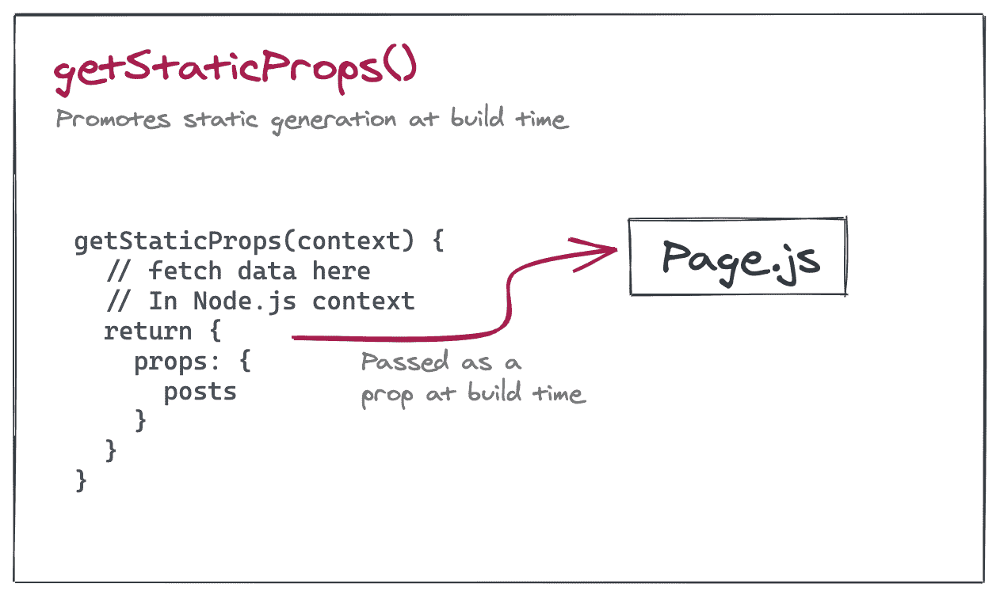
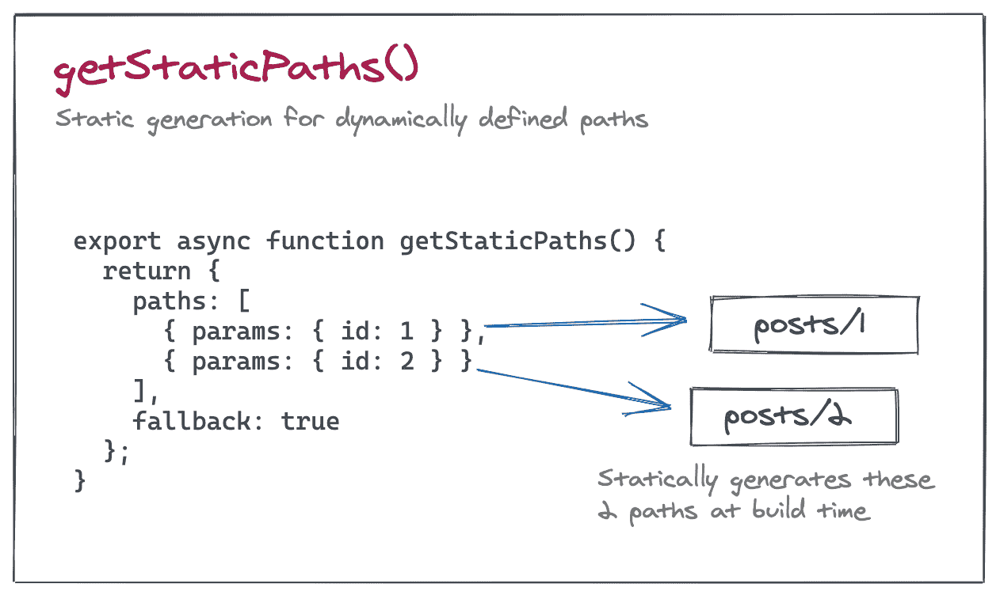
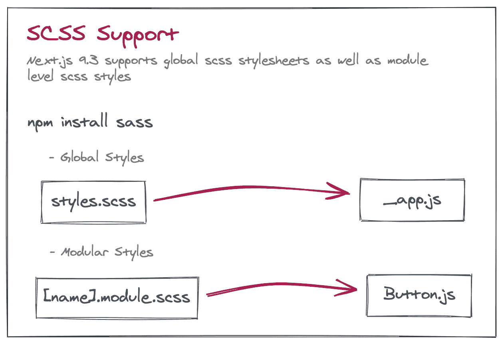

# Next.js 中的最新特性

> 原文：<https://blog.logrocket.com/the-latest-features-in-next-js/>

## 介绍

在不久前的 SSR(服务器端渲染)和静态站点生成的背景下， [Next.js](http://www.nextjs.org) 建立了一个我们无法否认的名声。在短短的几年时间里，它已经成为了 T2 托管静态网站(如登录页面、文档和博客)的首选框架。在本文中，让我们看看作为最新主要发布版本的一部分添加到框架中的主要增强功能， [Next.js 9.3](https://nextjs.org/blog/next-9-3) 和 [Next.js 9.4](https://nextjs.org/blog/next-9-4) 。

## 优化静态站点生成

Next.js 是一个混合框架，它允许我们在静态生成(SG)或服务器端呈现(SSR)之间进行选择。在 Next.js 9.0 中，我们看到了自动静态优化的引入，它依赖于数据获取方法`getInitialProps()`来决定页面是否必须在构建时呈现为 HTML。但是现在通过增加两个新的数据获取方法`getStaticProps` & `getServerSideProps`，这已经被推到了下一个层次。还引入了一个`getStaticPaths`来为动态路由生成静态页面。这就是工作原理。

### getStaticProps

这主要意味着为您的站点启用静态生成，并配置异步数据获取在构建时发生(在服务器上下文中)。只需从您的页面导出一个名为`getStaticProps`的`async`函数，并从其中返回一个带有`props`键的对象，该对象将作为道具传递给页面:

```
export async function getStaticProps(context) {
 return {
   props: {} // will be passed to the page component as props
 }
}
```

然后，Next.js 将在构建时通过在 Node.js 上下文中调用该函数来预呈现该页面。这里的好处是，我们可以使用任何方法(甚至直接访问数据库)获取数据，因为这些代码永远不会在客户端运行。


### getStaticPaths

当使用动态路径时，与`getStaticProps`一起使用，以定义在构建时静态呈现的路径列表。

从包含动态路由的页面中导出一个名为`getStaticPaths`的`async`函数，Next.js 将静态预呈现它指定的所有路径:

```
export async function getStaticPaths() {
 return {
   paths: [
     { params: { ... } }
   ],
   fallback: true // or false
 };
}

```

如果页面使用名为`pages/posts/[id].js`的动态路由，将`[{params:{id:1}},{params:{id:2}}]`导出为路径数组将导致在构建时静态生成`post/1`和`posts/2`。


Also, notice the fallback key being passed. If the value of `fallback` is false, then any path not returned in the `getStaticPaths` array will result in a **404 page** error.

这在页面中用于在每次提取时呈现页面(SSR)。使用`next/link`导航时，向服务器发出请求，执行`getServerSideProps`并将结果返回给前端。返回的结果作为 props 传递给页面:

```
export async function getServerSideProps(context) {
 return {
   props: {} // passed as props to page
 }
}

```


## 预览模式

引入`getStaticProps`和`getServerSideProps`的一个直接结果是，有条件的按需渲染变得可能。

预览模式的一个用例是，当您使用 CMS 的草稿版本，并希望预览服务器端呈现的版本，而不是静态生成的输出。

## 支持 Sass 和组件级样式

在 Next.js 9.3 发布之前，开发人员为了使用 SASS 样式表而使用了`next-sass`，但是现在，Next.js 支持开箱即用的 SASS。为了使用它，做`npm install sass`，然后，创建一个标准。scss 文件，然后将其导入到`pages/_app.js`中。

从 Next.js 9.3 开始，现在可以用全局 SASS 和 CSS 模块的形式定义样式。全局样式可以如上使用，而组件级样式可以通过命名为`[name].module.scss`来定义。模块通过自动生成唯一的类名来避免类名冲突。



### 增强型 404 页面

如果没有定义自定义的`pages/error.js`，Next.js 将自动、静态地生成一个 404 页面，并在任何需要的时候提供服务。如果用户需要定制错误页面，可以通过创建一个定制的`pages/404.js`来完成，这个定制的页面将在构建时被静态优化。

### 快速刷新

开发人员的经验是任何框架成败的主要原因。在 Next.js 9.4 中，通过快速刷新、热重新加载体验，Next.js 开发人员的开发体验有了很大的改善，现在默认情况下是启用的。

这意味着 Next.js 现在将只更新被编辑的代码文件，并只重新呈现那个组件，而不会丢失组件状态。其他增强开发人员体验的更新包括:

*   指向产生错误的准确行和列的错误位置
*   单击打开参考代码片段
*   修复运行时错误后自动解决这些错误

### 增强的`env`变量支持

在 Next.js 的早期版本中，开发人员很难知道某个特定的环境变量是仅在 Node.js 环境中可用，还是也包含在浏览器包中，但 Next.js 9.4 解决了这个问题。现在，用 NEXT_PUBLIC_ 附加一个环境变量确保它将被内联到浏览器 JavaScript 包中。还有，Next.js 支持[。默认环境加载](https://nextjs.org/docs/basic-features/environment-variables)。

### 增强的获取支持

在早期版本中，用于发出 REST 请求的 fetch API 是在浏览器环境中填充的。现在，在 Next.js 9.4 中，`fetch()`也被 polyfilled 在 Node.js 环境中。这意味着，对于在服务器端执行的代码，开发者不再需要包含像`node-fetch`或`isomorphic-fetch`这样的第三方库。

### 绝对进口

这是另一个增强功能，目的是让开发人员的生活变得不那么困难。当深入嵌套到一个组件中时，为了使用出现在树中更高位置的任何其他可重用代码，开发人员通常最终使用这种语法:

```
import Icon from '../../../../shared/icon'
```

如果共享文件夹就在应用程序的根目录中，开发人员应该能够像这样访问它:

```
import Icon from 'shared/icon'
```

现在使用`jsconfig.json` / `tsconfig.json`中的`baseUrl`属性，Next.js 就可以做到这一点。同样在相同的上下文中，现在也可以使用相同的配置文件创建自定义模块别名。这是它的样子:

```
// tsconfig.json or jsconfig.json
{
 "compilerOptions": {
   "baseUrl": ".",
   "paths": {
     "@/design-system/*": ["components/design-system/*"]
   }
 }
}

```

之后，可以使用以下语法导入组件:

```
import Icon from '@/design-system/icon'

```

## 结论

总之，Next 的最新版本。JS 9.3 和 Next.js 9.4 带来了各方面的重大改进。从静态生成、服务器端渲染、条件预览模式等核心性能到表面级别的改进。就 SASS 支持和开发人员体验改进而言，如快速刷新、env 变量支持和绝对导入使这些新版本值得升级。因此，如果您运行的是早期版本，请考虑进行更新。

## 使用 [LogRocket](https://lp.logrocket.com/blg/signup) 消除传统错误报告的干扰

[](https://lp.logrocket.com/blg/signup)

[LogRocket](https://lp.logrocket.com/blg/signup) 是一个数字体验分析解决方案，它可以保护您免受数百个假阳性错误警报的影响，只针对几个真正重要的项目。LogRocket 会告诉您应用程序中实际影响用户的最具影响力的 bug 和 UX 问题。

然后，使用具有深层技术遥测的会话重放来确切地查看用户看到了什么以及是什么导致了问题，就像你在他们身后看一样。

LogRocket 自动聚合客户端错误、JS 异常、前端性能指标和用户交互。然后 LogRocket 使用机器学习来告诉你哪些问题正在影响大多数用户，并提供你需要修复它的上下文。

关注重要的 bug—[今天就试试 LogRocket】。](https://lp.logrocket.com/blg/signup-issue-free)