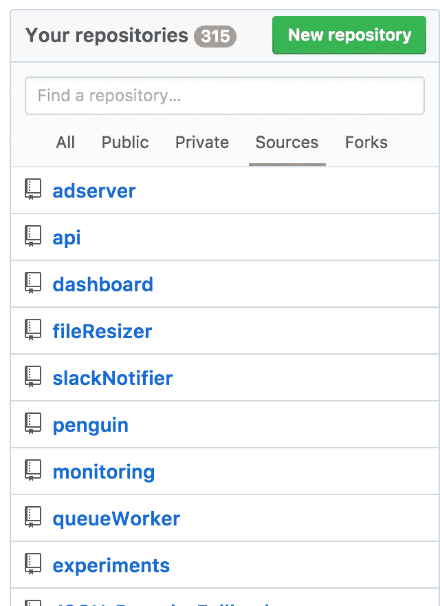
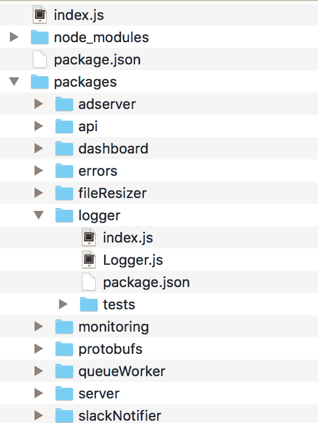
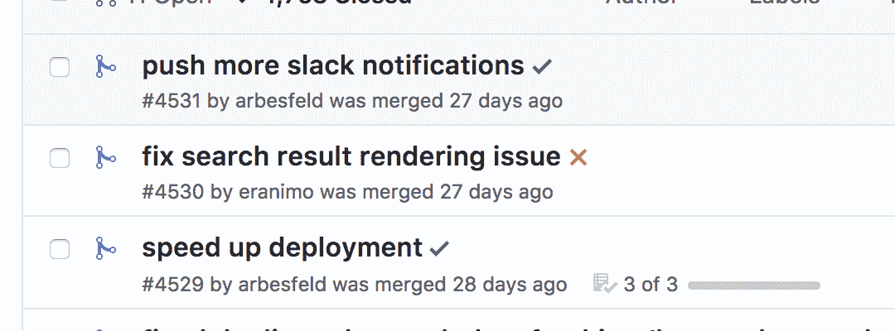

# monorepo:将代码放入它的位置

> 原文：<https://blog.logrocket.com/the-monorepo-putting-code-in-its-place-e073b3eb6295/>

维护一个不断增长的软件产品是令人畏惧的。你从一间两居室的公寓走到一间挤满了人的办公室，一路上，团队形成了，部署很慢，新的数据科学家伙只用 r 编写代码。

每个人都在生产大量的代码，但是你把它们都放在哪里呢？

在 LogRocket，我们有数以千计的文件，让我们的服务看起来不错，运行顺畅。从前端到后端，每一行代码都存储在一个庞大的 git 存储库中。

这种方法被称为单边回购。

## 听起来很乱

令人惊讶的是，它真的不是。一种常见的替代方法是每个服务有一个存储库。

这显然很有吸引力。

它使服务保持专注，并避免代码耦合。不幸的是，这种情况从未持续过。如果你用同一种语言部署两个微服务，它们可能会共享很多样板代码。如果他们也想交流，他们应该共享一个 RPC 模式。

最终结果是一堆随机的共享存储库，它们的存在只是为了充当真实服务之间的粘合剂。它可能看起来更干净，但实际上一点也不乱:



315 repos. What does “penguin” do again?

存储库也增加了很多开发人员的开销。他们需要被创建，被连接到 CI，被每个人克隆。

这只是开始。

使它们保持最新是困难的，对多个 PRs 的更改涉及同时跟踪多个 PRs。和 git 子报告很少是解决问题的方法。如果您的大多数开发人员将相同的一组存储库克隆到相同的位置，那么这种分离肯定会有一些明显的好处。

## 对混乱局面的驯服

你会说，代码分离。当然，单一回购也可能以类似的方式适得其反。将代码放在一起很吸引人；让它成长为一个无缝的泥球就不一样了。但是分离不是问题，存储库才是问题。每个项目都应该有一个模块结构来保持代码分离。幸运的是，这很容易通过一些工具解决。

在 JavaScript 中，本地模块管理最容易通过两种工具之一来完成:

*   [**Lerna**](https://lernajs.io/) —位于 npm 之上，手动将本地软件包符号链接到 node_modules 文件夹中。为发布单独的子包提供了许多工具。
*   [**Yarn Workspaces**](https://yarnpkg.com/blog/2017/08/02/introducing-workspaces/) —一个相当新的 Yarn 特性，类似于 lerna，但具有更精简的特性集，并专注于性能

这两者实质上都将您的整个存储库变成了私有 npm 包的集合。设置了 yarn 工作空间后，多存储库项目就变成了:



It’s packages all the way down.

由于它避免了与创建和管理 git 存储库相关的开销，许多事情开始变得更加清晰。这里的 penguin base 存储库已经变成了独立的服务器、日志和错误包。

## 其他好处

### 发展

共享一个目录树非常方便。您可以设置一个文件来导入应用程序使用的所有服务，并使用一个命令来启动它们:

```
import Server from 'server';
import Queue from 'queueWorker';
import Resizer from 'fileResizer';

Server.create({ port: 5000 });
Queue.create({ port: 5001 });
Resizer.create({ port: 5002 });
```

这比必须记住启动一切，或者采取额外的步骤在本地 docker 安装上重新创建您的生产环境要简单得多。

### 测试

进一步引入其他包的想法，端到端测试变得更加易于管理。例如，假设您正在测试 instaphoto 初创公司的处理管道。您可以简单地模拟出管道的任何服务中您不想要的部分。这是获得真正快速的端到端测试的方法:

```
import Server from 'server';
import Logger from 'logger';
import Slack from 'slackNotifier';
import sinon from 'sinon';

it('should log startup errors and send them to slack', () => {
  sinon.spy(Logger, 'logException');
  Slack.notify = sinon.spy(() => {});

  Server.create({ port: 5000 });
  Server.create({ port: 5000 }); // port already taken

  expect(Slack.notify).to.be.called();
  expect(Logger.logException).to.be.called();
});
```

与必须在本地 docker 安装上重新创建生产环境相比，这种设置允许更简单的开发。

### 代码审查

在 monorepo 中，一个改进或新特性的所有代码更改都可以包含在一个单一的 pull 请求中。因此，您可以一目了然地看到变化的全部范围。代码评审也可以在一个地方完成，讨论与特性相关，而不是任何团队的个别部分。这才是真正的协作。



Backend, frontend, ops. All in one place.

### 部署，回滚，再次部署！

像这样合并一个拉请求意味着可以同时部署到所有相关的系统。

当使用 lerna 或 yarn 工作空间时，需要做一些工作来构建一个单独的包。在 LogRocket，我们大致确定了这一点:

*   创建一个新的构建文件夹，只包含全局 package.json
*   浏览服务所需的所有本地包
*   将它们复制到构建文件夹中，并添加它们的外部依赖项
*   运行 npm 安装

由于没有什么像生产流量一样可以找到边缘情况，回滚有问题的代码就像恢复一次提交一样简单。一些容易做到的事情，即使是在周日凌晨 3 点。

### 公共包

在 LogRocket，我们在整个堆栈中共享代码:后端、前端，甚至与我们的公共 SDK 共享。为了保持我们的网络格式同步，SDK 发布了一些与后端服务处理数据所使用的相同的包。他们永远不会失去同步，因为他们不可能失去同步。

## 最后的想法

有些情况下，您仍然需要单独的存储库。如果你想开源你的一些代码，或者如果你做客户工作，你可能希望把一些事情分开。

你有更好的办法吗？请在这里或在 Twitter 上[告诉我们。](https://twitter.com/logrocketjs)

## 使用 [LogRocket](https://lp.logrocket.com/blg/signup) 消除传统错误报告的干扰

[](https://lp.logrocket.com/blg/signup)

[LogRocket](https://lp.logrocket.com/blg/signup) 是一个数字体验分析解决方案，它可以保护您免受数百个假阳性错误警报的影响，只针对几个真正重要的项目。LogRocket 会告诉您应用程序中实际影响用户的最具影响力的 bug 和 UX 问题。

然后，使用具有深层技术遥测的会话重放来确切地查看用户看到了什么以及是什么导致了问题，就像你在他们身后看一样。

LogRocket 自动聚合客户端错误、JS 异常、前端性能指标和用户交互。然后 LogRocket 使用机器学习来告诉你哪些问题正在影响大多数用户，并提供你需要修复它的上下文。

关注重要的 bug—[今天就试试 LogRocket】。](https://lp.logrocket.com/blg/signup-issue-free)