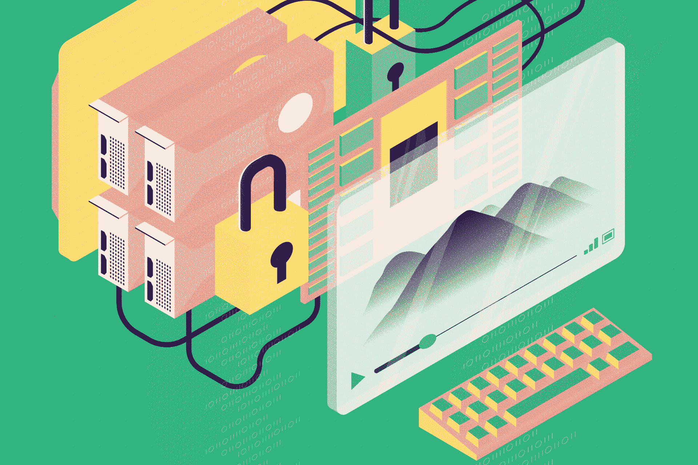
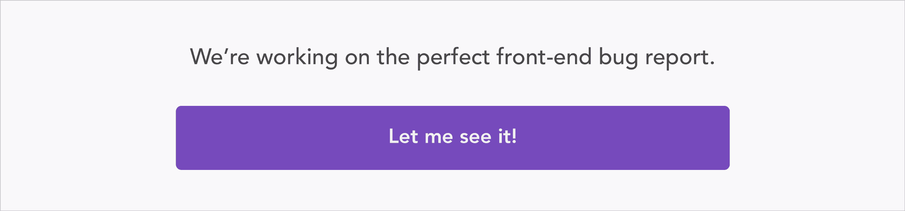

# 最有争议的 HTML5 扩展

> 原文：<https://blog.logrocket.com/the-most-controversial-html5-extension-7adc66bbc291/>

加密媒体扩展(eme)是一个备受争议的问题，它是最近添加到 HTML5 规范中的扩展。它们旨在为在浏览器中播放的媒体提供数字版权管理(DRM)支持。

财力雄厚的大公司将从 eme 的实施和采用中获益。W3C 一推出 eme，电子前沿基金会(EFF)就带着一封公开信[退出了 W3C 集团。自由软件基金会(FSF)也呼吁 W3C 集团拒绝 EME 的提议。](https://www.eff.org/pages/objection-rechartering-w3c-eme-group)

另一方面，所有主流浏览器都推出了对 EME 规范的支持，并被网飞这样的内容提供商投入使用。

为什么 eme 是一个如此有争议的概念？要回答这个问题，我们需要挖掘技术背后的动机。

### 动机

当媒体(例如音乐或电影)被记录在模拟媒体(例如磁带)上时，对可以发生的共享量有一个固有的限制。拷贝磁带意味着质量下降，因此创建拷贝的拷贝会使原始内容基本上无法使用。这意味着艺术家可以安全地发布他们的作品，而不用太担心每个人都可以免费得到一份拷贝。

然后，我们转向内容的数字拷贝，这意味着可以轻松创建无损拷贝。这时，数字版权管理(DRM)软件的概念出现了。

DRM 允许出版商控制消费者如何查看他们的内容。有许多不同的 DRM 方案，但每一个都有相同的基本结构:发行商用密钥加密内容，发行商随后在有限的时间内将密钥交给用户。当然，我们遗漏了很多细节。暂时抓住基本思路就够了。

DRM 一直备受争议。自由软件基金会建议，由于 DRM 阻止你对你购买的内容做什么(例如，你不能任意复制它)，它“[创造了一个损坏的商品](https://www.defectivebydesign.org/what_is_drm_digital_restrictions_management)；它阻止你做没有它可能做的事情。”索尼 BMG 公司曾在未经用户许可的情况下在客户的电脑上安装了[rootkit，以实施数字版权管理，这当然于事无补。](https://en.wikipedia.org/wiki/Sony_BMG_copy_protection_rootkit_scandal)

到目前为止，我们讨论的大多数 DRM 技术都是在人们仍然购买 DVD/CD 并使用桌面软件在机器上消费内容的时代开发的。这两者本质上都是过去的行为。

我们通过网飞、Spotify、Pandora、Apple Music 等服务来消费电影和音乐。，通常通过网络。由于与内容合作伙伴的协议，网飞等人有义务用 DRM 提供他们的内容。此外，网络流媒体可能是网飞的一大应用。这使得在网络上实施 DRM 成为网飞等人要解决的一个极其重要的问题。

这就是 eme 发挥作用的地方。它们本质上是一种允许浏览器通过加密介质与 DRM 系统通信的技术。它们使得 DRM 软件能够在浏览器上工作，并将加密的内容传递给用户。这意味着网飞可以为你提供一部加密的受 DRM 保护的电影。

### 技术

EMEs 背后的技术特别有趣，也是围绕该标准的争议的一部分。

比方说 *Felix* 是一项电影流媒体服务，它通过浏览器提供电影，并使用 eme 来保护其提供的内容。假设用户想要播放 Felix 的一些加密内容。事情是这样的:

*   浏览器将加载这些内容，意识到它是加密的，然后触发一些 Javascript 代码。
*   这个 Javascript 将获取加密的内容，并将其传递给一个叫做内容解密模块(CDM)的东西——稍后会详细介绍。
*   CDM 然后将触发一个请求，该请求将由 Felix 转发给*许可证服务器*。这是一个 Felix 控制的服务器，它决定是否允许特定用户播放特定内容。如果许可证服务器认为我们的用户可以观看该内容，它将向 CDM 发回该内容的解密密钥。
*   CDM 随后将解密内容，并开始为用户播放。

整个过程中最重要的部分是清洁发展机制。就其本质而言，CDM 必须是 Felix 信任的一段代码。如果不是，Felix 不能确定它会做它想要它做的事情。这意味着 CDM 必须与浏览器一起提供。有几个不同的 CDMs 提供商，包括谷歌的 Widevine 和 T2 的 Adobe Primetime。这两者都为 Felix 等内容提供商实施 DRM 提供了必要的加密支持。

### 争论

欧洲、中东和非洲之争的背后有多个故事。首先，像自由软件基金会这样的团体对 DRM 有一种固有的反对。他们认为，在网络上引入 DRM 将会极大地减少消费者随心所欲使用设备的自由。

此外，DRM 还防止对内容的合法修改，如给视频添加字幕。这意味着改善网络可访问性的合法软件将受到 eme 引入的不利影响。

> DRM 中没有对安全研究人员的保护:如果你篡改 DRM，你通常会被认为是一个做错事的人，即使你是为了研究目的而这么做的。

反对 DRM 的阵营已经存在了很长一段时间——eme 是他们反对 DRM 的另一个前线，鉴于 web 已经成为内容分发的主导形式，这一点尤为重要。这种反对是不可轻视的。网络中立运动的领导人之一 Tim Wu 出于这些原因反对 eme。[以太坊基金会](https://ethereum.org/)也公开反对将 EMEs 作为一种标准来实施。

### 内容解密模块

但是，围绕 CDMs，还有另一个角度来对抗 eme。目前，CDM 基本上是浏览器自带的闭源二进制 blobs。

这意味着 eme 导致在浏览器中引入闭源软件。由于浏览器构成了软件生态系统中如此重要的一部分，开源实现对于安全性、消费者保护等无疑是非常重要的。

此外，无法使用闭源 CDM 实施可能会导致浏览器领域缺乏竞争力。过去，围绕闭源编解码器及其在 Linux 中的位置有过类似的争论。然而，有争议的是，在传统的开放网络中，闭源软件的作用更加重要。

### 将会发生什么和应该发生什么

既然我们已经考虑了辩论的状况，我将步入竞技场。这里有两个重要的问题:什么样的*会发生*和什么样的*会发生*。前者更容易回答；后者更主观。

有巨大的经济激励指向 EME 的采用。正如我提到的，资金雄厚的演员致力于使他们成为网络的核心部分。此外，从技术角度来看，eme 对大多数互联网用户来说都非常有效，这使得内容提供商没有什么动力拒绝使用 eme。

正如 W3C 对 eme 的肯定所表明的那样，这种趋势有利于该标准，并将持续相当长的一段时间。为了抵制这种运动，用户必须确信 eme 的危害足够大，从而选择不使用它们的提供商。我没有看到任何证据表明目前普通用户的情况是这样的。

> 这意味着我相信网络正朝着 DRM 更大的扩散发展，而不是更小。

现在，来看一个更难的问题:什么样的*应该发生。我有一些明确的信念，例如，安全研究人员应该被免除与违反 DRM 相关的处罚；应该有社区可以依赖的 CDMs 的开源实现，等等。*

在其他问题上，我不太确定。对我来说，内容提供商应该能够保护他们花费数百万美元制作的内容。但是，这其中的含义(网络可访问性降低，消费者权利减少)也让我感到害怕。此外，我确信在音频/视频媒体元素上引入 DRM 将逐渐导致更多内容上的 DRM。

同时持有这些信念是一种逃避，因为目前似乎没有一个解决方案能让所有人都满意。也许当聪明人解决这个问题时，事情会有所改变。

## 使用 [LogRocket](https://lp.logrocket.com/blg/signup) 消除传统错误报告的干扰

[LogRocket](https://lp.logrocket.com/blg/signup) 是一个数字体验分析解决方案，它可以保护您免受数百个假阳性错误警报的影响，只针对几个真正重要的项目。LogRocket 会告诉您应用程序中实际影响用户的最具影响力的 bug 和 UX 问题。

然后，使用具有深层技术遥测的会话重放来确切地查看用户看到了什么以及是什么导致了问题，就像你在他们身后看一样。

LogRocket 自动聚合客户端错误、JS 异常、前端性能指标和用户交互。然后 LogRocket 使用机器学习来告诉你哪些问题正在影响大多数用户，并提供你需要修复它的上下文。

关注重要的 bug—[今天就试试 LogRocket】。](https://lp.logrocket.com/blg/signup-issue-free)