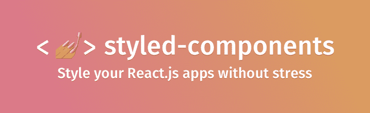
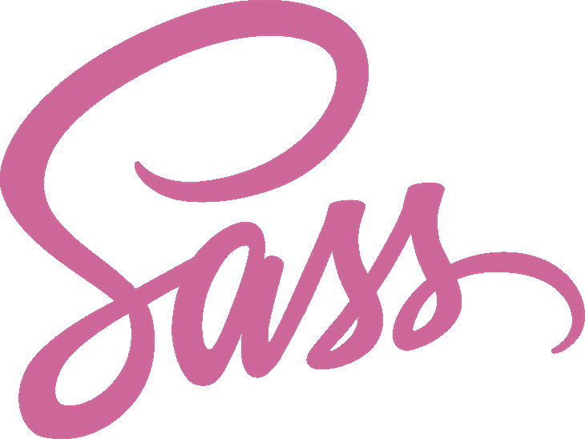
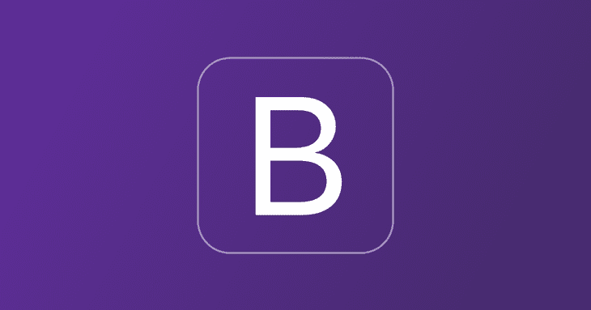
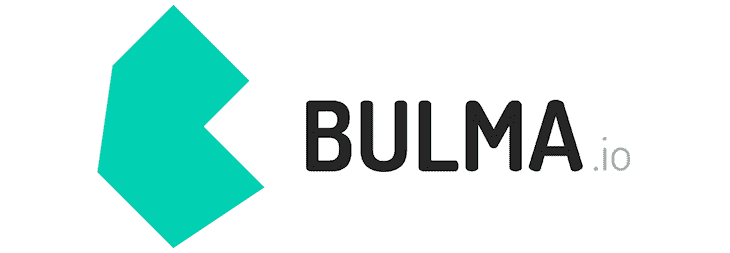
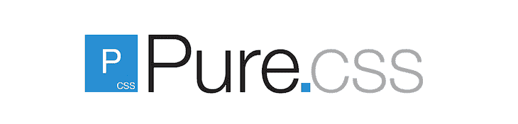
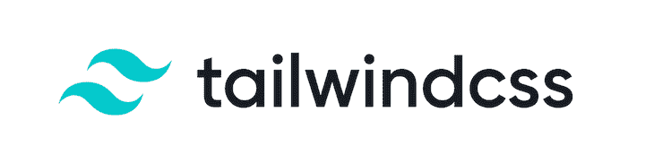

# 2020 年最受欢迎的 CSS 技术

> 原文：<https://blog.logrocket.com/the-most-in-demand-css-technologies-in-2020/>

这些年来，CSS 及其社区已经从样式表发展成为一个完整的技术生态系统，涵盖了 Bootstrap 和 Materialize 等框架，以及 Sass 等预处理程序，甚至还有 CSS-in-JS 等新概念。2020 年的前端 web 开发不再仅仅包括编写 CSS，还包括了解技术以及在任何给定的场景中使用哪些技术。

首届“[CSS 2019](https://2019.stateofcss.com)状态”调查记录并精美地展示了当今全球 CSS 用户的观点。数据点涵盖了 CSS 库和框架、特性、单元和选择器，以及更多。

该报告提供了对前端开发未来的一瞥，完全集中在 CSS 上。在我看来,“CSS 状态”报告已经是首要的纯 CSS 开发人员调查，我希望它将成为未来几年前端开发人员社区的主要内容。

在这篇文章中，我们将看看 2020 年最受欢迎的 CSS 技术，以及开发人员对 CSS 概念的定位，如预处理程序、框架和新的闪亮的 CSS-in-JS。

## CSS-in-JS

10 多年前，CSS 有了新的发展，核心规则被覆盖，新的特性被创建，形成了一种新技术，称为预处理程序。最近，一项叫做 CSS-in-JS 的革命性新技术出现了。

CSS-in-JS 允许您用 JavaScript 而不是 CSS 来设计您的演示文稿。然后，当您的应用程序运行时，JavaScript 被解析并生成 CSS，它直接附加到您的 DOM。这有助于将 CSS 抽象到组件级别，并使您的样式易于维护。它在 CSS 社区中风靡一时；以下是一些最常用的技术。

### 样式组件



styled-components 是一个 CSS-in-JS 库，它帮助您使用可视化原语和最好的现代浏览器技术来设计 React 组件的样式。它是一种优化的 CSS 增强，用于设计应用程序组件的样式，会让您想起 CSS 模块。

超过 200，000 个项目使用它，它有一个强大且快速增长的社区。根据 insights 的调查，多达 79%的 CSS 用户听说过它(考虑到[仅在三年前登陆](https://medium.com/styled-components/announcing-primitives-support-for-truly-universal-component-systems-5772c7d14bc7)，这是相当惊人的)，而多达 33%的[用户是重复用户](https://2019.stateofcss.com/technologies/css-in-js/)。另外 26%的人想要学习它。

这里有一篇我不久前写的关于样式化组件的文章。

### CSS 模块

CSS 模块是 CSS 文件，其中类名和转换的范围是本地的，所有链接和导入都是模块请求格式，如下所示:

```
import styles from "./style.css";
// import { className } from "./style.css";
```

它们被编译成一种称为[互操作 CSS](https://github.com/css-modules/icss) 的低级交换格式，但编写起来像普通的 CSS 文件:

```
.danger-heading {
  color: red;
}
```

当从 JS 模块导入 CSS 模块时，它会导出一个包含从本地名称到全局名称的所有映射的对象。它已经被 21%的受访者使用过，并在 GitHub 上被标记了 13000 次。这里有一个很大的认识差距，这可能是团队释放更多资源来帮助教育 CSS 用户的一个很好的机会。

### 风格 JSX

根据官方 Next.js 博客的说法，Styled JSX 是一个 CSS-in-JS 库，它允许你编写封装的和限定范围的 CSS 来设计你的组件。您为一个组件引入的样式不会影响其他组件，允许您添加、更改和删除样式，而不用担心意外的副作用。

根据 GitHub 的数据，凭借令人印象深刻的 [350，000 周下载量](https://www.npmjs.com/package/styled-jsx)和目前被 51，000 个项目使用的，在不久的将来有很大的采用前景。目前大约[54%的被调查 CSS 用户](https://2019.stateofcss.com/technologies/css-in-js/)没有听说过它，所以我相信这个数字到 2020 年底会有显著变化。

其他 CSS-in-JS 库还有 [JSS](https://cssinjs.org/) 、[情感](https://emotion.sh/docs/introduction)、[阿芙罗狄蒂](https://github.com/Khan/aphrodite)、[镭](https://formidable.com/open-source/radium/)。

## 预处理器

很久以前，在 CSS 的历史上出现了 Sass 和 Less。这些预处理程序引入了 CSS 中从未使用过的新特性，比如变量和编程语言中令人惊叹的嵌套样式概念。这些都发生在 CSS 开始赶上他们之前。

### 厚颜无耻



Sass 被认为是世界上最成熟、最稳定、最强大的专业级 CSS 扩展语言。它兼容所有的 CSS 版本，它已经被定期维护了大约 13 年，它有这么多很酷的功能。很多框架都是建立在 Sass 之上的，其中一个就是 [Compass](http://compass-style.org/) 。

目前有超过 150 万个项目在使用 Sass，这大约是 T2 80%的调查对象，我敢说，每个人都喜欢 Sass。

### 较少的


Leaner 样式表，俗称 Less，是另一个很好的 CSS 扩展，它使用 Less.js 将 Less 样式转换成 CSS 样式。它将 mixins 和变量等核心 JS 概念引入 CSS，这使得 JavaScript 开发人员很容易掌握。运行时，它将样式预处理为纯 CSS。

目前超过 100 万个项目在使用它，超过 98%的 CSS 用户[听说过它](https://2019.stateofcss.com/technologies/pre-post-processors/)，其中 25%是回头客，11%愿意学习。

另一个你可能想看看的预处理器库是 [Stylus](http://stylus-lang.com/) ，它也有一个不断增长的社区。

## CSS 框架

如果没有提到像 Bootstrap 这样的用户界面工具包，任何关于 CSS 技术的讨论都是不完整的。这使得 CSS 用户的生活变得简单，尤其是那些想要构建面向客户端的用户界面的初学者。在这一节中，我们来看一些需求量很大的框架。

### 引导程序



Bootstrap 是一个开源的、移动优先的工具包，用于开发 HTML、CSS 和 JS。您可以使用 Sass 变量和 mixins、响应式网格系统、大量预构建的组件和基于 jQuery 构建的强大插件快速构建您的想法或构建您的整个应用程序。

根据调查洞察，目前有超过 130 万用户使用它，其中多达 45%的 T2 用户是回头客。多年来，一些人已经转向更新更有趣的框架，但是 Bootstrap 仍然保留了大量的用户。

### 语义用户界面


语义 UI 是一个开发框架，它有助于使用人类友好的 HTML 创建漂亮的、响应迅速的布局。使用简洁的 HTML，语义 UI 将单词和类视为可交换的概念。超过 11，000 个项目在使用它，超过 64%的 CSS 用户听说过它，另有 21%的用户愿意学习。

### 布尔玛



布尔玛是一个基于 Flexbox 的免费开源 CSS 框架，被超过 200，000 名开发者使用。它是 100%响应的、以移动为中心的、模块化的、开源的。目前有超过 86，000 个项目在使用，10%的受访者表示[不止一次使用过布尔玛](https://2019.stateofcss.com/technologies/css-frameworks/)。随着 [460，000 的月下载量](https://www.npmjs.com/package/bulma)，布尔玛社区正在成长，并且有机会让社区发展得更广。

### 纯. css



Pure.css 是一组小型的、响应迅速的 css 模块，可以在每个 web 项目中使用。Pure 构建在 [Normalize.css](http://necolas.github.io/normalize.css/) 之上，为原生 HTML 元素提供布局和样式，以及最常见的 UI 组件。Pure 真的很小——整套模块以 3.8kB 的速度缩小并压缩。

目前被[超过 3000 个项目](https://github.com/pure-css/pure/)使用，超过 [的](https://2019.stateofcss.com/technologies/css-frameworks/) [18](https://2019.stateofcss.com/technologies/css-frameworks/) [百分之](https://2019.stateofcss.com/technologies/css-frameworks/) [被调查的](https://2019.stateofcss.com/technologies/css-frameworks/) [CSS 用户](https://2019.stateofcss.com/technologies/css-frameworks/)已经使用或者想要学习它。

### 顺风 CSS



Tailwind CSS 是一个实用至上的 CSS 框架，用于快速构建定制设计。Tailwind CSS 是一个高度可定制的低级 CSS 框架，它为您提供了构建定制设计所需的所有构件，而没有您必须努力克服的任何恼人的固执己见的风格。

目前有超过 25，000 个项目在使用它，根据调查的兴趣指标，它是最受欢迎的 CSS 框架，[14%的调查 CSS 用户希望学习使用它。](https://2019.stateofcss.com/technologies/css-frameworks/)

其他 CSS 框架包括[物化](https://materializecss.com/)、[基础](https://get.foundation/)、[蚂蚁设计](https://ant.design/)、 [UI 套件](http://getuikit.com/)、 [Primer](https://primer.style/css) 和 [Tachyons](https://tachyons.io/) 。

## 结论

在这篇文章中，您已经看到了各种 CSS 技术以及它们在社区中的需求，从 CSS-in-JS 到预处理程序甚至框架。CSS-in-JS 是冲击 CSS 社区的最新技术之一，我对这一技术的未来感到兴奋，尤其是像 styled-components 和 Tailwind CSS 这样的库和框架的增长。你最喜欢的 CSS 技术有哪些？请在评论中告诉我们！

## 你的前端是否占用了用户的 CPU？

随着 web 前端变得越来越复杂，资源贪婪的特性对浏览器的要求越来越高。如果您对监控和跟踪生产环境中所有用户的客户端 CPU 使用、内存使用等感兴趣，

[try LogRocket](https://lp.logrocket.com/blg/css-signup)

.

[](https://lp.logrocket.com/blg/css-signup)[https://logrocket.com/signup/](https://lp.logrocket.com/blg/css-signup)

LogRocket 就像是网络和移动应用的 DVR，记录你的网络应用或网站上发生的一切。您可以汇总和报告关键的前端性能指标，重放用户会话和应用程序状态，记录网络请求，并自动显示所有错误，而不是猜测问题发生的原因。

现代化您调试 web 和移动应用的方式— [开始免费监控](https://lp.logrocket.com/blg/css-signup)。