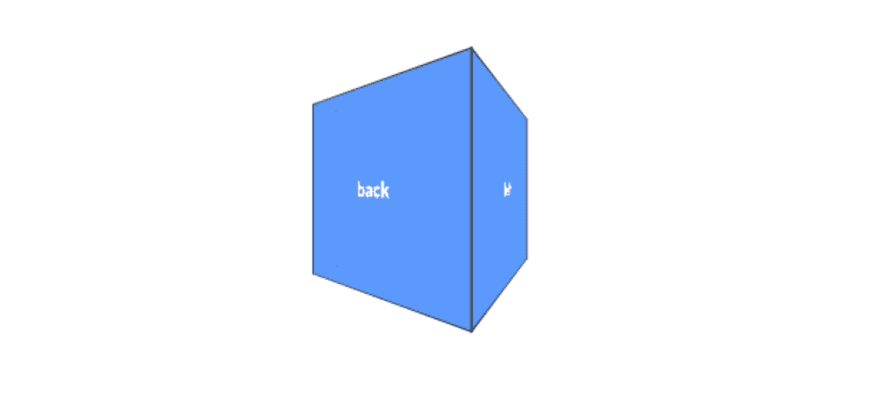
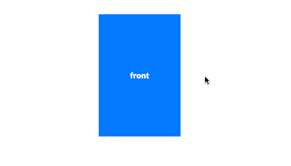
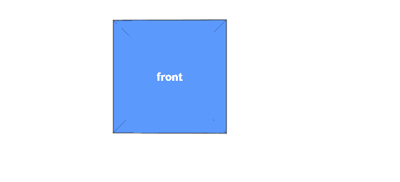
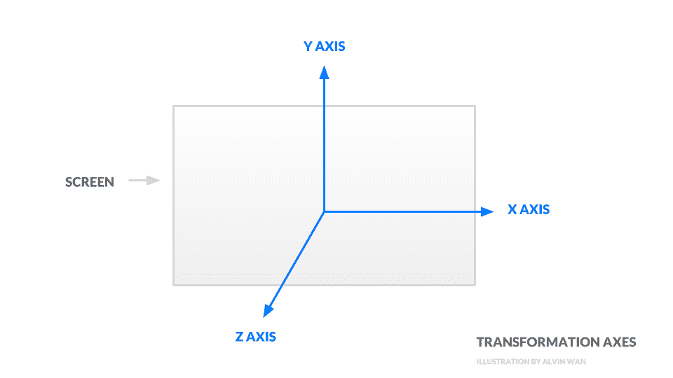
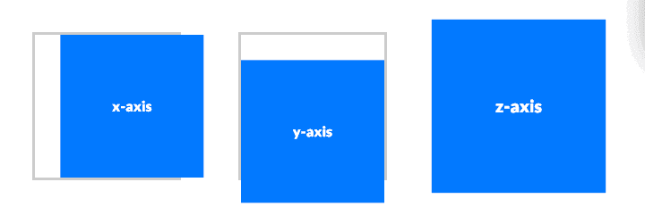
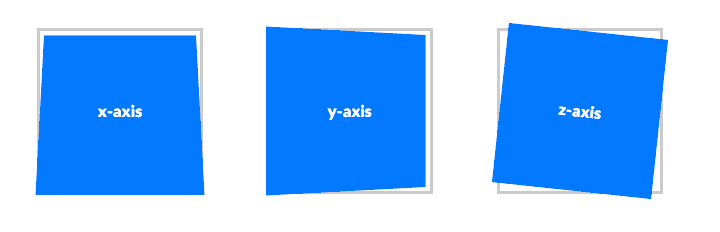
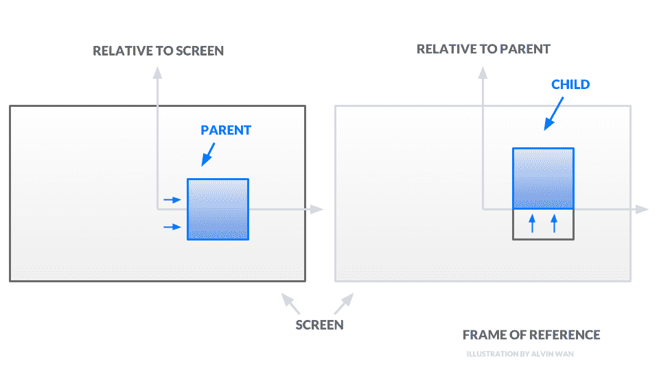
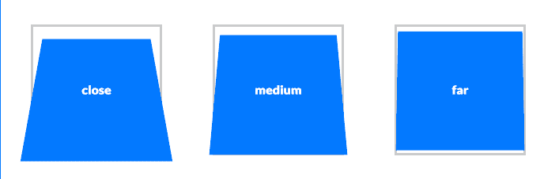
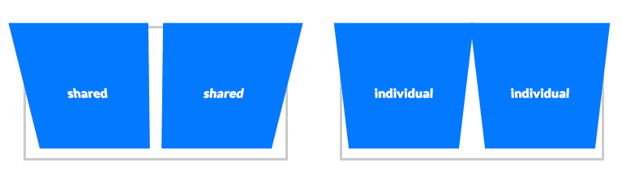
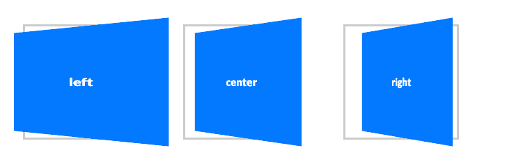

# noob 的 CSS 3D 转换指南- LogRocket 博客

> 原文：<https://blog.logrocket.com/the-noobs-guide-to-3d-transforms-with-css-7370aafd9edf/>



大多数网站和界面被限制在二维空间，最多模仿 3D 效果。以你最常见的日常界面为例:社交媒体、移动设备应用，或许还有生产力工具。所有这些都具有带有少量二维动画的二维按钮。使用投影和叠加对象，这些界面可以在二维中模仿三维效果。

然而，这些界面中的大多数都缺少真正的三维变换。当 CSS 转换在 2009 年首次引入时，缺乏浏览器支持或低效的客户端呈现可以证明坚持二维是合理的。然而，CSS 3D 转换现在[被普遍支持](https://caniuse.com/#feat=transforms3d)和[根据经验测试](https://www.smashingmagazine.com/2016/12/gpu-animation-doing-it-right/)，CSS 转换被硬件加速。此外，根据前微软创意人 Claudio Gulgieri 在 [TEDxBerkeley 的演讲](https://www.youtube.com/watch?v=njcpgtnyKRk),当设计师利用物理的三维世界时，数字界面会受益:熟悉“界面”,如门把手、拨号盘、扑克牌等，并扩展到数字界面中的类似物。然而，模仿阴影等效果只是一个开始。

有许多三维属性可以利用，例如，用户知道一个三维物体有多少个面。一张翻转的卡片暗示只有两面存在。一个绕一个轴旋转的盒子意味着四个轴。此外，用户知道如何与不同的 3D 对象交互。刻度盘应该旋转，陀螺应该旋转。不同的界面有不同的机会利用对三维物体的熟悉度——有些界面根本没有空间。

[](https://logrocket.com/signup/)

然而，这个介绍性的指南将会给你足够的体验来理解 3D 变换。有了这样的理解，你就可以自己决定 3D 转换是好事还是负担。在本指南中，我们将探索基本的 3D 变换和一些用例，讨论使用 CSS 在 3D 中进一步工作的必要构件。在本指南的结尾，您将看到下面翻转卡片和盒子的示例代码，使用我们下面讨论的概念。



### 转换

首先，我们将使用基本的二维正方形来说明三维空间中的变换。变换包括三种基本操作，即平移、旋转和缩放，它们控制对象的放置和方向。所有变换都围绕三个轴:

1.  **x 轴**从左向右运行，数值向右增加
2.  **y 轴**自下而上直线运行，数值向上递增
3.  **z 轴**从屏幕上突出，数值越高越靠近观察者。所有三个轴如下图所示:



我们下面讨论的转换都在这三个轴上运行。总共有三个转变；第一个是沿着一个或多个轴的**平移**，或者运动。使用`translateX`、`translateY`和`translateZ`，或者使用简写`translate3d`在三维空间中移动对象。

这里是沿着每个轴平移的 [codepen 演示。](https://codepen.io/alvinwan/pen/WPapwm?editors=1100)



为了便于**绕一个或多个轴旋转**，使用`rotateX`、`rotateY`和`rotateZ`。和以前一样，这里有一个简写`rotate3d`。

```
.translated-square {
  transform: 
    translateX(20px)  /* move right */
    translateY(-20px)  /* move down */
    translateZ(20px);  /* move closer to viewer */
}

.translated-square-shorthand {
  transform: translate3d(20px, -20px, 20px);
}
```

绕 z 轴的旋转等同于在 2D 的旋转。然而，围绕 x 轴和 y 轴的旋转是非常不同的效果。这里是围绕每个轴旋转的[代码演示。](https://codepen.io/alvinwan/pen/aXRJYW?editors=1100)



第三个也是最后一个变换是关于一个或多个轴的**缩放**。重申一下，缩放就是简单地调整对象的大小。使用`scaleX`、`scaleY`、`scaleZ`，或简称`scale3d`。由于我们的演示广场只存在于二维空间，在 z 维度上缩放是没有意义的。然而，缩放 x 或 y 相当于改变正方形的宽度或高度。

```
.scaled-square {
  transform: 
    scaleX(20deg)  /* flip "up" */
    scaleY(-20deg)  /* flip "right" */
    scaleZ(20deg);  /* rotate counter-clockwise */
}

.scaled-square-shorthand {
  transform: scale3d(20deg, -20deg, 20deg);
}
```

### 参照系

请注意，所有变换都是相对于参考框架进行操作的。为了更好地理解这一概念，请设想以下场景:

1.  一列火车正沿着铁路行驶。这列火车正向北移动，相对于地球
2.  列车员坐在火车里扔苹果。这个苹果相对于火车上下移动*。在火车的参照系中，没有“北”的概念。关于火车，这个苹果只是上下移动*
3.  然而，*相对于地球*，苹果实际上是向北*和*上下移动

注意参照系决定了我们如何描述苹果的运动。同样，以下面的 HTML 代码片段为例。我们将看到每个对象的参考系都是它在文档对象模型(DOM)中的父对象。换句话说，对于下面的例子，父对象类似于火车，子对象类似于苹果。

```
<div class="square parent">
  <div class="square child"></div>
</div>
```

假设我们将父元素向右平移 20 个像素，将子元素向上平移 20 个像素。

```
.parent {
  transform: translateX(20px);
}

.child {
  transform: translateY(20px);
}
```

子节点的向上平移是相对于父节点的*，这意味着子节点将总共向右*平移 20 像素，向上*平移 20 像素。*



参考框架允许我们将不同的 3D 对象组合在一起，并使用积木来组装更复杂的 3D 对象。为了更好地理解参考框架，请随意使用这个[参考框架的](https://codepen.io/alvinwan/pen/PVypMr)codepen 演示。我们对转换的讨论到此结束。在下一节中，我们将讨论相机的属性。

### 远景

到目前为止，在 CSS 规范中，透视是相机设置的总称。一个这样的设置是观察者和物体之间的距离。这由`perspective`属性本身控制。较低的透视值会产生放大的 3D 效果，而较高的透视值会产生柔和的 3D 效果。在这个[透视](https://codepen.io/alvinwan/pen/xMyWKB)的 codepen 演示中，透视值向右移动增加。

```
.square {
  transform: perspective(200px) rotateX(20deg);
}
```

物体离得越远，3D 效果就越不强烈。



设置透视图还有第二种方法，第一种方法是像上面那样设置属性，另一种方法是调用函数，如下所示:

```
.scene.close {
  perspective: 10em;
}

.scene.medium {
  perspective: 20em;
}

.scene.far {
  perspective: 100em;
```

注意，在调用`rotateX`函数之前，必须调用`perspective`函数*才能生效。此外，第二种方法仅适用于单个对象的透视。在下面的[透视组的代码公开演示](https://codepen.io/alvinwan/pen/BMqrRd)中，我们看到了共享透视(左)和个人透视(右)之间的区别。*



有了距离设置，我们还可以配置摄像机角度。具体来说，`perspective-origin`属性确定了消失点在场景中的位置。将消失点设置在左侧就好像观众向左移动。同样，将消失点设置在顶部就好像观察者从更高的角度观察物体。下面是不同视角起源的[代码笔演示。](https://codepen.io/alvinwan/pen/exPMXq)



相机设置到此结束。在本节中，我们讨论了如何设置摄像机的距离和位置。在接下来的两节中，除了上面的变换，我们还将使用这些相机效果来构建简单的几何对象和 3D 效果。

### 示例 1:翻转卡片

2012 年，幻想互动在他们的[重新设计的《今日美国》](https://www.facebook.com/Fi/videos/10151250080289923/)中使用了翻转卡片，标题在一边，文章的序言在另一边。在这一节中，我们将使用我们到目前为止接触过的技术重新创建这张翻转卡。

在 [codepen.io](https://codepen.io/) 创建一个新的 codepen。在 HTML 部分，定义您的卡。

1.  总是从定义一个场景来保存 3D 对象开始
2.  在这个场景中，我们添加了我们的卡
3.  该卡包含两个面，每个面将是一个 2D 矩形物体

```
<div class="scene">
  <div class="card">
    <div class="face front">front</div>
    <div class="face back">back</div>
  </div>
</div>
```

在你的 CSS 中，定义一个场景，包括它的视角。

```
.scene {
  width:10em;
  height:15em;
  perspective: 30em;
}
```

接下来，设计你的卡片对象。在这里，添加一个额外的属性`transform-style`，它控制子元素是如何呈现的——这个属性将决定子元素是在 2D 还是在 3D 空间中呈现。使用值`preserve-3d`确保卡的两面以 3D 方式呈现。

```
.card {
  width:100%;
  height:100%;
  position:relative;
  transition: transform 0.5s;
  transform-style: preserve-3d;
}
```

接下来，设计你的卡片的两面。最关键的属性是`backface-visibility`，它决定了我们的牌面背面是否被渲染。这里，将值设置为`hidden`，以便只渲染两面的“正面”。任意给每张脸分配颜色。

```
.face {
  width:100%;
  height:100%;

  color:#FFF;
  line-height:15em;
  text-align:center;
  position:absolute;

  backface-visibility:hidden;
}

.front {
  background-color:#0379ff;
}

.back {
  background-color:#333;
  transform: rotateY(180deg);
}
```

最后，在悬停时旋转卡片。

```
.scene:hover .card {
  transform: rotateY(180deg);
}
```

现在你已经完成了你的第一个纯 CSS 的 3D 变换效果！你可以在这里查看上面代码[的 codepen 演示来测试。](https://codepen.io/alvinwan/pen/zemjbw)


我们翻转卡片的例子到此结束。就其核心而言，这种效果依赖于前面讨论的转换和视角。然而，根据上面的例子，要达到预期的效果，还需要一些小技巧。以这些简单的 2D 面为基础，我们可以构建更复杂的几何图形，然后将它们组装起来，构建更复杂的物体。

### 示例 2:立方体

web 的 3D 引擎 WebGL 将一个对象定义为一个*几何体*和一个*材质*的组合。不严格地说，*几何*定义了形状，比如立方体、球体或圆柱体。*材质*定义外观，如反光、紫色和 50%透明。在这一节中，我们将建立一个最简单的几何图形，一个立方体。然后，这个立方体可以成为 CSS 中未来 3D 创作的构建块。

* * *

### 更多来自 LogRocket 的精彩文章:

* * *

和前面一样，在 [codepen.io](https://codepen.io/) 创建一个新的 Codepen。在 HTML 部分中，为多维数据集键入以下设置。再次像以前一样，定义一个场景，对象和面孔。

```
    <div class="scene">
      <div class="cube">
        <div class="face front">front</div>
        <div class="face right">right</div>
        <div class="face left">left</div>
        <div class="face back">back</div>
        <div class="face top">top</div>
        <div class="face bottom">bottom</div>
      </div>
    </div>
```

在 CSS 部分，给场景添加透视。

```
.scene {
  width:10em;
  height:10em;
  perspective:10em;
}
```

样式立方体，使所有的子元素都呈现在三维空间(`transform-style`)，并添加一个无限旋转的动画，这样我们就可以从各个角度看到我们的三维创作。

```
.cube {
  width:100%;
  height:100%;
  position:relative;
  animation: spinning 2s infinite;
  transform-style:preserve-3d;
}

@keyframes spinning {
  from  { transform: translateZ(-5em) rotateY(0deg);   }
  to    { transform: translateZ(-5em) rotateY(360deg); }
}
```

接下来，设置面的样式，使它们可见。

```
.face {
  width:100%;
  height:100%;
  position:absolute;
  background-color:rgba(3, 121, 255, 0.5);

  color:#FFF;
  line-height:10em;
  text-align:center;
}
```

对于这个倒数第二步，将每个面旋转到位。请注意，前、后、右和左面沿 y 轴旋转，顶面和底面沿 x 轴旋转。

```
.front  { transform: rotateY(0deg)   }
.right  { transform: rotateY(90deg)  }
.left   { transform: rotateY(-90deg) }
.back   { transform: rotateY(180deg) }
.top    { transform: rotateX(90deg)  }
.bottom { transform: rotateX(-90deg) }
```

请注意，所有的面都以原点为中心。然而，我们希望所有面的中心都在立方体的外围。因为立方体是 10em x 10em x 10em，所以沿着 Z 维度平移每个面以将它们全部向外移动。

```
.front  { transform: rotateY(0deg) translateZ(5em); }
.right  { transform: rotateY(90deg) translateZ(5em);  }
.left   { transform: rotateY(-90deg) translateZ(5em); }
.back   { transform: rotateY(180deg) translateZ(5em); }
.top    { transform: rotateX(90deg) translateZ(5em); }
.bottom { transform: rotateX(-90deg) translateZ(5em); }
```

您的预览现在应该与下面的匹配，一个无限旋转的立方体，所有 6 个面都被标记。你可以看到我们的旋转立方体的 [Codepen 演示。](https://codepen.io/alvinwan/pen/XOxOXa)


这个例子不需要新的机器或逻辑；事实上，我们遇到的怪癖和翻牌例子中的一样。我们的第二个例子到此结束，这是 CSS 中更复杂的 3D 创作的基本构建块。事实上，您可以通过合成多个 2D 面来创建任何 3D 几何图形，反过来，也可以在 CSS 中创建任意的 3D 模型。

### 结论

在本指南中，我们讲述了使用纯 CSS 进行 3D 变换的基础知识。具体来说，使用 CSS 从 3D 创作的构建块进行转换和透视。然而，最终，比 CSS 更强大更有效的 3D 引擎还是存在的；CSS 的作用只是增加一个界面。有了这个指南，你可以进一步发挥 CSS 的作用，潜在地利用用户对现有 3D 界面的熟悉，比如卡片、盒子或表盘。

## 你的前端是否占用了用户的 CPU？

随着 web 前端变得越来越复杂，资源贪婪的特性对浏览器的要求越来越高。如果您对监控和跟踪生产环境中所有用户的客户端 CPU 使用、内存使用等感兴趣，

[try LogRocket](https://lp.logrocket.com/blg/css-signup)

.

[](https://lp.logrocket.com/blg/css-signup)[https://logrocket.com/signup/](https://lp.logrocket.com/blg/css-signup)

LogRocket 就像是网络和移动应用的 DVR，记录你的网络应用或网站上发生的一切。您可以汇总和报告关键的前端性能指标，重放用户会话和应用程序状态，记录网络请求，并自动显示所有错误，而不是猜测问题发生的原因。

现代化您调试 web 和移动应用的方式— [开始免费监控](https://lp.logrocket.com/blg/css-signup)。