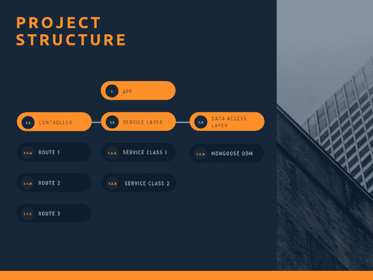
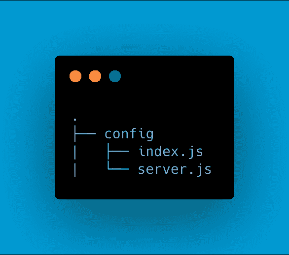
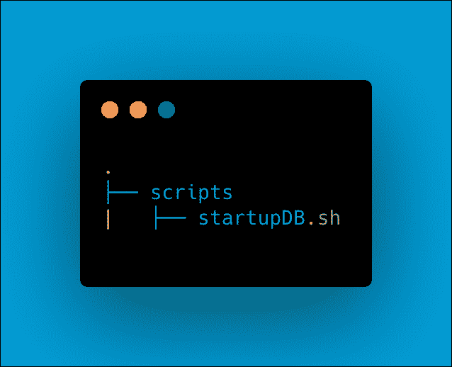
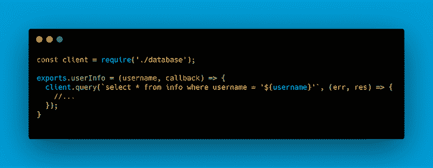
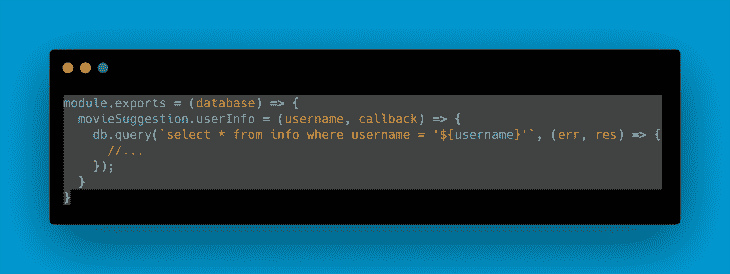
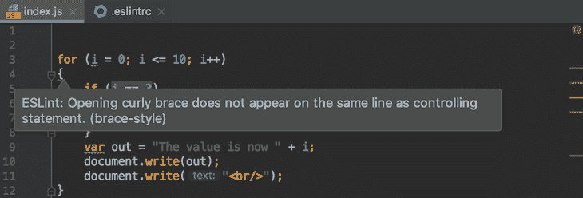
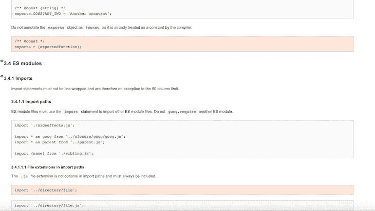
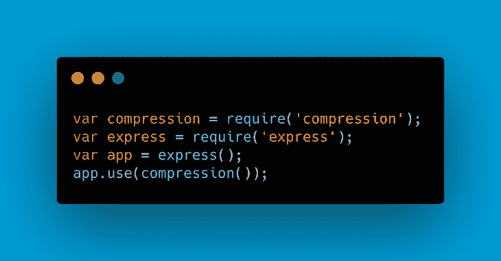
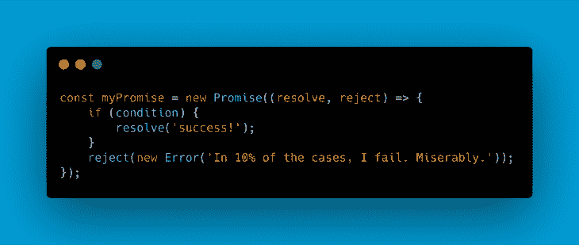
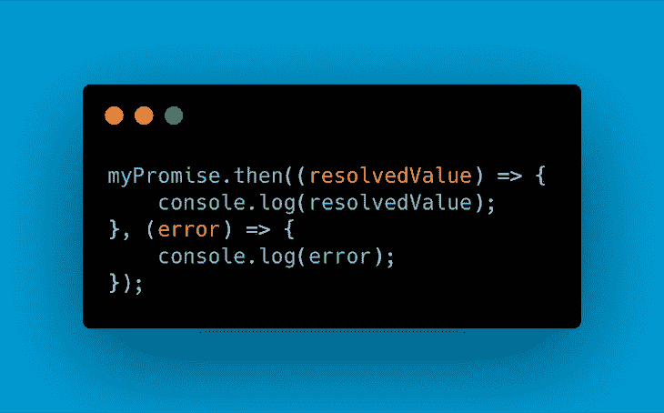

# Node.js 项目架构最佳实践

> 原文：<https://blog.logrocket.com/the-perfect-architecture-flow-for-your-next-node-js-project/>

***编者按**:本 Node.js 项目结构指南最后更新于 2021 年 2 月 26 日。*

一个比我聪明的人说:好的开始是成功的一半。我想不出任何引语能更好地描述每个开发人员在开始新项目时遇到的情况。以实用的方式设计项目结构是开发过程中最难的部分之一，事实上，这是一个微妙的过程。

在本教程中，我们将重点关注 [Node.js](https://blog.logrocket.com/node-js-15-whats-new-and-how-the-developer-experience-has-improved/) 项目结构。我们将概括介绍应用程序架构的基础知识，并分享一些项目结构最佳实践，以帮助您组织 Node.js 应用程序。

我们将讨论以下内容:

## 为什么项目架构很重要

对于我们的项目架构来说，有一个好的起点对于项目本身的生命周期以及您如何能够应对未来不断变化的需求是至关重要的。糟糕、混乱的项目架构通常会导致:

*   不可读和混乱的代码，这延长了开发过程，使产品本身更难测试
*   无用的重复，这使得代码更难维护和管理
*   在不弄乱现有代码的情况下实现新功能很困难

任何 Node.js 项目结构的主要目标都是帮助您:

*   编写干净易读的代码
*   在我们的应用程序中编写可重用的代码
*   避免重复
*   在不中断现有代码的情况下添加新功能

## Node.js 项目结构的最佳实践

现在，我们可以讨论我通常所说的应用程序结构流，这是一组有助于改善 Node.js 开发人员体验的规则和常见实践。

下面概述的 Node.js 项目架构最佳实践可以作为一个备忘单，帮助您为下一个项目建立完美的架构流程。

### 1.为您的项目创建文件夹结构

在我们的应用程序中，所有的东西都必须有自己的位置，而文件夹是对公共元素进行分组的最佳位置。特别是，我们想定义一个非常重要的分离，这就引出了我们的下一个规则。

### 2.分离业务逻辑和 API 路线

像 [Express.js](https://expressjs.com/) 这样的框架很神奇。它们为我们提供了难以置信的管理请求、视图和路由的功能。有了这样的支持，我们可能很想把我们的业务逻辑放到我们的 API 路由中。但是，这将很快使它们变成巨大的整体块，暴露出它们难以管理、难以阅读和易于分解。

也请不要忘记我们的应用程序的可测试性将如何降低，从而导致更长的开发时间。此时，你可能会想，“那么，我们如何解决这个问题呢？我可以把我的商业逻辑清晰而智能地放在哪里？”答案就在第三条规则中。

### 3.使用服务层

这是我们所有商业逻辑应该存在的地方。它基本上是一个类的集合，每个类都有自己的方法，实现我们应用的核心逻辑。在这一层中，您应该忽略的唯一部分是访问数据库的部分；这应该由数据访问层来管理。

既然我们已经定义了这三个初始规则，我们可以用图形表示结果如下:

Separating our business logic from our API routes.

并且随后的文件夹结构将我们送回到规则#1，然后可以变成:

通过观察最后这张图片，我们还可以在思考我们的结构时建立另外两条规则。

### 4.使用配置文件夹来组织配置文件

### 5.为长 npm 脚本建立一个脚本文件夹

### 6.使用依赖注入

Node.js 提供了令人惊叹的特性和工具，让我们的生活变得更加轻松。然而，正如我们所知道的，由于可测试性和代码可管理性的问题，使用依赖项在大多数时候是相当麻烦的。

有一个解决方案，叫做依赖注入。

> 依赖注入是一种软件设计模式，其中一个或多个依赖项(或服务)被注入或通过引用传递到一个依赖对象中。

通过在 Node.js 应用程序中使用依赖注入，您可以:

*   简化单元测试过程，将依赖项直接传递给你想使用的模块，而不是硬编码
*   **避免无用的模块耦合**，使维护更加容易
*   **加速你的 git 流程**。定义接口后，它们将保持原样，因此您可以避免任何合并冲突

Using Node.js without dependency injection.

这很简单，但是作为我们代码的一种方法仍然不是很灵活。如果我们想改变这个测试来使用一个示例数据库，会发生什么呢？我们应该修改我们的代码以适应新的需求。为什么不直接将数据库作为依赖项传递呢？

### 7.进行单元测试

现在我们知道我们已经掌握了依赖注入，我们也可以为我们的项目实现单元测试。测试是开发应用程序的一个非常重要的阶段。项目的整个流程——不仅仅是最终结果——都依赖于它，因为错误的代码会减慢开发过程并导致其他问题。

测试我们的应用程序的一种常见方法是通过单元来测试它们，其目标是隔离一段代码并验证其正确性。就过程式编程而言，一个单元可以是一个单独的函数或过程。这个过程通常由编写代码的开发人员执行。

这种方法的好处包括:

#### 提高代码质量

单元测试提高了代码的质量，帮助您在代码进入其他开发阶段之前识别出您可能忽略的问题。它将暴露边缘情况，并使您编写更好的整体代码

#### bug 发现得更早

这里的问题是在非常早期的阶段发现的。由于测试将由编写代码的开发人员来执行，错误将会更早地被发现，并且您将能够避免极其耗时的调试过程

#### 成本降低

应用程序中的缺陷越少，意味着花在调试上的时间越少，花在调试上的时间越少，意味着花在项目上的钱越少。时间是一个特别关键的因素，因为这个宝贵的单元现在可以用来为我们的产品开发新功能

### 8.对第三方服务调用使用另一层

通常，在我们的应用程序中，我们可能希望调用第三方服务来检索某些数据或执行某些操作。而且，很多时候，如果我们不将这个调用分离到另一个特定的层，我们可能会遇到一段失控的代码，它变得太大而无法管理。

解决这个问题的一个常见方法是使用[发布/订阅模式](https://blog.logrocket.com/getting-started-with-cloud-pub-sub-in-node/)。这种机制是一种消息传递模式，发送消息的实体称为发布者，接收消息的实体称为订阅者。

发布者不会将信息直接发送给特定的接收者。相反，他们会将发布的消息分类到特定的类别，而不知道哪些订阅者(如果有的话)可能正在处理它们。

以类似的方式，订阅者将表达对处理一个或多个类的兴趣，并且只接收他们感兴趣的消息——所有这些都不知道哪个发布者在那里。

发布-订阅模型支持事件驱动架构和异步并行处理，同时提高了性能、可靠性和可伸缩性。

### 9.使用棉绒

这个简单的工具将帮助您执行一个更快、整体更好的开发过程，帮助您在保持整个应用程序代码一致的同时，关注小错误。

Example of using a linter.

### 10.使用样式指南

还在考虑如何以一致的方式正确格式化您的代码吗？为什么不改编一下谷歌或 T2 Airbnb 提供给我们的令人惊叹的风格指南呢？阅读代码将变得难以置信的容易，并且你不会因为试图理解如何正确定位花括号而感到沮丧。

Google’s JavaScript style guide.

写一段很难的代码，很难理解你在做什么，最重要的是，为什么？千万别忘了评论一下。这对你的开发伙伴和你未来的自己来说会非常有用，他们都想知道为什么在你第一次写它六个月后你还要做一件事。

### 12.留意你的文件大小

太长的文件极难管理和维护。总是留意你的文件长度，如果它们变得太长，试着把它们分成模块打包在一个文件夹里，作为相互关联的文件。

### 13.使用 gzip 压缩

在将文件发送到 web 浏览器之前，服务器可以使用 gzip 压缩来减小文件大小。这将减少延迟和滞后。

An example of using gzip compression with Express.

### 14.使用承诺

使用回调是在 JavaScript 中处理异步代码的最简单的可能机制。然而，原始回调经常牺牲应用程序控制流、错误处理和语义，而这些是我们在使用同步代码时非常熟悉的。一个解决方案是在 Node.js 中使用 promises。

[承诺](https://blog.logrocket.com/js-promises/)通过使我们的代码更容易阅读和测试，同时仍然提供函数式编程语义和更好的错误处理平台，带来的好处多于坏处。

A basic example of a promise.

### 15.使用 promises 的错误处理支持

我敢保证，发现自己在应用程序中出现意外错误或行为一点也不愉快。编写代码时，错误是不可避免的。这只是人类的一部分。

处理它们是我们的责任，我们不仅应该在应用程序中使用承诺，还应该利用 catch 关键字提供的错误处理支持。

## 结论

创建 Node.js 应用程序可能具有挑战性。我希望这一套规则能帮助你在建立你将要使用的架构类型以及支持该架构的实践时，将自己置于正确的方向。

更多类似的内容，请关注我的 [T](https://twitter.com/BorrelliDev) [维特](https://twitter.com/BorrelliDev)和我的[博客](https://thecoderswag.com/)。

## 200 只显示器出现故障，生产中网络请求缓慢

部署基于节点的 web 应用程序或网站是容易的部分。确保您的节点实例继续为您的应用程序提供资源是事情变得更加困难的地方。如果您对确保对后端或第三方服务的请求成功感兴趣，

[try LogRocket](https://lp.logrocket.com/blg/node-signup)

.

[https://logrocket.com/signup/](https://lp.logrocket.com/blg/node-signup)

LogRocket 就像是网络和移动应用程序的 DVR，记录下用户与你的应用程序交互时发生的一切。您可以汇总并报告有问题的网络请求，以快速了解根本原因，而不是猜测问题发生的原因。

LogRocket 检测您的应用程序以记录基线性能计时，如页面加载时间、到达第一个字节的时间、慢速网络请求，还记录 Redux、NgRx 和 Vuex 操作/状态。

[Start monitoring for free](https://lp.logrocket.com/blg/node-signup)

.