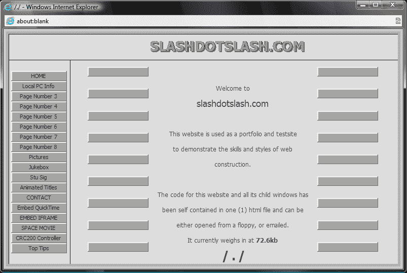

# “为什么”的问题在单页应用程序框架中

> 原文：<https://blog.logrocket.com/the-question-of-why-in-single-page-application-frameworks-91383446d0f5/>

多年来,“单页应用程序”一词已经成为一种特殊类型的网站和一种 web 开发模式的代名词。当一个网站被构建得更像桌面应用程序而不是传统的静态 web 文档时，它可以被视为单页应用程序(SPA ),利用结构化 Javascript 连接到服务器端服务，为您的平均 web 体验增加平滑性和动态性。

这意味着用户既可以阅读又可以编辑内容的网站，内容本身无需刷新页面即可更新。想想 Gmail 或 Twitter。

这个短语本身可以追溯到 2002 年，当时 Tibco Software 的几个工程师实际上为早期单页面应用程序背后的技术申请了专利。大约在同一时间，Slashdotslash.com 出现了，它是首批在线 web 应用程序之一，是一个实验新 web 技术的沙箱，所有这些都在一个 HTML 文档中，无需刷新页面。

但是事情真正开始于 2008 年，当时杰西·詹姆斯·加瑞特给 AJAX 起了个名字，这是一种允许开发者向服务器发出动态请求而无需加载新页面的技术。

这与客户端框架(如 jQuery、Dojo 和 Prototype)的兴起非常合拍，提升了 Javascript 的形象并拓展了它的极限。

如果没有这两种趋势，我们就不太可能看到新的单页面应用程序框架的出现，这种框架是受 jQuery 等的启发，但经过调整利用了 AJAX。

如果你搜索得足够多，你会看到大量的文章深入研究一个框架与另一个框架的技术考虑，回答它如何做到最好的问题。

### 你看不到的是为什么

所以，我认为在概念形成或早期开发阶段，看看开发人员如何描述他们自己的框架可能会很有趣，并尝试了解他们背后的意图。

将变得非常清楚的是，每个框架都是一个权衡的游戏。这些框架背后的意识形态在关于如何构建它们、它们的编程 API 以及它们留下的足迹的决策中扮演着重要的角色。

请记住，这绝不是一个全面的列表，但我认为它很好地代表了框架的轨迹。

### 骨干网. js

> Backbone.js 旨在为拥有雄心勃勃的界面的数据丰富的 web 应用程序提供一个共同的基础——同时非常谨慎地避免通过做出任何你更有能力自己做出的决定来将你逼入困境。 [*— Backbone.js 文档*](http://backbonejs.org/#FAQ-why-backbone)

关于 SPA 框架的任何讨论都应该从 Backbone.js 开始。它是由 Jeremy Ashkenas 在 2010 年开发的，目的是给这个已经变得难以驾驭的 Javascript 应用领域一个结构。

Ashkenas 在现有库的基础上构建了主干，即 jQuery 和下划线。这就是“共同基础”这一概念的来源。Backbone 的目标是统一和组织复杂的 Javascript 代码，使其可以跨项目重用，并且更容易理解。因此，主干网提供了足够的结构，使程序员远离笨拙的“意大利面条式代码”,并一致地处理服务器上的数据，但仍将大部分决策权留在个人开发者手中。

### 安古斯

> 我想看看能不能简化这一点。但是我不想为开发者简化它，我想为网页设计者简化它。所以不懂编程的人。因为人们不知道如何编程，我不得不局限于 HTML。[——*谈棱角分明的创作者美子·赫维里*](https://www.youtube.com/watch?v=r1A1VR0ibIQ)

AngularJS 几乎与 Backbone 同时出现，尽管它在此之前已经开发了一段时间。Angular 背后的意图非常明显。该框架的目标受众是设计人员，或者至少是没有经验的开发人员。大多数关于框架结构的决定都是基于这个假设。

例如，模板可以直接用普通的 HTML 创建，这样 Angular 用户就不必学习新的东西来开始了。Angular 还内置了一些方便的工具，并鼓励采用固执己见的方法进行开发。所有这些使得 Angular 的实际规模和广度比它之前的框架(如 Backbone)大得多，但它也缩短了学习曲线。

### 余烬

> Ember 是一个 JavaScript 框架，它可以完成所有你通常必须手工完成的繁重工作。每个 web 应用程序都有共同的任务；Ember 会为您做这些事情，因此您可以专注于构建杀手级功能和 UI。 — [*原烬自述*](https://github.com/emberjs/ember.js/commit/ce15182c19fe481cda0042653f84b037150e4ef3)

Ember 实际上是作为 web 框架 SproutCore 的重写开始的，它在 Backbone 和 Angular 时代很流行，并被苹果用于他们的许多 web 项目。但是 SproutCore 在 2012 年后有些萎靡，许多开发者意识到是时候改变了。因此开发人员耶胡达·卡茨和 T2·汤姆·戴尔开始开发 SproutCore 2.0，也就是后来的 Amber.js 和 Ember。

Katz 和 Dale 在 Ruby on Rails 社区中有着丰富的经验。对于那些不熟悉的人来说，Rails 是一个服务器端框架，它更喜欢“约定胜于配置”这基本上意味着许多关于如何开发应用程序的决定已经由*框架*做出，这给了个体开发者一个良好的开端。

这种精神贯穿了恩伯采取的方法。Ember 的创建者认为有一大堆样板代码(从服务器获取数据，将路径连接到模板，将事情分解成部分，等等。)开发人员需要为每个项目反复编写。所以它一开始就做了这项工作，对代码如何工作做了很多假设，并将其抽象出来。

只要你坚持 Ember 规定的方法，在你写一行代码之前，很多事情已经为你做好了。Katz 甚至夸口说“如果你是一个 Backbone 迷，我想你会喜欢用 Amber 编写这么少的代码。”

### 反应

> React 是一个用于构建可组合用户界面的库。它鼓励创建可重用的 UI 组件，这些组件呈现随时间变化的数据。

> React 刚推出时，开发者是这样描述的。但是他们真的这么总结:

> 当您的数据随时间变化时，React 真的会大放异彩。

> –[*皮特·亨特，《我们为什么要造 React》*](https://facebook.github.io/react/blog/2013/06/05/why-react.html)

React 是脸书为了解决一个非常特殊的问题而创立的。当页面上的数据不断变化和更新时(比如实时更新)，事情往往会变得有点慢。因此，他们隔离了导致这个问题的层，通常称为视图层，并开始工作。

所以对于 React 来说，*为什么*很简单。速度。

* * *

### 更多来自 LogRocket 的精彩文章:

* * *

不出所料，React 是一个框架，在这个框架中，所有事情都是从数据中得出的。当数据改变时，事物会做出反应。

快点。

有各种各样的算法(虚拟 dom 有人吗？)甚至还有一种名为 JSX 的新标记语言来支持这项工作，但从根本上说，数据是一等公民。事实证明，速度不仅给了 React 开发人员一个明确的目标，也是一个基准原则。

### 某视频剪辑软件

> Vue.js 是一个用于构建 web 界面的库。与其他一些工具一起，你也可以称之为“框架”，尽管它更像是一组能够很好地协同工作的可选工具。[——*尤雨溪，《Vue.js: a (re)简介》*](http://blog.evanyou.me/2015/10/25/vuejs-re-introduction/)

在许多方面，Vue 开始是一种反应(原谅双关语)。创造者[尤雨溪](https://twitter.com/youyuxi)认识到了 React 能够取得的进步，但同时也看到了一个分裂的、不断变化的社区(最后一个，我保证)。

你最初抵制“框架”这个名字，因为他希望 Vue 是一个只提供最低限度开箱即用的东西。但是为了尝试和限制 Vue 社区的分裂，你在主要 Vue 代码库的模块化、第一方插件上投入了很多努力。它融合了 Angular 等框架的更规范的方法和 React 等库的灵活性，创建了一组完全不同的工具，恰好可以很好地协同工作。

### 提前

> 对我来说，我想要[React]的开发者体验，但我不想为此付费。这让我开始思考。—[*杰森·米勒，把“P”放在前面*](https://www.youtube.com/watch?v=TQptGQlGXqA&t=5s)

Preact 实际上早在 2015 年就开始作为一个 Codepen，一种让[杰森·米勒](https://twitter.com/_developit)尝试 react 的一些渲染限制的方法。但直到一些性能基准在网上公布，证明 React 在移动设备上的迟缓，米勒的快速和肮脏的实验大大改善了这些基准，它才真正成为焦点。所以他以开源库的名义发布了代码。

Preact 的既定目标一直是完全高于——以更少的性能成本获得 react 的所有优点(因此 *P* react)。从那以后，这个库已经不止一次地被更新和重组，但是它总是把这个目的放在前台，利用 React 的 API，同时改变它在后台的工作方式。

### 超 app

> Hyperapp 是一个现代的 JavaScript 库，用于在浏览器中构建快速且功能丰富的应用程序。它是最小的(1.4 kB)，简单，使用起来很有趣。[——*豪尔赫·布卡兰，介绍 Hyperapp 1.0*](https://medium.com/hyperapp/introducing-hyperapp-1-0-dbf4229abfef)

“小”当然是 Hyperapp(最初称为跳蚤)的关键词。代码库最初大约为 4KB，但到了 1.0 版本时，这个数字下降得更多。Hyperapp 只为您提供了基础知识，一种管理代码中的状态和模板的方法，但它的目标主要是提供一些工具，并避免碍事。从一开始，布卡兰就一直强调 Hyperapp 的足迹和务实方法是其基本原则。

### 结论

如果说这里有什么教训的话，那就是指导框架的视角。它的设计，它的架构，甚至它试图解决的问题都是从这个角度出发的，并且定下了一个基调。从那里，一个社区聚集在这个观点周围，并催化它的努力，一段时间后，一个新的框架诞生了。

## [LogRocket](https://lp.logrocket.com/blg/react-signup-general) :全面了解您的生产 React 应用

调试 React 应用程序可能很困难，尤其是当用户遇到难以重现的问题时。如果您对监视和跟踪 Redux 状态、自动显示 JavaScript 错误以及跟踪缓慢的网络请求和组件加载时间感兴趣，

[try LogRocket](https://lp.logrocket.com/blg/react-signup-general)

.

  

LogRocket 结合了会话回放、产品分析和错误跟踪，使软件团队能够创建理想的 web 和移动产品体验。这对你来说意味着什么？

LogRocket 不是猜测错误发生的原因，也不是要求用户提供截图和日志转储，而是让您回放问题，就像它们发生在您自己的浏览器中一样，以快速了解哪里出错了。

不再有嘈杂的警报。智能错误跟踪允许您对问题进行分类，然后从中学习。获得有影响的用户问题的通知，而不是误报。警报越少，有用的信号越多。

LogRocket Redux 中间件包为您的用户会话增加了一层额外的可见性。LogRocket 记录 Redux 存储中的所有操作和状态。

现代化您调试 React 应用的方式— [开始免费监控](https://lp.logrocket.com/blg/react-signup-general)。

* * *