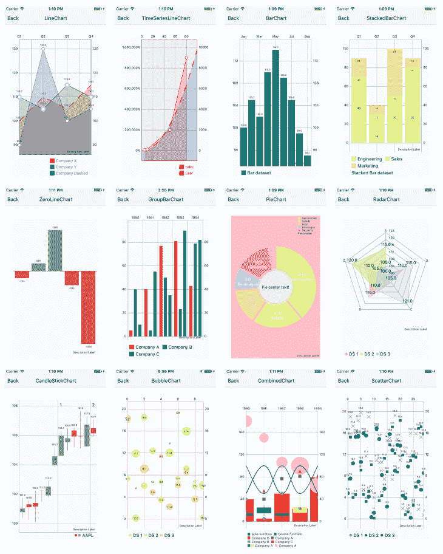
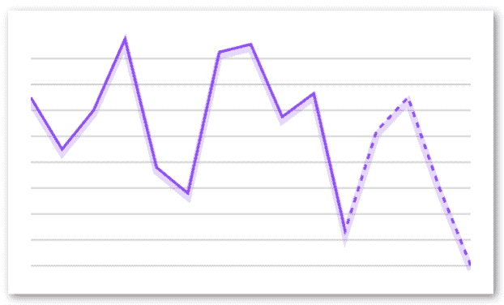
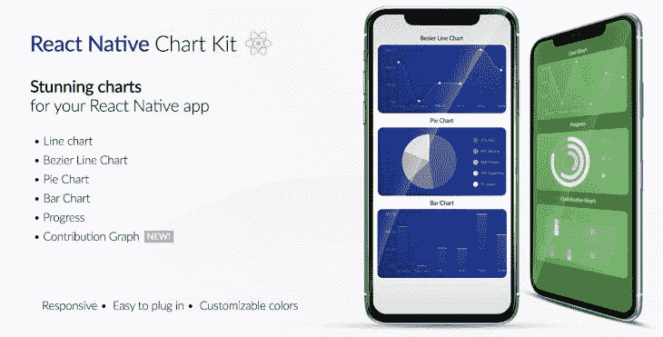
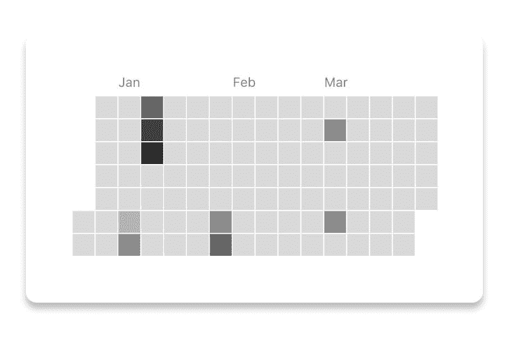
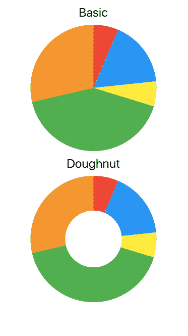
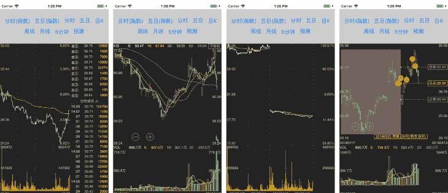
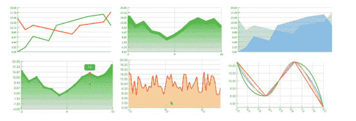
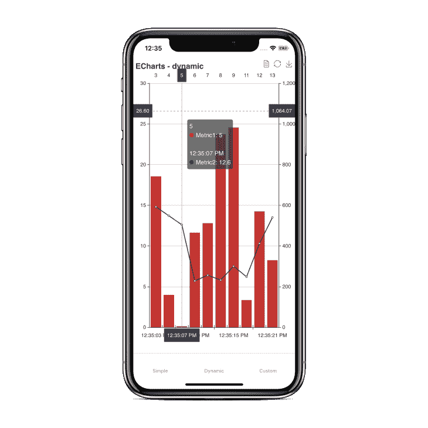
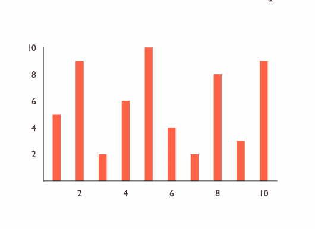
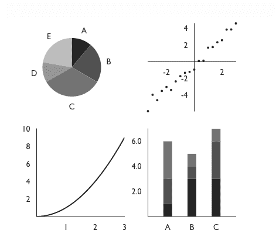

# 2021 年 8 大 React 原生图表库

> 原文：<https://blog.logrocket.com/the-top-8-react-native-chart-libraries-for-2021/>

当您希望以一种有意义的方式显示从数据库中检索到的统计数据时，图表和图形会很方便。了解哪种数据可视化库最适合您正在开发的移动应用程序是这一过程的第一步。

跨平台移动应用框架 React Native 拥有大量开源库，有助于用图表和图形表示数据。在这篇文章中，让我们浏览一下这些库，总结一下哪些库适合特定的需求。

## 反应-原生-图表-包装

这个开源库支持 iOS 和 Android 设备。它基于本地图表库，如 MPAndroidChart 和 iOS charts，在 Android 平台上，它支持 [MPAndroidChart 库](https://github.com/PhilJay/MPAndroidChart)中的大多数配置。它还支持不同数量的图表类型，包括折线图、散点图、气泡图、饼图、雷达图、条形图、组合图和烛台图。

作为一个库，它有很好的文档记录，并通过一步一步的教程来解释如何集成到新的 React 原生应用程序中，并指出 iOS 和 Android 之间的主要传统差异。比如颜色在 Android 上的 alpha 在 0-255 的范围之间，在 iOS 上是 0-1。对于第一次在移动应用程序中使用图表库的人来说，这种信息非常有用。该库在 GitHub 上得到积极维护。

## 反应-原生-svg

这个库为 iOS 和 Android 设备上的 React 本地应用程序提供了 SVG 图表支持，并为 web 提供了一个兼容层。它使用 [react-native-svg](https://github.com/react-native-svg/react-native-svg) 包作为依赖来渲染图形和图表。它利用 [d3](https://d3js.org/) 库创建 SVG 路径并计算坐标。

最初是一个附带项目，现在支持各种图表模式作为现成的组件。以下是该库可用的模式列表:

*   面积
*   堆叠面积图
*   酒吧
*   堆叠条形图
*   线条
*   馅饼
*   进步圈
*   亚西斯
*   XAxis

因为所有这些组件都是库本身附带的，所以它还为每个组件提供了一组公共的道具来定制图表，以准确的形式表示数据。这套通用道具也使它更容易在现实世界中使用。

## 反应-原生-图表-套件

一个支持 Expo 应用程序和 React 本地普通应用程序的图表库是值得认真考虑的。它建立在著名的开源项目之上，如`react-native-svg`、`paths-js`和`react-native-calendar-heatmap`。它支持线条、贝塞尔曲线、饼图、进度环、堆积条形图和贡献图(也称为热图)等模式。与本文中提到的其他库相比，这个库支持的一些模式是独特的。每种模式都有自己的一套道具，这使得在移动应用程序屏幕上定制数据变得更加容易。

除了一些独特的模式，这个库还允许您通过计算设备屏幕的宽度，使用 React Native 的`Dimensions` API 来呈现响应图表。每个图表组件还接受一个可以应用于父 SVG 或`View`组件的`style`属性，以定制该图表模式的默认样式。

## 反应-本机-饼图

一个简单易用的开源库提供了两种不同的以饼状图形式显示数据的方式，通过`react-native-pie-chart`可以获得。对于作为应用程序开发人员，您需要以饼图的形式表示数据，但希望保持应用程序包较小的情况，这是非常有用的。正如本文所讨论的，库提供了各种组件和模式，这些组件和模式肯定会增加应用程序的整体规模。

这个库提供了一组道具来应用自定义样式或在它提供的两种形状之间切换。这使得配置和理解变得容易。

## CLCchart

不断变化的数据必须准确，以便最终用户进行分析，这无疑是在移动应用程序屏幕上描绘的最复杂的数据之一，例如股票市场数据。CLCchart 是一个跨平台的 UI 图表库，专门使用画布以图表的形式表示股票数据。它支持 web 和跨平台移动应用框架，如 React Native。只需从终端窗口执行一行代码，就可以轻松安装和集成 React 本地应用程序。

这个库依赖于一个名为 [GCanvas](https://github.com/alibaba/GCanvas) 的跨平台渲染引擎。这个引擎是由阿里巴巴的一个开发团队为移动设备开发的，基于 OpenGL。要在 React 原生应用中使用它，你必须按照[的一套指令](https://alibaba.github.io/GCanvas/docs/Integrate%20GCanvas%20on%20ReactNative.html)来安装它，并将其集成到 iOS 和 Android 平台上。

## 反应-本机-响应-折线图

像 react-native-pie-chart 一样，这个库特别擅长在移动屏幕上以线条的形式表示数据。这个库完全用 TypeScript 编写，有一个可组合的 API，用于不同类型的折线图表示。它支持添加工具提示和大量数据点。

它只依赖于两个外部库，`react-native-svg`和`react-native-gesture-handler`。通过启用后一种依赖，它允许这个库通过设置一个`viewport`道具来支持可滚动图表。最后，因为它不太依赖于其他库，并且只支持一种图表模式，所以这个库的总包大小只有 62 千字节(未压缩)。

## react-native-echarts-wrapper

这是一个包含流行电子图表的图表框架。它在`webview`上运行，并明确依赖于`react-native-webview`。有了这个库，就可以为应用程序屏幕上的每个数据表示创建和表示一组具有交互性的复杂数据。

由于它使用了`webview`，它既支持 vanilla React 本地应用程序，也支持 Expo 应用程序。在运行于`webview`中 JavaScript 线程的图表和 React 本地 JavaScript 线程之间进行双向数据通信并不容易。所以这个库利用名为`sendData`的`webview`方法与 React 本地 JavaScript 线程通信。请注意，使用这种方法，只能发送字符串格式的数据。

## 胜利-本土

victory-native 由强大实验室的开发团队构建和维护，是一个图表库，支持模块化形式的不同模式，并准备好为 React 和 React 本地应用程序使用组件。React 本机变体也称为胜利本机。该库提供的所有组件都可以用来可视化各种格式的数据，并支持在样式和行为方面的完全定制。在 React 本地应用程序中安装和集成这个图表库很容易。它唯一的对等依赖项是`react-native-svg`,也需要显式安装。

除了这个库支持的一组不同的图表组件之外，它还有许多额外的好处。首先也是最重要的是对动画和过渡的支持。在`animate`道具的帮助下，动画变化可以应用到`VictoryChart`组件。使用 [d3-interpolate](https://github.com/d3/d3-interpolate) 可以制作动画，这是一组插值方法。使用诸如`onEnter`和`onExit`这样的道具来定制`VictoryChart`组件上的默认过渡。

与本文中提到的其他库相比，这个库的下一个优势是支持[材质和灰度设计主题](https://formidable.com/open-source/victory/guides/themes)。一组颜色可以以数组的形式定义，用来表示字体系列、字体大小和字母间距等数据。为了标记特定的数据集或图表中的数据表示，`VictoryTooltip`也可用于向图表添加工具提示。

这个库提供了许多关于创建自定义图表组件的配置选项和信息，很难涵盖所有内容。

## 结论

列表中包含的开源库要么基于个人经验，要么是那些积极维护的库。这些 UI 组件库的目的是让您以准确的形式表示统计数据，并帮助应用程序开发过程。考虑到移动应用程序的开发成本，这些库提供的一些组件和动画很难重新发明。

如果你熟悉 React Native 生态系统中的任何其他图表库，但在这篇文章中没有提到，请在下面的评论部分留下它的链接，并告诉我们你为什么喜欢它。

## [LogRocket](https://lp.logrocket.com/blg/react-native-signup) :即时重现 React 原生应用中的问题。

[LogRocket](https://lp.logrocket.com/blg/react-native-signup) 是一款 React 原生监控解决方案，可帮助您即时重现问题、确定 bug 的优先级并了解 React 原生应用的性能。

LogRocket 还可以向你展示用户是如何与你的应用程序互动的，从而帮助你提高转化率和产品使用率。LogRocket 的产品分析功能揭示了用户不完成特定流程或不采用新功能的原因。

开始主动监控您的 React 原生应用— [免费试用 LogRocket】。](https://lp.logrocket.com/blg/react-native-signup)