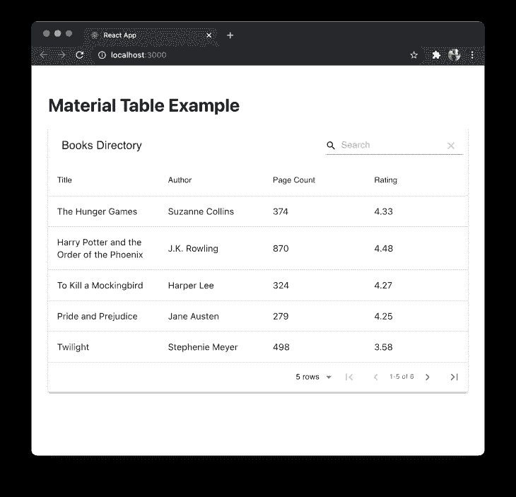
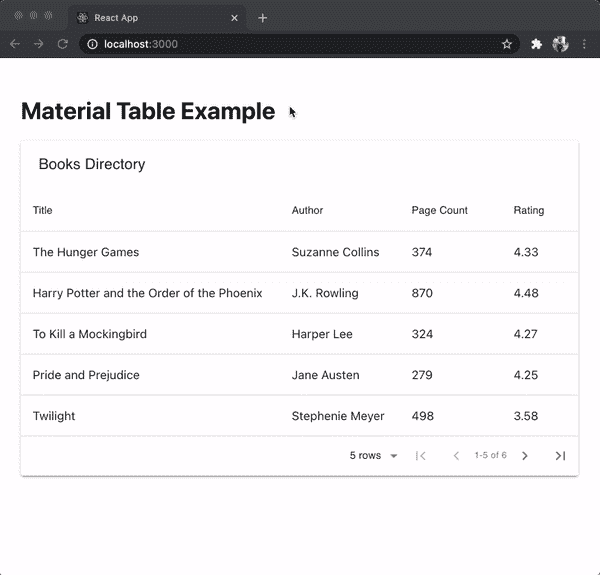
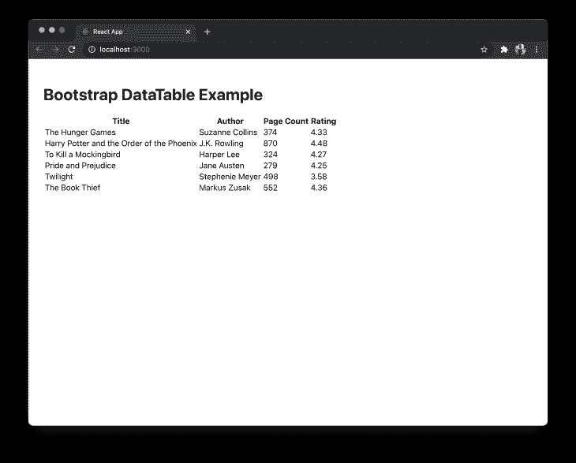
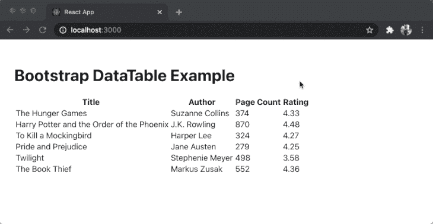
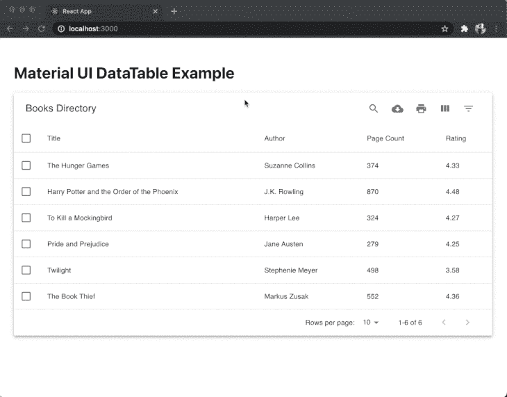
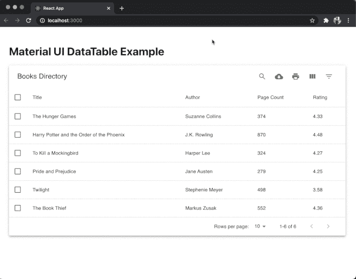
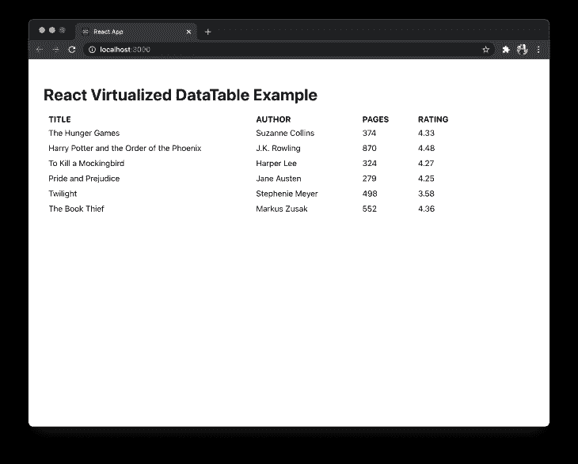
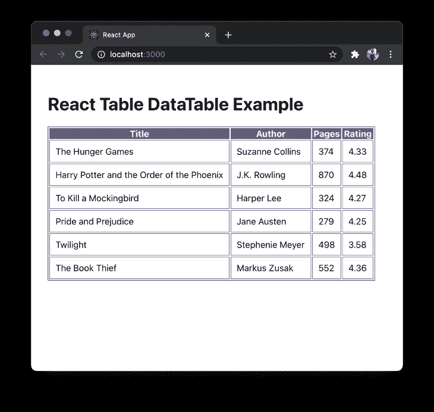

# 将在 2021 年使用的顶级 React 表库

> 原文：<https://blog.logrocket.com/the-top-react-table-libraries-to-use-in-2021/>

作为一名 React 开发人员，您可能需要以表格的形式表示数据，但是手动创建表格需要花费大量的时间。由于 React 有一个庞大的生态系统，所以有很多第三方库可供选择。在本文中，让我们比较一下 React 可用的一些顶级表库。

## 材料表

[material-table](https://material-table.com/#/docs/get-started) 是一种在 React 应用程序中以表格格式表示数据的强大方式。它遵循材料 UI 准则来设计元素的样式。它是 React 领域最流行的开源库之一，提供了不同的组件。这些组件可用于根据复杂性处理样式。这个库的最新版本支持最低版本的 React】。

要查看它的运行情况，请从终端窗口在 React 应用程序中运行以下命令来安装该库:

```
yarn add material-table @material-ui/core

```

然后添加材质图标。有两种方法可以做到这一点。最初的方法是，你可以简单地在文件`public/index.html`中使用 HTML 导入材质图标字体:

```
<link
  rel="stylesheet"
  href="https://fonts.googleapis.com/icon?family=Material+Icons"
/>

```

另一种方法是在 React 应用程序中安装`@material-ui/icons`包:

```
yarn add @material-ui/icons

```

在现实世界的应用程序中，提供给 React 应用程序的数据来自外部 API。为了保持简洁，让我们使用一小组虚拟数据。在`src/`目录中创建一个名为`data.js`的新文件，并添加以下代码片段:

```
export const data = [
  {
    id: 1,
    title: 'The Hunger Games',
    authors: 'Suzanne Collins',
    num_pages: 374,
    rating: 4.33
  },
  {
    id: 2,
    title: 'Harry Potter and the Order of the Phoenix',
    authors: 'J.K. Rowling',
    num_pages: 870,
    rating: 4.48
  },
  {
    id: 3,
    title: 'To Kill a Mockingbird',
    authors: 'Harper Lee',
    num_pages: 324,
    rating: 4.27
  },
  {
    id: 4,
    title: 'Pride and Prejudice',
    authors: 'Jane Austen',
    num_pages: 279,
    rating: 4.25
  },
  {
    id: 5,
    title: 'Twilight',
    authors: 'Stephenie Meyer',
    num_pages: 498,
    rating: 3.58
  },
  {
    id: 6,
    title: 'The Book Thief',
    authors: 'Markus Zusak',
    num_pages: 552,
    rating: 4.36
  }
];

```

然后创建一个名为`MTable.js`的新文件，并导入 material-table 库和虚拟数据数组:

```
import MaterialTable from 'material-table';
import { data } from '../data';

```

因为 material-table 是一个 React 组件，所以您可以在任何自定义组件的 JSX 中返回它。像这样定义一个自定义组件:

```
const MTable = () => {
  //...
};
export default MTable;

```

有两个道具是 material-table 库期望收到的。以行格式显示数据的道具`data`。另一个属性`columns`定义了列的数量。这是一个期望每列的`title`作为特定列的标题和原始的`field`的数组。`field`的值应该代表`data`数组中对象的确切字段:

```
const columns = [
  { title: 'Title', field: 'title' },
  { title: 'Author', field: 'authors' },
  { title: 'Page Count', field: 'num_pages' },
  { title: 'Rating', field: 'rating' }
];

```

在`<MaterialTable />`组件上的第三个称为`title`的道具可以用来给整个表格赋予标题。该组件的完整使用可以以 JSX 的形式返回，如下所示:

```
return (
  <div style={{ maxWidth: '100%' }}>
    <MaterialTable columns={columns} data={data} title='Books Directory' />
  </div>
);

```

要查看它的运行情况，请在`App.js`文件中导入自定义表格组件:

```
import MTable from './components/MTable';
function App() {
  return (
    <div style={{ padding: '30px' }}>
      <h1>Material Table Example</h1>
      <MTable />
    </div>
  );
}
export default App;

```

默认情况下，材料表库显示搜索栏和分页。



您可以通过添加名为`options`的第四个道具来定制表格的视图，该道具是一个对象，用于定制表格。

在`MTable.js`中，让我们从表格中移除搜索栏，并在数据的每一行被选中时为其添加背景。这是由一个名为`onRowClick`的道具完成的，当点击或选择它时，它从表格中接受 ID `selectedRow`。

将以下道具添加到`<MaterialTable/>`:

```
import { useState } from 'react';
import MaterialTable from 'material-table';
import { data } from '../data';
const MTable = () => {
  const [selectedRow, setSelectedRow] = useState(null);
  const columns = [
    { title: 'Title', field: 'title' },
    { title: 'Author', field: 'authors' },
    { title: 'Page Count', field: 'num_pages' },
    { title: 'Rating', field: 'rating' }
  ];
  return (
    <div style={{ maxWidth: '100%' }}>
      <MaterialTable
        columns={columns}
        data={data}
        title='Books Directory'
        onRowClick={(evt, selectedRow) =>
          setSelectedRow(selectedRow.tableData.id)
        }
        options={{
          search: false,
          rowStyle: rowData => ({
            backgroundColor:
              selectedRow === rowData.tableData.id ? '#67aeae' : '#FFF'
          })
        }}
      />
    </div>
  );
};
export default MTable;

```

以下是输出:



您可以看到，使用 React 钩子，可以添加一些功能，比如选择一行和应用定制样式。分页也可以开箱即用。你可以在这里找到更多关于使用不同道具[定制桌子的信息。](https://material-table.com/#/docs/all-props)

## 反应引导表 2

如果您在 React 应用中使用基于引导的 UI 组件，那么要显示数据表并使用相同的设计系统，[React-React-Bootstrap-table 2](https://react-bootstrap-table.github.io/react-bootstrap-table2)是一个完美的匹配。它提供了更简洁的设计和更小的包大小，避免了处理太多的业务逻辑。

要在 React 应用程序中使用它，请从终端窗口运行以下命令来安装它:

```
yarn add react-bootstrap-table-next

```

然后，在 React app 中导入 Bootstrap CSS 库。这通常在`App.js`或`index.js`文件中完成:

```
import 'react-bootstrap-table-next/dist/react-bootstrap-table2.min.css';

```

然后，创建一个名为`BTable.js`的定制组件文件，并从`react-bootstrap-table-next`库中导入组件`BootstrapTable`。让我们使用相同的虚拟数据集来显示表组件中的数据，因此，也从文件`src/data.js`中导入它。

```
import BootstrapTable from 'react-bootstrap-table-next';
import { data } from '../data';

```

默认情况下，它接受三个属性:

*   `data`数组在表格的一行中显示每个对象
*   属性接受一个惟一的值来标识不同的行。通常，数组中每一行的`id`或`index`是这个属性的值
*   `columns`识别不同的标签并定制它们

`columns`被定义为一个数组，数据数组中的每个字段都要显示为一个对象。每个对象中的`text`表示每个列的自定义标题名称，`dataField`的值表示来自`data`数组的实际字段:

```
const BTable = () => {
  const columns = [
    { text: 'Title', dataField: 'title' },
    { text: 'Author', dataField: 'authors' },
    { text: 'Page Count', dataField: 'num_pages' },
    { text: 'Rating', dataField: 'rating' }
  ];
  return (
    <div style={{ maxWidth: '100%' }}>
      <BootstrapTable columns={columns} data={data} keyField='id' />
    </div>
  );
};
export default BTable;

```

下面是一个基本的表格输出:



要添加自定义选项，有两种方法。第一个是提供基本功能，例如对像这样添加的列中的值进行排序:

```
const columns = [
  { text: 'Title', dataField: 'title', sort: true },
  { text: 'Author', dataField: 'authors' },
  { text: 'Page Count', dataField: 'num_pages' },
  { text: 'Rating', dataField: 'rating', sort: true }
];

```

在上面的代码片段中，我们向数据字段`title`和`rating`添加了名为`sort`的第三个属性，其布尔值为`true`。这将启用基于这两列中升序和降序值的排序。



要使用其他特性，比如[分页](https://react-bootstrap-table.github.io/react-bootstrap-table2/docs/basic-pagination.html)，你必须安装一个名为`react-bootstrap-table2-paginator`的独立组件库，并遵循它的过程。尽管这个组件库支持表内的这些高级数据管理特性，但是安装每个单独的组件并进行集成的过程可能会很繁琐。但是，这样做的好处是，您可以选择使用哪些高级功能，这将有助于您根据 React 应用程序中使用的组件将包的大小保持在最小。另一点要注意的是，到目前为止，它只支持 Bootstrap 版本 4。

## MUI-数据表

这个列表中的另一个基于材质 UI 的数据表组件。如果您在 React 应用中使用基于材质 UI 的设计系统，MUI-Datatables 是一种很好的表示数据表的方式。它支持过滤、选择行、搜索、将数据表导出为 CSV 格式、排序等功能。

要查看它的运行情况，首先在 React 项目中安装它。由于这个组件是基于 Material UI 的，所以需要安装`@material-ui/core`和`@material-ui/icons`:

```
yarn add mui-datatables @material-ui/core @material-ui/icons

```

然后，创建一个名为`MUITable.js`的定制组件文件，并从`mui-datatables`导入组件。让我们使用相同的虚拟数据集来显示表格组件中的数据，因此，也从文件`src/data.js`中导入它:

```
import MUIDataTable from 'mui-datatables';
import { data } from '../data';

```

与 material-table 组件库类似，它也默认接受四个属性:

*   `data`数组在表格的一行中显示每个对象
*   `title`给表格加标题
*   `columns`识别不同的标签并定制它们
*   在表上添加更多定制的`options`

`columns`被定义为一个数组，数据数组中的每个字段都要显示为一个对象。每个对象中的`label`代表每个列的自定义标题名称:

```
const MUITable = () => {
  const columns = [
    { label: 'Title', name: 'title' },
    { label: 'Author', name: 'authors' },
    { label: 'Page Count', name: 'num_pages', options: { sort: true } },
    { label: 'Rating', name: 'rating' }
  ];
  const options = {
    filterType: 'checkbox'
  };
  return (
    <div style={{ maxWidth: '100%' }}>
      <MUIDataTable
        columns={columns}
        data={data}
        title='Books Directory'
        options={options}
      />
    </div>
  );
};
export default MUITable;

```

默认情况下，MUIDataTable 组件支持 material-table 组件的许多功能，例如悬停时高亮显示一行、选中时高亮显示一行以及分页。



其他功能，如搜索、隐藏特定列和过滤值也是现成的。



这个库提供了许多不同的功能，如果这些功能中的任何一个符合您的使用情况，这就是您要考虑的组件。

*   GitHub 拥有 1.8k 的恒星，它可能不会像它的同行一样受欢迎
*   [官方文档](https://www.material-ui-datatables.com/) —官方文档不具表达性，只有 CodeSandbox 中以示例形式提供的代码片段

## 反应虚拟化

react virtualized 是一个多用途的组件库，支持大型列表和数据表的呈现。它支持数据表以简单的表格格式显示，其他支持的格式有网格、砖石、列表和集合。由于支持多种格式和动态数据列表的原因，它是这个列表中最受欢迎的开源组件库之一。

要在 React 应用程序中使用它，请从终端窗口运行以下命令来安装它:

```
yarn add react-virtualized

```

然后，创建一个名为`RVTable.js`的定制组件文件，并从`react-virtualized`库中导入组件。让我们使用相同的虚拟数据集来显示表格组件中的数据，因此，也从文件`src/data.js`中导入它。

它使用自己的 CSS 样式，因此，您必须导入`react-virtualized/styles.css`:

```
import { Column, Table } from 'react-virtualized';
import 'react-virtualized/styles.css';
import { data } from '../data';

```

数据表是使用该库提供的两个组件构建的。`Table`用于定义表格的大小和行数。在这个组件上使用名为`rowGetter`的属性，数组数据是可迭代的。

`Column`组件代表每个组件。它接受一个显示列标题的`label`属性，一个表示数据数组中字段的`dataKey`属性，以及一个为每列定制的`width`值:

```
const RVTable = () => {
  return (
    <div style={{ maxWidth: '100%' }}>
      <Table
        headerHeight={20}
        width={920}
        height={300}
        rowHeight={30}
        rowGetter={({ index }) => data[index]}
        rowCount={data.length}
      >
        <Column label='Title' dataKey='title' width={400} />
        <Column label='Author' dataKey='authors' width={200} />
        <Column label='Pages' dataKey='num_pages' width={100} />
        <Column label='Rating' dataKey='rating' width={100} />
      </Table>
    </div>
  );
};
export default RVTable;

```

以下是输出:



与其他组件不同，react virtualized 是应用定制样式和功能的最低要求。使用这个库，您将必须定义自己的样式并实现诸如分页或在表中搜索之类的功能。

## 反应表

React Table 是一个轻量级的库，以表格格式表示数据。与列表中的其他库相比，它不是一个表组件库，而是一个实用程序库。

它是轻量级的(包大小在 5kb 到 14kb 之间)，可组合和可扩展的。开箱即用，它没有附带标记或样式。这意味着无论设计系统如何，它都可以在 React 应用程序中使用。

要查看它的操作，让我们首先通过在终端窗口中运行以下命令来安装它:

```
yarn add react-table

```

然后，创建名为`RTTable.js`的定制组件文件。因为它支持 React 钩子，所以从`react-table`库中导入钩子`useTable`。让我们使用相同的虚拟数据集来显示表组件中的数据，因此，也从文件`src/data.js`中导入它:

```
import BootstrapTable from 'react-bootstrap-table-next';
import { data } from '../data';

```

`useTable`钩子接受一个对象`columns`和`data`作为参数。要定义表中列的结构，请添加以下内容:

```
const RTTable = () => {
  const columns = [
    {
      Header: 'Title',
      accessor: 'title'
    },
    {
      Header: 'Author',
      accessor: 'authors'
    },
    {
      Header: 'Pages',
      accessor: 'num_pages'
    },
    {
      Header: 'Rating',
      accessor: 'rating'
    }
  ];
  //...
};
export default RTTable;

```

`accessor`属性与`data`数组中的键具有相同的值。为了确保在每次渲染时重新创建数据数组，React 表库建议使用`useMemo`钩子。您可以从`react`库中导入钩子，并修改如下代码片段:

```
import { useMemo } from 'react';
import { useTable } from 'react-table';
import { data as mockData } from '../data';
const RTTable = () => {
  const data = useMemo(() => mockData, []);
  const columns = useMemo(
    () => [
      {
        Header: 'Title',
        accessor: 'title'
      },
      {
        Header: 'Author',
        accessor: 'authors'
      },
      {
        Header: 'Pages',
        accessor: 'num_pages'
      },
      {
        Header: 'Rating',
        accessor: 'rating'
      }
    ],
    []
  );
  // ...
};

```

现在，React Table 只在 memoized 值改变时才根据提供的数据计算列。在定义了列和数据数组之后，将它们作为参数传递给钩子`useTable`来创建一个表实例。

使用这个实例，您可以在标题行上循环显示列标题，在表行上循环显示特定列下每一行中的适当数据。`react-table`库没有任何样式或标记，所以您可以使用自己的样式和 HTML 元素，如`table`、`thead`和`tbody`来创建完整的表格:

```
const tableInstance = useTable({ columns, data });
const {
  getTableProps,
  getTableBodyProps,
  headerGroups,
  rows,
  prepareRow
} = tableInstance;
return (
  <table {...getTableProps()} style={{ border: 'solid 1px blue' }}>
    <thead>
      {headerGroups.map(headerGroup => (
        <tr {...headerGroup.getHeaderGroupProps()}>
          {headerGroup.headers.map(column => (
            <th
              {...column.getHeaderProps()}
              style={{
                background: '#657',
                color: 'white',
                fontWeight: 'bold'
              }}
            >
              {column.render('Header')}
            </th>
          ))}
        </tr>
      ))}
    </thead>
    <tbody {...getTableBodyProps()}>
      {rows.map(row => {
        prepareRow(row);
        return (
          <tr {...row.getRowProps()}>
            {row.cells.map(cell => {
              return (
                <td
                  {...cell.getCellProps()}
                  style={{
                    padding: '10px',
                    border: 'solid 0.6px gray',
                    background: '#fff'
                  }}
                >
                  {cell.render('Cell')}
                </td>
              );
            })}
          </tr>
        );
      })}
    </tbody>
  </table>
);

```

以下是上述基本示例的输出:



你可以简单的将`react-table`与[材质 UI](https://react-table.tanstack.com/docs/examples/material-ui-components) 和 [Bootstrap](https://react-table.tanstack.com/docs/examples/bootstrap-ui-components) 等 UI 组件库集成。`react-table`库的核心基础是为函数式 React 组件中使用的所有东西提供挂钩，这意味着它为诸如[分页](https://react-table.tanstack.com/docs/api/usePagination)、[选择行](https://react-table.tanstack.com/docs/api/useRowSelect)、使用[过滤器](https://react-table.tanstack.com/docs/api/useFilters)、[调整列大小](https://react-table.tanstack.com/docs/api/useResizeColumns)等功能提供挂钩。

*   GitHub 上有超过 13.4k 颗星星，它的受欢迎程度不言而喻，因为它挂钩了第一个可以在 React 应用程序中使用的实用程序库，无论其样式和标记如何
*   [官方文档](https://react-table.tanstack.com/) —该文档很有表现力，是了解更多信息的绝佳资源
*   [示例](https://react-table.tanstack.com/docs/examples/footers) —它有一个广泛的示例列表，每个示例都有沙盒，因此您可以在使用之前进行测试

## 结论

列表中包含的开源库要么基于个人经验，要么是那些积极维护的库。这些组件库的目的是让您在表格中表示数据，并获得良好的开发体验。考虑到开发成本，这些库提供的一些集成很难从头实现。

如果你熟悉 React 生态系统中的另一个表格组件库，但在这篇文章中没有提到，请在下面的评论部分留下它的链接，告诉我们你为什么喜欢它。

## [LogRocket](https://lp.logrocket.com/blg/react-signup-general) :全面了解您的生产 React 应用

调试 React 应用程序可能很困难，尤其是当用户遇到难以重现的问题时。如果您对监视和跟踪 Redux 状态、自动显示 JavaScript 错误以及跟踪缓慢的网络请求和组件加载时间感兴趣，

[try LogRocket](https://lp.logrocket.com/blg/react-signup-general)

.

[ ](https://lp.logrocket.com/blg/react-signup-general) [](https://lp.logrocket.com/blg/react-signup-general) 

LogRocket 结合了会话回放、产品分析和错误跟踪，使软件团队能够创建理想的 web 和移动产品体验。这对你来说意味着什么？

LogRocket 不是猜测错误发生的原因，也不是要求用户提供截图和日志转储，而是让您回放问题，就像它们发生在您自己的浏览器中一样，以快速了解哪里出错了。

不再有嘈杂的警报。智能错误跟踪允许您对问题进行分类，然后从中学习。获得有影响的用户问题的通知，而不是误报。警报越少，有用的信号越多。

LogRocket Redux 中间件包为您的用户会话增加了一层额外的可见性。LogRocket 记录 Redux 存储中的所有操作和状态。

现代化您调试 React 应用的方式— [开始免费监控](https://lp.logrocket.com/blg/react-signup-general)。