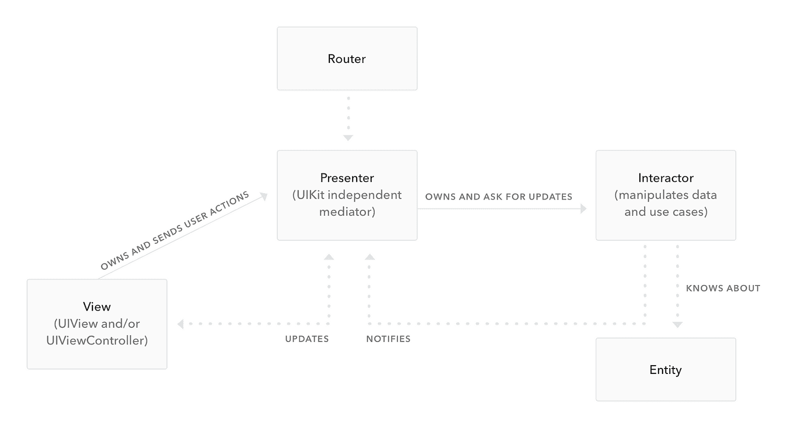
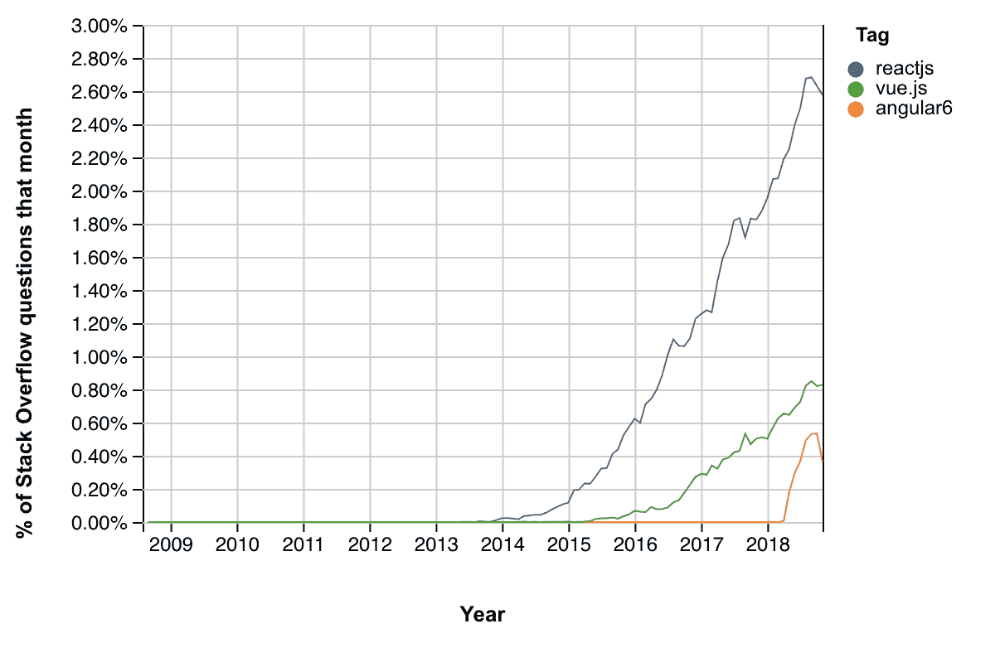

# MVP - LogRocket 博客的毒性

> 原文：<https://blog.logrocket.com/the-toxicity-of-the-mvp-e94db68aaabb/>

#### 如何做出一个不烂的 MVP

2014 年，我开始了第一次实习。这是我第一次在我的领域里专业地工作，作为一个几乎没有任何行业经验的新手，我被一个能想象到的最小的创业公司雇佣了。在一个小车库里，我和两位创始人坐在一起，用 VBScript 和 ASP.NET 编写代码库。直到今天，我在那里的工作仍然是我第一次也是唯一一次在专业环境中遇到 Visual Basic。

我记得公司选择用十年前的技术开发一个全新的产品时，我立刻感到不快，所以我问这位联合创始人关于他使用 VBScript 的决定。

他的回应？

> “这是我当时最了解的。”

这句话我听得太多了。创始人用他们最了解的东西进行建设，这通常会导致糟糕的系统设计、过时的技术和无法扩展的基础设施。一旦产品起飞，优先级的不断变化最终会导致不可逾越的技术债务。

结果总是两种结果之一:技术债务保持原样，或者腾出大量时间来重建核心基础设施，而不是运输产品。

这种困境很大程度上源于一种意识形态，即任何最小可行产品(MVP)都应该是快速、肮脏和廉价的。用[Y-Combinator 合伙人迈克尔·赛贝尔](https://www.youtube.com/watch?v=fn5QxET8Y8c)的话说:

> "如果花了一个多月的时间来构建，它就不是 MVP . "

尽管赛贝尔的建议很有道理(我实际上鼓励看完整个视频)，但“一个月”的心态有可能欺骗企业家，让他们相信他们必须牺牲自己的价值观来创造可交付成果。对于大多数 MVP 来说，一个月的时间已经足够了——如果你做得好的话。

在一个理想的世界里，所有的 MVP 都应该以最聪明、最快的方式计划和执行，而不损害视觉、设计或可用性。不幸的是，这种情况很少发生。我最初的一些项目是用 Visual Basic、PHP 和普通 JavaScript 编写的，经过多次重写，直到它们被认为可以远程使用或维护。

我发现总会有一个“哦，操***”的时刻，在这个时刻，你意识到你的技术堆栈结构不够好，不能以你需要的速度提供功能，你意识到即将到来的重写是不可避免的。对我来说，这一时刻已经导致了多年来太多副业的死亡。

#### 为什么这很重要？

正如我在[上一篇文章](https://blog.logrocket.com/designing-as-a-developer-in-2018-eca1ab5bff2)中提到的，第一印象决定一切。虽然那篇文章讨论了产品视觉设计的重要性，但是产品的实际可用性同样重要。

当我开始第一次迭代[语言](https://golinguistic.com/)时，我选择了 [React Native](https://facebook.github.io/react-native/) 作为其开发的跳板。我相信，使用一个允许开发人员同时为两个平台构建的框架，可以让我尽可能地开发出最快的应用程序。然而，在开发一年左右的时间里，尽管功能齐全，但该应用程序仍充满了漏洞和性能问题。平台之间的行为是不一致的——对 iOS 用户来说可能是快乐的事情对 Android 用户来说可能是地狱，反之亦然。

虽然我能够开发一些东西，让我能够向尽可能多的人提供应用程序，但这是一个使用和维护都很痛苦的产品。它没有把用户放在第一位。如果用户第一次安装软件时发现它有令人难以置信的错误，他们可能永远不会再使用它。最重要的是，他们不会把产品当回事。

你可以快速开发产品，也可以正确开发。如果你构建的正确，那么你的软件未来的每一次迭代都会很快。如果你构建得很快，你可以发布产品，但是有可能在将来重写不必要的代码。

那么，你是怎么做的呢？

### 实现要求

在一头扎进一个产品之前，提前考虑你的需求是什么，并允许它们影响你的设计决策。您的整个应用程序可以作为单个 Node.js 应用程序运行吗？它需要调用外部 API 吗？您的应用程序是依赖来自云端的数据，还是本地存储足够？虽然这些问题看起来微不足道，但它们将有助于指导您完成剩余的步骤，并帮助您构建更好的软件。

#### **例子**

让我们从一个基本的 MVP 概念开始:一个类似 Reddit 的网站，在那里你可以对人们的宠物照片投赞成票和反对票。在每个周末，最受欢迎的宠物会被选出，并在下一周出现在主页上。姑且称之为宠物派对吧。

**你能做的:**租一辆 VPS。设置一个基本的数据库、API 层和目录结构，允许您进行基本的 POST 文件上传，以便在本地存储用户图像并在数据库中引用它们。

你应该做的: [整理](https://docker-curriculum.com/)它。在不同的 docker 容器中运行你的数据库和 API，然后[把它们放在同一个网络](https://docs.docker.com/network/)。使用外部服务存储你的文件，比如 [AWS S3](https://aws.amazon.com/s3/) (甚至可能使用 [Cloudfront](https://aws.amazon.com/cloudfront/) )。

**为什么:**突然你的网站爆炸了。人们每天上传数百张照片(为什么不呢，动物很可爱)。你在你的 VPS 上最大化你的空间。你经历了[斜线圆点效应](https://en.wikipedia.org/wiki/Slashdot_effect)。你想让系统分布式，但你不能不 Dockerizing 一切和重新配置您的服务器。你几乎在发布后立刻就达到了“哦，操***”的时刻。

### 采用一种架构

尽管适用性程度不同，软件架构允许您构建有结构和完整性的代码。他们阻止你问诸如“我应该把这个逻辑放在哪里？”和改进代码库导航。虽然最流行的架构是模态-视图-控制器 [MVC](https://en.wikipedia.org/wiki/Model%E2%80%93view%E2%80%93controller) ，但是还有很多其他的，比如 [MVVM](https://en.wikipedia.org/wiki/Model%E2%80%93view%E2%80%93viewmodel) 、 [MVP](https://en.wikipedia.org/wiki/Model%E2%80%93view%E2%80%93presenter) 、 [VIP](https://hackernoon.com/introducing-clean-swift-architecture-vip-770a639ad7bf?gi=161549ad2d6a) 、 [VIPER](https://www.objc.io/issues/13-architecture/viper/) 。

One of the most complex software architectures, VIPER, conceptualizes iOS apps as a series of modules consisting of a View (pure visuals), Presenter (visual logic), Interactor (non-visual logic), Entity (data model), and Router (transition logic).

无论你选择哪种架构，都取决于你的软件需求。而且，某些框架可能会使用自己的架构或者 app 结构，比如 [Angular](https://angular.io/) (NgModules)或者[React](https://reactjs.org/)([Flux](https://medium.com/@cabot_solutions/flux-the-react-js-application-architecture-a-comprehensive-study-fd2585d06483)/[Redux](https://redux.js.org/))。

#### **例子**

让我们回到宠物聚会。你决定推出一项新功能:图像编辑。现在你可以给每个人的宠物照片添加有趣的小帽子和小胡子。图像编辑器在新模式下打开。

**您可以做的:**您可以向显示图像模态 DOM 元素的按钮添加一个 onClick 事件。您使用 HTML canvas 编辑图像，然后使用另一个 onClick 事件触发器关闭模式并上传新图像。

**你应该做什么:**利用像 React 这样的前端库和 [Flux](https://medium.com/@cabot_solutions/flux-the-react-js-application-architecture-a-comprehensive-study-fd2585d06483) 架构，通过调度一个 Flux 动作来触发模型的可见性。该操作将接受一个图像，该图像在显示的模式下是可编辑的。然后，该模式将分派调用页面将订阅的“关闭”动作，其中包含已编辑的图像 URL。

**为什么:**如果使用来自第一个建议的逻辑，它会住在哪里？在每个调用模型的页面上。活动图像 URL 位于何处？作为局部变量？这种方法限制了模型的可重用性，使得调用和重用更加困难。通过实现单向架构，这类问题很容易回答。

### 准备好加速了吗

当构建一个初始产品时，关键是你的方法允许你尽可能快地开发新的特性。比如静态站点生成器 [Gatsby](https://www.gatsbyjs.org/) 会自动编译一个“的目录。jsx”文件到独特页面的现成路径。需要一个新的用户资料页面？砰。只需添加一个 React 组件，并将路由留给 [Gatsby](https://www.gatsbyjs.org/) 。

这就是我要说的。

其他情况可能需要更多的工作。好消息是，如果你已经采用了一种架构，那么你已经成功了一半。在[语言](https://golinguistic.com/)的主要产品是移动应用的情况下，[蝰蛇](https://www.objc.io/issues/13-architecture/viper/) + [定制 XCode 模板](https://robots.thoughtbot.com/creating-custom-xcode-templates)用于快速向应用添加新屏幕。

对于网络应用，请查看[约曼](https://yeoman.io/)。

#### **例子**

你想在最近流行的宠物派对网站上添加一个页面，展示过去一年中最可爱、最受欢迎的宠物“全明星”。您需要添加一个新的 API 端点、一个新的页面和一个新的路由来服务页面。

**你能做的:**确切地提到了什么。手动编写新路由的逻辑、新页面的视图和逻辑，并添加新的 API 端点。这可能需要你两三天的时间。

**你应该做什么:**通过 Gatsby 这样的框架动态生成你的路线。您将一个 React 组件添加到一个目录中，然后*砰*！你已经走了 2/3 步。您甚至可以用类似的方式构建您的 API，其中一个模块导出两件事情:路由名称和路由逻辑。Express 会自动将其添加到应用程序中。

**原因:**这种方法节省了手工构建新功能的时间。虽然设置自动化管道可能需要较长时间，但一旦完成，您就可以立即启动新页面和活动。

### 减少、再利用、回收

如果你问当今的任何一个 web 开发人员，他们会如何着手一个新项目，大多数人会说他们会使用组件库，比如 [Angular](https://angular.io/) 、 [React](https://reactjs.org/) 和 [Vue](https://vuejs.org/) 。他们的理由很简单:模块化。通过将一个 web 应用程序分解成模块化的、可重用的组件，[代码重复](https://en.wikipedia.org/wiki/Don%27t_repeat_yourself)被极大地减少了，站点范围内的变化可以在一个中央模块中发生，并在整个应用程序中传播。从长远来看，这种方法使您的代码更容易维护、测试和扩展。

事实上，网络应用模块化的想法已经变得如此流行，以至于这个概念也渗透到了科技领域的其他领域，比如 iOS 和 T2 的 Android 开发。

对于模块化编程的简要概述，我建议[查阅维基百科](https://en.wikipedia.org/wiki/Modular_programming)。为了更深入地了解与您的特定技术堆栈相关的模块化，我会在开始之前做一些额外的研究。

#### **例子**

PetParty 现在已经获得了足够的关注，以至于你想雇佣一些兼职的帮手。在尝试了我上一篇文章中提到的建议后，你决定你仍然想雇佣一名设计师。设计师为你的网站设计了一个成熟的设计系统，它有两种风格的按钮:主要的和次要的。一个是蓝色的，一个是灰色的。

你能做的:简单。创建两个全局 CSS 类。根据需要应用它们。

**您应该做的:**创建一个可重用的 React、Vue 或 Angular 组件，将这些样式应用于该组件。考虑一个“主题”道具，可以是“主要的”也可以是“次要的”。[不允许组件接受“类名”或“样式”属性](http://jxnblk.com/writing/posts/patterns-for-style-composition-in-react/#stateless-functional-ui-components)。

**为什么:**虽然 CSS 类很棒，但它们允许开发者覆盖和扩展你的按钮样式，打破设计系统。此外，按钮的任何 JS 业务逻辑都可以附加到按钮本身，而不必在任何简单使用按钮的页面上复制逻辑。

### 拥抱生态系统

最后，当决定一个架构或框架来实现上述任何目标时，确保您选择的任何东西都有好的文档、好的社区和(最好)好的维护。考虑到新框架来来去去的速度，这一步尤其棘手。押注于此时“太大而不能倒”的科技公司通常是相当安全的，比如 [Node](https://nodejs.org/) (8 岁以上)、[。网](https://dotnet.microsoft.com/) (15+岁)[可可](https://en.wikipedia.org/wiki/Cocoa_Touch) (10+岁)，或者[爪哇](https://en.wikipedia.org/wiki/Java_%28software_platform%29) (20+岁)。

像 [React](https://reactjs.org/) 和 [Angular](https://angular.io/) 这样的框架对于游戏来说是相当新的，出现还不到 10 年，所以只有时间能证明一切。重要的是，您和您的开发人员将能够始终找到您需要的资源，以便在未来继续构建您的产品。一个框架支持的体面指标可能是[有多少 StackOverflow 问题存在于它的](https://insights.stackoverflow.com/trends)，它的 [GitHub 星计数](https://github.com/trending)，以及[它的 GitHub 贡献者活动](https://help.github.com/articles/viewing-contribution-activity-in-a-repository/)。

React, Vue.js, and Angular 6 questions on StackOverflow as of December 2018.

重要的是要注意这个规则的一个例外:有时你别无选择。以 [Apollo 的 iOS 库](https://github.com/apollographql/apollo-ios)为例:它维护得很差，文档也很少，但仍然是在 iOS 上使用 GraphQL 的最流行的(如果不是唯一的)解决方案之一(除非你想编写自己的框架)。

#### **例子**

您决定听取上面的一些建议，并为 PetParty 使用单向架构。

**你可以做的:**你决定放弃 Flux 和 Redux，使用你发现的一个伟大的新库 StatefulJS。它声称功能就像 Redux 和 Flux 一样，但更轻、更灵活。

**您应该做的:**使用 Flux 或 Redux，尽管负载可能更重。

**原因:** StatefulJS 只有 96 颗 GitHub 星。它是由一个叫 Devin 的乌克兰人建造的，最近一次更新是在 9 个月前。网上没人说。它在 repo 中有一些自述文件，但除此之外没有其他文档。不出所料，当你使用它遇到第一个 bug 时，你的团队中没有人知道该怎么做。Devin 没有反应。您现在已经因为花费时间调试一个没人使用的库而耽误了开发。

### 结论

现在，在你举起你的干草叉并声称这些对于一个简单的 MVP 来说可能是多余的之前，请意识到这些只是你在构建下一个大产品时的考虑因素。如果你认为太多，你不必使用像 [React](https://reactjs.org/) 这样的沉重框架或者像 [VIPER](https://www.objc.io/issues/13-architecture/viper/) 这样的复杂架构。我只是要求您在将系统与想到的第一个工具放在一起之前，考虑一下系统的设计和基础设施。如果你的目标是用你的 MVP 来验证你的想法，一定要在开发的时候告诉人们你的想法。今年年初，我告诉 Reddit 关于[语言](https://golinguistic.com/)和[通过那种方式得到了急需的验证](https://www.reddit.com/r/languagelearning/comments/83mbr1/three_years_ago_i_posted_one_of_my_side_projects/)，尽管仍然是预测试版。

许多开发人员没有意识到规划 MVP 的重要性，作为一个一生中处理了太多技术债务的开发人员，我只是要求你们在开始之前都要聪明。😎

## [LogRocket](https://lp.logrocket.com/blg/react-signup-general) :全面了解您的生产 React 应用

调试 React 应用程序可能很困难，尤其是当用户遇到难以重现的问题时。如果您对监视和跟踪 Redux 状态、自动显示 JavaScript 错误以及跟踪缓慢的网络请求和组件加载时间感兴趣，

[try LogRocket](https://lp.logrocket.com/blg/react-signup-general)

.

  

LogRocket 结合了会话回放、产品分析和错误跟踪，使软件团队能够创建理想的 web 和移动产品体验。这对你来说意味着什么？

LogRocket 不是猜测错误发生的原因，也不是要求用户提供截图和日志转储，而是让您回放问题，就像它们发生在您自己的浏览器中一样，以快速了解哪里出错了。

不再有嘈杂的警报。智能错误跟踪允许您对问题进行分类，然后从中学习。获得有影响的用户问题的通知，而不是误报。警报越少，有用的信号越多。

LogRocket Redux 中间件包为您的用户会话增加了一层额外的可见性。LogRocket 记录 Redux 存储中的所有操作和状态。

现代化您调试 React 应用的方式— [开始免费监控](https://lp.logrocket.com/blg/react-signup-general)。