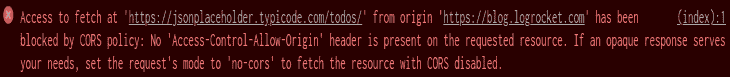

# 实现跨来源资源共享的最终指南(CORS) - LogRocket 博客

> 原文：<https://blog.logrocket.com/the-ultimate-guide-to-enabling-cross-origin-resource-sharing-cors/>

考虑以下情况:您试图使用`fetch()`从网站上的 API 获取一些数据，但是以错误结束。

您打开控制台，看到“请求的资源上不存在`Access-Control-Allow-Origin`头”，或者用红色文本写着“`Access-Control-Allow-Origin`头的值`<some_url>`不等于提供的原点”，这表明您的请求被 CORS 策略阻止。



似曾相识？StackOverflow 上的`cors`标签下发布了超过 10，000 个问题，这是困扰前端开发人员和后端开发人员的最常见问题之一。那么，CORS 政策到底是什么，为什么我们经常面临这个错误呢？

## 什么是跨源资源共享(CORS)？

有趣的是，这并不是我们描述的错误，而是预期的行为。我们的网络浏览器执行**同源策略**，该策略限制不同来源之间的资源共享。[跨产地资源共享](https://developer.mozilla.org/en-US/docs/Web/HTTP/CORS)，或 CORS，是我们可以克服这一障碍的机制。要了解 CORS，让我们先了解同源政策及其必要性。

### 同源政策

简单来说，同源政策就是浏览器纳入的网页版“不要和陌生人说话”。

今天所有可用的现代 web 浏览器都遵循同源策略，该策略限制来自一个源的`XMLHttpRequest`和`fetch`请求如何与来自另一个源的资源交互。起源到底是什么？

它是方案、域和端口的组合。该方案可以是 HTTP、HTTPS、FTP 或任何其他方案。同样，端口也可以是任何有效的端口号。同源请求本质上是那些方案、域和端口匹配的请求。让我们看看下面的例子。

假设我们的来源是`[http://localhost:3000](http://localhost:3000)`，请求可以分为同源或跨源请求，如下所示:

这就是为什么当你开发单页面应用程序(spa)时，你运行在`[http://localhost:3000](http://localhost:3000)`上的前端不能对你运行在`[http://localhost:5000](http://localhost:5000)`上的服务器或任何其他端口进行 API 调用的原因。

此外，从起点`[https://mywebsite.com](https://mywebsite.com)`到起点`[https://api.mywebsite.com](https://api.mywebsite.com)`的请求仍然被认为是跨站点请求，即使第二个起点是一个子域。

由于同源策略，浏览器将自动阻止来自跨源请求的响应与客户端共享。出于安全原因，这非常好！但并非所有网站都是恶意的，在许多情况下，您可能需要从不同的来源获取数据，尤其是在现代的[微服务架构](https://blog.logrocket.com/methods-for-microservice-communication/)时代，不同的应用程序托管在不同的来源上。

对我们来说，这是深入研究 CORS 并学习如何使用它来允许跨来源请求的好时机。

## 允许与 CORS 的跨站点请求

我们已经确定，浏览器不允许不同来源之间的资源共享，但有无数的例子，我们能够这样做。怎么会？这就是 CORS 出现的原因。

CORS 是一种基于 HTTP 报头的协议，支持不同来源之间的资源共享。除了 HTTP 头，CORS 还依赖于浏览器的飞行前请求，对非简单请求使用`OPTIONS`方法。本文稍后将详细介绍简单的预检请求。

因为 HTTP 头是 CORS 机制的关键，所以让我们看看这些头以及它们各自的含义。

### `Access-Control-Allow-Origin`

`Access-Control-Allow-Origin`响应头可能是 CORS 机制设置的最重要的 HTTP 头。这个头的值由允许访问资源的来源组成。如果这个头没有出现在响应头中，这意味着服务器上没有设置 CORS。

如果该报头存在，则对照请求报头的`Origin`报头检查其值。如果值匹配，请求将成功完成，资源将被共享。如果不匹配，浏览器将响应 CORS 错误。

在公共 API 的情况下，为了允许所有源访问资源，可以在服务器上将`Access-Control-Allow-Origin`头设置为`*`。为了只限制特定来源访问资源，可以将头部设置为客户端来源的完整域，例如`[https://mywebsite.com](https://mywebsite.com)`。

### `Access-Control-Allow-Methods`

`Access-Control-Allow-Methods`响应头用于指定允许的 HTTP 方法或服务器可以响应的 HTTP 方法列表，如`GET`、`POST`和`PUT`。

该报头出现在对预先飞行的请求的响应中。如果您请求的 HTTP 方法不在允许的方法列表中，将导致 CORS 错误。当您想限制用户通过`POST`、`PUT`、`PATCH`或`DELETE`请求修改数据时，这非常有用。

### `Access-Control-Allow-Headers`

`Access-Control-Allow-Headers`响应头指出了您的请求可以拥有的允许的 HTTP 头的列表。为了支持像`x-auth-token`这样的自定义头，您可以在您的服务器上相应地设置 CORS。

除了允许的标头之外，包含其他标头的请求将导致 CORS 错误。类似于`Access-Control-Allow-Methods`报头，该报头用于响应预先飞行的请求。

### `Access-Control-Max-Age`

预先飞行的请求要求浏览器首先使用`OPTIONS` HTTP 方法向服务器发出请求。只有在这之后，如果认为安全，才可以发出主请求。然而，为每个预先飞行的请求进行`OPTIONS`调用可能是昂贵的。

为了防止这种情况，服务器可以使用`Access-Control-Max-Age`头进行响应，允许浏览器在一定时间内缓存预先飞行请求的结果。该标题的值是以秒为单位的时间量。

* * *

### 更多来自 LogRocket 的精彩文章:

* * *

总的来说，下面是 CORS 响应头的语法:

```
Access-Control-Allow-Origin: <allowed_origin> | *
Access-Control-Allow-Methods: <method> | [<method>]
Access-Control-Allow-Headers: <header> | [<header>]
Access-Control-Max-Age: <delta-seconds>

```

## 简单请求与预先飞行的请求

不触发 CORS 预检的请求属于简单请求类别。然而，该请求只有在被视为简单请求之后才必须满足某些条件。这些条件是:

1.  请求的 HTTP 方法应该是下列方法之一:`GET`、`POST`或`HEAD`
2.  除了用户代理自动设置的报头之外，请求报头应该只包含 CORS 安全列表报头，例如`Accept`、`Accept-Language`、`Content-Language`和`Content-Type`
3.  `Content-Type`头应该只有以下三个值中的一个:`application/x-www-form-urlencoded`、`multipart/form-data`或`text/plain`
4.  如果使用`XMLHttpRequest`，则没有事件侦听器在由`XMLHttpRequest.upload`属性返回的对象上注册
5.  请求中不应使用任何`ReadableStream`对象

如果不满足这些条件中的任何一个，该请求将被视为飞行前请求。对于这样的请求，浏览器必须首先使用`OPTIONS`方法向不同的源发送请求。

这用于检查将实际请求发送到服务器是否安全。实际请求的批准或拒绝取决于预先飞行的请求的响应报头。如果这些响应头和主请求头不匹配，就不会发出请求。

## 扶持 CORS

让我们考虑一下我们最初面对 CORS 错误的情况。我们有多种方法可以解决这个问题，这取决于我们是否可以访问托管资源的服务器。我们可以把范围缩小到两种情况:

1.  你有权访问后端或知道后端开发人员
2.  您只能管理前端，不能访问后端服务器

### 如果您可以访问后端:

因为 CORS 只是一种基于 HTTP 头的机制，所以您可以配置服务器用适当的头来响应，以便在不同的源之间实现资源共享。看看我们上面讨论的 CORS 头文件，并相应地设置头文件。

对于[node . js](https://nodejs.org/en/)+[express . js](https://expressjs.com/)开发者，可以从 npm 安装`cors`中间件。下面是使用 Express web 框架和 CORS 中间件的一个片段:

```
const express = require('express');
const cors = require('cors');
const app = express();

app.use(cors());

app.get('/', (req, res) => {
  res.send('API running with CORS enabled');
});

app.listen(5000, console.log('Server running on port 5000'));

```

如果没有传递由 CORS 配置组成的对象，将使用默认配置，这相当于:

```
{
  "origin": "*",
  "methods": "GET,HEAD,PUT,PATCH,POST,DELETE",
  "preflightContinue": false,
  "optionsSuccessStatus": 204
}

```

以下是如何在您的服务器上配置 CORS，它只允许来自`[https://yourwebsite.com](https://yourwebsite.com)`的带有标题`Content-Type`和`Authorization`的`GET`请求，具有 10 分钟的飞行前缓存时间:

```
app.use(cors({
  origin: 'https://yourwebsite.com',
  methods: ['GET'],
  allowedHeaders: ['Content-Type', 'Authorization'],
  maxAge: 600
}));

```

虽然这段代码特定于 Express.js 和 Node.js，但概念是相同的。使用您选择的编程语言和框架，您可以手动设置响应的 CORS 头，或者为其创建一个定制的中间件。

### 如果您只能访问前端:

很多时候，我们可能无法访问后端服务器。例如，公共 API。因此，我们无法在收到的响应中添加标头。但是，我们可以使用一个代理服务器，将 CORS 头添加到代理请求中。

[cors-anywhere](https://github.com/Rob--W/cors-anywhere) 项目是一个 Node.js 反向代理，它可以让我们做同样的事情。代理服务器在`[https://cors-anywhere.herokuapp.com/](https://cors-anywhere.herokuapp.com/)`上可用，但是您可以通过克隆存储库并将其部署在像 [Heroku](https://www.heroku.com/) 这样的免费平台或任何其他需要的平台上来构建您自己的代理服务器。

在这种方法中，不是像这样直接向服务器发出请求:

```
fetch('https://jsonplaceholder.typicode.com/posts');

```

只需将代理服务器的 URL 附加到 API URL 的开头，如下所示:

```
fetch('https://cors-anywhere.herokuapp.com/https://jsonplaceholder.typicode.com/posts');

```

## 结论

当我们开始欣赏同源策略对跨站点伪造攻击的安全性时，CORS 似乎很有意义。虽然控制台中出现的红色 CORS 错误消息不会神奇地消失，但是无论您是在前端还是后端工作，您现在都具备了处理这些消息的知识。

## 使用 [LogRocket](https://lp.logrocket.com/blg/signup) 消除传统错误报告的干扰

[](https://lp.logrocket.com/blg/signup)

[LogRocket](https://lp.logrocket.com/blg/signup) 是一个数字体验分析解决方案，它可以保护您免受数百个假阳性错误警报的影响，只针对几个真正重要的项目。LogRocket 会告诉您应用程序中实际影响用户的最具影响力的 bug 和 UX 问题。

然后，使用具有深层技术遥测的会话重放来确切地查看用户看到了什么以及是什么导致了问题，就像你在他们身后看一样。

LogRocket 自动聚合客户端错误、JS 异常、前端性能指标和用户交互。然后 LogRocket 使用机器学习来告诉你哪些问题正在影响大多数用户，并提供你需要修复它的上下文。

关注重要的 bug—[今天就试试 LogRocket】。](https://lp.logrocket.com/blg/signup-issue-free)