# Flutter - LogRocket 博客中文本字段的最终指南

> 原文：<https://blog.logrocket.com/the-ultimate-guide-to-text-fields-in-flutter/>

大多数现代应用程序需要用户进行某种类型的输入。无论是注册、登录还是反馈表单，学习如何实现文本字段是开发人员需要掌握的一项重要技能。

在 Flutter 中，我们可以使用两种类型的文本字段小部件来获取用户输入。一个是`TextField`，另一个是`TextFormField`，稍微高级一点的`TextField`版本。`TextFormField`提供了比`TextField`更多的功能，比如构建表单验证和直接设置初始文本值的能力。

如果您的文本字段只需要用户输入一两个信息，我建议使用`TextField`小部件。否则，如果您想创建一个包含多个输入字段和验证的更大的表单，最好使用`TextFormField`小部件。

## 创建一个基本的`TextField`

创建一个基本的`TextField`小部件很简单。将`TextField`小部件应用到您希望它出现的小部件树中。这将添加一个默认样式的默认`TextField`:

```
TextField(
    )

```

## 创建一个基本的`TextFormField`

可以像添加`TextField`一样添加`TextFormField`。这两个小部件在视觉上没有区别:

```
TextFormField(
    )

```

## 设置文本字段的样式

通过将`InputDecoration`设置为`TextField` / `TextFormField`小部件的`decoration`属性，可以很容易地对文本字段进行个性化设置:

```
     TextField(
            decoration: InputDecoration(
              filled: true,
              fillColor: Colors.blueAccent,
              border: OutlineInputBorder(
                borderSide: BorderSide.none,
                borderRadius: BorderRadius.circular(50)
              ),
            ),
          )

```

如果您想将背景颜色应用到您的文本字段，您必须将`filled`值设置为`true`。否则，背景颜色不会受到影响。

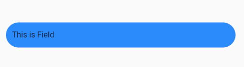

## 更改文本颜色

可以使用`TextField`小部件的`style`属性来更改文本颜色。您也可以通过将颜色设置为`cursorColor`属性来更改光标颜色:

```
        TextField(
              cursorColor: Colors.black,
              style: TextStyle(
                color: Colors.white
              ),
              decoration: InputDecoration(
                filled: true,
                fillColor: Colors.blueAccent,
                border: OutlineInputBorder(
                  borderSide: BorderSide.none,
                  borderRadius: BorderRadius.circular(50)
                ),
              ),
            )

```


## 添加提示文本

提示文本用于让用户了解文本字段可以接受的输入值。您可以使用`hintText`属性向文本字段添加提示，当您开始键入时，该提示将会消失。默认颜色是灰色，但是您可以添加`hintStyle`来更改文本样式:

```
    TextField(
        decoration: InputDecoration(
          hintStyle: TextStyle(color: Colors.blue),
          hintText: "Enter your name"
        ),
      )

```

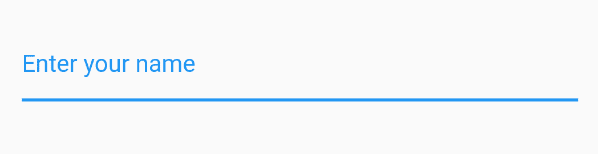

## 添加多行支持

默认情况下，`TextField`显示为单行。但是我们可以通过`maxLines`属性指定支持的最大行数。这不会限制您可以添加的行数，它一次只显示指定的行数。如果您想根据输入文本的数量扩展字段，您可以将`null`设置为`maxLines`属性:

```
        TextField(
          maxLines: 5,
        ),

```

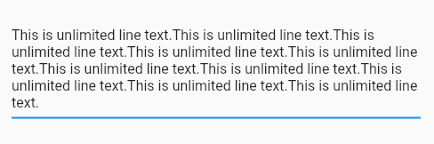

## 读取输入值

阅读用户的输入是你的文本域最重要的特性。在颤振中，这可以使用`TextEditingController`来完成。

首先，创建一个`TextEditingController`，并将其设置为`TextField`小部件的控制器属性。

在本例中，我添加了一个额外的`Button`和`Text`小部件，当您单击“显示文本”按钮时，它将显示添加的文本。

当您按下按钮时，它会将`textController`值设置为`displayText`变量。`displayText`已经被设置为`Text`小工具的文本，所以当你按下“显示文本”时你可以看到输入的文本出现:

```
class _TextFormState extends State<TextFormSample> {
  TextEditingController textController = TextEditingController();
  String displayText = "";

  @override
  Widget build(BuildContext context) {
    return Column(
      children: [
        TextField(
          controller: textController,
          maxLines: null,
        ),
        ElevatedButton(onPressed: (){
          setState(() {
            displayText = textController.text;
          });
        }, child: Text("Show Text")),
        Text(displayText,style: TextStyle(fontSize: 20),)
      ],
    );
  }
}

```

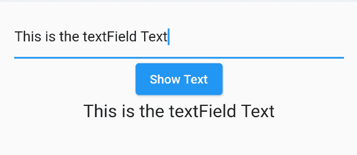

## 预填充文本

在加载文本字段时预先填充值在配置文件更新和登录屏幕等场景中非常有用。`TextField`小部件本身没有设置初始值的属性，但这可以使用`TextEditingController`来完成。

创建一个`TextEditingController`，为构造函数的`text`属性设置一个值，它将在第一次加载时填充到小部件中:

```
  TextEditingController textController = TextEditingController(text: "Initial Text");

  @override
    Widget build(BuildContext context) {
      return Center(
        child: TextField(
          controller: textController,
        ),
      );
    }

```

然后使用`TextFormField`中的`initialValue`属性创建您的预填充文本:

```
        TextFormField(
          initialValue: "Initial Text",
        )

```

## 根据输入类型更改键盘

你可能见过应用程序为不同的输入类型显示不同的键盘布局，比如电话号码的数字键盘或电子邮件的“@”按钮。这可以通过`keyboardType`属性在 Flutter 中完成。它接受`TextInputType`和[多个选项，如号码、日期、电话、姓名和电子邮件地址](https://api.flutter.dev/flutter/services/TextInputType-class.html):

```
     TextField(
        keyboardType: TextInputType.number,
      )

```

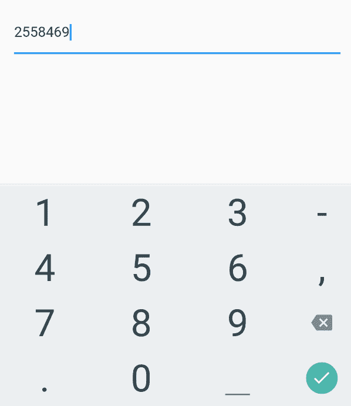

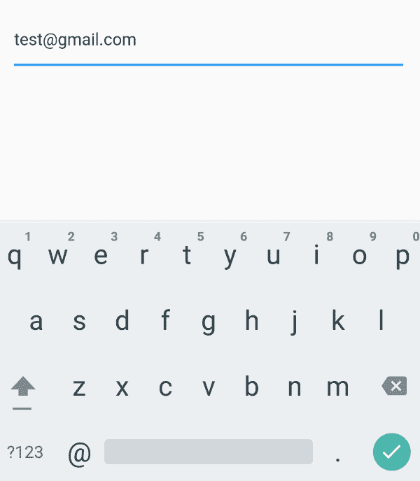

## 将普通文本字段转换为密码字段

通过将`obscureText`属性设置为`true`,您可以将一个纯文本字段转换为一个密码字段，从而屏蔽输入值。

默认情况下，该属性将显示点来屏蔽密码字符。但是您可以通过将`obscuringCharacter`值设置为您喜欢的任何值来改变这一点；这里，我选择了星号:

```
     TextField(
        obscureText: true,
        obscuringCharacter: "*",
      )

```

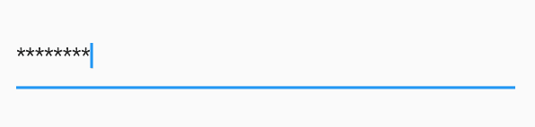

## 限制字符数

`maxLength`属性接受整数值来指定特定字段接受的最大字符数。添加该属性后，如果用户输入的字符数超过了`maxLength`中指定的字符数，将自动阻止输入:

```
     TextField(
        maxLength: 2,
      )

```

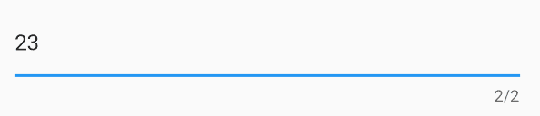

## 限制和允许输入值

为了减少用户错误，必须在文本字段中使用验证来限制某些字符或数字。

Flutter 的`inputFormatter`属性允许您为`TextField`小部件设置一组过滤器。它将接受两种类型:

1.  允许特定字符，可使用`FilteringTextInputFormatter.allow()`进行设置
2.  拒绝使用`FilteringTextInputFormatter.deny()`设置的特定字符

下面是一个示例，说明如果拒绝某些字符，您的代码可能会是什么样子:

```
TextField(
        inputFormatters: [FilteringTextInputFormatter.deny(RegExp("[0-9]+"))],
      )

```

如果用户输入被拒绝的字符，文本字段不会向用户显示错误。它只是根据输入阻止或允许指定的字符。

然而，添加带有验证的错误消息很简单，这是我们接下来要讨论的。

## 验证带有错误消息的输入

由于某些属性的可用性，对`TextField`和`TextFormField`应用错误消息略有不同。让我们来看看如何在这些小部件中验证带有错误消息的输入。

### 在`TextField`中输入验证错误信息

在`TextField`中没有添加错误消息的直接属性。但是您可以基于验证的值在`InputDecoration`中设置一个`errorText`属性。

在下面的例子中，我判断输入值是否为空和一个数字，并根据结果将`isANumber`值更改为 true 或 false。基于`isANumber`值，您可以设置错误文本，就像我在这里对“请输入一个数字”所做的那样:

```
class _LoginFormState extends State<LoginForm> {

  TextEditingController textController = TextEditingController();
  RegExp digitValidator  = RegExp("[0-9]+");
  bool isANumber = true;
  @override
  Widget build(BuildContext context) {
    return Center(
      child: 
      TextField(
        onChanged: (inputValue){
          if(inputValue.isEmpty || digitValidator.hasMatch(inputValue)){
            setValidator(true);
          } else{
            setValidator(false);
          }
        },

        decoration: InputDecoration(
          errorText: isANumber ? null : "Please enter a number"
        ),
      ),
    );
  }
  void setValidator(valid){
    setState(() {
      isANumber = valid;
    });
  }
}

```

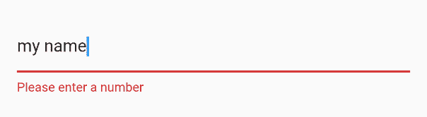

通过将`TextStyle`设置为`errorStyle`属性，可以很容易地定制错误文本的颜色。

您可以使用`focusedErrorBorder`和`errorBorder`属性更改边框颜色。`errorBorder`将在没有焦点的时候显示出来。因此，请确保在更改边框颜色时设置这两个属性:

```
TextField(
        onChanged: (inputValue){
          if(inputValue.isEmpty || digitValidator.hasMatch(inputValue)){
            setValidator(true);
          } else{
            setValidator(false);
          }
        },

        decoration: InputDecoration(
          errorText: isANumber ? null : "Please enter a number",
          errorStyle: TextStyle(color: Colors.purpleAccent),
          focusedErrorBorder: UnderlineInputBorder(borderSide: BorderSide(color: Colors.purpleAccent)),
          errorBorder: UnderlineInputBorder(borderSide: BorderSide(color: Colors.purpleAccent))
        ),
      )

```

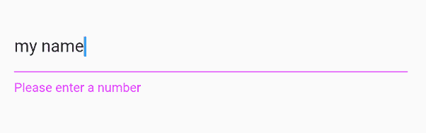

### 在`TextFormField`中输入验证错误信息

`TextFormField`和`TextField`的主要区别在于`TextFormField`小部件使用了`Form`小部件，后者可以包含多个`TextField`小部件。

在 Flutter 中，用`TextFormField`创建一个有效的`Form`很简单。

* * *

### 更多来自 LogRocket 的精彩文章:

* * *

首先，创建一个`Form`小部件，添加两个带有按钮的`TextFormField`小部件(我用的是`ElevatedButton`和`Text`)。

创建`Form`小部件时要记住的重要事情是，您必须首先创建一个访问`Form`所需的`GlobalKey`。创建一个`GlobalKey`后，您可以将该键设置为`Form`小部件的`key`属性。

`TextFormField`包含一个名为验证器的属性。您可以在验证器回调函数中访问字段值，并根据返回值进行不同的验证。对于第一个文本字段，我们将使用正则表达式检查它是否为空，或者值是否为数字。如果该条件失败，您可以为该特定字段返回一条错误消息。

在`onPressed`事件中，您可以使用`GlobalKey`对象检查表单的有效性，并将`isValidForm`值更改为`true`或`false`，以在下面的`Text`小部件中显示一条消息:

```
class _NumberFormState extends State<NumberForm> {

  var _numberForm = GlobalKey<FormState>();
  RegExp _digitRegex = RegExp("[0-9]+");
  bool isValidForm = false;
  @override
  Widget build(BuildContext context) {
    return Center(
      child: Form(
        key: _numberForm,
        child: 
        Column(
          children: [
            TextFormField(
              validator: (inputValue){
                if(inputValue.isEmpty || !_digitRegex.hasMatch(inputValue)){
                  return "Please enter number";
                }
                return null;
              },
            ),
            TextFormField(
              validator: (inputValue){
                if(inputValue.isEmpty){
                  return "Please Fill before";
                }
                return null;
              },
            ),
            ElevatedButton(
              onPressed: (){
                if(_numberForm.currentState.validate()){
                    setState(() {
                      isValidForm = true;
                    });
                } else{
                  setState(() {
                      isValidForm = false;
                    });
                }
            }, child: Text("Check Number")),
            Text( isValidForm ? "Nice" : "Please Fix error and Submit ")
          ],
        )),
    );
  }
}

```

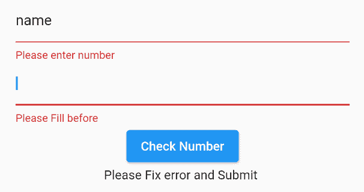

## 结论

我希望这篇文章能让你更好地了解如何在 Flutter 的`TextField`和`TextFormField`小部件中定制和使用不同的属性。

## 使用 [LogRocket](https://lp.logrocket.com/blg/signup) 消除传统错误报告的干扰

[](https://lp.logrocket.com/blg/signup)

[LogRocket](https://lp.logrocket.com/blg/signup) 是一个数字体验分析解决方案，它可以保护您免受数百个假阳性错误警报的影响，只针对几个真正重要的项目。LogRocket 会告诉您应用程序中实际影响用户的最具影响力的 bug 和 UX 问题。

然后，使用具有深层技术遥测的会话重放来确切地查看用户看到了什么以及是什么导致了问题，就像你在他们身后看一样。

LogRocket 自动聚合客户端错误、JS 异常、前端性能指标和用户交互。然后 LogRocket 使用机器学习来告诉你哪些问题正在影响大多数用户，并提供你需要修复它的上下文。

关注重要的 bug—[今天就试试 LogRocket】。](https://lp.logrocket.com/blg/signup-issue-free)