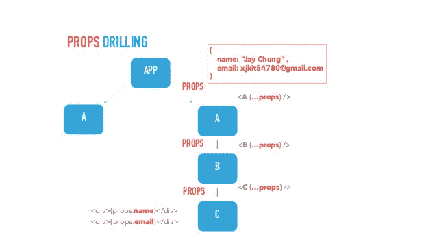

# React - LogRocket 博客中的支柱钻井的优点

> 原文：<https://blog.logrocket.com/the-upsides-of-prop-drilling-in-react/>

## 支柱钻孔介绍

在使用 React 时，总是需要与不同的组件共享数据。这可以通过最基本的方式实现，即使用支柱钻孔。正确钻孔允许组件之间的单向数据共享。以道具形式传递或共享的数据。

让我们考虑下图:



对于要在 C 组件中访问的 A 组件中的数据，它必须作为 prop 传递给 B 组件，最后传递给 C 组件。这就是所谓的线程化。

从上面的解释中，你可以了解什么是支柱钻探的基本知识，以及我们为什么需要它。

现在让我们继续使用我们在上面学到的知识创建一个简单的应用程序。本教程的所有代码都可以在这里找到。

首先，让我们在 React 应用程序的 src 文件夹中创建两个文件，分别命名为 app.js 和 name.js。

接下来，我们将下面的代码复制到 name.js 文件中:

```
import React from 'react';
const Name = () =>{
  return(
  <div>
     {/* names should be here*/}
  </div>
  )
}
export default Name;
```

现在，让我们将以下代码添加到 app.js 文件中:

```
import React,{useState} from 'react';
import Name from './Names'
const App = () =>{
  const [data , setData] = useState([
    {
     name:'Ijeoma Belinda',
     age: 13,
    },
    {
     name:'Ozioko Chioma',
     age: 17,
    }
  ])
  return(
    <Name data = {data} />
  )
}
export default App;
```

注意，我们需要在`name.js`中显示的数据作为一种状态存储在`app.js`文件中。为了将它作为道具传递下去，我们需要将第 16 行中的代码替换为:

```
<Name data = {data} />
```

现在，我们可以在 name.js 文件中使用它，如下所示:

```
import React from 'react';
const Name = (props) =>{
  return(
  <div>
      {props.data.map( unitData => <h1>{unitData.name}</h1>)}
  </div>
  )
}
export default Name;
```

app.js 和 name.js 的最终代码应该如下所示:

```
import React,{useState} from 'react';
import Name from './Names'
const App = () =&gt;{
  const [data , setData] = useState([
    {
     name:'Ijeoma Belinda',
     age: 13,
    },
    {
     name:'Ozioko Chioma',
     age: 17,
    }
  ])
  return(
    &lt;Name data = {data} /&gt;
  )
}
export default App;
```

下面的 name.js 文件:

```
import React from 'react';
const Name = (props) =>{
  return(
  <div>
      {props.data.map( unitData => <h1>{unitData.name}</h1>)}
  </div>
  )
}
export default Name;
```

注意`props`是作为参数添加到功能组件中的。

如果一切都做得正确，存储在状态中的数据现在应该显示在浏览器中。

### 支柱钻井的好处

在处理小型应用程序时，prop drilling 可以作为一种快速简便的组件间数据传输方法。与其他常见的数据传输方法不同，prop drilling 相对容易学习和实施。

除此之外，作为道具传递的数据可以很容易地在状态改变时更新，以反映新的变化。

为了更好地理解这一点，让我们回到 app.js 文件，用新用户的数据更新状态，如下所示:

```
import React,{useState , useEffect} from 'react';
import Name from './Names'
const App = () =>{
  const [data , setData] = useState([
    {
     name:'Ijeoma Belinda',
     age: 13 },
      {
     name:'Ozioko Chioma',
     age: 17
    }
  ])
  useEffect(() => {
   setData([
   ...data,
    {
      name:'Eze ifechi',
      age: 17,
     }
  ])
  },[])
  return(
    <Name data = {data} />
  )
}
export default App;
```

您会注意到，浏览器中呈现的页面会立即更新以反映新的更改，而无需添加任何额外的代码或逻辑。

### 支柱钻井的缺点

道具钻井确实有其缺点，在某些情况下，它不值得。随着您的代码库的增加，适当的调整会使您的代码变得过于复杂，而且随着代码的增加，情况只会变得更糟。

除此之外，props 可以被传递给不一定需要它的组件，只是为了让数据到达子组件，导致代码库不必要的增加。

为了演示这一点，让我们通过添加一个名为 singleName.js 的新文件来调整我们的代码，然后在我们的 Name.js 文件中呈现它，如下所示:

```
import React from 'react';
import SingleName from './singleName'
const Name = (props) =>{
  return(
  <div>
      {props.data.map( unitData => <SingleName unitData = {unitData} />)}
  </div>
  )
}
export default Name;
```

接下来，让我们将以下代码添加到我们的新文件(`singleName.js`)中:

```
import React from 'react';
const SingleName = (props) =>{
  return(
  <div>
      <h1>{props.data.name}</h1>
  </div>
  )
}
export default SingleName;
```

请注意，数据被传递到 name.js 文件，即使它并不需要，以便它到达子组件，在本例中是 singleName.js。

随着代码库的增加，跟踪道具名称可能会变得很困难，尤其是在线程中途道具被重命名的情况下。

如果你遇到这种情况，可能很难解决。

## **如何解决这些问题**

首先要做的就是少用元件。避免添加不必要的组件，这些组件需要适当的训练来防止代码库变得太大。

现在，重要的是要注意，这并不意味着你应该把你的代码浓缩到只有一个组件。但是，可能有一种情况，你真的不需要增加一个额外的组件。在这种情况下，请记住，您不希望代码过于复杂。

* * *

### 更多来自 LogRocket 的精彩文章:

* * *

你可以做的另一件事是总是使用一个默认的道具名，这样就很容易跟踪它。

在您的应用中，除了适当的钻孔，您还可以使用其他替代方法。在应用程序的几乎所有部分都需要您的数据的情况下，您可以使用上下文 API。Context API 可以为您的应用程序的不同部分提供您需要的所有数据，而没有 prop drilling 带来的所有复杂性。

## 结论

正确钻孔，即使有其缺点，仍然是组件之间数据传输的可行方法，应该用于相对较小的应用。但是，在处理较大的应用程序时，不建议将它作为主要的数据传输方法。

## 使用 LogRocket 消除传统反应错误报告的噪音

[LogRocket](https://lp.logrocket.com/blg/react-signup-issue-free)

是一款 React analytics 解决方案，可保护您免受数百个误报错误警报的影响，只针对少数真正重要的项目。LogRocket 告诉您 React 应用程序中实际影响用户的最具影响力的 bug 和 UX 问题。

[ ](https://lp.logrocket.com/blg/react-signup-general) [  ](https://lp.logrocket.com/blg/react-signup-general) [LogRocket](https://lp.logrocket.com/blg/react-signup-issue-free)

自动聚合客户端错误、反应错误边界、还原状态、缓慢的组件加载时间、JS 异常、前端性能指标和用户交互。然后，LogRocket 使用机器学习来通知您影响大多数用户的最具影响力的问题，并提供您修复它所需的上下文。

关注重要的 React bug—[今天就试试 LogRocket】。](https://lp.logrocket.com/blg/react-signup-issue-free)