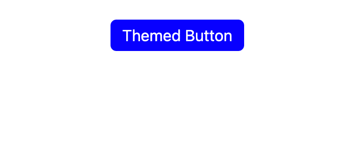
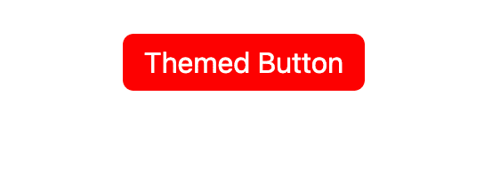
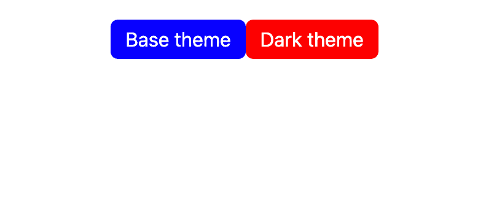
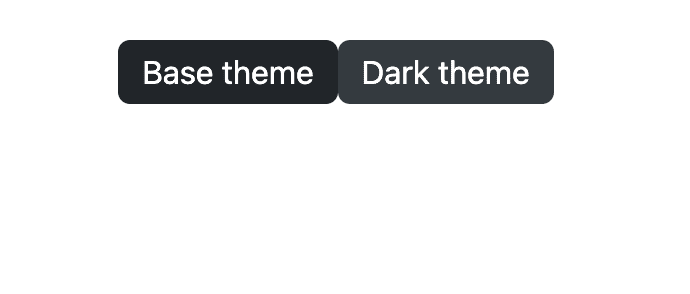

# 用顺风 CSS 对 React 组件进行主题化

> 原文：<https://blog.logrocket.com/theming-react-components-tailwind-css/>

您对创建自己的 themeable React 组件库感兴趣吗？也许您希望完全控制项目的调色板，并希望用户可以使用各种不同的主题。也许你只是一个想锻炼你创造力的爱好者。无论你属于哪个阵营，看看这篇文章就知道了！

我们将为创建一个可伸缩的、完全可定制的、可主题化的 React 组件库打下基础。

对于我们的示例项目，我们将使用 Tailwind CSS 来主题化我们的组件。如果你以前没有用过 Tailwind CSS，那你就错过了。

Tailwind 由大量实用 CSS 类组成。这意味着您不必编写任何 CSS——您只需将适当的 Tailwind 类添加到 HTML 元素中，以应用所需的样式。边距、填充、背景颜色和其他所有东西都相差一个等级。

将它与可重用的 React 组件结合起来，您就可以创建可伸缩的主题库了。

## 设置项目

让我们从创建 React 项目开始:

```
$ yarn create react-app themed-react-project
$ cd themed-react-project

```

接下来，我们将按照[官方文档](https://tailwindcss.com/docs/guides/create-react-app)中的说明来设置 Tailwind。首先，我们将安装 Tailwind 及其对等依赖项:

```
$ yarn add -D [email protected]:@tailwindcss/postcss7-compat [email protected]^7 [email protected]^9

```

现在我们需要安装 [CRACO](https://blog.logrocket.com/create-react-app-and-tailwindcss/) :

```
$ yarn add @craco/craco

```

在您的`package.json`文件中，修改您的`start`、`build`和`test`脚本，使用`craco`代替`react-scripts`:

```
{
  /* ... */
  "scripts": {
      "start": "craco start",
      "build": "craco build",
      "test": "craco test",
      "eject": "react-scripts eject"
  },
  /* ... */
}

```

请注意，我们没有将 CRACO 用于`eject`脚本。

在项目根目录下创建一个包含以下内容的`craco.config.js`文件:

```
// craco.config.js
module.exports = {
  style: {
    postcss: {
      plugins: [
        require('tailwindcss'),
        require('autoprefixer'),
      ],
    },
  },
}

```

在项目根目录下创建一个`tailwind.config.js`文件，如下所示:

```
// tailwind.config.js
module.exports = {
  purge: ["./src/**/*.{js,jsx,ts,tsx}", "./public/index.html"],
  darkMode: false,
  theme: {
    extend: {},
  },
  variants: {
    extend: {},
  },
  plugins: [],
};

```

最后，用下面的代码替换`src/index.css`,让 Tailwind 在构建时使用它的样式:

```
// src/index.css
@tailwind base;
@tailwind components;
@tailwind utilities;

```

我们已经设置好了一切！现在让我们开始我们的主题。

## 顺风主题化

关于顺风的最好的事情之一是它的可配置性。开箱后，它带有一个巨大的调色板。但是，如果你正在为你的站点创建主题化组件，默认的调色板可能有点太多了。

让我们从定义三种颜色开始:原色、次色和文本颜色。我们可以通过修改我们的`tailwind.config.js`文件来轻松做到这一点，如下所示:

```
// tailwind.config.js
module.exports = {
  purge: ["./src/**/*.{js,jsx,ts,tsx}", "./public/index.html"],
  darkMode: false, // or 'media' or 'class'
  theme: {
    colors: {
      primary: "blue",
      secondary: "red",
      "text-base": "white",
    },
    extend: {},
  },
  variants: {
    extend: {},
  },
  plugins: [],
};

```

现在我们可以将这些颜色用于任何接受颜色的 Tailwind 实用程序类。让我们通过创建一个定制的按钮组件来测试我们的主题。

在`src`文件夹中，创建另一个名为`components`的文件夹。现在在里面创建一个`Button.js`文件。我们将使用我们在顺风配置中定义的颜色来定义背景和文本颜色。我们还将使用一些内置的 Tailwind 类来圆角，并向按钮添加一些填充:

```
// src/components/Button.js
const Button = ({ children, ...rest }) => {
  return (
    <button className="rounded-md bg-primary text-text-base px-3 py-1">
      {children}
    </button>
  );
};

export default Button;

```

注意，我们在`rest`变量中捕获任何额外的属性，然后将它们传递给基本 HTML `button`组件。这样我们就可以定义任何典型的按钮行为，比如`onClick`回调。

让我们去`App.js`测试我们的按钮。我们将删除样板代码，只添加我们创建的按钮:

```
// src/App.js
import Button from "./components/Button";
function App() {
  return (
    <div className="flex justify-center mt-5">
      <Button>Themed Button</Button>
    </div>
  );
}
export default App;

```

您应该看到我们的自定义按钮，以我们的原色作为背景！

这是很好的第一步，但是我们的按钮不太容易定制，因为我们将颜色硬编码为`bg-primary`。如果我们想使用我们的第二颜色作为背景呢？没问题—让我们将颜色作为道具传入，并使用字符串插值来动态定义按钮的颜色:

```
// src/components/Button.js
const Button = ({ children, color, ...rest }) => {
  return (
    <button className={`rounded-md bg-${color} text-text-base px-3 py-1`} {...rest}>
      {children}
    </button>
  );
};

Button.defaultProps = {
  color: "primary",
};
export default Button;

```

我们将默认颜色设置为原色，这样就不必每次都传入道具。让我们试着将`App.js`中的颜色更改为`secondary`，以确保它正常工作:

```
import Button from "./components/Button";
function App() {
  return (
    <div className="flex justify-center mt-5">
      <Button color="secondary">Themed Button</Button>
    </div>
  );
}
export default App;

```



这很好，但是加强我们传入的道具会更好。这样，如果有人用`color` prop 打错了字，控制台中会出现一条警告消息，解释为什么组件没有按预期运行。

在我们的`components`文件夹中，让我们创建一个名为`themeProps.js`的文件，在这里我们将定义所有主题组件的公共属性:

```
// src/components/themeProps.js
import { oneOf } from "prop-types";
const props = {
  color: oneOf(["primary", "secondary"]),
};
export default props;

```

现在我们可以在自定义的`Button`组件中使用`themeProps`:

```
// src/components/Button.js
import themeProps from "./themeProps";
const Button = ({ children, color, ...rest }) => {
  return (
    <button className={`rounded-md bg-${color} text-text-base px-3 py-1`} {...rest}>
      {children}
    </button>
  );
};

Button.propTypes = {
  ...themeProps,
};

Button.defaultProps = {
  color: "primary",
};

export default Button;

```

随着我们道具类型的实施，让我们继续动态定义我们的主题。

## 动态定义主题

现在，我们在顺风配置文件中定义了主要、次要和文本颜色。

我们可以在顺风主题配置中定义任意多的颜色，但是我们有一个限制:我们选择的颜色被硬编码到配置文件中。如果我们想在运行时动态切换主题呢？例如，如果我们有一个黑暗模式，并且用户想在晚上在黑暗模式下查看我们的站点，这将是有用的。

我们可以使用 [CSS 变量](https://blog.logrocket.com/how-to-use-css-variables-like-a-pro/)来定义颜色，而不是将调色板直接硬编码到顺风配置中。然后我们可以在运行时动态地改变这些变量的值，随心所欲地改变主题。将您的`tailwind.config.js`文件更改为如下所示:

```
// tailwind.config.js
module.exports = {
  purge: ["./src/**/*.{js,jsx,ts,tsx}", "./public/index.html"],
  darkMode: false, // or 'media' or 'class'
  theme: {
    colors: {
      primary: "var(--theme-primary)",
      secondary: "var(--theme-secondary)",
      "text-base": "var(--theme-text-base)",
    },
    extend: {},
  },
  variants: {
    extend: {},
  },
  plugins: [],
};

```

我们在顺风配置文件中使用了三个变量，分别叫做`--theme-primary`、`--theme-secondary`和`--theme-text-base`。它们现在还没有定义，所以让我们继续努力。在 React 项目的`src`文件夹中，创建一个名为`themes`的新文件夹，并添加一个名为`base.js`的文件。这将是我们的基本主题，以后我们可以添加其他主题。将此放入您的`base.js`文件:

```
// src/themes/base.js
const baseTheme = {
 "--theme-primary": "blue",
 "--theme-secondary": "red",
 "--theme-text-base": "white"
};
export default baseTheme;

```

这将我们的 CSS 变量的名称映射到我们希望与变量相关联的颜色，但是 CSS 变量本身仍然没有被定义。幸运的是，在 JavaScript 中设置 CSS 变量很容易，所以让我们创建一个接受主题对象的函数，并用我们定义的值创建相应的 CSS 变量。

在您的`themes`文件夹中创建一个`utils.js`文件，并添加以下内容:

```
// src/themes/utils.js
export function applyTheme(theme) {
  const root = document.documentElement;
  Object.keys(theme).forEach((cssVar) => {
    root.style.setProperty(cssVar, theme[cssVar]);
  });
}

```

现在，让我们使用这个函数来应用我们的应用程序安装时的基本主题。我们可以用[使用效果钩](https://blog.logrocket.com/guide-to-react-useeffect-hook/)来做这件事。修改您的`App.js`文件，如下所示:

```
import { useEffect } from "react";
import Button from "./components/Button";
import { applyTheme } from "./themes/utils";
import baseTheme from "./themes/base";

function App() {
  useEffect(() => {
    applyTheme(baseTheme);
  }, []);
  return (
    <div className="flex justify-center mt-5">
      <Button color="secondary">Themed Button</Button>
    </div>
  );
}

export default App;

```

在浏览器中，应用程序看起来应该还是以前的样子。现在，我们只有我们的基础主题，这将是很好的创造一个黑暗的主题。然而，在此之前，我们可以清理一下我们定义主题的方式。我们的主题文件直接将 CSS 变量名映射到一种颜色，但是以一种更友好的方式定义我们的颜色会更好。

让我们在我们的`utils.js`文件中创建一个`createTheme`函数，它将把像`primary`和`secondary`这样的名字映射到我们已经决定使用的相应 CSS 变量名。这是我们更新的`utils.js`文件:

```
export function applyTheme(theme) {
  const root = document.documentElement;
  Object.keys(theme).forEach((cssVar) => {
    root.style.setProperty(cssVar, theme[cssVar]);
  });
}

export function createTheme({
  primary,
  secondary,
  textBase,
}) {
  return {
    "--theme-primary": primary,
    "--theme-secondary": secondary,
    "--theme-text-base": textBase,
  };
}

```

现在让我们调整我们的`base.js`主题文件来使用`createTheme`函数:

```
import { createTheme } from "./utils";
const baseTheme = createTheme({
  primary: "blue",
  secondary: "red",
  textBase: "white",
});
export default baseTheme;

```

让我们在我们的`themes`文件夹中创建一个`dark.js`文件，它使用相同的模式来定义一个黑色主题:

```
import { createTheme } from "./utils";
const darkTheme = createTheme({
  primary: "#212529",
  secondary: "#343A40",
  textBase: "white",
});
export default darkTheme;

```

让我们修改`App.js`来显示两个可以动态修改主题的按钮:

```
import { useEffect } from "react";
import Button from "./components/Button";
import { applyTheme } from "./themes/utils";
import baseTheme from "./themes/base";
import darkTheme from "./themes/dark";

function App() {
  useEffect(() => {
    applyTheme(baseTheme);
  }, []);
  return (
    <div className="flex justify-center mt-5">
      <Button onClick={() => applyTheme(baseTheme)}>Base theme</Button>
      <Button color="secondary" onClick={() => applyTheme(darkTheme)}>
        Dark theme
      </Button>
    </div>
  );
}

export default App;

```

首先你会看到我们的基本主题:



现在点击黑暗主题按钮，你会看到他们切换！



## 添加`hover`

我们可以添加尽可能多的主题和尽可能多的颜色，但是我们的按钮还是有点无聊。它们总是相同的颜色——我们应该让它们在用户悬停时变成更浅的颜色。

幸运的是，顺风让这变得非常简单。我们所要做的就是给任何一个类添加一个前缀`hover:`,我们只希望在组件悬停时应用这个前缀。

对于我们的深色主题和基本主题，让我们再定义两种颜色，当按钮悬停在上面时应用:`primary-light`和`secondary-light`。让我们首先更新我们的`tailwind.config.js`文件，使用 CSS 变量`--theme-primary-light`和`--theme-primary-dark`定义的颜色:

```
// tailwind.config.js
module.exports = {
  purge: ["./src/**/*.{js,jsx,ts,tsx}", "./public/index.html"],
  darkMode: false, // or 'media' or 'class'
  theme: {
    colors: {
      primary: "var(--theme-primary)",
      "primary-light": "var(--theme-primary-light)",
      secondary: "var(--theme-secondary)",
      "secondary-light": "var(--theme-secondary-light)",
      "text-base": "var(--theme-text-base)",
    },
    extend: {},
  },
  variants: {
    extend: {},
  },
  plugins: [],
};

```

接下来，在我们的主题`utils.js`文件中，我们将更新我们的`createTheme`函数来创建这些新变量:

```
// src/themes/utils.js
export function applyTheme(theme) {
  const root = document.documentElement;
  Object.keys(theme).forEach((cssVar) => {
    root.style.setProperty(cssVar, theme[cssVar]);
  });
}

export function createTheme({
  primary,
  primaryLight,
  secondary,
  secondaryLight, 
  textBase,
}) {
  return {
    "--theme-primary": primary,
    "--theme-primary-light": primaryLight,
    "--theme-secondary": secondary,
    "--theme-secondary-light": secondaryLight,
    "--theme-text-base": textBase,
  };
}

```

现在让我们在`base.js`主题文件中定义原色和次色的较亮变体:

```
// src/themes/base.js
import { createTheme } from "./utils";

const baseTheme = createTheme({
  primary: "blue",
  primaryLight: "#4d4dff",
  secondary: "red",
  secondaryLight: "#ff4d4d",
  textBase: "white",
});

export default baseTheme;

```

现在我们将为我们的黑暗主题做同样的事情:

```
// src/themes/dark.js
import { createTheme } from "./utils";

const darkTheme = createTheme({
  primary: "#212529",
  primaryLight: "#464f58",
  secondary: "#343A40",
  secondaryLight: "#737f8c",
  textBase: "white",
});

export default darkTheme;

```

最后，我们将把悬停变量应用到按钮上。记住，由于`color`是作为道具传入的，我们可以使用字符串插值来动态应用正确的悬停变量。

我们所需要做的就是添加一个名为`hover:bg-${color}-light`的类，然后它将根据属性变成`hover:bg-primary-light`或`hover:bg-secondary-light`:

```
// src/components/Button.js
import themeProps from "./themeProps";

const Button = ({ children, color, ...rest }) => {
  return (
    <button
      className={`rounded-md bg-${color} hover:bg-${color}-light text-text-base px-3 py-1`}
      {...rest}
    >
      {children}
    </button>
  );
};

Button.propTypes = {
  ...themeProps,
};

Button.defaultProps = {
  color: "primary",
};
export default Button;

```

在你的浏览器中尝试一下，当你悬停在按钮上时，你会注意到按钮会改变颜色！

## 结论

我们只制作了一个主题按钮组件，但是我们可以使用这里开始的代码轻松地创建大量主题组件。

任何主题库也需要比我们在这个项目中定义的调色板大得多的调色板。然而，正如我们在添加主要和次要颜色的变体时所看到的，根据需要向主题添加更多的颜色是很容易的。

完整的源代码，你可以在我的 GitHub 账户上查看。

## [LogRocket](https://lp.logrocket.com/blg/react-signup-general) :全面了解您的生产 React 应用

调试 React 应用程序可能很困难，尤其是当用户遇到难以重现的问题时。如果您对监视和跟踪 Redux 状态、自动显示 JavaScript 错误以及跟踪缓慢的网络请求和组件加载时间感兴趣，

[try LogRocket](https://lp.logrocket.com/blg/react-signup-general)

.

[ ](https://lp.logrocket.com/blg/react-signup-general) [](https://lp.logrocket.com/blg/react-signup-general) 

LogRocket 结合了会话回放、产品分析和错误跟踪，使软件团队能够创建理想的 web 和移动产品体验。这对你来说意味着什么？

LogRocket 不是猜测错误发生的原因，也不是要求用户提供截图和日志转储，而是让您回放问题，就像它们发生在您自己的浏览器中一样，以快速了解哪里出错了。

不再有嘈杂的警报。智能错误跟踪允许您对问题进行分类，然后从中学习。获得有影响的用户问题的通知，而不是误报。警报越少，有用的信号越多。

LogRocket Redux 中间件包为您的用户会话增加了一层额外的可见性。LogRocket 记录 Redux 存储中的所有操作和状态。

现代化您调试 React 应用的方式— [开始免费监控](https://lp.logrocket.com/blg/react-signup-general)。