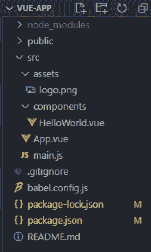
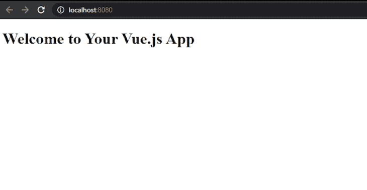
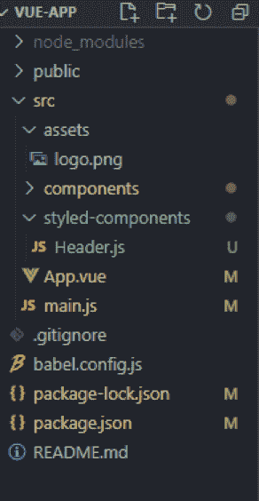
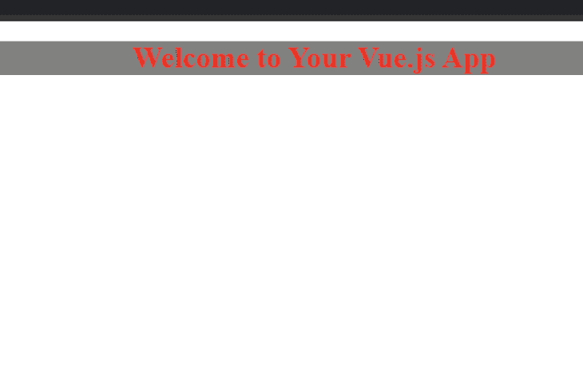
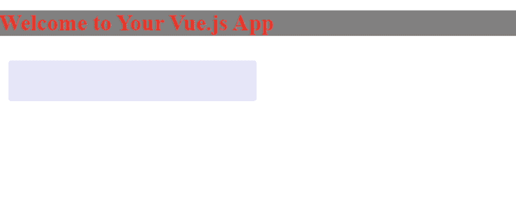
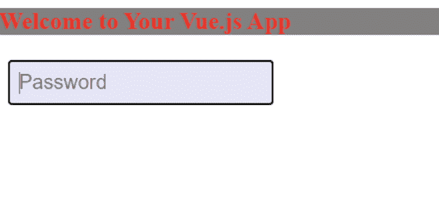
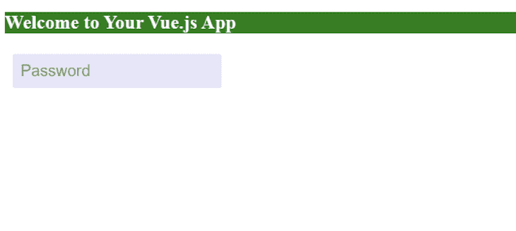
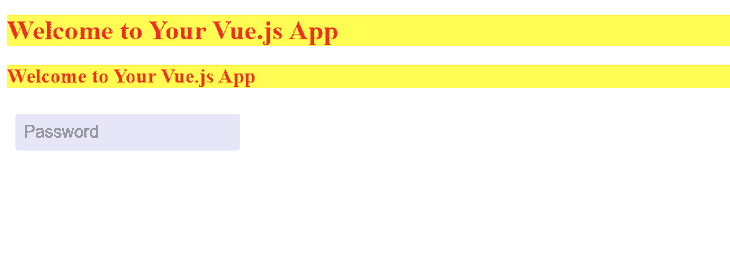
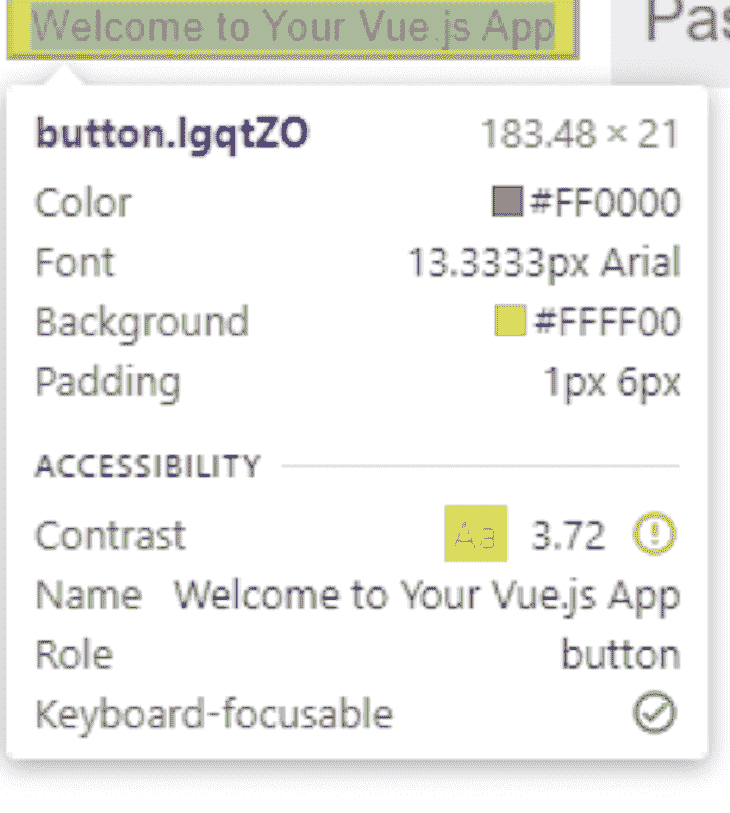
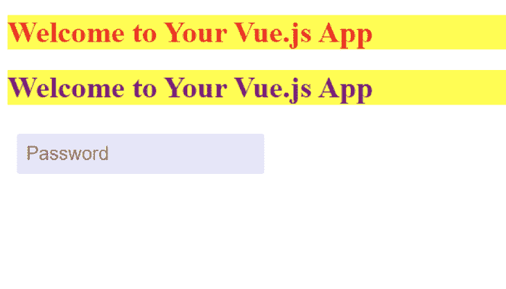

# 使用 styled-components - LogRocket 博客对 Vue.js 进行主题化

> 原文：<https://blog.logrocket.com/theming-vue-js-with-styled-components/>

随着 web 开发能力和工具的发展，web 开发框架样式也反映了这种发展。从内联样式转移到 CSS-in-JS 解决方案使得开发体验更加一致。

有了 [styled-components](https://styled-components.com/) 库，开发人员可以在 JavaScript 或 JavaScript 框架中使用 CSS，而不是在样式化时创建传统的单独 CSS 文件。它在 React 中取得了巨大成功，现在它可用于 Vue 项目。

在这篇文章中，我们将看到为什么在 Vue 中使用样式化组件是有利的。

## Vue.js 中样式化组件的优势

### 构建您自己的组件

Styled-components 让您可以在 [Vue](https://blog.logrocket.com/new-features-in-vue-3-and-how-to-use-them-2/) 中自由地制作自己的定制样式组件。您可以设置 HTML 标记的样式，并为它们选择自己的名称，以使您的代码更具可读性。

### 无类别策略

使用样式化组件，所有事情都是在道具的帮助下完成的。您可以动态地更改组件的样式，而无需使用类。它使您能够在样式化组件的字符串中使用三元运算符。

### 并行设计

Styled-components 使组件的样式和设计在整个应用程序中并行且相似，而不需要太多的努力。[主题功能](https://dev.to/aromanarguello/how-to-use-themes-in-styled-components-49h)提供了一个中心位置来定义基本的设计元素，如颜色、大小和间距，并且可以很容易地集成到应用程序的所有组件中。

### 一个庞大的社区

看到[巨大的增长](https://github.com/styled-components/styled-components/network/dependents?package_id=UGFja2FnZS01MDYyMTAyMzk%3D)，styled-components 社区为任何问题提供帮助，并有[一个面向开发者的流行库](https://github.com/styled-components)。

现在我们已经看到了样式化组件的好处，是时候在我们的 Vue 项目中安装这个库了，看看我们如何使用它的不同特性。

## 在 Vue.js 中安装样式化组件

在安装库之前，在本地机器上启动并运行一个 Vue 项目。建立项目后，使用以下命令安装库:

```
npm i vue-styled-components

```

如果您使用 Vue CLI 来设置项目，文件夹结构将如下所示:



从我们的 Vue 应用中移除所有样式后，`HelloWorld.vue`如下所示:

```
// HelloWorld.vue

<template>
  <div class="hello">
    <h1>{{ msg }}</h1>
  </div>
</template>

<script>
export default {
  name: 'HelloWorld',
  props: {
    msg: String
  }
}
</script>

```

让我们运行项目，在浏览器中查看以下输出:



正如我们所见，有一个简单的没有应用样式的`h1` header 标签。我们将用样式化组件来样式化这个`h1`，并且我们必须在`src`目录中创建一个新文件夹来存储它们。在该文件夹中，创建一个`Header.js`文件。项目结构将如下所示:



然后，在`Header.js`中添加以下代码行:

```
import styled from "vue-styled-components";

export const StyledHeader = styled.h1`
  font-size: 1.5em;
  text-align: center;
  color: red;
  background-color: grey;
`;

```

最后，我们可以在`HelloWorld.vue`中注册`StyledHeader`，用它代替`h1`:

```
<template>
  <div class="hello">
    <StyledHeader>{{ msg }}</StyledHeader>
  </div>
</template>

<script>
import {StyledHeader} from "../styled-components/Header"
export default {
  name: 'HelloWorld',
  components:{
    StyledHeader
  },
  props: {
    msg: String
  }
}
</script>

```

现在，让我们启动服务器，看看普通而乏味的 header 标记是如何变化的:



正如我们所看到的，所需的样式已经应用，没有使用任何 CSS！

## 在样式化组件中传递道具

样式组件和其他组件一样，有接受道具的能力。例如，我们可以创建一个输入字段并向其传递一个道具。这里，我们将在`components`文件夹中创建一个名为`Input.js`的新组件，并向其中添加以下代码:

```
import styled from "vue-styled-components";

export const StyledInput = styled.input`
  font-size: 1.25em;
  padding: 0.5em;
  margin: 0.5em;
  color: blueviolet;
  border: none;
  background-color: lavender;
  border-radius: 3px;

  &:hover {
    box-shadow: inset 1px 1px 2px rgba(0, 0, 0, 0.1);
  }
`;

```

下一步是在`HelloWorld.vue`中使用它:

```
<template>
  <div class="hello">
    <StyledHeader>{{ msg }}</StyledHeader>
    <StyledInput/>  
  </div>
</template>

<script>
import {StyledInput} from "../styled-components/Input"
import {StyledHeader} from "../styled-components/Header"

export default {
  name: 'HelloWorld',
  components:{
    StyledInput,StyledHeader
  },
     props: {
    msg: String
  }

}
</script>

```

保存更改将在浏览器中反映出来，确认我们的输入已呈现:



但是如果没有适当的输入，这看起来很奇怪。让我们把它作为道具和类型一起传递给`StyledInput`:

```
<template>
  <div class="hello">
  <StyledHeader>{{ msg }}</StyledHeader>
  <StyledInput placeholder="Password" type="text"/>  
  </div>
</template>

...

```

运行该命令会得到以下输出:



## Vue.js 中带有道具的动态样式

这是样式化组件最强的特性之一。它允许开发人员在不使用大量类的情况下设置动态样式。

因为 styled-components 可以带道具，基于道具应用样式，所以我们把自定义道具给`StyledHeader`。

让我们修改我们的`Header.js`文件如下:

```
import styled from "vue-styled-components";
const hdrProps = { primary: Boolean };

export const StyledHeader = styled("h1", hdrProps)`
  font-size: 1.5em;
  text-align: start;
  color: ${(props) => (props.primary ? "white" : "red")};
  background-color: ${(props) => (props.primary ? "green" : "yellow")};
`;

```

在这里，我们已经为我们的`StyledHeader`定义了道具。styled 函数将带有属性的 HTML 元素作为参数，之后我们可以根据属性的值指定 CSS 的行为。

让我们运行这个项目，不要为我们之前创建的头提供任何支持，并在浏览器中看到以下输出:

这完全按照我们指定的方式工作。现在，让我们为我们的`StyledHeader`提供一个`primary`道具，并检查样式是否被正确应用:

```
<template>
  <div class="hello">
  <StyledHeader primary>{{ msg }}</StyledHeader>
  <StyledInput placeholder="Password" type="text"/>  
  </div>
</template>

<script>
import {StyledInput} from "../styled-components/Input"
import {StyledHeader} from "../styled-components/Header"

export default {
  name: 'HelloWorld',
  components:{
    StyledInput,StyledHeader
  },
     props: {
    msg: String
  }

}
</script>

```

正如我们所见，`StyledHeader`正在接受`primary`作为道具。保存更改后，我们的项目呈现以下输出:



这样，我们成功地改变了基于道具的风格，赋予了我们方法背后的基本概念。带有道具的样式可以用按钮事件、表单提交等等来改变。我们现在可以利用样式化组件充分发挥动态样式化的威力。

## 将同一样式应用于多个组件

Styled-components 还提供了使组件遵循相同样式的能力。这为应用程序创建了一致的风格，并删除了大量重复的代码。

通过简单地在`Header.js`中添加下面一行代码，我们可以应用下面的代码来为`h2`使用相同的样式:

```
export const StyledHeader2
= StyledHeader.withComponent("h2");

```

在`HelloWorld.vue`文件中使用该组件后，我们将得到以下输出:



## 动态更改呈现组件的类型

有时，组件必须根据特定的场景进行更改，但保持相同的样式。对于这种情况，样式化组件可以使用道具来改变正在呈现的组件。

如果我们应用`as`道具来改变`StyledHeader`，我们可以把它变成一个按钮:

```
<template>
  <div class="hello">
  <StyledHeader as=button>{{ msg }}</StyledHeader>
  <StyledInput placeholder="Password" type="text"/>  
  </div>
</template>

```

然后浏览器给我们以下输出:


仔细观察`role`，我们可以清楚地看到它是一个按钮:



## 扩展样式

如果必须在不重写的情况下对组件样式进行更改，我们可以覆盖或添加新的样式。

通过创建一个名为`NewHeader.js`的新组件，我们可以覆盖先前创建的`Header.js`的`color`属性。

然后，让我们在`NewHeader.js`中添加以下代码:

```
import { StyledHeader } from "./Header";
export const NewHeader = StyledHeader.extend`
  color: purple;
  border-color: purple;
`;

```

现在让我们渲染并在我们的`HelloWorld.vue`文件中使用它:

```
<template>
  <div class="hello">
  <StyledHeader >{{ msg }}</StyledHeader>
  <NewHeader >{{ msg }}</NewHeader>
  <StyledInput placeholder="Password" type="text"/>  
  </div>
</template>

<script>
import {StyledInput} from "../styled-components/Input"
import {NewHeader} from "../styled-components/NewHeader"

import {StyledHeader} from "../styled-components/Header"

export default {
  name: 'HelloWorld',
  components:{
    StyledInput,StyledHeader,NewHeader
  },
     props: {
    msg: String
  }

}
</script>

```

保存更改后，我们得到以下输出:



正如我们所见，我们已经覆盖了`Header.js`的颜色，并在新创建的`NewHeader.js`中使用了它的样式。

## 结论

Styled-components 是一个强大的库，它解决了我们在使用普通 CSS 时会发现的大多数棘手问题。虽然最初的学习曲线可能很陡，但好处是值得的。

## 像用户一样体验您的 Vue 应用

调试 Vue.js 应用程序可能会很困难，尤其是当用户会话期间有几十个(如果不是几百个)突变时。如果您对监视和跟踪生产中所有用户的 Vue 突变感兴趣，

[try LogRocket](https://lp.logrocket.com/blg/vue-signup)

.

[](https://lp.logrocket.com/blg/vue-signup)[https://logrocket.com/signup/](https://lp.logrocket.com/blg/vue-signup)

LogRocket 就像是网络和移动应用程序的 DVR，记录你的 Vue 应用程序中发生的一切，包括网络请求、JavaScript 错误、性能问题等等。您可以汇总并报告问题发生时应用程序的状态，而不是猜测问题发生的原因。

LogRocket Vuex 插件将 Vuex 突变记录到 LogRocket 控制台，为您提供导致错误的环境，以及出现问题时应用程序的状态。

现代化您调试 Vue 应用的方式- [开始免费监控](https://lp.logrocket.com/blg/vue-signup)。