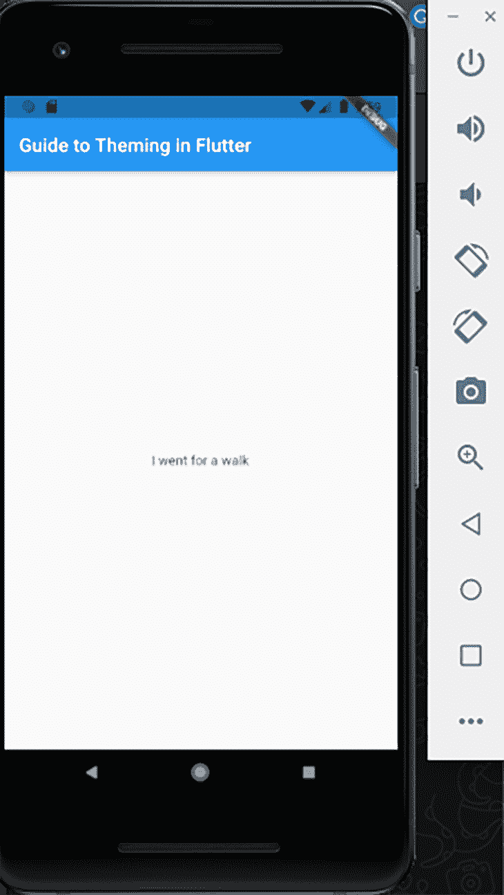
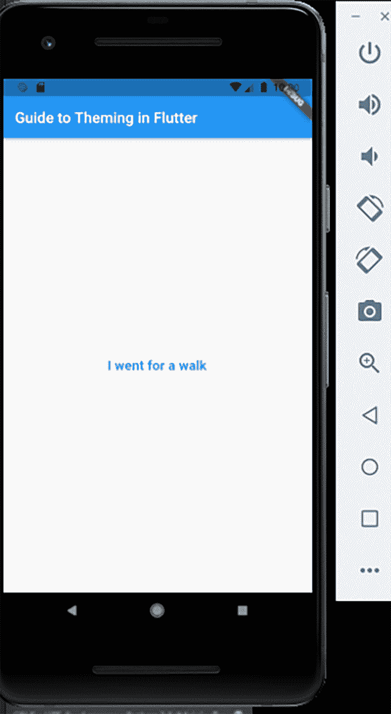
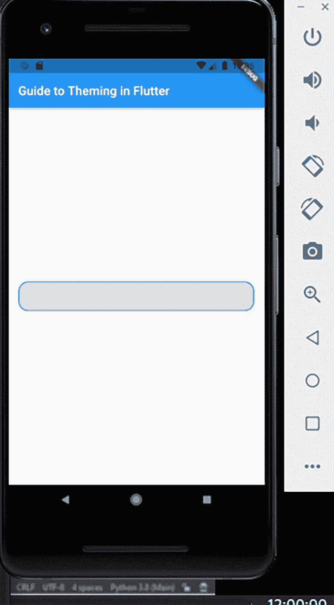
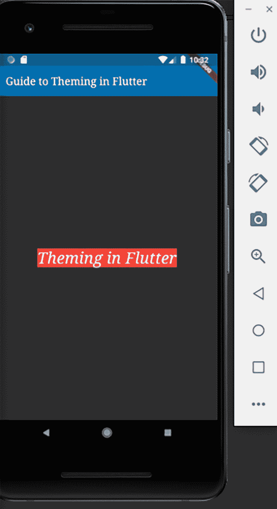
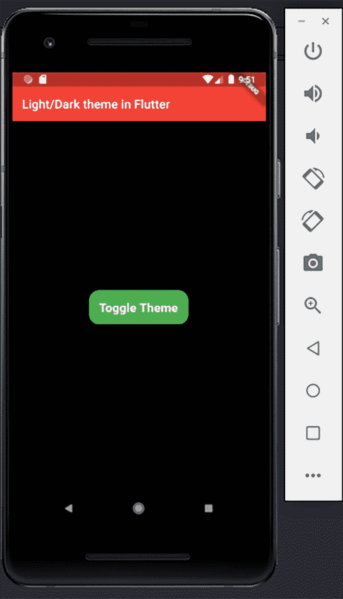
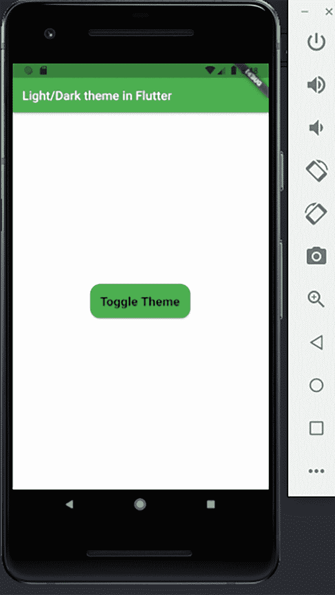

# Flutter 中的应用主题化指南

> 原文：<https://blog.logrocket.com/theming-your-app-flutter-guide/>

## 什么是主题化？

主题化是使应用程序看起来吸引人、有吸引力并符合你的品味或需求的所有东西的总称。这是让你的应用程序变得漂亮的原因，随着个人喜好的不同，这背后的细节会因人而异。

像文本样式、文本颜色、图标样式等因素都会影响应用程序的主题。让一个应用程序吸引用户的一切都来自于主题化，磨练你对 Flutter 主题的知识将会让你成为一个更加熟练的 Flutter 开发者。

### 在 Flutter 中，你可以用什么来给一个应用设置主题？

Flutter 的`[MaterialApp](https://api.flutter.dev/flutter/material/MaterialApp-class.html)`带有默认的浅蓝色主题。当你启动默认的计数器应用程序时，你会看到它:它是普通的蓝色和白色。

然而，正如我们之前强调的，应用程序主题化有很多方法，从改变简单文本和图标样式的外观，到使用样式化小部件，如[容器小部件](https://api.flutter.dev/flutter/widgets/Container-class.html)、`[TextButton](https://api.flutter.dev/flutter/material/TextButton-class.html)`或`[RawMaterialButton](https://api.flutter.dev/flutter/material/RawMaterialButton-class.html)`。在应用程序中，亮暗主题模式之间也有复杂的切换。

所有这些都有助于应用程序的整体主题。这篇文章将会涉及到为一个 Flutter 应用程序设置主题的每一种方法。

## 主题化小部件和容器

在这一节中，我们将讨论如何通过样式化文本小部件和容器小部件来样式化 Flutter 中的小部件和容器。Flutter 提供了一个`TextStyle`类，它包含几个可以修改文本小部件外观的属性。

```
Text("I went for a walk")

```



Flutter 使用默认的颜色、大小、结构和粗细在屏幕上呈现文本。我们现在可以添加一些样式来增强应用程序的外观和感觉。我们将通过调整`TextStyle`类提供的属性来做到这一点。

```
 Text("I went for a walk", 
 style: TextStyle(
   color: Colors.blue, 
   weight: FontWeight.bold, 
   fontSize: 18,
   ),
  ),

```



通过调整`TextStyle`类的属性，我们改变了文本的外观，并增加了应用程序整体主题的趣味性。

容器小部件的样式化过程类似于我们为`TextStyle`所做的；然而，我们在这里通过调整`BoxDecoration`类的属性来实现样式，然后将这些属性传递给容器小部件的装饰参数。

```
Container(
  height: 48,
  margin: const EdgeInsets.all(16),
  decoration: BoxDecoration(
  color: Colors.grey[300],
  borderRadius: const BorderRadius.all(
   Radius.circular(16),
  ),
  border: Border.all(
   color: Colors.blue,
   width: 2,
  ),
  ),
 );

```



上面，我们给容器分配了一种颜色(灰色)，并通过调整`borderColor`属性给它一个蓝色边框。这给了我们一条围绕容器本身的宽度为 2px 的蓝线。

我们在上面的代码块中做的另一个样式选择是改变边框半径；我们给它一个 16px 的圆形边界半径。这为容器提供了极好的圆形边缘，而不是默认容器的平边缘。

最后，我们给了整个容器 16px 的边距，这样在容器的每一边都留下了 16px 的空间。

## 使用材料`ThemeData`类

我们之前讨论的两个场景——`TextStyle`类和容器小部件——处理特定屏幕的单个组件的样式，不影响其他`TextStyle`类或容器小部件的样式。

现在，假设我们希望在整个应用程序中共享一个特定的主题，包括颜色、亮度、粗细、图标样式和文本样式。我们可以使用`ThemeData`类来实现这一点，它为我们提供了许多特性来满足我们的口味。

考虑下面的代码块。

```
MaterialApp(
 title: 'Guide to Theming in Flutter',
 theme: ThemeData(
 brightness: Brightness.dark,
 primaryColor: Colors.lightBlue[800],
 accentColor: Colors.cyan[600],
 fontFamily: 'Georgia',
 textTheme: TextTheme(
  headline1: TextStyle(fontSize: 50, fontWeight: FontWeight.bold),
  headline6: TextStyle(fontSize: 30.0, fontStyle: FontStyle.italic),
  bodyText2: TextStyle(fontSize: 18.0, fontFamily: 'Hind'),
 ),
 ),
 home: MyHomePage(),
);

```

`ThemeData`类提供了一些属性，我们可以通过修改来调整应用程序的主题。`brightness`属性处理主题的整体亮度，并影响应用程序中的文本颜色，因为文本颜色通过`Brightness.light`变为黑色，通过`Brightness.dark`变为白色。

`primaryColor`属性影响应用程序重要部分的背景颜色，包括工具栏、标签栏和应用程序栏。

`accentColor`属性影响小部件的前景色，也指辅助色。字体系列以及`textTheme`的不同类别都被修改了，如上面的代码块所示。

默认情况下，Flutter 为每个`headline`和`bodyText`类别赋值，但是每个类别都可以调整，以适应我们的设计口味。

要在应用程序的任何部分具体使用任何声明的主题，我们只需调用我们想要的主题，如下所示。

```
Container(
 color: Theme.of(context).accentColor,
 child: Text(
 'Theming in Flutter',
 style: Theme.of(context).textTheme.headline6,
 ),
),

```



上面，我们用声明的`headline6`值来设置文本的样式，这意味着字体大小将是 36，字体样式将是斜体。这种样式化的方法非常方便，并且减少了在应用程序中重复的代码行数，如果我们要单独地对它们进行样式化的话。

## 亮暗主题模式

我们要讨论的最后一种主题是 Flutter 应用程序的明暗主题模式的实现。黑暗主题模式通常用于节省电池寿命的能量和减少在弱光物理环境中对眼睛的压力的应用中。

在本教程中，我们将利用 [adaptive_theme 包](https://pub.dev/packages/adaptive_theme)来促进这一点。这个包提供了许多优秀的开箱即用的功能，以确保不同主题模式的顺利设置和过渡。它还会在每次应用程序重新启动时获取最新的主题。

除了 adaptive_theme，我们还将利用 [Riverpod 包](https://pub.dev/packages/flutter_riverpod)。

首先将下面的代码添加到`pubspec.yaml`文件中的依赖关系块下。

```
dependencies:
 adaptive_theme: ^2.2.0
 flutter_riverpod: ^0.14.0+3

```

在终端中运行`flutter pub get`命令。该命令将下载这两个包，并准备好在您的代码库中使用。

```
flutter pub get

```

转到`main.dart`文件，导入 adaptive_theme 和 [Riverpod 包](https://blog.logrocket.com/provider-vs-riverpod-comparing-state-managers-in-flutter/)。

```
import 'package:adaptive_theme/adaptive_theme.dart';
import 'package:flutter/material.dart';
import 'package:flutter_riverpod/flutter_riverpod.dart';

```

创建一个名为`savedThemeMode`的变量，在重启应用程序时访问用户最近使用的模式。让主块异步，等待 adaptive_theme 包提供的`getThemeMode`函数。

接下来要做的是将整个应用程序包装在一个`ProviderScope`类中，以访问应用程序中使用的提供者。

```
Future<void> main() async {
 WidgetsFlutterBinding.ensureInitialized();
 final savedThemeMode = await AdaptiveTheme.getThemeMode();
 runApp(ProviderScope(child: MyApp(savedThemeMode: savedThemeMode)));
}

```

创建一个变量来接收来自上面主程序块的`savedThemeMode`。用 adaptive_theme 类包装整个`MaterialApp`,这样我们就可以访问它的属性，这样我们就可以为应用程序定制亮暗主题模式。

```
class MyApp extends StatelessWidget {
 final AdaptiveThemeMode? savedThemeMode;
 // ignore: use_key_in_widget_constructors
 const MyApp({this.savedThemeMode});
 @override
 Widget build(BuildContext context) {
 return AdaptiveTheme(
  light: ThemeData(
  brightness: Brightness.light,
  primaryColor: Colors.green,
  scaffoldBackgroundColor: Colors.white,
  ),
  dark: ThemeData(
  brightness: Brightness.dark,
  primaryColor: Colors.red,
  scaffoldBackgroundColor: Colors.black,
  iconTheme: const IconThemeData(
   color: Colors.black,
  ),
  ),

```

我们将`ThemeData`传递给`adaptive_theme`类的`light`属性，我们将所有想要定制的变量放入其中。然后我们定制`brightness`、`primaryColor`和`scaffoldBackgroundColor`。对`dark`属性做同样的事情。我们修改了`ThemeData`类中的属性，并将它们传递给 adaptive_theme 提供的属性。

接下来是我们在`savedThemeMode`中传递的初始属性，如果`peradventure`为 null(例如，如果 app 是新安装的)，则默认为 light 主题模式。最后，我们将`MaterialApp`类传递给`builder`函数，并将声明的主题传递给它的属性。

```
 initial: savedThemeMode ?? AdaptiveThemeMode.light,
  builder: (theme, dark) {
  return MaterialApp(
  title: 'Article Light/Dark Theme',
  theme: theme,
  darkTheme: dark,
  home: const HomePage(),
  );
  },
 );
 }
}

```

为了在明暗主题模式之间切换，我们将使用一个`RawMaterialButton`并将 adaptive_theme 的`toggleMode`函数传递给它的`onPressed`属性。该按钮允许用户通过点击或轻触按钮在两种模式之间切换。

```
class HomePage extends StatelessWidget {
 const HomePage({Key? key}) : super(key: key);
 @override
 Widget build(BuildContext context) {
 return Scaffold(
  appBar: AppBar(
  title: const Text('Light/Dark theme in Flutter'),
  ),
  body: Column(
  mainAxisAlignment: MainAxisAlignment.center,
  children: [
   Center(
   child: RawMaterialButton(
    child: const Text(
    'Switch Modes',
    style: TextStyle(
     fontSize: 20,
     fontWeight: FontWeight.bold,
    ),
    ),
    onPressed: () {
    AdaptiveTheme.of(context).toggleThemeMode();
    },
    fillColor: Colors.green,
    padding: const EdgeInsets.all(16),
    shape: RoundedRectangleBorder(
    borderRadius: BorderRadius.circular(16),
    ),
   ),
   ),
  ],
  ),
 );
 }
}

```

最后，下面的图片显示了亮暗主题模式，当它们被切换时会出现。





## 结论

自定义各种属性来创建您想要的主题可能会非常令人兴奋，尤其是当它使应用程序与您的设计品味相关联时。根据到目前为止所学的内容，您现在可以设计单个类、容器小部件的样式，甚至为您的应用程序提供自定义的明暗主题模式。

## 使用 [LogRocket](https://lp.logrocket.com/blg/signup) 消除传统错误报告的干扰

[](https://lp.logrocket.com/blg/signup)

[LogRocket](https://lp.logrocket.com/blg/signup) 是一个数字体验分析解决方案，它可以保护您免受数百个假阳性错误警报的影响，只针对几个真正重要的项目。LogRocket 会告诉您应用程序中实际影响用户的最具影响力的 bug 和 UX 问题。

然后，使用具有深层技术遥测的会话重放来确切地查看用户看到了什么以及是什么导致了问题，就像你在他们身后看一样。

LogRocket 自动聚合客户端错误、JS 异常、前端性能指标和用户交互。然后 LogRocket 使用机器学习来告诉你哪些问题正在影响大多数用户，并提供你需要修复它的上下文。

关注重要的 bug—[今天就试试 LogRocket】。](https://lp.logrocket.com/blg/signup-issue-free)