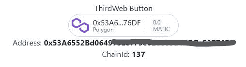
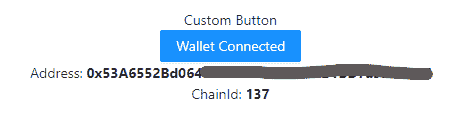

# 第三网络提供商:连接你的 DApp 和钱包

> 原文：<https://blog.logrocket.com/thirdwebprovider-connect-dapp-wallet/>

当开发基于区块链的应用程序时，您必须将应用程序连接到钱包。根据你使用的钱包，你必须仔细阅读文档来找到每个钱包的正确连接代码，这可能是一项令人兴奋和耗时的任务。

[thirdweb 的提供商组件](https://thirdweb.com/)、`ThirdwebProvider`，解决了这个问题，帮你把你的 DApp 和不同的钱包连接起来，像 MetaMask、CoinBase、 [Magic](https://magic.link) 、[。l](https://magic.link) [ink](https://magic.link) ，和[wallet 用很少的代码连接](https://walletconnect.com/) 。在本文中，我们将使用 `ThirdwebProvider` 组件将我们的应用程序与钱包连接起来。我们开始吧！

## 什么是 DApp？

在将我们的 DApp 与钱包连接之前，首先，我们需要实际了解什么是 DApp。代表分散式应用程序的 DApp 使用智能合约在对等(P2P)区块链网络上运行。简而言之，一个应用程序只有在满足以下条件时才能成为分散式应用程序:

*   它使用智能合约来运行其功能
*   它使用区块链网络进行交易

## DApp 是如何制作的？

当你了解了网络开发和区块链网络的基础知识，创建一个 DApp 并不困难。DApp 可以分为三个主要部分，前端，智能合同和区块链网络。

### 前端

就像普通的 web 应用程序一样，您的 DApp 将有一个前端，您可以使用 HTML、CSS、JavaScript 或任何 JavaScript 框架来创建它。这个前端可以直接连接到智能合约，否则，您可以使用后端与智能合约通信。

### 智能合同

智能合同是一种计算机程序，一旦部署就不可修改，并且一旦满足其定义的标准就自动执行。

您的前端将与智能合约进行各种功能的通信。例如，考虑一个 NFT 市场。当您铸造 NFT 时，创建 NFT 的所有函数都存储在智能合约中。智能合同中的功能运行以铸造带有您的地址的 NFT。

### 区块链网络

区块链是记录交易的不可修改的分类账系统。它在节点之间共享，这些节点是参与网络的所有计算机。当您为交易部署智能合约时，您是在区块链上进行的。

有许多不同的区块链网络可用，一些流行的包括以太坊，多边形，索拉纳和雪崩。为了进行交互，智能合约和用户必须位于同一个区块链网络上。加密钱包可用于管理用户帐户，但它们必须连接到 DApp。

让我们用`ThirdwebProvider`把 DApp 和钱包联系起来。

## 什么是 thirdweb？

hirdweb 是一个平台，它提供 SDK、库和模块来加速基于 Web3 的应用程序的开发。Thirdweb 的主要特点是它为智能合约提供模块，包括 NFTs、NFT 市场、令牌、drops、分散投票系统等等。总之，这些功能可以帮助开发人员部署智能合约，而无需编写任何可靠的代码。

`ThirdwebProvider`是 [@3rdweb/react](https://www.npmjs.com/package/@3rdweb/sdk) 库附带的组件之一，帮助应用程序连接不同的钱包。`ThirdwebProvider`包括以下功能:

*   支持多个钱包，如 MetaMask、CoinBase、Magic.link 和 WalletConnect
*   预建和自定义按钮的选项
*   易于定义网络和在网络之间切换

为了了解更多关于`ThirdwebProvider`的信息，我们将创建一个小应用程序来将我们的 DApp 连接到钱包。

## 使用`ThirdwebProvider`

为了在我们的应用程序中使用`ThirdwebProvider`组件，我们需要安装库来为它创建接口:

```
npm install @3rdweb/react @3rdweb/hooks 

```

*   `3rdweb/react`:为我们提供`Thirdwebprovider`组件
*   `3rdweb/hooks`:帮助管理网络并提供`ConnectWallet`按钮组件，我们将在后面添加

## App.js

让我们开始在`App.js`中编写代码。首先，让我们从我们需要的进口开始:

```
import { ThirdwebProvider } from "@3rdweb/react";

```

## 功能成分

我们需要用`ThirdwebProvider`包装我们的应用程序，以便在整个应用程序中使用它的功能。我们还需要包含其他组件，如`ConnectWallet`，否则，从钱包中提取数据将无法在`ThirdwebProvider`组件之外工作:

```
export default function App() {
  return (
    <ThirdwebProvider
      connectors={connectors}
      supportedChainIds={supportedChainIds}
    >
      <childrenComponent />
    </ThirdwebProvider>
  );
}

```

我们已经定义了`ThirdwebProvider`,这样我们就可以让应用程序中的其他组件成为它的子组件。我们有两个道具，`connectors`和`supportedChainIds`，我们可以在同一个`App.js`组件中定义这两个属性:

```
const supportedChainIds = [1, 4, 137];
const connectors = {
  injected: {}
};

```

在`supportedChainIds`中，我们已经定义了应用程序中受支持的链。我们在一个数组中定义不同的 ID。链 ID 是区块链网络的数值。下表包括一些主要的区块链网络和相关的链 ID:

| 名字 | 链子 | 链 ID | 类型 |
| --- | --- | --- | --- |
| Mainnet | 以太币 | 一 | 生产 |
| 罗普斯滕 | 以太币 | 3 | 试验 |
| 林克比 | 以太币 | 四 | 试验 |
| 戈利 | 以太币 | 5 | 试验 |
| 多边形主网 | 马蒂奇 | 137 | 生产 |

在`connectors`中，我们定义了要连接的不同钱包，特别是元掩码的`injected`。你可以定义更多的钱包，比如 CoinBase、Magic Link 和 WalletConnect，用逗号`,`隔开。下表包括不同钱包的代码:

| 钱包 | Code |
| --- | --- |
| MetaMask | 

```
injected: {}
```

 |
| CoinBase | 

```
walletlink: { appName: "thirdweb - demo", url: "https://thirdweb.com", darkMode: false, },
```

 |
| 魔法 | 

```
magic: { apiKey: "pk_...", // Your magic api key chainId: 1, // The chain ID you want to allow on magic }
```

 |
| WalletConnect | 

```
walletconnect: {}
```

 |

所有的加在一起，我们的 `App.js` 文件将看起来像下面的代码:

```
import "./styles.css";
import { ThirdwebProvider } from "@3rdweb/react";
const supportedChainIds = [1, 4, 137];
const connectors = {
  injected: {}
};
export default function App() {
  return (
    <ThirdwebProvider
      connectors={connectors}
      supportedChainIds={supportedChainIds}
    >
      <Children />
    </ThirdwebProvider>
  );
}

```

现在，我们已经准备好创建一个按钮，并从钱包中提取数据，比如地址和提供商。

## 第三网页`ConnectWallet`

现在我们的`App.js`文件已经准备好了，我们只需要添加一个按钮来与钱包进行交互。我们将使用来自 thirdweb 的`ConnectWallet`按钮组件:

```
import { ConnectWallet } from "@3rdweb/react";
import { useWeb3 } from "@3rdweb/hooks";

```

*   `ConnectWallet`:连接钱包的按钮
*   `useWeb3:`用于从钱包中提取数据，如地址、`chainId`、提供商等。

## 功能成分

现在，我们只需要将`ConnectWallet`组件添加到按钮的返回中。我添加了几行代码来显示钱包的地址和网络的`chainId`:

```
  return (
    <div className="container">
      <h1>ThirdWeb Button</h1>
      <ConnectWallet />
      <h2>
        Address:<b> {address}</b>
      </h2>
      <h2>
        ChainId:<b> {chainId}</b>
      </h2>
    </div>
  );
};

```

在上面的代码中，我们使用了地址和`chainId`，但是我们还没有定义它。让我们用`useWeb3`来定义它们:

```
  const { address, chainId, provider } = useWeb3();

```

总之，该组件将类似于以下代码:

```
import { ConnectWallet } from "@3rdweb/react";
import { useWeb3 } from "@3rdweb/hooks";
const ThirdwebConnect = () => {
  const { address, chainId, provider } = useWeb3();
  return (
    <div className="container">
      <h1>ThirdWeb Button</h1>
      <ConnectWallet />
      <h2>
        Address:<b> {address}</b>
      </h2>
      <h2>
        ChainId:<b> {chainId}</b>
      </h2>
    </div>
  );
};
export default ThirdwebConnect;

```

现在，我们已经准备好使用按钮将我们的应用程序连接到我们的钱包。点击按钮并登录 MetaMask 钱包。连接后，您将看到钱包的详细信息:



## 自定义连接按钮

让我们用`useWeb3`创建一个定制按钮组件:

```
import { useWeb3 } from "@3rdweb/hooks";

```

除了提取数据，`useWeb3`还将为我们提供`connectWallet`来将应用程序连接到钱包。

## 功能成分

我们定义了两个按钮，一个用于连接钱包，一个用于断开钱包。我们通过条件渲染来渲染按钮。我们使用元掩码，所以我们将`connectWallet`定义为`injected`，但是您也可以使用其他钱包:

```
return (
    <div className="container">
      <h1>Custom Button</h1>
      {address && (
        <Button type="primary" onClick={disconnectWallet} className="primary">
          Wallet Connected
        </Button>
      )}
      {!address && (
        <Button type="primary" onClick={() => connectWallet("injected")}>
          Connect Wallet
        </Button>
      )}
      <h2>
        Address:<b> {address}</b>
      </h2>
      <h2>
        ChainId:<b> {chainId}</b>
      </h2>
    </div>
  );

```

对于`connectWallet`和`disconnectWallet`，我们使用了`useWeb3`:

```
  const {
    address,
    chainId,
    provider,
    disconnectWallet,
    connectWallet
  } = useWeb3();

```

自定义按钮组件将如下所示:

```
import { useWeb3 } from "@3rdweb/hooks";
import { Button } from "antd";
const CustomConnect = () => {
  const {
    address,
    chainId,
    provider,
    disconnectWallet,
    connectWallet
  } = useWeb3();
  return (
    <div className="container">
      <h1>Custom Button</h1>
      {address && (
        <Button type="primary" onClick={disconnectWallet} className="primary">
          Wallet Connected
        </Button>
      )}
      {!address && (
        <Button type="primary" onClick={() => connectWallet("injected")}>
          Connect Wallet
        </Button>
      )}
      <h2>
        Address:<b> {address}</b>
      </h2>
      <h2>
        ChainId:<b> {chainId}</b>
      </h2>
    </div>
  );
};
export default CustomConnect;

```

## 自定义按钮输出

我们的自定义按钮的工作方式类似于第三个 web 按钮:



您可以在 CodeSandbox 上查看正在运行的项目:

结论

## 在本文中，我们学习了 thirdweb、DApps、制作 DApp 的基础知识以及将 DApp 连接到钱包。这些概念将帮助你更好地理解 Web3。希望这篇文章有助于提高你对 DApps 的理解。您应该能够按照本文中的步骤将您的 DApp 连接到钱包。编码快乐！

加入像 Bitso 和 Coinsquare 这样的组织，他们使用 LogRocket 主动监控他们的 Web3 应用

## 影响用户在您的应用中激活和交易的能力的客户端问题会极大地影响您的底线。如果您对监控 UX 问题、自动显示 JavaScript 错误、跟踪缓慢的网络请求和组件加载时间感兴趣，

.

[try LogRocket](https://lp.logrocket.com/blg/web3-signup)

LogRocket 就像是网络和移动应用的 DVR，记录你的网络应用或网站上发生的一切。您可以汇总和报告关键的前端性能指标，重放用户会话和应用程序状态，记录网络请求，并自动显示所有错误，而不是猜测问题发生的原因。

[](https://lp.logrocket.com/blg/web3-signup)[https://logrocket.com/signup/](https://lp.logrocket.com/blg/web3-signup)

现代化您调试 web 和移动应用的方式— [开始免费监控](https://lp.logrocket.com/blg/web3-signup)。

Modernize how you debug web and mobile apps — [Start monitoring for free](https://lp.logrocket.com/blg/web3-signup).