# Three.js:几何和材料- LogRocket 博客

> 原文：<https://blog.logrocket.com/three-js-geometries-and-materials/>

博彩业是最成功的行业之一。仅在 2020 年，博彩业预计将产生 1590 亿美元的收入。

在每年生产的数百万游戏中，有一些非凡的基于网络的游戏。浏览器每天都变得越来越复杂和强大，这使得为网络浏览器创建令人惊叹的逼真的 3D 和 2D 游戏变得越来越可能。

在本教程中，我们将演示如何在 Three.js 中创建几何图形和用于设计几何图形的材质。

## Three.js 是什么？

Three.js 是一个强大的游戏库，用于创建基于网页的游戏。它是一个跨浏览器的 JavaScript 库和 API，旨在帮助您使用 WebGL 在浏览器中构建和显示 3D 动画——从简单的 3D 图案到逼真的实时场景。

Three.js 使您能够将纹理和材质应用于对象。它还提供了各种光源来照亮场景，高级后处理效果，自定义着色器等。您可以从 3D 建模软件加载对象，以便在游戏中使用。

为了更深入地帮助你开始，看看这个[给游戏开发者的 Three.js 初学者指南](https://blog.logrocket.com/intro-to-three-js-for-game-developers/)。

## 安装 Three.js

Three.js 非常容易上手。首先，从`[https://mrdoob.github.com/three.js/build/three.min.js](https://mrdoob.github.com/three.js/build/three.min.js)`获取缩小的 Three.js 文件。然后，将其添加到`script`标签中的`src`属性中:

```
<script src="https://mrdoob.github.com/three.js/build/three.min.js"></script>

```

至此，Three.js 已初始化并准备就绪。

## Three.js 中的几何图形

[几何图形](https://threejs.org/docs/#api/en/core/Geometry)用于在 Three.js 中创建和定义图形。几何图形是`Three.Geometry`类的一个实例。

形状由面和顶点定义。顶点定义了点在空间中的位置。面代表形状的表面。

例如，一个立方体有六个顶点(边)和六个面。要在网格上画一个立方体，我们必须先画出六个顶点的位置，然后用一条线把它们连接起来。这将创建立方体的表面并定义形状/几何图形。您可以创建各种其他形状—多边形、圆柱体、金字塔等。—用同样的方法。

Three.js 中的面是`Three.Face3`类的一个实例，顶点/表面是`Three.Vector3`类的一个实例。我们可以用这些类创建几何图形。Three.js 有一些内置的基本形状，包括立方体、球体、多面体、圆环和圆环结。

### `CubeGeometry`

要在 Three.js 中创建一个立方体，请使用`Three.CubeGeometry`。

```
>var cubeGeometry = new THREE.CubeGeometry(20, 20, 20);

```

第一个参数是立方体的宽度。第二个和第三个参数分别是立方体的高度和深度。在这里，我们给了它们相同的值:`20`。

结果应该是这样的:

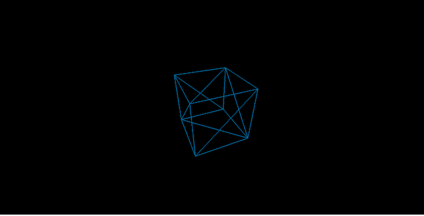

`CubeGeometry`有另外三个论点:

```
>var cubeGeometry = new THREE.CubeGeometry(20, 20, 20, 2, 2, 2);

```

立方体的各个部分是宽度、高度和深度。这些线段将立方体的表面分成较小的边。

上面将宽度、高度和深度段设置为`2`，因此它们将被分成两边。

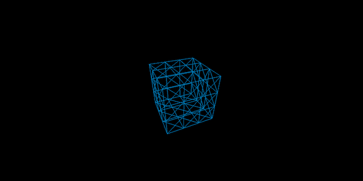

值`3`将把表面分割成三个较小的边。

```
>var cubeGeometry = new THREE.CubeGeometry(20, 20, 20, 3, 3, 3);
```


如果你不指定参数，他们有一个默认值`1`，所以表面有一边。

### `SphereGeometry`

在 Three.js 中，`Three.SphereGeometry`创建一个球体。

```
>var sphereGeometry = new Three.SphereGeometry(20)

```

上面将创建一个半径为`20`的球体。

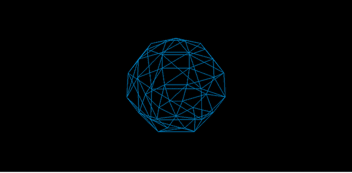

`SphereGeometry`还有两个参数:

```
>var sphereGeometry = new Three.SphereGeometry(20, 8, 6)

```

这是球体应该分成的水平和垂直分段的数量。`8`参数代表水平分段。球体将被分成八段，其垂直轴将被分成五段。

### `CylinderGeometry`

要在 Three.js 中创建一个圆柱体，使用`Three.CylinderGeometry`。

```
>var cylinderGeometry = new THREE.CylinderGeometry(15, 15, 30)

```

第一个参数是圆柱体顶部的半径；第二个是底部的半径。第三个参数表示圆柱体的高度。

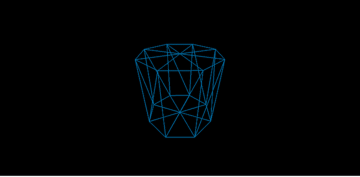

我们可以设置曲面上连接顶面和底面的边的数量。这被称为`radiusSegments`，它作为第四个参数进入。默认值为`8`。

```
>var cylinderGeometry = new THREE.CylinderGeometry(15, 15, 30, 9)

```

这将把顶面和底面分成九段:

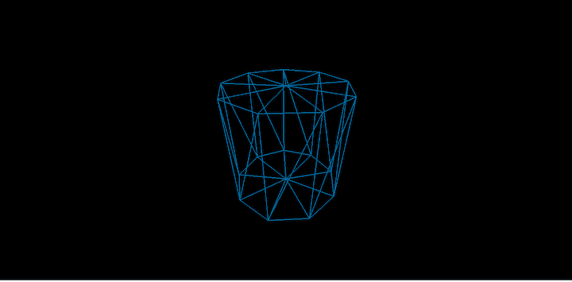

我们也可以设置曲面周围面的环数。这叫`heightSegments`。它作为第五个参数，默认值为`1`。

```
>var cylinderGeometry = new THREE.CylinderGeometry(15, 15, 30, 9, 2)

```

这将把曲面的每个面分成两段:

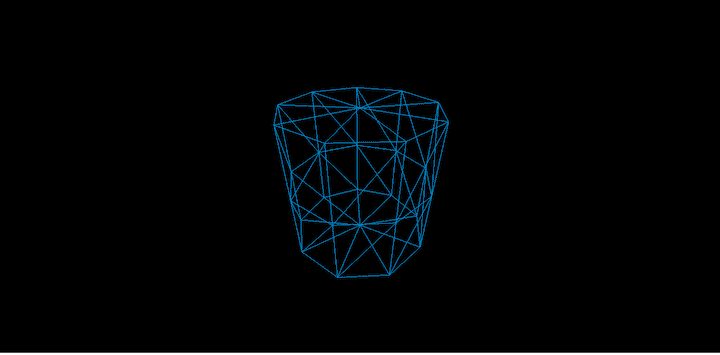

您可以确定圆柱体的末端是开放的还是封闭的。这是一个布尔值:`true`使它打开，而`false`使它关闭。这作为第六个参数。默认值为`false`。

```
>var cylinderGeometry = new THREE.CylinderGeometry(15, 15, 30, 9, 2, true)

```

这将渲染一个两端开放的圆柱体。

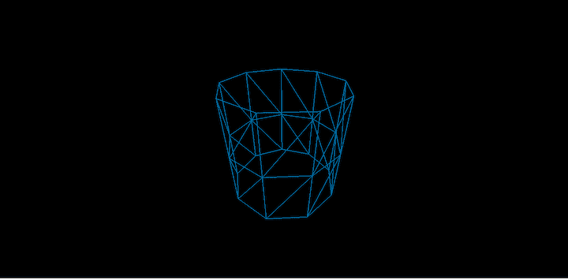

### `TorusGeometry`

`TorusGeometry`生成管状形状。`Three.TorusGeometry`类是我们用来生成形状的。

```
>var torusGeo = new THREE.TorusGeometry(10, 3, 16, 100)

var meshBasicMaterial = new THREE.MeshBasicMaterial({
    color: 0x0095DD,
    wireframe: true,
    wireframeLinewidth: 2
});

var torusMesh = new THREE.Mesh(torusGeo, meshBasicMaterial);

scene.add(torusMesh)

```

以上将生成一个圆环形状:

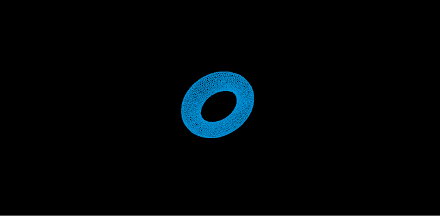

```
new THREE.TorusGeometry(10, 3, 16, 100)
```

第一个参数设置从圆环中心到管状体中心的圆环半径。其默认值为`1`。第二个是管的半径，默认值是`0.4`。

第三个参数代表径向线段，默认设置为`8`。第四个默认将管状分段设置为`6`。

我们已经看到了基本的三维几何。我们也可以用三个 js 创建和渲染 2D 几何图形。

## Three.js 中的 2D 几何

除了 3D 几何图形，您还可以在 Three.js 中创建引人入胜的 2D 形状，如平面、圆形和环形。

### `PlaneGeometry`

要在 Three.js 中创建一个平面，我们将使用`Three.PlaneGeomerty`。

```
>var planeGeo = new THREE.PlaneGeometry(20, 20)

```

第一个参数是平面的宽度。第二个代表高度。

以上将创建一个 20 个单位宽和高的 2D 平面。

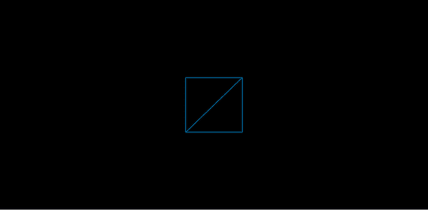


`PlaneGeometry`‘s third and fourth arguments specify the number of segments the width and height of the plane, respectively, can have.

```
>var planeGeo = new THREE.PlaneGeometry(20, 20, 3, 3)

```

这将把平面分成三行三列。

### 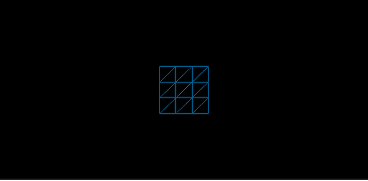

### `CircleGeometry`

要在 Three.js 中创建一个圆，可以使用`THREE.CircleGeometry`类。

```
>var circleGeo = new THREE.CircleGeometry(20)

```

上面创建了一个半径为 20 个单位的圆形。

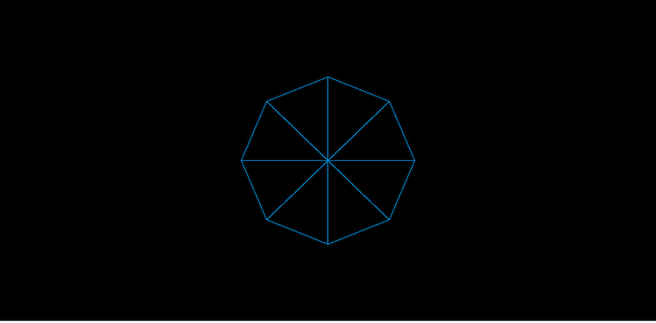

如你所见，这个圆被细分为八个边。`THREE.CircleGeometry`构造函数的第二个参数允许我们设置要划分的圆的边数。默认值为`8`。

```
>var circleGeo = new THREE.CircleGeometry(20, 10)

```

上面创建了一个分为 10 部分的圆。

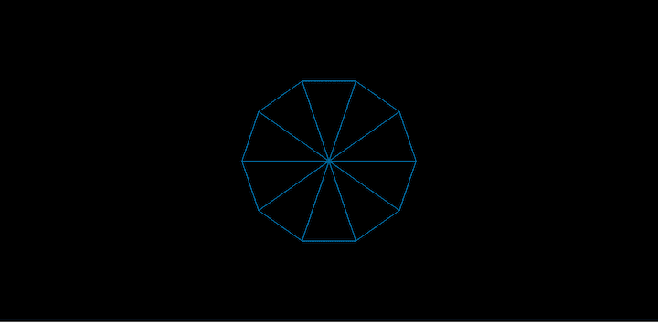

### `RingGeometry`

`RingGeometry`创建一个中间有洞的 2D 环形。`THREE.RingGeometry`构造函数创建环形。

```
>var ringGeo = new THREE.RingGeometry(20, 20)

```

上面的命令创建了一个内径和外径各为 20 个单位的环。

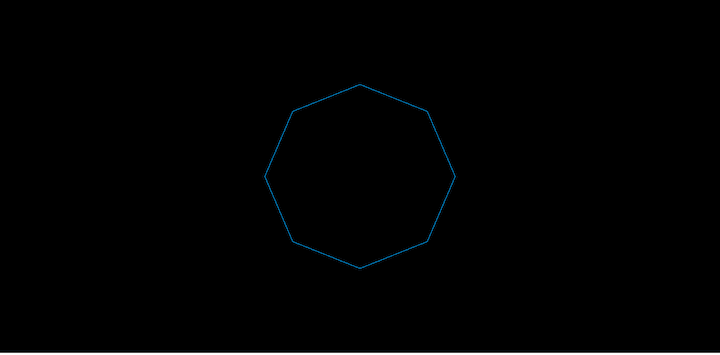

我们可以在环的形状中设置径向段和环段。

```
>var ringGeo = new THREE.RingGeometry(20,
    20, 9, 10)

```

第三个参数是环将被分成的径向段的数量。第四个设置环将被分成的环段的数量。

## 在 Three.js 中呈现文本

正如我们创建 3D 和 2D 几何图形一样，我们也可以在 Three.js 中呈现文本。Three.js 中的字体`.js`文件必须包含在页面中，Three.js 才能呈现文本。

例如，以下代码将 Helvetica 字体添加到页面中:

```
<script src="https://raw.github.com/mrdoob/three.js/master/examples/fonts/helvetiker_bold.typeface.js"></script>
<script src="https://raw.github.com/mrdoob/three.js/master/examples/fonts/helvetiker_regular.typeface.js"></script>

```

为了在 Three.js 中创建和呈现文本，我们将使用`THREE.TextGeometry`。

```
>var myNameGeometry = new THREE.TextGeometry("Nnamdi Chidume", {
    size: 30,
    height: 20
    font: "Tahoma",
});

```

第一个参数是我们想要呈现的文本。在这里，我设置了自己的名字:“纳姆迪·希都姆。”

第二个参数是一个带有我们在文本上设置的选项的对象。这里，我们将文本的大小和高度分别设置为`30`和`20`。我们还将渲染字体设置为 Tahoma。

我们可以设置几个附加选项，包括:

*   `weight`，设置字体粗细
*   `style`，决定文本的样式——正常、粗体或斜体
*   `bevelEnabled`，决定文字是否有钝边或锐边；其值可以是`true`或`false`

## Three.js 中的材料

[Materials](https://threejs.org/docs/#api/en/materials/Material) 管理 Three.js 中对象的纹理和颜色。一个材质覆盖一个对象、颜色或表面上的纹理。

打个比方，材料就像我们穿的衣服。无论你起床后是选择穿上马球衫、牛仔裤、西装、裙子、衬衫还是传统服饰等等。重点是给你正常的外表增加一些活力。材料就像是 Three.js 中你的对象的时髦衣服。

Three.js 提供了大量的资料，包括:

*   网状基础材料
*   网状材料
*   MeshLambertMaterial
*   网状正常材料
*   网格深度材料
*   网格面材料

以上都是`MeshMaterial`的子类。

### `MeshBasicMaterial`

`MeshBasicMaterial`用于显示纯色或线框。

```
>var basicMaterial = new THREE.MeshBasicMaterial({
    color: 0x0095DD
});

```

上面显示了蓝色的纯色。

```
>var meshBasicMaterial = new THREE.MeshBasicMaterial({
    color: 0x0095DD,
    wireframe: true,
    wireframeLinewidth: 2
});

```

这会显示一个线宽为`2`的线框。

有时很难区分两个相邻的、相同颜色的无光表面。例如，这是一个带有实心显示屏的球体:

```
>var sphGeo = new THREE.SphereGeometry(20, 8, 6)
var basicMaterial = new THREE.MeshBasicMaterial({
    color: 0x0095DD
});

var sphMesh = new THREE.Mesh(sphGeo, meshBasicMaterial);

```

很难看到球体的实心外观；虽然它看起来像 2D，但它应该是 3D 的。

基本材质不受光照影响。

### `MeshPhongMaterial`

Phong 材质看起来比基本材质更有光泽。`PhongMaterial`受场景中光线的影响。没有灯光，Phong 材质的花边物体会呈现黑色。

```
>var sphGeo = new THREE.SphereGeometry(20, 8, 6)
var phongMaterial = new THREE.MeshPhongMaterial({
    color: 0x0095DD
});

```

什么都不会显示，到处都是黑的。这是因为场景中没有灯光。

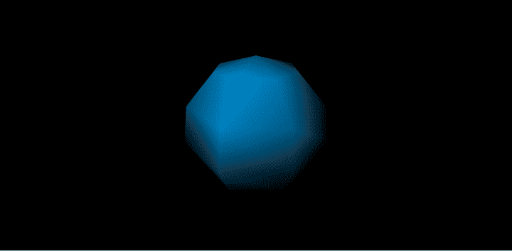

```
>var sphGeo = new THREE.SphereGeometry(20, 8, 6)

var phongMaterial = new THREE.MeshPhongMaterial({
    color: 0x0095DD
});
var sphMesh = new THREE.Mesh(sphGeo, phongMaterial);

var light = new THREE.PointLight(0xFFFFFF);
light.position.set(-10, 15, 50);
scene.add(light);

```

这里，我们给场景添加了灯光，并将其指向球体对象。带有 Phong 材质的球体将可见。

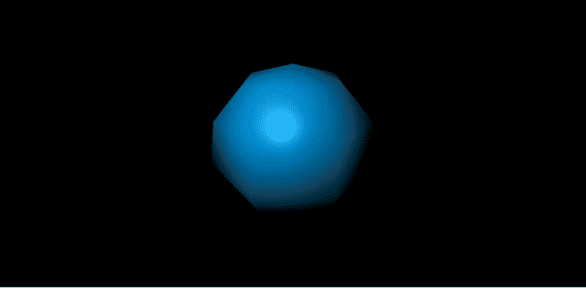

### `MeshLambertMaterial`

Lambert 材质类似于 Phong 材质，但没有 Phong 那么光滑。如果没有光照，具有 Lambert 材质的对象会显示为黑色。

```
>var sphGeo = new THREE.SphereGeometry(20, 8, 6)

var lambertMaterial = new THREE.MeshLambertMaterial({
    color: 0x0095DD
});

var sphMesh = new THREE.Mesh(sphGeo, lambertMaterial);

var light = new THREE.PointLight(0xFFFFFF);
light.position.set(-10, 15, 50);
scene.add(light);

```

带有 Lambert 材质的球体将会出现，但是没有我们在上一节看到的 Phong 材质那么亮。


### `MeshNormalMaterial`

这种材料对于区分物体的表面或物体的形状非常有用，尤其是对于具有难以区分的纯色、无光表面的物体。

```
>var sphGeo = new THREE.SphereGeometry(20, 8, 6)
var basicMaterial = new THREE.MeshBasicMaterial({
    color: 0x0095DD
});

var sphMesh = new THREE.Mesh(sphGeo, meshBasicMaterial);

```

将很难看到球体表面的形状。如果我们把材质换成普通材质，表面就可以分辨了。

```
>var sphGeo = new THREE.SphereGeometry(20, 8, 6)
var basicMaterial = new THREE.MeshNormalMaterial({
    color: 0x0095DD
});

var sphMesh = new THREE.Mesh(sphGeo, meshBasicMaterial);

```

`MeshNormalMaterial`使用面的法向量的 x/y/z 值的大小来计算和设置显示颜色的红/绿/蓝值。

这种普通材料所产生的颜色变化使我们能够看到一个未被照亮的同色物体的形状。

### `MeshDepthMaterial`

用灰色阴影渲染对象。它的亮度取决于它与相机的距离。

```
>var sphGeo = new THREE.SphereGeometry(20, 8, 6)
var depthMaterial = new THREE.MeshDepthMaterial();

var sphMesh = new THREE.Mesh(sphGeo, depthMaterial);
```

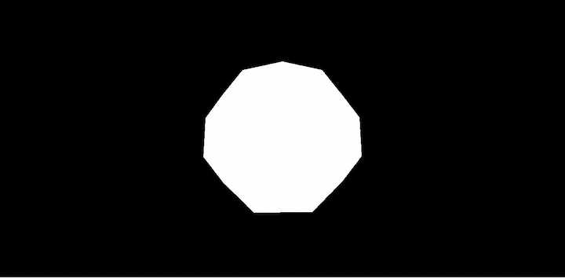

## 结论

我们在这篇文章中讨论了很多，包括材料和几何图形，如何创建三维物体，如球体和圆柱体等，如何创建 2D 物体，如环和平面，以及如何创建文本。我们还学习了如何构建改变形状纹理和颜色的材料。

## 通过理解上下文，更容易地调试 JavaScript 错误

调试代码总是一项单调乏味的任务。但是你越了解自己的错误，就越容易改正。

LogRocket 让你以新的独特的方式理解这些错误。我们的前端监控解决方案跟踪用户与您的 JavaScript 前端的互动，让您能够准确找出导致错误的用户行为。

[](https://lp.logrocket.com/blg/javascript-signup)

LogRocket 记录控制台日志、页面加载时间、堆栈跟踪、慢速网络请求/响应(带有标题+正文)、浏览器元数据和自定义日志。理解您的 JavaScript 代码的影响从来没有这么简单过！

[Try it for free](https://lp.logrocket.com/blg/javascript-signup)

.