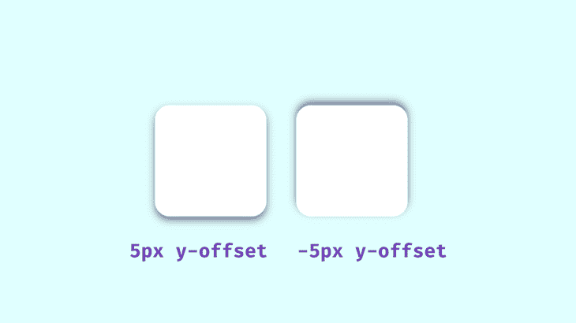
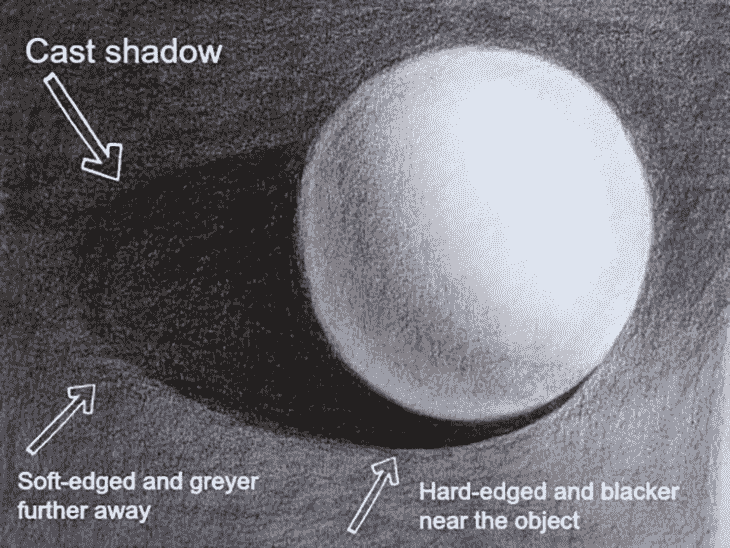
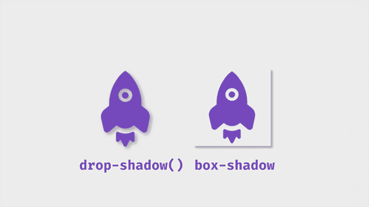
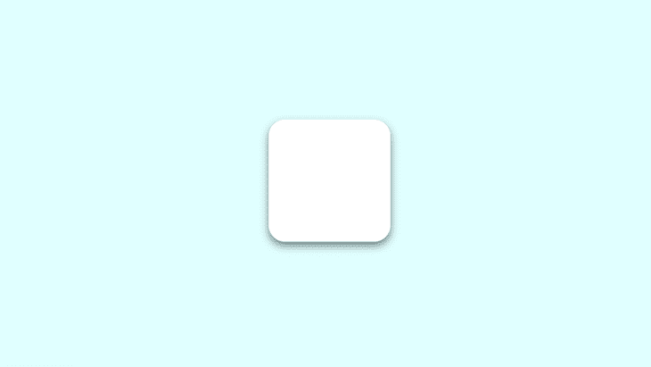
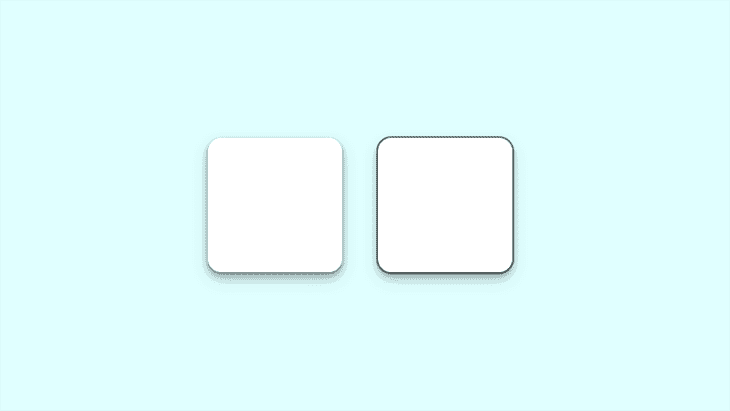
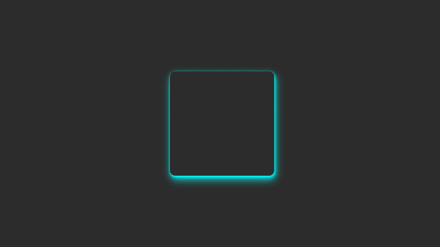
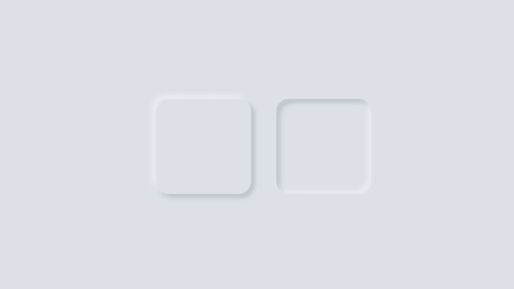
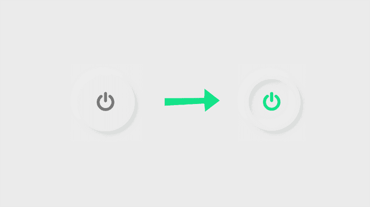
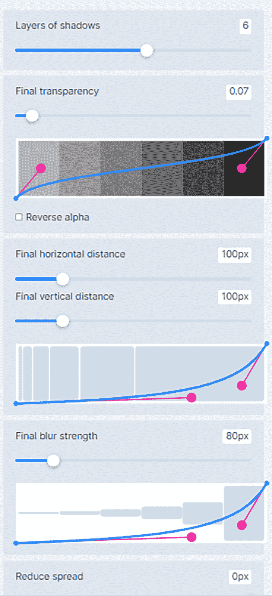

# 3 种风格的 CSS 盒子-阴影效果-日志火箭博客

> 原文：<https://blog.logrocket.com/three-ways-style-css-box-shadow-effects/>

如今，一个网站仅仅做好自己的工作是不够的——它必须带领用户踏上一段旅程，一段色彩、字体、色调等一切都令人赏心悦目的旅程。网站必须看起来和感觉起来真实，阴影起了很大的作用。

在这篇文章中，我们将看看`box-shadow` CSS 属性，以及如何用三种不同的方式来设计它:

1.  [分层阴影](#creating-layered-shadows-css-box-shadow)
2.  [霓虹阴影](#creating-neon-shadows-css-box-shadow)
3.  [异形阴影](#creating-neumorphic-shadows-css-box-shadow)

我们还将介绍:

这是面向具备 HTML 和 CSS 工作知识的前端开发人员的。您还应该熟悉`box-shadow`属性。

## 什么是`box-shadow`属性？

属性允许你在网页上的元素周围添加阴影。它可以告诉我们一个元素，比如一个按钮，一个导航项，或者一个文本卡片，是否是交互的。

我们的眼睛习惯于看到阴影。它们给出了一个物体大小和深度的概念，而`box-shadow`将这种真实感带入了我们的在线体验。如果设计得当，它可以提高网页的美观度。

让我们看看一个典型的`box-shadow`是如何在 CSS 中声明的:

```
box-shadow: 0px 5px 10px 0px rgba(0, 0, 0, 0.5)

```

前四个值是:

1.  `x-offset`，代表水平阴影位置
2.  `y-offset`，代表阴影的垂直位置
3.  模糊半径，影响阴影的锐度；较高的值意味着阴影较浅，反之亦然
4.  第四个值定义了价差

除了模糊半径，所有这些都可以是负值。例如，上面的代码片段将把`box-shadow`放在元素的底部，但是如果你像下面这样添加负值，阴影将会在顶部:

```
box-shadow: 0px -5px 10px 0px rgba(0, 0, 0, 0.5)

```



在`0px`设置的扩散值将使阴影与盒子大小相同；正值将增加其大小，负值将缩小其大小。

### 使阴影感觉真实

下一个值是颜色。我们将使用`rgba()`颜色，因为它们的 alpha 值。这样，我们可以指定不透明度，这是设计真实阴影时要考虑的一个重要方面。光线充足的空间中的阴影不是黑色或完全不透明的，您可以看到阴影投射区域的颜色。

当设计`box-shadow`属性时，记住透明阴影是最好的，因为它们在多色背景下看起来很棒。环顾四周，观察阴影与其光源的关系；在使用 CSS 进行样式设计时，您需要记住这一点。



Source: [How to Draw Journey](http://www.howtodrawjourney.com/ombres-et-lumiere.html)

最靠近对象的区域阴影最暗，然后逐渐向外扩散和模糊。不透明或完全黑色的阴影会分散注意力，难看，并意味着完全阻挡光线，这不是我们所追求的。

### 避开`dropshadow()`滤镜

这是一个在图像周围添加投影的滤镜。它和`box-shadow`不一样，在给图像添加阴影时需要注意这一点。

下面的代码片段显示了这些过滤器之间的区别。

```
box-shadow: 5px 5px 5px 0px rgba(0,0,0,0.3);
filter: drop-shadow(5px 5px 5px rgba(0,0,0,0.3));

```



## 带`box-shadow` s 的基础

首先用 HTML 创建一个简单的盒子容器:

```
<body>
    <div class=box>
    </div>
</body>
```

接下来，CSS:

```
div{
  height: 150px;
  width: 150px;
  background: #fff;
  border-radius: 20px;
 }
.box{
  box-shadow: 0px 5px 10px 0px rgba(0, 0, 0, 0.5); 
}

```

这将是输出:



## 使用带有`:hover`伪类和`transform`属性的`box-shadow`

`box-shadow`也会受到`:hover`伪类的影响。您可以为以前没有阴影的组件添加阴影，或者对现有阴影进行更改。在这个例子中，`transform`属性修改了我们的阴影。

```
.box:hover{
  box-shadow: 0px 10px 20px 5px rgba(0, 0, 0, 0.5);
  transform: translateY(-5px);
}

```

`transform`属性有助于使盒子看起来离页面更远。在这个例子中，`translate()`函数用于调整框的大小。

可以添加关键字`inset`来将阴影放入框或元素的框架内。该框看起来会陷入页面中。

```
.box2{
  box-shadow: inset 0px 5px 10px 0px rgba(0, 0, 0, 0.5);
}
.box2:hover{
  transform: translateY(5px);
  box-shadow: inset 0px 10px 20px 2px rgba(0, 0, 0, 0.25);
}

```

基本上，你可以玩弄价值观，直到你得到你喜欢的。这是使用这些例子的最终阴影的样子:

参见 [CodePen](https://codepen.io) 上 Oscar-Jite([@ Oscar-Jite](https://codepen.io/oscar-jite))
的钢笔 [简单框影](https://codepen.io/oscar-jite/pen/rNGRdYe)。

`translate()`功能的另一种选择是`scale()`。当`translate()`沿 x 轴和 y 轴改变阴影位置时，`scale()`沿 x 轴和 y 轴增加盒子的尺寸。

我们来演示一下。在第二个框中，添加`:hover`上的`scale()`值:

```
.box2:hover {
  transform: scale(1.1);
  box-shadow: 0px 10px 20px 2px rgba(0, 0, 0, 0.25);
}

```

这将使盒子的大小增加到原来的 1.1 倍。

请看 [CodePen](https://codepen.io) 上 Oscar-Jite([@ Oscar-Jite](https://codepen.io/oscar-jite))
的笔[翻译并缩放](https://codepen.io/oscar-jite/pen/oNoXQay)。

你不希望网页上出现难看、拙劣或无聊的阴影，看起来很业余。有很多方法可以改善`box-shadow`的外观，并更好更有效地使用它——所有这些我将在下面的章节中解释。

## 用 CSS 创建分层阴影`box-shadow`

通过用逗号分隔阴影值，可以将多个阴影堆叠在一起。这种技术可以用来创建有趣的阴影，平滑地融入页面。

让我们用 CSS 来演示一下:

```
box-shadow: 0px 1px 2px rgba(0,0,0,0.1), 
            0px 2px 4px rgba(0,0,0,0.1), 
            0px 4px 8px rgba(0,0,0,0.1), 
            0px 8px 16px rgba(0,0,0,0.1);

```

请注意，spread 值没有被添加——在这种情况下并不真正需要它，但最终，由您来决定您的`box-shadow`看起来如何。

如果我们将偏移和模糊半径设置为`0px`并为一个阴影添加一个扩散值，我们将为这个框添加一个边框。

```
box-shadow: 0px 0px 0px 2px rgba(0,0,0,0.5), 
            0px 2px 4px rgba(0,0,0,0.1),
            0px 4px 8px rgba(0,0,0,0.1),
            0px 8px 16px rgba(0,0,0,0.1);

```

因为这个边框在技术上是一个阴影，因为父元素中的框没有占用额外的空间。

这是使用这两种技术的输出结果:



注意左边盒子上平滑微妙的阴影。右边的方框显示阴影边框。

现在，让我们看看实际场景中的`box-shadow`。该属性几乎可以用于网页上的任何元素，但更常见的元素包括导航栏、文本卡片和图像。它也可以添加到输入字段和按钮中。

参见 [CodePen 上的](https://codepen.io) [@oscar-jite](https://codepen.io/oscar-jite) )
笔[分层阴影页](https://codepen.io/oscar-jite/pen/bGoyJvX)。

构建一个简单的网页，如演示中所示，并尝试自己设计`box-shadow`的样式！

## 用 CSS 创建霓虹阴影`box-shadow`

现实生活中的阴影通常是黑色或灰色的，具有不同的不透明度。但是如果影子有颜色呢？

在现实世界中，你可以通过改变光源的颜色来得到彩色的阴影。在网站上没有“真正的”光源等同于改变，所以你可以通过改变`box-shadow`上的颜色值来获得这种霓虹灯效果。

让我们改变第一个例子的颜色:

```
.box{
  box-shadow: 0px 5px 10px 0px rgba(0, 0, 0, 0.7); 
}
.box2{
  box-shadow: inset 0px 5px 10px 0px rgba(0, 0, 0, 0.7);
}

```

这是输出:

参见 [CodePen](https://codepen.io) 上 Oscar-Jite([@ Oscar-Jite](https://codepen.io/oscar-jite))
的笔[霓虹影](https://codepen.io/oscar-jite/pen/KKXLMwx)。

通过将阴影分层，您可以获得更鲜明的光晕:

```
box-shadow: 0px 1px 2px 0px rgba(0,255,255,0.7),
            1px 2px 4px 0px rgba(0,255,255,0.7),
            2px 4px 8px 0px rgba(0,255,255,0.7),
            2px 4px 16px 0px rgba(0,255,255,0.7);

```



展示彩色阴影，尤其是霓虹阴影的最好方式是在深色主题的网页上。深色主题非常受欢迎，如果你使用正确的颜色，这种效果可以很好地补充它。

所有繁重的工作都已经在前面的例子中完成了，所以让我们把早期的站点演示变暗，看看结果！

请看 [CodePen](https://codepen.io) 上 Oscar-Jite([@ Oscar-Jite](https://codepen.io/oscar-jite))
的笔 [霓虹影 Demo](https://codepen.io/oscar-jite/pen/oNGraoJ) 。

最好使用对比度好的颜色，就像我们在这个演示中所做的那样。蓝色在深色背景的映衬下非常显眼。为了使它更亮，你可以增加不透明度。

## 用 CSS 创建神经阴影`box-shadow`

这种效果是独特的，视觉上令人愉悦。它来自于 [skeuomorphism](https://xd.adobe.com/ideas/principles/web-design/flat-vs-material-skeuomorphic-examples/) ，试图将物体复制成它们在现实生活中的样子。在 skeuomorphism 的链接文章中有一些例子，但一个快速的例子是早期的苹果设备 UI。

我们需要创建的前两个效果是处理平面 web 组件，这些组件看起来浮在页面上方，并在背景上投下阴影。这种效果使这些组件看起来像是从页面中挤出来的。

```
box-shadow: -10px -10px 15px rgba(255,255,255,0.5),
            10px 10px 15px rgba(70,70,70,0.12);

```

我们也可以把它们放在里面:

```
box-shadow: inset -10px -10px 15px rgba(255, 255, 255, 0.5), 
           inset 10px 10px 15px rgba(70, 70, 70, 0.12);

```



在上面的例子中，有两个互相对立的盒子阴影。白色`box-shadow`表示光源的方向，并作为一个亮点。和我们在现实生活中看到的差不多。

参见 [CodePen](https://codepen.io) 上 Oscar-Jite([@ Oscar-Jite](https://codepen.io/oscar-jite))
的笔 [形影](https://codepen.io/oscar-jite/pen/yLPBgLX)。

异形设计模仿现实生活中的物体。它并不完全复制事物，但它看起来足够真实，就像你可以伸手触摸它。

现在让我们创建一个很酷的东西，一个使用复选框的按钮开关。



To get started, create a checkbox input.

```
<body>
    <input type="checkbox" />
</body>
```

现在谈谈 CSS:

```
input[type="checkbox"] {
  height: 200px;
  width: 200px;
  top: 50%;
  left: 50%;
  -webkit-appearance: none;
  box-shadow: 
    -10px -10px 15px rgba(255, 255, 255, 0.5),
    10px 10px 15px rgba(70, 70, 70, 0.12);
  position: absolute;
  transform: translate(-50%, -50%);
  border-radius: 50%; /*Makes the circle*/
  border: 20px solid #ececec;
  outline: none;
  display: flex;
  align-items: center;
  justify-content: center;
  cursor: pointer;
}

```

接下来，添加图标。我从[字体牛逼](https://fontawesome.com/)中得到了这个特别的图标。链接 CDN 并复制图标的 Unicode。

```
input[type="checkbox"]::after {
  font-family: FontAwesome;
  content: "\f011"; /*ON/OFF icon Unicode*/
  color: #7a7a7a;
  font-size: 70px;
}

```

设置单击按钮时的属性。我们在圆圈内添加了`box-shadow`，这意味着创建两个插入层。

```
input[type="checkbox"]:checked{
  box-shadow: 
  -10px -10px 15px rgba(255, 255, 255, 0.5),
  10px 10px 15px rgba(70, 70, 70, 0.12),
  inset -10px -10px 15px rgba(255, 255, 255, 0.5),
  inset 10px 10px 15px rgba(70, 70, 70, 0.12);
}

```

最后，设置点击后图标的颜色。

```
input[type="checkbox"]:checked::after{
  color: #15e38a;
}

```

结果是:

看[码笔](https://codepen.io)上的[笔
开关](https://codepen.io/oscar-jite/pen/YzEKQpm)由 Oscar-Jite([@ Oscar-Jite](https://codepen.io/oscar-jite))
。

## CSS `box-shadow`浏览器支持

需要注意的是，`box-shadow`是[，并不是所有的浏览器](https://caniuse.com/?search=css%20box-shadow)都完全支持它，尤其是早期版本，所以在设计阴影的时候需要使用`webkit`扩展。

```
-webkit-box-shadow: 1px 1px 0px rgba(0,0,0,0.1);/*For webkit browsers*/
-moz-box-shadow: 1px 1px 0px rgba(0,0,0,0.1);/*For Firefox*/
box-shadow: 1px 1px 0px rgba(0,0,0,0.1);

```

Chrome 从版本 4 到版本 9 部分支持这个属性，使用前缀`-webkit-`，从版本 10 开始完全支持。

对于 Mozilla Firefox，版本 2 和 3 不支持 CSS `box-shadow`。使用前缀`-moz-`的 3.5 和 3.6 版本部分支持它，从版本 4 开始完全支持它。

现在已经退役的 Internet Explorer 在版本 9、10 和 11 中支持该属性，并且在其继任者 Microsoft Edge 的所有版本中也支持该属性。

Safari 浏览器版本 3.1 和 4 部分支持前缀为`-webkit-`的该属性，从版本 5 开始完全支持。Opera 浏览器支持`box-shadow`，10.1 版本除外。

如果浏览器不支持阴影，它们只是从网页中省略，对布局没有影响。

## 使用`box-shadow`的提示

`box-shadow`是一个让你的网站看起来不错的好方法，但是如果使用不当，它很容易毁掉你的项目。以下是设计阴影时需要考虑的一些技巧:

### 少即是多

当分层阴影时，浏览器做更多的工作。这在快速的现代设备上可能不是问题，但是你必须考虑使用旧的、较慢的设备或较差的互联网连接的用户。

### 保持一致

你不能让你的影子看起来杂乱无章！所有的阴影应该看起来相似，因为你应该使用单一的光源。

### 谨慎使用动画

降低性能的一个快速方法是制作`box-shadow`的动画。另外，这个属性本身看起来已经很棒了，所以真的不需要动画。

动画可以是简单的`:hover`到`transition`，添加最少。

### 使用阴影分层工具

现在，如果你不想写多行代码，你累了，或者只是觉得懒惰，在 [shadows.brumm.af](https://shadows.brumm.af/) 有一个很好的工具可以帮助你创建分层的阴影。它允许你添加多达 10 个`box-shadow`层到你的对象，节省时间，因为你不必手动输入多个值来获得完美的阴影。另外，你可以更快地得到更复杂的阴影值。




只需设置属性，预览`box-shadow`，将代码复制并粘贴到您的项目中，您就大功告成了！

## 结论

我们已经了解了如何对阴影进行分层，如何创建霓虹阴影并将其转换为高光，以及如何使用异形阴影实现在线真实感。你正在成为影子专家的路上！

熟能生巧，所以试着自己设计一些阴影。查看一个元素可以添加多少个`box-shadow`层。试着组合颜色，看看什么有效。记住要在尽可能多的设备上进行测试，以获得最佳性能。

## 你的前端是否占用了用户的 CPU？

随着 web 前端变得越来越复杂，资源贪婪的特性对浏览器的要求越来越高。如果您对监控和跟踪生产环境中所有用户的客户端 CPU 使用、内存使用等感兴趣，

[try LogRocket](https://lp.logrocket.com/blg/css-signup)

.

[](https://lp.logrocket.com/blg/css-signup)[https://logrocket.com/signup/](https://lp.logrocket.com/blg/css-signup)

LogRocket 就像是网络和移动应用的 DVR，记录你的网络应用或网站上发生的一切。您可以汇总和报告关键的前端性能指标，重放用户会话和应用程序状态，记录网络请求，并自动显示所有错误，而不是猜测问题发生的原因。

现代化您调试 web 和移动应用的方式— [开始免费监控](https://lp.logrocket.com/blg/css-signup)。