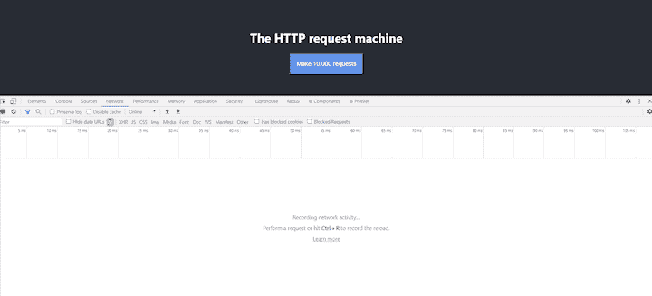
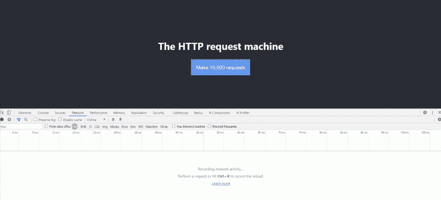
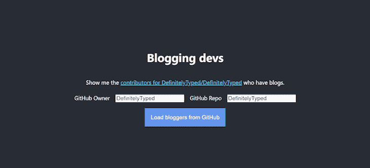

# 用 React 钩子抑制数据请求

> 原文：<https://blog.logrocket.com/throttling-data-requests-with-react-hooks/>

当应用程序加载数据时，通常会发出相对较少的 HTTP 请求。例如，假设我们正在开发一个学生管理应用程序，那么一个“view”屏幕可能会发出一个 HTTP 请求，在显示之前加载该学生的数据。

有时候，应用程序需要发出大量的 HTTP 请求。假设有一个报告应用程序，它加载数据，然后出于演示目的对数据进行聚合。

这种需求提出了两个有趣的问题:

1.  我们如何逐步加载数据？
2.  我们如何向用户呈现加载进度？

在本教程中，我们将演示如何使用自定义的 React 钩子来解决这些问题。

## 让我们让 Chrome 屈服吧

我们将通过使用 [Create React App](https://create-react-app.dev/) 构建一个 TypeScript React app 来开始我们的旅程。

```
npx create-react-app throttle-requests-react-hook --template typescript

```

因为我们要进行一些异步调用，我们将通过使用广泛使用的 [`react-use`](https://github.com/streamich/react-use) 作为 [`useAsync`](https://github.com/streamich/react-use/blob/master/docs/useAsync.md) 钩子来简化代码。

```
cd throttle-requests-react-hook
yarn add react-use

```

我们将用以下内容替换`App.css`文件:

```
.App {
  text-align: center;
}

.App-header {
  background-color: #282c34;
  min-height: 100vh;
  display: flex;
  flex-direction: column;
  align-items: center;
  justify-content: center;
  font-size: calc(10px + 2vmin);
  color: white;
}

.App-labelinput > * {
  margin: 0.5em;
  font-size:24px;
}

.App-link {
  color: #61dafb;
}

.App-button {
  font-size: calc(10px + 2vmin);
  margin-top: 0.5em;
  padding: 1em;
  background-color: cornflowerblue;
  color: #ffffff;
  text-align: center;
}

.App-progress {
  padding: 1em;
  background-color: cadetblue;
  color: #ffffff;
}

.App-results {
  display: flex;
  flex-wrap: wrap;
}

.App-results > * {
  padding: 1em;
  margin: 0.5em;
  background-color: darkblue;
  flex: 1 1 300px;
}

```

然后，我们将把`App.tsx`内容替换为:

```
import React, { useState } from "react";
import { useAsync } from "react-use";
import "./App.css";

function use10_000Requests(startedAt: string) {
  const responses = useAsync(async () => {
    if (!startedAt) return;

    // make 10,000 unique HTTP requests
    const results = await Promise.all(
      Array.from(Array(10_000)).map(async (_, index) => {
        const response = await fetch(
          `/manifest.json?querystringValueToPreventCaching=${startedAt}_request-${index}`
        );
        const json = await response.json();
        return json;
      })
    );

    return results;
  }, [startedAt]);

  return responses;
}

function App() {
  const [startedAt, setStartedAt] = useState("");
  const responses = use10_000Requests(startedAt);

  return (
    <div className="App">
      <header className="App-header">
        <h1>The HTTP request machine</h1>
        <button
          className="App-button"
          onClick={(_) => setStartedAt(new Date().toISOString())}
        >
          Make 10,000 requests
        </button>
        {responses.loading && <div>{progressMessage}</div>}
        {responses.error && <div>Something went wrong</div>}
        {responses.value && (
          <div className="App-results">
            {responses.value.length} requests completed successfully
          </div>
        )}
      </header>
    </div>
  );
}

export default App;

```

我们构建的应用程序非常简单:这是一个按钮，当你按下它时，使用[获取 API](https://developer.mozilla.org/en-US/docs/Web/API/Fetch_API) 并行发出 10，000 个 HTTP 请求。本例中请求的数据是一个任意的 JSON 文件:`manifest.json`。如果你仔细观察，你会发现我们用 URL 做了一些 querystring 技巧来避免获取缓存数据。

事实上，对于这个演示，我们对这些 HTTP 请求的结果不感兴趣。相反，我们感兴趣的是浏览器如何应对这种方法(剧透:不太好)。值得考虑的是，从与浏览器运行在同一台机器上的服务器请求文本文件应该很快。

因此，我们将运行`yarn start`并转到`[http://localhost:3000](http://localhost:3000)`以访问应用程序。在 Devtools 打开的情况下运行会导致以下不愉快的事件:



为了简洁起见，上面的 gif 已经做了很大的编辑。实际上，启动第一个请求需要 20 秒。在此之前，Chrome 没有响应。当请求开始触发时，有相当数量的请求因`net::ERR_INSUFFICIENT_RESOURCES`而失败。被激发的请求在被执行之前处于“停滞”状态。这是 [Chrome 限制连接数](https://developers.google.com/web/tools/chrome-devtools/network/reference#timing)的结果(所有浏览器都这么做):

> 已经有六个 TCP 连接为此源打开，这是极限。仅适用于 HTTP/1.0 和 HTTP/1.1。

总之，当前方法的问题有三个方面:

1.  浏览器变得没有响应
2.  由于资源不足，HTTP 请求失败
3.  用户看不到与进度相关的信息

## 掐死我

我们可以实现一个节流器，而不是一次触发所有请求来敲打浏览器。限制是一种允许您限制操作执行速率的机制。

在这种情况下，我们希望限制 HTTP 请求的速率。throttle 将解决前两个问题，本质上保持浏览器自由和简单，并确保请求被成功发送。我们也想让我们的用户了解进展情况。

是时候揭开`useThrottleRequests`的面纱了:

```
import { useMemo, useReducer } from "react";
import { AsyncState } from "react-use/lib/useAsync";

/** Function which makes a request */
export type RequestToMake = () => Promise<void>;

/**
 * Given an array of requestsToMake and a limit on the number of max parallel requests
 * queue up those requests and start firing them
 * - inspired by Rafael Xavier's approach here: https://stackoverflow.com/a/48007240/761388
 *
 * @param requestsToMake
 * @param maxParallelRequests the maximum number of requests to make - defaults to 6
 */
async function throttleRequests(
  requestsToMake: RequestToMake[],
  maxParallelRequests = 6
) {
  // queue up simultaneous calls
  const queue: Promise<void>[] = [];
  for (let requestToMake of requestsToMake) {
    // fire the async function, add its promise to the queue,
    // and remove it from queue when complete
    const promise = requestToMake().then((res) => {
      queue.splice(queue.indexOf(promise), 1);
      return res;
    });
    queue.push(promise);

    // if the number of queued requests matches our limit then
    // wait for one to finish before enqueueing more
    if (queue.length >= maxParallelRequests) {
      await Promise.race(queue);
    }
  }
  // wait for the rest of the calls to finish
  await Promise.all(queue);
}

/**
 * The state that represents the progress in processing throttled requests
 */
export type ThrottledProgress<TData> = {
  /** the number of requests that will be made */
  totalRequests: number;
  /** the errors that came from failed requests */
  errors: Error[];
  /** the responses that came from successful requests */
  values: TData[];
  /** a value between 0 and 100 which represents the percentage of requests that have been completed (whether successfully or not) */
  percentageLoaded: number;
  /** whether the throttle is currently processing requests */
  loading: boolean;
};

function createThrottledProgress<TData>(
  totalRequests: number
): ThrottledProgress<TData> {
  return {
    totalRequests,
    percentageLoaded: 0,
    loading: false,
    errors: [],
    values: [],
  };
}

/**
 * A reducing function which takes the supplied `ThrottledProgress` and applies a new value to it
 */
function updateThrottledProgress<TData>(
  currentProgress: ThrottledProgress<TData>,
  newData: AsyncState<TData>
): ThrottledProgress<TData> {
  const errors = newData.error
    ? [...currentProgress.errors, newData.error]
    : currentProgress.errors;

  const values = newData.value
    ? [...currentProgress.values, newData.value]
    : currentProgress.values;

  const percentageLoaded =
    currentProgress.totalRequests === 0
      ? 0
      : Math.round(
          ((errors.length + values.length) / currentProgress.totalRequests) * 100
        );

  const loading =
    currentProgress.totalRequests === 0
      ? false
      : errors.length + values.length < currentProgress.totalRequests;

  return {
    totalRequests: currentProgress.totalRequests,
    loading,
    percentageLoaded,
    errors,
    values,
  };
}

type ThrottleActions<TValue> =
  | {
      type: "initialise";
      totalRequests: number;
    }
  | {
      type: "requestSuccess";
      value: TValue;
    }
  | {
      type: "requestFailed";
      error: Error;
    };

/**
 * Create a ThrottleRequests and an updater
 */
export function useThrottleRequests<TValue>() {
  function reducer(
    throttledProgressAndState: ThrottledProgress<TValue>,
    action: ThrottleActions<TValue>
  ): ThrottledProgress<TValue> {
    switch (action.type) {
      case "initialise":
        return createThrottledProgress(action.totalRequests);

      case "requestSuccess":
        return updateThrottledProgress(throttledProgressAndState, {
          loading: false,
          value: action.value,
        });

      case "requestFailed":
        return updateThrottledProgress(throttledProgressAndState, {
          loading: false,
          error: action.error,
        });
    }
  }

  const [throttle, dispatch] = useReducer(
    reducer,
    createThrottledProgress<TValue>(/** totalRequests */ 0)
  );

  const updateThrottle = useMemo(() => {
    /**
     * Update the throttle with a successful request
     * @param values from request
     */
    function requestSucceededWithData(value: TValue) {
      return dispatch({
        type: "requestSuccess",
        value,
      });
    }

    /**
     * Update the throttle upon a failed request with an error message
     * @param error error
     */
    function requestFailedWithError(error: Error) {
      return dispatch({
        type: "requestFailed",
        error,
      });
    }

    /**
     * Given an array of requestsToMake and a limit on the number of max parallel requests
     * queue up those requests and start firing them
     * - based upon https://stackoverflow.com/a/48007240/761388
     *
     * @param requestsToMake
     * @param maxParallelRequests the maximum number of requests to make - defaults to 6
     */
    function queueRequests(
      requestsToMake: RequestToMake[],
      maxParallelRequests = 6
    ) {
      dispatch({
        type: "initialise",
        totalRequests: requestsToMake.length,
      });

      return throttleRequests(requestsToMake, maxParallelRequests);
    }

    return {
      queueRequests,
      requestSucceededWithData,
      requestFailedWithError,
    };
  }, [dispatch]);

  return {
    throttle,
    updateThrottle,
  };
}

```

`useThrottleRequests`钩子返回两个属性:

1.  `throttle`，一个包含以下数据的`ThrottledProgress<TData>`:
    *   `totalRequests`，将被提出的请求的数量
    *   `errors`，来自失败请求的错误
    *   `values`，来自成功请求的响应
    *   `percentageLoaded`，一个介于 0 和 100 之间的值，表示已完成(成功或失败)的请求的百分比
    *   `loading`，节流阀当前是否正在处理请求
2.  `updateThrottle`，一个公开三个函数的对象:
    *   `queueRequests`，将应该排队并以节流方式执行的请求传递给该函数
    *   `requestSucceededWithData`，请求成功提供数据时调用的函数
    *   `requestFailedWithError`，请求未能提供错误时调用的函数

用这么多词来形容我们的`useThrottleRequests`钩。通过迁移我们的`use10_000Requests`钩子来使用它，让我们看看它是什么样子。

这里有一个`App.tsx`的新实现:

```
import React, { useState } from "react";
import { useAsync } from "react-use";
import { useThrottleRequests } from "./useThrottleRequests";
import "./App.css";

function use10_000Requests(startedAt: string) {
  const { throttle, updateThrottle } = useThrottleRequests();
  const [progressMessage, setProgressMessage] = useState("not started");

  useAsync(async() => {
      if (!startedAt) return;

      setProgressMessage("preparing");

      const requestsToMake = Array.from(Array(10_000)).map(
        (_, index) => async () => {
          try {
            setProgressMessage(`loading ${index}...`);

            const response = await fetch(
              `/manifest.json?querystringValueToPreventCaching=${startedAt}_request-${index}`
            );
            const json = await response.json();

            updateThrottle.requestSucceededWithData(json);
          } catch (error) {
            console.error(`failed to load ${index}`, error);
            updateThrottle.requestFailedWithError(error);
          }
        }
      );

      await updateThrottle.queueRequests(requestsToMake);

  }, [startedAt, updateThrottle, setProgressMessage]);

  return { throttle, progressMessage };
}

function App() {
  const [startedAt, setStartedAt] = useState("");

  const { progressMessage, throttle } = use10_000Requests(startedAt);

  return (
    <div className="App">
      <header className="App-header">
        <h1>The HTTP request machine</h1>
        <button
          className="App-button"
          onClick={(_) => setStartedAt(new Date().toISOString())}
        >
          Make 10,000 requests
        </button>
        {throttle.loading && <div>{progressMessage}</div>}
        {throttle.values.length > 0 && (
          <div className="App-results">
            {throttle.values.length} requests completed successfully
          </div>
        )}
        {throttle.errors.length > 0 && (
          <div className="App-results">
            {throttle.errors.length} requests errored
          </div>
        )}
      </header>
    </div>
  );
}

export default App;

```

看看新的`use10_000Requests`钩子，与我们之前的实现有一些细微的不同。首先，我们现在暴露了`throttle`，一个`ThrottleProgress<TData>`。我们更新的钩子也公开了一个`progressMessage`，它是一个简单的`string`，存储在`useState`中，我们在油门运行时更新它。

事实上，这里出现的信息并不有趣。`progressMessage`的存在只是为了说明您可以在请求完成时从请求中获取一些数据用于显示目的——例如，运行总数。

那么，我们的新钩子方法表现如何呢？



它表现得非常好，确实！同样，为了简洁起见，上面的 gif 也经过了编辑。如果我们回顾以前的方法所面临的问题，我们如何比较？

1.  浏览器保持响应
2.  浏览器不会遇到失败的 HTTP 请求
3.  始终向用户显示进度的细节

太棒了。

## 我们要建造什么？

我们目前的例子肯定是人为的。让我们将`useThrottleRequests`挂钩应用到一个更现实的场景中。

我们将构建一个应用程序，给定 GitHub 上的一个 repo，列出所有贡献者的博客。您可以在 GitHub 个人资料上指定博客 URL 许多人用这个来指定他们的 Twitter 个人资料。

多亏了优秀的 [GitHub REST API](https://docs.github.com/en/free-pro-team@latest/rest) ，我们可以构建这一点，它公开了我们目标的两个感兴趣的端点:列出存储库贡献者和获取用户。

### 1.列出存储库参与者

[列出存储库贡献者](https://docs.github.com/en/free-pro-team@latest/rest/reference/repos#list-repository-contributors)列出位于此 URL: `GET [https://api.github.com/repos/](https://api.github.com/repos/){owner}/{repo}/contributors`的指定存储库的贡献者。响应是一个对象数组，关键是一个指向用户 API 端点的`url`属性。

```
[
  // ...
  {
    // ...
    "url": "https://api.github.com/users/octocat",
    // ...
  },
  // ...
]

```

### 2.获取用户

[获取一个用户](https://docs.github.com/en/free-pro-team@latest/rest/reference/users#get-a-user)就是上面的`url`属性所引用的 API。调用时，它返回一个对象，该对象表示有关用户的公开可用信息。

```
{
  // ...
  "name": "The Octocat",
  // ...
  "blog": "https://github.blog",
  // ...
}

```

## 博客开发 1.0 版

我们现在准备好构建我们的博客开发应用程序。让我们将现有的`App.tsx`替换为:

```
import React, { useCallback, useMemo, useState } from "react";
import { useAsync } from "react-use";
import { useThrottleRequests } from "./useThrottleRequests";
import "./App.css";

type GitHubUser = { name: string; blog?: string };

function timeout(ms: number) {
  return new Promise((resolve) => setTimeout(resolve, ms));
}

function useContributors(contributorsUrlToLoad: string) {
  const { throttle, updateThrottle } = useThrottleRequests<GitHubUser>();
  const [progressMessage, setProgressMessage] = useState("");

  useAsync(async () => {
    if (!contributorsUrlToLoad) return;

    setProgressMessage("loading contributors");

    // load contributors from GitHub
    const contributorsResponse = await fetch(contributorsUrlToLoad);
    const contributors: { url: string }[] = await contributorsResponse.json();

    setProgressMessage(`loading ${contributors.length} contributors...`);

    // For each entry in result, retrieve the given user from GitHub
    const requestsToMake = contributors.map(({ url }, index) => async () => {
      try {
        setProgressMessage(
          `loading ${index} / ${contributors.length}: ${url}...`
        );

        const response = await fetch(url);
        const json: GitHubUser = await response.json();

        // wait for 1 second before completing the request
        // - makes for better demos
        await timeout(1000);

        updateThrottle.requestSucceededWithData(json);
      } catch (error) {
        console.error(`failed to load ${url}`, error);
        updateThrottle.requestFailedWithError(error);
      }
    });

    await updateThrottle.queueRequests(requestsToMake);

    setProgressMessage("");
  }, [contributorsUrlToLoad, updateThrottle, setProgressMessage]);

  return { throttle, progressMessage };
}

function App() {
  // The owner and repo to query; we're going to default
  // to using DefinitelyTyped as an example repo as it
  // is one of the most contributed to repos on GitHub
  const [owner, setOwner] = useState("DefinitelyTyped");
  const [repo, setRepo] = useState("DefinitelyTyped");
  const handleOwnerChange = useCallback(
    (event: React.ChangeEvent<HTMLInputElement>) =>
      setOwner(event.target.value),
    [setOwner]
  );
  const handleRepoChange = useCallback(
    (event: React.ChangeEvent<HTMLInputElement>) => setRepo(event.target.value),
    [setRepo]
  );

  const contributorsUrl = `https://api.github.com/repos/${owner}/${repo}/contributors`;

  const [contributorsUrlToLoad, setUrlToLoad] = useState("");
  const { progressMessage, throttle } = useContributors(contributorsUrlToLoad);

  const bloggers = useMemo(
    () => throttle.values.filter((contributor) => contributor.blog),
    [throttle]
  );

  return (
    <div className="App">
      <header className="App-header">
        <h1>Blogging devs</h1>

        <p>
          Show me the{" "}
          <a
            className="App-link"
            href={contributorsUrl}
            target="_blank"
            rel="noopener noreferrer"
          >
            contributors for {owner}/{repo}
          </a>{" "}
          who have blogs.
        </p>

        <div className="App-labelinput">
          <label htmlFor="owner">GitHub Owner</label>
          <input
            id="owner"
            type="text"
            value={owner}
            onChange={handleOwnerChange}
          />
          <label htmlFor="repo">GitHub Repo</label>
          <input
            id="repo"
            type="text"
            value={repo}
            onChange={handleRepoChange}
          />
        </div>

        <button
          className="App-button"
          onClick={(e) => setUrlToLoad(contributorsUrl)}
        >
          Load bloggers from GitHub
        </button>

        {progressMessage && (
          <div className="App-progress">{progressMessage}</div>
        )}

        {throttle.percentageLoaded > 0 && (
          <>
            <h3>Behold {bloggers.length} bloggers:</h3>
            <div className="App-results">
              {bloggers.map((blogger) => (
                <div key={blogger.name}>
                  <div>{blogger.name}</div>
                  <a
                    className="App-link"
                    href={blogger.blog}
                    target="_blank"
                    rel="noopener noreferrer"
                  >
                    {blogger.blog}
                  </a>
                </div>
              ))}
            </div>
          </>
        )}

        {throttle.errors.length > 0 && (
          <div className="App-results">
            {throttle.errors.length} requests errored
          </div>
        )}
      </header>
    </div>
  );
}

export default App;

```

该应用程序使用户能够进入 GitHub 项目的组织和存储库。然后，当单击按钮时，它会:

*   加载贡献者
*   为每个贡献者加载单个用户(为每个贡献者加载单独的 HTTP 请求)
*   在加载时传达进度
*   加载用户时，为每个用户呈现一个带有列出的博客的磁贴

为了让演示更加清晰，我们人为地将每个请求的持续时间降低了一秒钟。当你把它放在一起时，它看起来是这样的:



我们构建了一个 React 钩子，它允许我们在不阻塞浏览器 UI 的情况下逐渐加载数据，并提供进度数据来通知用户。

## [LogRocket](https://lp.logrocket.com/blg/react-signup-general) :全面了解您的生产 React 应用

调试 React 应用程序可能很困难，尤其是当用户遇到难以重现的问题时。如果您对监视和跟踪 Redux 状态、自动显示 JavaScript 错误以及跟踪缓慢的网络请求和组件加载时间感兴趣，

[try LogRocket](https://lp.logrocket.com/blg/react-signup-general)

.

[ ](https://lp.logrocket.com/blg/react-signup-general) [](https://lp.logrocket.com/blg/react-signup-general) 

LogRocket 结合了会话回放、产品分析和错误跟踪，使软件团队能够创建理想的 web 和移动产品体验。这对你来说意味着什么？

LogRocket 不是猜测错误发生的原因，也不是要求用户提供截图和日志转储，而是让您回放问题，就像它们发生在您自己的浏览器中一样，以快速了解哪里出错了。

不再有嘈杂的警报。智能错误跟踪允许您对问题进行分类，然后从中学习。获得有影响的用户问题的通知，而不是误报。警报越少，有用的信号越多。

LogRocket Redux 中间件包为您的用户会话增加了一层额外的可见性。LogRocket 记录 Redux 存储中的所有操作和状态。

现代化您调试 React 应用的方式— [开始免费监控](https://lp.logrocket.com/blg/react-signup-general)。