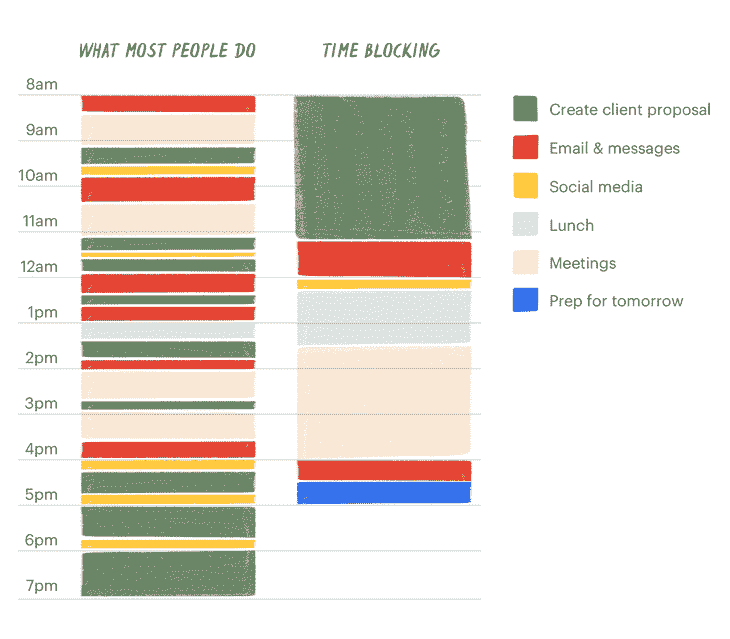

# 时间阻塞指南:如何优化你的工作量

> 原文：<https://blog.logrocket.com/product-management/time-blocking-how-to-optimize-your-workload/>

你见过能完成日常清单上所有事情的产品经理吗？

我也没有。

工作中最有压力的因素之一，也是经前综合症中冒名顶替综合症的主要原因之一，是事实上一个工作日总有比小时数更多的事情要做。

这就是为什么生产力和工作负载优化对产品经理来说至关重要。知道你已经完成了大部分的周目标给了经前综合症患者急需的精神安慰。

有多种方法可以最大限度地提高日常生产力。在本指南中，我们将介绍时间阻塞。

* * *

## 目录

* * *

## 混乱工作日的问题是

那些做过产品经理或者见过产品经理工作的人知道我在说什么:一个项目经理的工作日是混乱的。

它不仅充斥着各种完全不同的活动——从状态更新到设计评审到战略规划——而且这些活动通常也是高度不可预测的。你无法预测下一个生产问题或“紧急利益相关者要求”何时会出现。

尽管完全避免混乱的工作日是不太可能的，但是构建产品是一项混乱且不可预测的工作。有一些策略可以让工作更容易管理，更有效率。

其中一个策略是时间阻塞。

## 什么是时间阻塞？

时间块是一种方法，在这种方法中，你可以在一个预先定义的时间段内做类似主题的任务，而不是分散在一周中。

[Todoist](%E2%80%9Chttps://todoist.com/productivity-methods/time-blocking%E2%80%9D)

时间阻塞的主要目的是尽可能地限制上下文切换，从而提高你的整体生产力。

它可以是周期性的(例如，每周一早上更新状态)，也可以是临时的(例如，从所有与设计相关的任务中清除待办事项)。

## 时间封锁的好处

时间阻塞如此有效有很多原因。

最值得注意的是，时间阻塞帮助你:

### 减少上下文切换

时间阻塞的主要和最明显的好处是减少了上下文切换。

你不必在你的时间段内只做一件特定的事情。只要你从事类似主题的工作，你会发现从一个到另一个更容易快速移动。

转换如此之快，是因为你不必一直完全切换上下文。如果你留出时间来写各种状态更新，你的思维方式已经专注于写更新，即使这些是不同的计划。

### 增加对干扰的抵抗力

如果你在日历上空出几个小时来处理各种任务，或者创造一个名为“一般工作”的空闲时间，你就是在要求别人把你拉进一个计划外的会议。

另一方面，如果你把某一特定活动的时间从日历上划掉，计划外的会议就不太可能发生，因为在同一时间给你一个重叠的邀请是不礼貌的。

* * *

订阅我们的产品管理简讯
将此类文章发送到您的收件箱

* * *

看一下这个例子。

你认为今天谁会有一个计划外的会议？

### 跟踪花费在任务上的时间

你不知道你花了多少时间写状态更新，发电子邮件，或者管理路线图，直到你开始跟踪它。

当你临时工作时，几乎不可能评估你的时间去了哪里。但是，如果你开始使用时间段，随着时间的推移，你调整这些时间段的长度，以符合实际需求，你就可以清楚地了解你的时间。

然后，它创建一个强大的工件来检查和适应。你可能会惊讶地发现，你每周花 10 个小时写更新，而花 3 个小时管理路线图。

你可能会觉得你的优先级是正确的，但这是一种直觉，除非你努力地跟踪你的时间。精确评估你的时间去了哪里。会有回报的。

### 节省时间

当你划出一大块时间，避免一心多用，保护自己不受干扰时，你的工作效率会飙升。

在两个小时有主题的、不受干扰的工作中，你可以比四个小时无计划的、不受干扰的工作获得更多。

## 如何实现时间阻塞

实施时间阻塞没有灵丹妙药，不同的技术对不同的人更有效。然而，为了给你一个起点，如果我必须从零开始，我将如何实现时间阻塞:

1.  [确定你的周期性任务](#identify-your-recurring-tasks)
2.  [确定你效率最高和最低的时间](#identify-your-most-and-least-productive-times)
3.  [计划你的时间段](#plan-your-time-blocks)
4.  [检查并调整](#inspect-and-adapt)

### 1.确定您的周期性任务

第一步是确定你的重复性任务。什么类型的工作每天或每周重复？在你的周计划中有哪些是不可避免的？常见活动包括:

*   回复电子邮件
*   撰写更新
*   管理积压
*   审查产品

列出所有你知道会定期重复的活动。

### 2.确定你效率最高和最低的时间

当你按照一个人的自然周期来计划时，时间块是最有效的。我们每天都有生产力的高峰和低谷。把你最有效率的时间用来回复邮件，或者在一天中效率最低的时间去做要求最高的事情，都是浪费时间。

你可以试试每天写日记。每小时，在日记中记下你的能量水平，重复这个过程，直到你开始看到模式。

### 3.计划你的时间段

现在你已经有了一个你经常处理的“主题”的列表，并且了解了你一天/一周的工作效率，是时候提前计划一周了。

但是，不要试图一次计划好所有的事情。如果时间阻塞在你的日历中是一个新概念，试图一口气“掌握它”肯定会导致失败和沮丧。

我也不建议过多改变会议日程。尝试使用您当前拥有的容量。每天找一个小时批量处理一些工作似乎是一个好的开始。

### 4.检查和调整

一旦你开始了你的时间阻塞之旅，你应该检查它的效果并定期调整你的方法。

有些任务会比你计划的时间长，有些会比计划的时间短。有些老虎机可能更适合你。有些可能根本不能很好地工作。

随着你越来越擅长时间阻塞，你可以试着重新组织你的会议，一起修改你的日程表。

由于产品经理的工作一直在发展和变化，这一步也一直是相关的。

我建议当你第一次尝试这种方法时，每周回顾一次，一旦你掌握了它，每月至少回顾一次。

## 要避免的陷阱

在实现时间阻塞时，您应该警惕一些常见的陷阱。

这些陷阱包括:

### 忽视休息

尽管用富有成效的时间段来安排你的一整天可能很诱人，但它充其量只能起到反作用。

你需要休息来度过一天，不要害怕把这些也挡在外面！它们不仅能帮你充电，提高一天的效率，还能给你创造空间。

毕竟，最好的想法是在众所周知的淋浴下产生的。

### 不留下任何懈怠

意想不到的事情会发生，干扰会出现。不要反抗。接受它作为生活的事实。

预订整个星期，不给计划外的会议和活动留有余地，只是一厢情愿的想法。时间阻塞和时间管理的目标是保护你的大部分时间，但不是 100%。项目经理必须灵活，并对意外变化做出快速反应。

空出一些位置，或者找到一个创造性的方法来为“计划外的工作”留出空间这不仅有助于你变得更加现实，还能提示你的同事何时可以联系到你。

我们都知道这一周会有临时的干扰。为他们打算。

### 试图革新日历

有些人喜欢在发现新的时间管理方法时把一切都颠倒过来。他们对新技术感到兴奋，并希望尽快从中获益。

大换班很少奏效。它们经常造成混乱，却没有直接的积极回报。慢慢来。了解什么最适合你，并调整方法使之最适合你。

## 摘要

时间封锁是一种强大的生产力策略，通过限制分心和消除环境转换，可以帮助产品经理在一周内实现更多目标。总的想法是长时间专注于相似类型的任务。

有许多方法可以实现时间阻塞。一种方法是从识别你经常重复的任务开始，围绕你的最高和最低生产率时间计划它们，并不断检查和适应。

尽管这个概念相对简单，但还是有一些潜在的陷阱需要避免。确保在你的日历中为意想不到的任务留有一些时间，不要忽视休息的时间，最重要的是，不要试图从第一天起就改革你的日历。一步步来。

*精选图片来源:[icon scout](https://iconscout.com/icon/deadline-3302765)*

## [LogRocket](https://lp.logrocket.com/blg/pm-signup) 产生产品见解，从而导致有意义的行动

[LogRocket](https://lp.logrocket.com/blg/pm-signup) 确定用户体验中的摩擦点，以便您能够做出明智的产品和设计变更决策，从而实现您的目标。

使用 LogRocket，您可以[了解影响您产品的问题的范围](https://logrocket.com/for/analytics-for-web-applications)，并优先考虑需要做出的更改。LogRocket 简化了工作流程，允许工程和设计团队使用与您相同的[数据进行工作](https://logrocket.com/for/web-analytics-solutions)，消除了对需要做什么的困惑。

让你的团队步调一致——今天就试试 [LogRocket](https://lp.logrocket.com/blg/pm-signup) 。

[Bart Krawczyk Follow](https://blog.logrocket.com/author/bartkrawczyk/) Learning how to build beautiful products without burning myself out (again). Writing about what I discovered along the way.