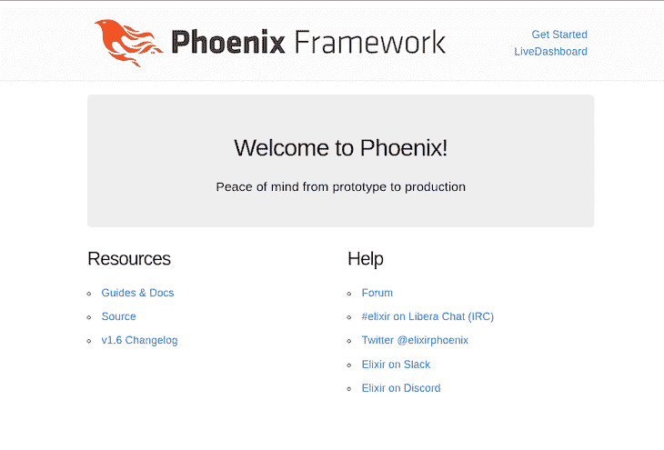
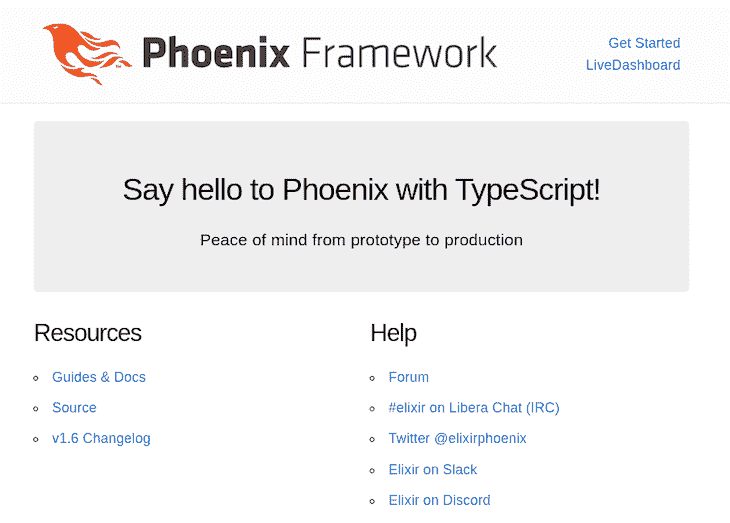
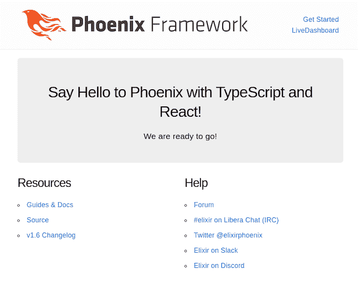
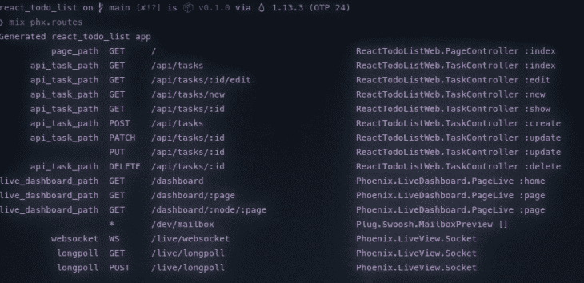
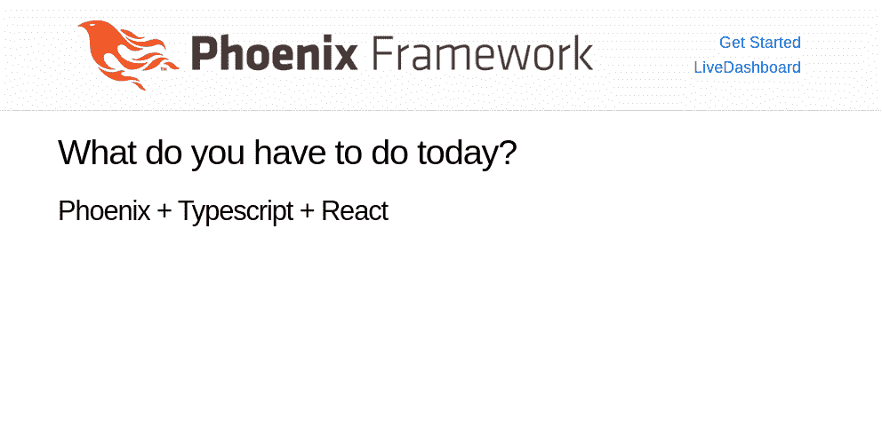
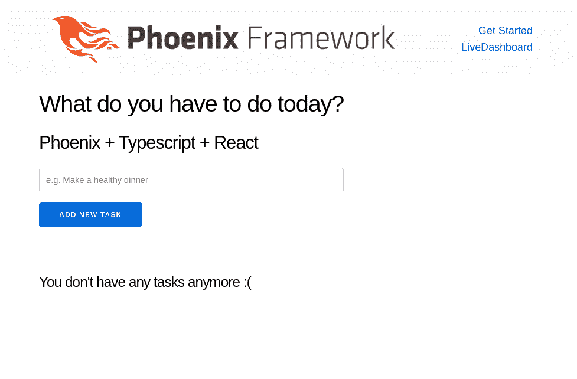
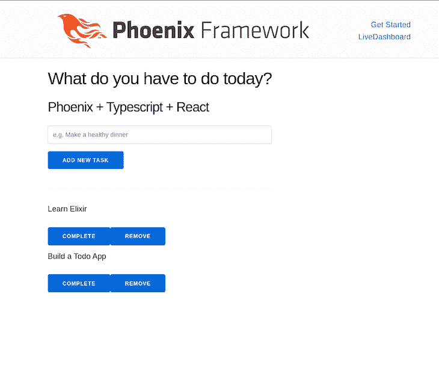
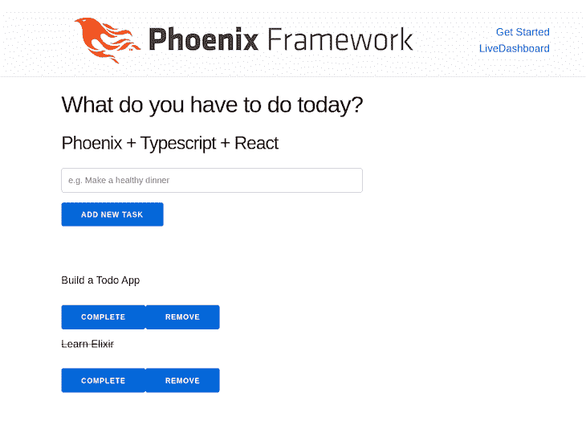

# 用 Phoenix、React 和 TypeScript 创建一个待办事项应用程序

> 原文：<https://blog.logrocket.com/to-do-list-phoenix-react-typescript/>

在过去的几年中，Phoenix 框架获得了广泛的采用，每个新版本都带来了更多值得注意的改进。Phoenix v1.6 的发布对前端工具进行了显著的改进，比如增加了 HEEx 模板，放弃了 webpack，并采用了 esbuild。

然而，有时候，开发人员可能需要开发更复杂、更健壮的接口；在这些场景中，我们可以[利用 React](https://blog.logrocket.com/create-graphql-api-react-phoenix-2/) 提供的力量和庞大的生态系统。

随着 esbuild 的采用，Phoenix 对 TypeScript 的支持是现成的，这使得包含 React 变得更加简单。在本教程中，我们将使用 Phoenix、React 和 TypeScript 开发待办事项应用程序的基本功能。要继续学习，您可以[在 GitHub](https://github.com/amacgregor/react_todo_list) 上访问本教程的源代码。我们开始吧！

## 目录

## 先决条件

对于本教程，我们需要确保我们有一个良好的工作环境；[遵循官方的药剂说明](https://elixir-lang.org/install.html)，它将为您提供以下几个选项:

*   Linux、Windows 和 macOS 上的本地安装
*   长生不老药的版本
*   软件包管理器版本设置

我建议关注本地安装，因为这可能是最容易开始的。

您还需要在本地安装 npm 并运行 PostgreSQL 版本。你可以从[官方说明](https://nodejs.org/en/)中轻松安装 Node.js，在大多数情况下，你的系统可能已经预装了 Node.js。

根据你使用的操作系统的不同， [Postgres](https://www.postgresql.org/) 安装起来可能会有点棘手。然而，我们可以[利用 Docker 并获得一个运行](https://blog.logrocket.com/run-phoenix-application-docker/)的本地版本。首先，创建一个文件夹来保存数据库数据:

```
> mkdir ${HOME}/phoenix-postgres-data/

```

使用 Postgres 映像运行 Docker 容器，如下所示:

```
$ docker run -d \
    --name phoenix-psql \
    -e POSTGRES_PASSWORD=Phoenix1234 \
    -v ${HOME}/phoenix-postgres-data/:/var/lib/postgresql/data \
    -p 5432:5432 \
    postgres

```

验证容器正在运行:

```
&gt; docker ps
CONTAINER ID   IMAGE      COMMAND                  CREATED         STATUS        PORTS                                  NAMES
7ce134cb32   postgres   "docker-entrypoint.s…"   6 seconds ago   Up 5 seconds  5432/tcp, 0.0.0.0:5432->5432/tcp       phoenix-psql

```

验证 PostgreSQL 已启动并正在运行:

```
> docker exec -it phoenix-psql bash
[email protected]:/# psql -h localhost -U postgres
psql (13.2 (Debian 13.2-1.pgdg100+1))

Type "help" for help.
postgres=# \l
                                 List of databases
   Name    |  Owner   | Encoding |  Collate   |   Ctype    |   Access privileges   
-----------+----------+----------+------------+------------+-----------------------
 postgres  | postgres | UTF8     | en_US.utf8 | en_US.utf8 | ...

```

## 安装凤凰

现在我们已经安装了必要的依赖项，我们可以继续安装 Phoenix 应用程序生成器并创建我们的第一个 Phoenix 应用程序。Phoenix 生成器作为一个混合归档文件分发，可以使用以下命令安装:

```
> mix archive.install hex phx_new 1.6.15

```

Mix 档案本质上是遵循 [Erlang 档案格式](http://erlang.org/doc/man/code.html)的 Elixir 项目的`.zip`文件。简而言之，档案为我们提供了一种分发项目的方式，并将它们作为常规的命令工具。

## 设置 Phoenix 应用程序

第一步是使用以下命令创建一个新的 Phoenix 应用程序:

```
> mix phx.new react_todo_list

```

在启动应用程序之前，确保已经创建并运行了数据库。您可以通过运行以下命令来实现这一点:

```
mix ecto.create

```

接下来，用下面的代码启动 Phoenix 服务器:

```
mix phx.server

```

如果一切正常，您应该会在访问`[http://localhost:4000](http://localhost:4000)`时看到 Phoenix 主页:



## 在 Phoenix 中使用 TypeScript

在 Phoenix ≤v1.6 中，默认的前端工具是 webpack，这是一个很好的捆绑和编译资产的工具。然而，webpack 的设置有点复杂，这给开发人员带来了很多挫折。

随着 Phoenix 1.6 的发布，默认的前端工具变成了 esbuild，这是一个更简单的工具，不需要配置文件。此外，esbuild 支持现成的 TypeScript，这将使我们在使用 React 时更加轻松。

我们可以通过在名为`hello.ts`的`react_todo_list/assets/js`文件夹中创建一个新文件并添加以下代码来测试 TypeScript 是否正常工作:

```
function hello(name: string): string {
    return "Say hello to " + name + " with TypeScript!";
  }
  export default hello;

```

接下来，我们需要将文件导入到`react_todo_list/assets/js/app.js`文件中:

```
import hello from "./hello";
document.querySelector("section.phx-hero h1").innerHTML = hello("Phoenix");

```

完成后，主页应该如下所示:



开始使用 TypeScript 和 Phoenix 就是这么简单，不需要额外的配置。

## 使用与凤凰反应

我们的最后一个设置步骤是向我们的应用程序添加 React。与 TypeScript 不同，我们需要添加一些额外的代码来让 React 工作。

确保您在`assets`文件夹中，并运行以下命令:

```
cd react_todo_list/assets

```

进入`assets`文件夹后，我们可以通过运行以下命令来安装必要的依赖项:

```
npm install --save react react-dom remount
npm install --save-dev @types/react @types/react-dom
```

上面的命令将安装 React 和 [react-dom](https://reactjs.org/docs/react-dom.html) 包，以及这两个包的 TypeScript 定义，以帮助我们自动完成。我们可以通过在`react_todo_list/assets/js`文件夹中创建一个名为`react_hello.tsx`的新文件并添加以下代码来测试一切是否正常:

```
import React from "react";
interface HelloProps {
    name: string;
}
const ReactHello: React.FC<HelloProps> = (props: HelloProps) => {
    const name = props.name;
    return (
        <section className="phx-hero">
         <h1>Say Hello to {name} with TypeScript and React!</h1>
          <p>We are ready to go!</p>
        </section>
    );
};
export default ReactHello;

```

接下来，打开模板文件`react_todo_list/lib/react_todo_list_web/templates/page/index.html.heex`，分别用下面的代码片段替换下面的代码块:

```
<section class="phx-hero">
  <h1><%= gettext "Welcome to %{name}!", name: "Phoenix" %></h1>
  <p>Peace of mind from prototype to production</p>
</section>
```

```
<div id="hello"/>

```

最后，我们需要在`react_todo_list/assets/js/app.js`文件中导入组件:

```
import React from "react";
import ReactDOM from "react-dom";
import ReactHello from "./react_hello";
const hello = document.getElementById("hello");
ReactDOM.render(<ReactHello name="Phoenix" />, hello);

```

确保替换我们之前添加的两行并删除`hello.ts`文件。

最后，将文件重命名为`app.jsx`。然后，我们需要更新`react_todo_list/config/config.exs`中的配置文件。用下面的代码块替换下面的代码块:

```
      ~w(js/app.js --bundle --target=es2017 --outdir=../priv/static/assets --external:/fonts/* --external:/images/*),
```

```
     ~w(js/app.jsx --bundle --target=es2017 --outdir=../priv/static/assets --external:/fonts/* --external:/images/*),

```

完成后，重启服务器并访问`[http://localhost:4000](http://localhost:4000)`查看结果:



## 构建我们的待办事项应用程序

既然我们基本的 Phoenix、React 和 TypeScript 设置已经完成，我们就可以开始构建我们的待办事项列表应用程序了。请记住，我们的目标是构建一个简单的待办事项列表应用程序，它使用 React 组件来显示项目列表，并允许我们向列表中添加新项目。

## 创建待办事项列表架构

在继续前端工作之前，我们需要为待办事项列表创建数据库模式。我们可以通过运行以下命令来实现这一点:

```
 mix phx.gen.json Todo Task tasks description:text completed:boolean --web Api

```

确保将资源添加到`lib/react_todo_list_web/router.ex`中的`routes`文件中:

```
     scope "/api", ReactTodoListWeb.Api, as: :api do
      pipe_through :api
      ...
      resources "/tasks", TaskController
    end

```

通过运行以下命令，确认路由正确无误:

```
 mix phx.routes

```



接下来，我们需要运行迁移来创建数据库表:

```
 mix ecto.migrate

```

接下来，我们将更新`PageController`,以便它从数据库返回任务列表。打开`lib/react_todo_list_web/controllers/page_controller.ex`文件，用以下内容替换`index`功能:

```
...
  use ReactTodoListWeb, :controller
  alias ReactTodoList.Todo
  def index(conn, _params) do
    tasks = Todo.list_tasks()
    render(conn, "index.html", props: Poison.encode!(%{tasks: tasks}))
  end

```

确保将[毒药](https://github.com/devinus/poison)添加到`mix.exs`中的依赖列表中:

```
   defp deps do
    [
...
      {:poison, "~> 4.0"}
    ]
  end

```

通过运行以下命令安装依赖项:

```
mix deps.get

```

## 向我们的 Phoenix 和 TypeScript 应用程序添加 React

有了模式，我们就可以开始前端工作了。首先，我们需要为 React 应用程序建立基线结构。

首先在`react_todo_list/assets/js`文件夹中创建以下文件夹:

```
cd react_todo_list/assets/js
mkdir react
mkdir react/components
mkdir react/constants
touch react/index.jsx
touch react/App.jsx

```

接下来，我们需要在`react_todo_list/assets/js/react/index.jsx`文件下创建 React 应用程序的入口点，并添加以下代码:

```
import { define } from 'remount';
import App from './App';
define({'x-application': App});

```

上面的代码将允许我们将 React 应用程序安装到 HTML 模板中的`x-application`元素上。

现在，我们需要更新索引模板来安装 React 应用程序。打开`react_todo_list/lib/react_todo_list_web/templates/page/index.html.heex`文件，将代码替换为以下内容:

```
<section class="row">
  <x-application props-json={@props}/>
</section>

```

确保更新`app.jsx`以导入`react/index.tsx`文件。

在重新加载页面时，我们应该在默认的 Phoenix 页眉之外看到一个空页面；我们还没有向 React 应用程序添加任何内容。

让我们继续给`react_todo_list/assets/js/react/App.tsx`添加一些简单的脚手架:

```
import { Title } from "./components/Title";
import React from "react";
interface AppProps {
  name: string;
}
const App: React.FC<AppProps> = (props: AppProps) => {  
  return (
    <div className="title">
      <Title
       title="What do you have to do today?"
        subtitle="Phoenix + Typescript + React"
      />
    </div>
  );
}
export default App;

```

我们还将为`react_todo_list/assets/js/react/components/Title.tsx`添加一些脚手架:

```
import React from "react";
interface TitleInterface {
    title: string;
    subtitle: string;
  }

  export function Title({ title, subtitle }: TitleInterface) {
    return (
      <div className="mb-11">
        <h1 className="text-center font-display text-4xl tracking-tighter text-app-800 antialiased sm:text-left">
          {title}
        </h1>
        <h2 className="font-base mt-2 text-center text-sm text-app-500 antialiased sm:text-left">
          {subtitle}
        </h2>
      </div>
    );
  }

```

如果一切正常，我们的 React 应用程序将被安装到`x-application`元素上，我们应该会看到以下内容:



既然我们已经建立了一个基本的 React 应用程序，我们就可以开始处理待办事项列表组件了。

## 创建待办事项列表组件

对于教程的这一部分，我们将创建以下组件:

*   `TaskForm`:负责向列表中添加新任务
*   `TaskItem`:负责显示单个任务项
*   `TaskList`:负责显示任务列表

### `TaskForm`

```
`react_todo_list/assets/js/react/components/TaskForm.tsx`:
import React from "react";
export function TaskForm() {
  return (
    <>
        <div className="task-form-container">
            <input type="text" placeholder="e.g. Make a healthy dinner" />
            <button className="button">
                Add new Task
            </button>
       </div>
        <hr className="my-12" />
    </>
 );
}

```

### `TaskItem`

```
`react_todo_list/assets/js/react/components/TaskItem.tsx`:
import React from "react";
interface TaskItemInteface {
    id: number;
    text: string;
    completed: boolean;
  }

export function TaskItem({ id, text, completed }: TaskItemInteface) {
    return (
        <div className="task-item">
            <p>
            <span className={completed ? "line-through" : ""}>{text}</span>
            </p>
            <div className="task-actions">
                <button className="button">
                    Complete
                </button>
                <button className="button">
                   Remove
               </button>
            </div>
        </div>
    );
}

```

### `TaskList`

```
`react_todo_list/assets/js/react/components/TaskList.tsx`:
import { TaskItem } from "./TaskItem";
import React from "react";
export function TaskList() {
  const tasks = Array<typeof TaskItem>();
  return (
    <>
      {tasks.length > 0 ? (
        tasks.map((tasks) => (false))
      ) : (
        <div className="task-list-container">
            <h3>You don't have any tasks anymore :(</h3>
        </div>
      )}
    </>
  );
}

```

一旦我们添加了所有的组件，我们就可以更新`App.tsx`文件来包含这些组件:

```
import { Title } from "./components/Title";
import React from "react";
import { TaskForm } from './components/TaskForm';
import { TaskList } from './components/TaskList';
interface AppProps {
  name: string;
}
const App: React.FC<AppProps> = (props: AppProps) => {  
  return (
    <div className="title">
      <Title
        title="What do you have to do today?"
        subtitle="Phoenix + Typescript + React"
      />
      <TaskForm />
      <TaskList />
    </div>
  );
}
export default App;

```

如果一切正常，我们应该会看到以下屏幕:



## 连接待办事项 API

尽管我们已经设置了组件，但是我们还没有连接 API。我们将从动态的任务列表开始；为此，我们需要一些种子数据。

## 为数据库设定种子

打开`react_todo_list/priv/repo/seeds.exs`文件并添加以下代码:

```
alias ReactTodoList.Repo
alias ReactTodoList.Todo.Task
Repo.insert!(%Task{
  id: 1,
  description: "Learn Elixir",
  completed: false
})
Repo.insert!(%Task{
  id: 2,
  description: "Build a Todo App",
  completed: false
})

```

要为数据库设定种子，请运行以下命令:

```
mix run priv/repo/seeds.exs

```

现在，返回到`TaskList`组件并更新`TaskList.tsx`以从 API 获取任务:

```
import { TaskItem } from "./TaskItem";
import React from "react";
import { useState, useEffect } from "react";
export  function TaskList() {
    const [tasks, setTasks] = useState({});
    useEffect(() => {
      const getTaskList = async () => {
        const response = await fetch(
          "http://localhost:4000/api/tasks"
       );
        const responseJson = await response.json();
       setTasks(responseJson);
      };
     getTaskList();
   }, []);
    return (
    <>
        {tasks?.data?.length > 0 ? (
            tasks.data.map((task) =>  <TaskItem key={task.id} {...task} />)
        ) : (
        <div className="task-list-container">
            <h3>You don't have any tasks anymore :(</h3>
        </div>
        )}
    </>
    );
}

```

在上面的代码中，我们使用 React 中的`useEffect`钩子从 API 中获取任务。我们使用`map`函数遍历任务，并为每个任务呈现`TaskItem`组件。

如果一切正常，您应该会看到以下屏幕:

## 

完成并删除任务

## 现在我们有了任务列表，我们可以开始处理`TaskItem`组件了。我们将添加完成和删除任务的功能。

首先，打开`TaskList.tsx`文件，添加以下函数来处理`deleteItem`事件:

现在，我们采用最简单的方法，在删除一个任务后再次获取任务。接下来，我们将更新`TaskItem.tsx`文件，为`Remove`按钮添加`deleteItem`函数:

```
...
    const deleteItem = async (id: number) => {
        const responseDelete = await fetch(
            http://localhost:4000/api/tasks/${id}`,
            {
            method: "DELETE",
            }
        );
        const response = await fetch(
           "http://localhost:4000/api/tasks"
          );
        const responseJson = await response.json();
       setTasks(responseJson);
    }

```

请注意我们是如何向名为`deleteItem`的`TaskItem`组件添加新道具的。我们还将`deleteItem`功能从`TaskList`传递给了`TaskItem`组件。

```
import React from "react";
interface TaskItemInteface {
    id: number;
    description: string;
    completed: boolean;
    deleteItem: (id: number) => void;
  }

export function TaskItem({ id, description, completed, deleteItem }: TaskItemInteface) {
    const handleDelete = async (id) => {
        deleteItem(id)
    }
    return (
      <div className="task-item">
          <p>
          <span className={completed ? "line-through" : ""}>{description}</span>
            </p>
            <div className="task-actions">
                <button className="button">
                    Complete
                </button>
             <button onClick={() => handleDelete(id)} className="button">
                   Remove
                </button>
            </div>
        </div>
    );
}

```

您可以尝试删除一个任务，您应该会看到它从列表中删除。接下来，我们将添加完成任务的功能。以非常相似的方式，我们将更新`TaskList`文件以添加`completeItem`函数:

上面的代码非常类似于`deleteItem`函数。我们使用`PUT`方法来更新任务。接下来，我们将更新`TaskItem.tsx`文件，为`Complete`按钮添加`handleComplete`功能:

```
    const completeItem = async (id: number, description: string) => {
        const requestOptions = {
            method: 'PUT',
            headers: { 'Content-Type': 'application/json' },
            body: JSON.stringify({id: id, task: { completed: true}})
        };
        const responseUpdate = await fetch(
            http://localhost:4000/api/tasks/${id}`,
            requestOptions
        );
        const response = await fetch(
            "http://localhost:4000/api/tasks"
         );
        const responseJson = await response.json();
        setTasks(responseJson);
    }

```

就像使用`deleteItem`函数一样，我们将`completeItem`函数从`TaskList`传递给`TaskItem`组件。最后，更新`app.css`文件来添加`line-through`类:

```
import React from "react";
interface TaskItemInteface {
    id: number;
    description: string;
    completed: boolean;
    deleteItem: (id: number) => void;
    completeItem: (id: number) => void;
  }

export function TaskItem({ id, description, completed, deleteItem, completeItem}: TaskItemInteface) {
    const handleDelete = async (id) => {
        deleteItem(id)
    }
    const handleComplete = async (id) => {
        completeItem(id)
    }
    return (
        <div className="task-item">
           <p>
           <span className={completed ? "line-through" : ""}>{description}</span>
           </p>
           <div className="task-actions">
                <button onClick={() => handleComplete(id)} className="button">
                   Complete
                </button>
               <button onClick={() => handleDelete(id)} className="button">
                    Remove
                </button>
            </div>
        </div>
    );
}

```

你可以试着完成一项任务，你应该看到它被划掉了:

```
.line-through {
  text-decoration: line-through;
}

```



添加新任务

## 最后，我们将添加添加新任务的功能。首先，我们将更新`TaskForm.tsx`文件以添加`addItem`函数:

如果您尝试添加一个新任务，您会注意到直到您刷新整个页面，该任务才会添加到列表中。这是因为`TaskForm`和`TaskList`组件不共享相同的状态。

```
import React from "react";
import { useState } from "react";
export function TaskForm() {
    const [input, setInput] = useState(typeof string);
    const addItem = async (description: string) => {
        const requestOptions = {
            method: 'POST',
            headers: { 'Content-Type': 'application/json' },
            body: JSON.stringify({task: {description: description, completed: false}})
        };
        const responseCreate = await fetch(
           http://localhost:4000/api/tasks`,
            requestOptions
        );
        const response = await fetch(
            "http://localhost:4000/api/tasks"
            );
        const responseJson = await response.json();
    }
    return (
    <>
        <div className="task-form-container">
           <input value={input} onChange={(e) => setInput(e.target.value)} type="text" placeholder="e.g. Make a healthy dinner" />
            <button onClick={() => addItem(input)} className="button">
                Add new Task
            </button>
        </div>
        <hr className="my-12" />
    </>
    );
}

```

为了解决这个问题，我们将把状态移到`App`组件。首先，更新`App.tsx`:

接下来，我们将更新`TaskForm`和`TaskList`组件以接收`setTasks`和`tasks`功能作为道具:

```
import { Title } from "./components/Title";
import React from "react";
import { TaskForm } from './components/TaskForm';
import { TaskList } from './components/TaskList';
import { useState, useEffect } from "react";
interface AppProps {
  name: string;
}
const App: React.FC<AppProps> = (props: AppProps) => {  
  const [tasks, setTasks] = useState({});
  return (
   <div className="title">
      <Title
        title="What do you have to do today?"
        subtitle="Phoenix + Typescript + React"
      />
      <TaskForm setTasks={setTasks} />
      <TaskList tasks={tasks} setTasks={setTasks} />
    </div>
  );
}
export default App;

```

继续尝试添加新任务。您应该看到任务列表更新，而不必刷新页面。此外，您现在可以删除和完成任务，而无需刷新页面。

```
`react_todo_list/assets/js/react/components/TaskList.tsx`

import { TaskItem } from "./TaskItem";
import React from "react";
import { useState, useEffect } from "react";
export  function TaskList({tasks, setTasks}) {
    useEffect(() => {
      const getTaskList = async () => {
        const response = await fetch(
          "http://localhost:4000/api/tasks"
        );
        const responseJson = await response.json();
        setTasks(responseJson);
      };
      getTaskList();
    }, []);
    const deleteItem = async (id: number) => {
        const responseDelete = await fetch(
            http://localhost:4000/api/tasks/${id}`,
            {
            method: "DELETE",
            }
        );
       const response = await fetch(
            "http://localhost:4000/api/tasks"
          );
        const responseJson = await response.json();
        setTasks(responseJson);
    }
    const completeItem = async (id: number, description: string) => {
        const requestOptions = {
          method: 'PUT',
            headers: { 'Content-Type': 'application/json' },
            body: JSON.stringify({id: id, task: { completed: true}})
        };
        const responseUpdate = await fetch(
          http://localhost:4000/api/tasks/${id}`,
            requestOptions
        );
      const response = await fetch(
           "http://localhost:4000/api/tasks"
         );
      const responseJson = await response.json();
        setTasks(responseJson);
    }
    return (
    <>
        {tasks?.data?.length > 0 ? (
            tasks.data.map((task) =>  <TaskItem deleteItem={deleteItem} completeItem={completeItem} key={task.id} {...task} />)
        ) : (
        <div className="task-list-container">
            <h3>You don't have any tasks anymore :(</h3>
        </div>
        )}
    </>
    );
}

```

```
``react_todo_list/assets/js/react/components/TaskForm.tsx`
import React from "react";
import { useState } from "react";
export function TaskForm({setTasks}) {
    const [input, setInput] = useState(typeof string);
    const addItem = async (description: string) => {
        const requestOptions = {
            method: 'POST',
            headers: { 'Content-Type': 'application/json' },
            body: JSON.stringify({task: {description: description, completed: false}})
        };
        const responseCreate = await fetch(
            http://localhost:4000/api/tasks`,
            requestOptions
        );
       const response = await fetch(
           "http://localhost:4000/api/tasks"
            );
        const responseJson = await response.json();
        setTasks(responseJson);
    }
    return (
   <>
        <div className="task-form-container">
            <input value={input} onChange={(e) => setInput(e.target.value)} type="text" placeholder="e.g. Make a healthy dinner" />
            <button onClick={() => addItem(input)} className="button">
                Add new Task
            </button>
        </div>
        <hr className="my-12" />
    </>
    );
}

```

结论

## 在本教程中，我们学习了如何使用 Phoenix、TypeScript 和 React 创建一个简单的待办事项列表应用程序。

我们已经了解了如何将 Phoenix API 的强大功能与 React 应用程序的灵活性结合起来。然而，我们仅仅触及了 Phoenix 和 React 的皮毛。

如果您想了解 Phoenix 和 React 的更多信息，我建议您尝试一下这个应用程序并添加新的特性。例如，您可以向应用程序添加一个新页面，以便查看所有已完成的任务。请在评论中告诉我们你决定在这个简单的应用程序上构建什么。我希望你喜欢这个教程。编码快乐！

[LogRocket](https://lp.logrocket.com/blg/react-signup-general) :全面了解您的生产 React 应用

## 调试 React 应用程序可能很困难，尤其是当用户遇到难以重现的问题时。如果您对监视和跟踪 Redux 状态、自动显示 JavaScript 错误以及跟踪缓慢的网络请求和组件加载时间感兴趣，

.

[try LogRocket](https://lp.logrocket.com/blg/react-signup-general)

LogRocket 结合了会话回放、产品分析和错误跟踪，使软件团队能够创建理想的 web 和移动产品体验。这对你来说意味着什么？

[ ](https://lp.logrocket.com/blg/react-signup-general) [](https://lp.logrocket.com/blg/react-signup-general) 

LogRocket 不是猜测错误发生的原因，也不是要求用户提供截图和日志转储，而是让您回放问题，就像它们发生在您自己的浏览器中一样，以快速了解哪里出错了。

不再有嘈杂的警报。智能错误跟踪允许您对问题进行分类，然后从中学习。获得有影响的用户问题的通知，而不是误报。警报越少，有用的信号越多。

LogRocket Redux 中间件包为您的用户会话增加了一层额外的可见性。LogRocket 记录 Redux 存储中的所有操作和状态。

现代化您调试 React 应用的方式— [开始免费监控](https://lp.logrocket.com/blg/react-signup-general)。

Modernize how you debug your React apps — [start monitoring for free](https://lp.logrocket.com/blg/react-signup-general).