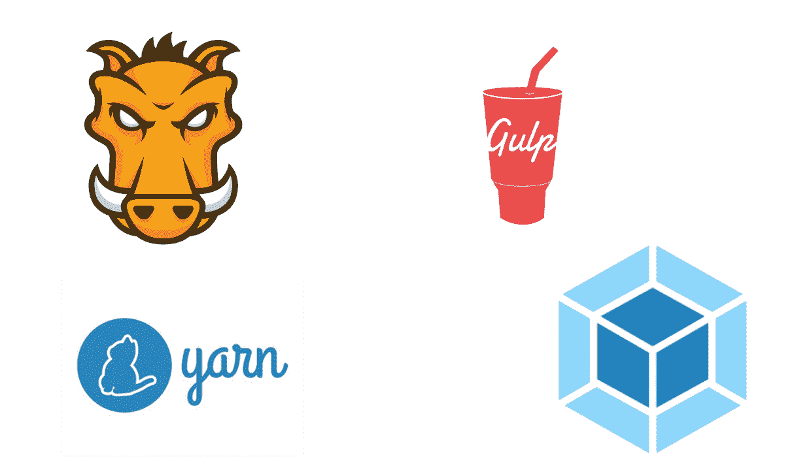

# 面向前端开发人员的工具和现代工作流

> 原文：<https://blog.logrocket.com/tools-and-modern-workflow-for-front-end-developers-505c7227e917/>



最近出现了不同的工具和工作流，以使前端开发过程更容易——其中一种工具被称为`build tool`。在本教程中，我们将探索什么是构建工具以及如何使用它们。我们会看看 NPM 脚本，咕噜，吞咽和网络包。我们还将讨论如何根据您的项目需求选择要使用的构建工具。

[](https://logrocket.com/signup/)

### 先决条件

大多数构建工具都构建在`NODE and NPM`之上。在本教程中，NPM T2 的基本知识是假定的，但不是必需的，因为我们也将介绍 NPM。本教程确实需要关于 **HTML** 、 **CSS** 和 **JavaScript** 的基础知识。

### NPM

**NPM** (节点包管理器)是一个预装 Node.js 的 JavaScript 包管理器，即使使用它不需要 Node.js 技能。NPM 的主要功能是运行一个简单的任务，比如浏览器同步，从你的`package.json`文件中动态加载库和样式表。NPM 安装了一个`node_modules`文件夹，这样你就可以从不同的安装包中运行更多的命令。任何本机 CLI 任务都可以使用正确的对象在脚本中完成。让我们看一些例子。

### 使用

默认情况下，`NPM`预装了`NODE`。所以不需要安装不同的。要使用`npm scripts`，你所要做的就是初始化它。创建一个名为`npm_test`的新文件夹，然后初始化 NPM 来创建一个`package.json`文件。在您的终端中键入`npm init`，然后按照提示进行操作。完成后，您应该会在项目文件夹中看到一个`package.json`文件。该文件应该如下所示:

```
{
      "name": "npm_tests",
      "version": "1.0.0",
      "description": "",
      "main": "index.js",
      "scripts": {
        "test": "echo \"Error: no test specified\" && exit 1"
      },
      "author": "",
      "license": "ISC"
    }
```

如您所见，`index.js`被定义为主脚本，也就是我们应用程序的入口点。我们需要创建该文件，并告诉 NPM 如何启动我们的应用程序。首先，创建一个名为`index.js`的空白文件，然后更新`package.json`文件中的`scripts`对象，如下所示:

```
"scripts": {
        "start": "node index.js"
     },
```

这告诉 node，每当我们在终端中键入命令`npm start`时，它应该启动`index.js`文件。在您的`index.js`文件中，让我们放一个简单的日志消息。添加以下代码:

```
console.log('This is index.js')
```

现在，在您的终端中键入`npm start`，您应该会看到以下输出:

```
$ npm start
    > [email protected] start /home/user/frontend/npm_tests
    > This is index.js
```

虽然这个例子不太可靠。稍后，当我们讨论其他构建工具时，我们将看到如何使用`npm scripts`来执行其他有用的命令，如安装依赖项、测试等。

### 故事

Yarn (Yarn Package Manager)是脸书创建的另一个 JavaScript 包管理器。随着时间的推移，它被认为是一个更快和更可靠的替代 NPM，因为他们有类似的语法和功能。Yarn 也安装来自`NPM Registry`的包，所以任何`NPM Package`也可以安装 Yarn。Yarn 对管理包有不同的理念。让我们来看看其中的一些。

### 使用

纱线和 NPM 的功能基本相同。虽然它们的功能相似，但它们的语法不同。要了解如何安装和使用纱线，请遵循第[页](https://yarnpkg.com/lang/en/docs/install/#debian-stable)的说明。

**NPM 还是纱？**许多人认为(并且测试已经证明)`Yarn`比`npm`更快，然而，大多数人仍然使用`npm`,我们将讨论的大多数构建工具默认支持`npm`。然而，选择要使用的工具主要是开发人员和项目需求的功能。请务必选择最适合您项目需求的工具。

### 咕哝

Grunt 是一个构建在**节点之上的 JavaScript 任务运行器。Js 和 NPM** 。它的主要功能是优化并帮助您减少项目中的所有重复性任务，如加载 JavaScript 资源、样式表、林挺和调试。因为`GRUNT`是建立在`NPM`之上的，所以它是用一个`package.json`文件初始化的，但是任务是在一个`Grunt.js`文件中定义的。

**N/B:**`**'G'**`**`**Grunt.js**`**中必须大写。**让我们看看如何利用它来促进我们的发展:**

 **### 使用

要使用 grunt，我们首先需要安装它。在你的终端输入`npm install -g grunt`。这将在你的机器上全局安装 **grunt** 。接下来，创建一个名为`grunt_test`的文件夹，并初始化一个`package.json`文件。在您的终端中键入`npm init`并按照提示创建文件。现在你的`package.json`文件应该是这样的:

```
{
      "name": "grunt_test",
      "version": "1.0.0",
      "description": "",
      "main": "app.js",
      "scripts": {
        "test": "echo \"Error: no test specified\" && exit 1"
      },
      "author": "",
      "license": "ISC"
    }
```

接下来，我们需要安装 Grunt 作为一个依赖项。在你的终端输入`npm install --save grunt`。该命令会将 grunt 安装为一个依赖项，您的`package.json`文件现在将如下所示:

```
{
      "name": "grunt_test",
      "version": "1.0.0",
      "description": "",
      "main": "index.js",
      "scripts": {
        "test": "echo \"Error: no test specified\" && exit 1"
      },
      "author": "",
      "license": "ISC",
      "dependencies": {
        "grunt": "^1.0.3"
      }
    }
```

既然`grunt`安装好了，那就用吧。创建一个空的`gruntfile.js`文件。为了使用这个文件，我们需要设定一个目标，假设我们有几个包含代码的文件，我们想把它们编译成一个。为此，我们需要使用插件(插件是为工具增加额外功能的代码片段)。为了实现我们的目标，我们将使用一个名为`grunt-contrib-concat`的插件。要安装插件，请在您的终端中键入以下内容:

```
npm install grunt-contrib-concat --save-dev
```

现在让我们付诸行动。创建一个名为`js`的文件夹，然后创建两个文件`main1.js`和`main2.js`，并添加以下代码:

```
/** this is main1.js **/
```

对`main2.js`做同样的操作。现在，在您的`gruntfile.js`文件中添加以下代码行:

```
module.exports = function(grunt){

      grunt.initConfig({
       concat: {
        dist: {
          src: ['js/main1.js', 'js/main2.js'],
          dest: 'dist/js/built.js',
         },
        },
      });

      grunt.loadNpmTasks('grunt-contrib-concat');
    };
```

该任务指示 grunt 将文件从`main1.js`和`main2.js`复制到名为`dist/built.js`的文件夹/文件中。虽然这个文件还没有创建，但是`grunt`会自动为我们创建它。在你的终端键入`grunt concat`:

```
$ grunt concat
    Running "concat:dist" (concat) task
    Done
```

现在，您将看到一个新文件夹已经创建完毕`dist/built.js`:

```
/** this is main one */
    /** this is main two */
```

这表明它将两个文件的内容加在了一起。当你有很多 JavaScript 风格时，这是非常强大的，它将通过把所有代码编译成一个文件来帮助优化你的网站。grunt 还有很多其他的功能和用途，你可以在这里找到它们[。](https://gruntjs.com/plugins)

### 吞咽

Gulp.js 是构建在 Node.js 和 NPM 之上的另一个 JavaScript 任务运行器。它的主要功能是帮助您减少项目中所有重复的任务。Gulp 是一个前端构建系统，所以不管使用什么前端技术(Vue、React 或 Angular ),它仍然可以以最佳方式工作和执行。它也由一个`package.json`文件管理，并内置了对各种插件的支持，这些插件有助于执行各种任务。

### 使用

Gulp 构建在`node strings`之上，以`pipelines`的形式处理数据。创建一个名为`gulp_test`的文件夹，初始化一个 **package.json** 文件。在您的终端中键入`npm init`并按照提示初始化文件。您的 **package.json** 现在看起来像这样:

```
{
      "name": "gulp_test",
      "version": "1.0.0",
      "description": "",
      "main": "index.js",
      "scripts": {
        "test": "echo \"Error: no test specified\" && exit 1"
      },
      "author": "",
      "license": "ISC"
    }
```

要使用`gulp`，我们必须将其作为项目依赖项安装。在你的终端输入`npm install --save-dev gulp`。这将把它保存为一个项目依赖，你的`package.json`文件将会是这样的:

```
{
      "name": "gulp_test",
      "version": "1.0.0",
      "description": "",
      "main": "index.js",
      "scripts": {
        "test": "echo \"Error: no test specified\" && exit 1"
      },
      "author": "",
      "license": "ISC",
      "devDependencies": {
        "gulp": "^4.0.0"
      }
    }
```

为了创建任务，我们必须创建一个名为`gulpfile.js`的文件，并向其中添加代码。**大口**有四个顶级功能:

*   **gulp.task** —设置运行 gulp 的任务
*   **gulp.src** —告诉 gulp 要使用的文件
*   **gulp.dest** —告诉 gulp 输出文件的位置
*   **gulp.watch** —告诉 gulp 注意更新

让我们创建虚拟 HTML。首先，创建一个`src`文件夹，并将这两个文件添加到其中。`index.html`和`test.html`然后向其中添加以下代码:

```
<html>
        <head>
            <title>Gulp Test</title>
        </head>
        <body>
            <h2>This is for a test</h2>
        </body>
    </html>
```

我们来设定一些任务。在您的 **gulp.js** 文件中添加以下代码行:

```
const gulp = require('gulp');

    gulp.task('compileHtml', function(done){
      gulp.src('src/*.html')
      .pipe(gulp.dest('build'));
      done();
    });
```

这个命令告诉 gulp 将所有文件从`src`目录复制到一个构建目录。我们创建了一个函数`compileHtml`，当我们想要运行我们的任务时，我们将参考这个函数。在你的终端键入`gulp compileHTml`。现在可以看到已经创建了一个`build`文件夹，其中包含文件。接下来，让我们使用一个`gulp`插件来缩小我们的 Javascript。首先，我们需要安装插件。要查看`gulp`插件列表，请点击查看[。](https://gulpjs.com/plugins/)

首先，让我们创建一个名为`js`的文件夹，并在其中创建一个测试文件`test.js`。接下来，我们需要安装一个名为`uglify`的插件来帮助我们缩小文件。在终端键入`npm install --save-dev gulp-uglify`。这将把它作为一个依赖项安装在我们的项目中。现在在你的`gulpfile.js`中更新代码为:

```
const gulp = require('gulp');
    const uglify = require('gulp-uglify');

    gulp.task('compileHtml', function(done){
      gulp.src('src/*.html')
      .pipe(gulp.dest('build'));
      done();
    });

    gulp.task('minify', function(done){
      gulp.src('src/js/*.html')
      .pipe(uglify())
      .pipe(gulp.dest('build/js'));
      done();
    });
```

### 网络包

Webpack 是一个前端构建工具。更准确地说，它被定义为一个`Module Bundler`。Webpack 的功能不仅仅是将不同的模块转换成静态资产。Webpack 使捆绑代码、将所有旧的 **JS** 代码转换成 **ES6** 、加载开发依赖、运行自动化任务和管理项目变得容易。使用 Webpack，您可以加载自定义文件或由`NPM`安装的文件。Webpack 的基本功能可以通过使用`plugins and loaders` `css` `sass` `jsx` `CoffeeScript`扩展为更复杂的功能，这些都是常见的 Webpack 加载器的例子。

### 使用

要使用 Webpack，我们必须先安装它。我们可以通过终端输入`npm install -g Webpack`来安装。此命令将在您的计算机上全局安装 Webpack。接下来，让我们创建一个文件夹来使用。创建一个文件夹`webpacktest`并初始化一个`package.json`文件。在您的终端中键入`npm init`并按照提示创建文件。现在 **package.json** 文件应该是这样的:

```
{
      "name": "webpacktest",
      "version": "1.0.0",
      "description": "",
      "main": "app.js",
      "scripts": {
        "test": "echo \"Error: no test specified\" && exit 1"
      },
      "author": "",
      "license": "ISC"
    }
```

现在我们有了它的设置，让我们做一些事情。假设我们想在我们的新项目中使用`JQuery`库，我们可以这样做。首先，我们需要安装`JQuery`。在你的终端键入`npm install --save jquery`。如果这是成功的，您的`package.json`文件将看起来像这样:

```
{
      "name": "webpacktest",
      "version": "1.0.0",
      "description": "",
      "main": "app.js",
      "scripts": {
        "test": "echo \"Error: no test specified\" && exit 1"
      },
      "author": "",
      "license": "ISC",
      "dependencies": {
        "jquery": "^3.3.1"
      }
    }
```

您可以看到`JQuery`已经作为一个依赖项被安装。现在，为了使用它，我们需要创建文件。首先，让我们创建一个将加载到浏览器中的 HTML 文件。创建一个`index.html`文件，并向其中添加以下代码行:

```
<html>
        <head>
            <title>WebPack Test</title>
        </head>
        <body>

            <script src="bundle.js"></script>
        </body>
    </html>
```

你可以看到我们调用了一个名为`bundle.js`的文件，尽管它还没有被创建。当我们运行我们的`Webpack`命令时， **Webpack** 会自动将我们告诉它的所有代码编译到那个文件中。现在创建一个`app.js`文件，并添加以下代码行:

```
let $ = require('jquery');

     $('body').append("<h1>Hey there! This is JQUERY</h1>");
```

这里我们在项目中需要`JQuery`，然后我们使用`append` JQuery 函数将数据添加到页面中。要查看这个，输入`webpack --mode=development app.js -o bundle.js`。完成后，在浏览器中打开您的**index.html**文件，您将看到以下内容:


这意味着 Webpack 成功捆绑了代码，导入了`JQuery`库供我们使用。你已经可以看到这是多么的有益，就好像我们必须导入十个依赖关系一样 **Webpack** 让我们可以将所有的依赖关系添加到一个文件中，而不是单个文件。让我们使用有用的数据。创建一个`books.js`文件，并向其中添加以下代码行:

```
let books = [
     { name: "Hey there my name is awesome"},
     { name: "The mythical man month"},
     { name: "Please don't make me think"}
    ]

    module.exports = books;
```

接下来，更新您的`app.js`,如下所示:

```
let $ = require('jquery');
    let books = require('./books.js');

    $.each(books, function(key, value){
      $('body').append("<h1>"+ books[key].name +"</h1>");
    })
```

在这里，我们从`books.js`文件导入书籍，并使用特殊的 **JQuery** 函数将它动态添加到我们的 HTML 页面。现在，如果您运行命令`webpack --mode=development app.js -o bundle.js`，您将在页面上看到:


在你的终端输入`webpack --mode=development app.js -o bundle.js --watch`。现在你所做的任何改变 **Webpack** 都会自动监视并更新 **bundle.js** 文件。最后，让我们看看如何向页面添加样式。为了在 Webpack 中使用 **CSS 或 SASS** ，我们必须使用**加载器**。让我们安装它。在你的终端输入`npm install --save-dev css-loader style-loader`。您的 **package.json** 文件现在将如下所示:

```
{
      "name": "webpacktest",
      "version": "1.0.0",
      "description": "",
      "main": "app.js",
      "scripts": {
        "test": "echo \"Error: no test specified\" && exit 1"
      },
      "author": "",
      "license": "ISC",
      "dependencies": {
        "jquery": "^3.3.1"
      },
      "devDependencies": {
        "css-loader": "^2.0.1",
        "style-loader": "^0.23.1"
      }
    }
```

你可以看到两个加载器都被安装为**开发依赖**供我们使用。让我们创建一个样式表，并向其中添加基本样式。创建一个`styles.css`文件，并向其中添加以下代码行:

```
body {
      background: yellow;
    }
```

现在更新您的`app.js`文件，如下所示:

```
require('!style-loader!css-loader!./styles.css');
    let $ = require('jquery');
    let books = require('./books.js');

    $.each(books, function(key, value){
      $('body').append("<h1>"+ books[key].name +"</h1>");
    })
```

现在，由于 **Webpack** 处于观察模式，刷新您的浏览器，您会看到:


现在我们已经看到了如何使用 Webpack 以及它如何帮助开发。还有很多 Webpack 命令、技术和插件需要探索，你可以在这里找到它们[。](https://webpack.js.org/concepts/)

### 结论

在本教程中，我们讨论了不同的构建工具以及它们如何帮助改进我们的开发。所有这些工具都很棒，适合某些用例。但是，尽量不要花太多时间考虑使用哪种工具。只需定义您的项目需求，然后尝试使用最适合该需求且不太难设置和上手的工具。谢了。编码快乐！

## 200 只显示器出现故障，生产中网络请求缓慢

部署基于节点的 web 应用程序或网站是容易的部分。确保您的节点实例继续为您的应用程序提供资源是事情变得更加困难的地方。如果您对确保对后端或第三方服务的请求成功感兴趣，

[try LogRocket](https://lp.logrocket.com/blg/node-signup)

.

[](https://lp.logrocket.com/blg/node-signup)[https://logrocket.com/signup/](https://lp.logrocket.com/blg/node-signup)

LogRocket 就像是网络和移动应用程序的 DVR，记录下用户与你的应用程序交互时发生的一切。您可以汇总并报告有问题的网络请求，以快速了解根本原因，而不是猜测问题发生的原因。

LogRocket 检测您的应用程序以记录基线性能计时，如页面加载时间、到达第一个字节的时间、慢速网络请求，还记录 Redux、NgRx 和 Vuex 操作/状态。

[Start monitoring for free](https://lp.logrocket.com/blg/node-signup)

.**