# 智能合同自动化工具

> 原文：<https://blog.logrocket.com/tools-smart-contract-automation-guide/>

智能合同不是自动执行的；它们的执行完全依赖于在区块链网络上进行的链上事务，作为触发函数调用的动作调用。然而，手动执行智能合约也有缺点，例如潜在的安全风险、不必要的延迟以及人为错误的可能性。

本文探讨了智能合同自动化的核心概念，并回顾了各种智能合同自动化工具的优缺点。此外，本指南还展示了流行的智能合同自动化工具所使用的流程:[链节管理员](https://chain.link/keepers)、[意式冰淇淋网络](https://www.gelato.network)和 [OpenZeppelin Defender](https://www.openzeppelin.com/defender) 。

*向前跳转:*

## 先决条件

要阅读本文，请确保您具备以下条件:

## 了解智能合同自动化

在智能合同自动化出现之前，开发人员使用集中式服务器来实施各种手动流程，如基于时间的执行、开发运维任务、离线计算和清算。

手动流程增加了智能合约的安全风险，因为它们为分散的应用程序引入了一个中心故障点。此外，通常由手动流程导致的网络拥塞会延迟交易的执行，使用户资金面临风险。

智能合同自动化使我们能够自动化一些 Web3 功能，如产量农业、跨链 NFT 铸造、低抵押贷款清算、游戏等。

现在我们已经对智能合同自动化有了一个概述，让我们回顾一些流行的智能合同自动化工具，并了解它们是如何工作的。

## 链节保持器

Chainlink Keepers 是一款智能合同自动化工具，可以在多个区块链上运行，例如[以太坊](https://ethereum.org/en/)、 [BNB 链](https://www.bnbchain.org/en)和[多边形](https://polygon.technology/)。该工具使外部拥有的帐户能够对智能合约中的预定条件进行检查，然后根据时间间隔触发和执行交易。

例如，开发人员可以通过监控 Keepers 网络上的条件来注册自动维护的智能合同。随后，节点在 Keepers 网络上执行链外计算，直到满足智能契约中定义的条件。

如果不满足智能合同条件，计算将返回值`false`，节点继续工作。如果智能合同条件得到满足，计算返回一个值`true`，Keepers 网络触发合同执行。

链节保持器提供了许多好处:

*   轻松集成:Chainlink Keepers 的用户友好文档包括操作指南，帮助开发人员加快集成速度
*   **安全性和可靠性**:链节保持器的分散特性通过降低与集中式服务器相关的安全风险，为应用程序提供了一个安全的框架。Chainlink Keepers 使用透明池进行操作，有助于在开发者和 Dao 之间建立信任
*   **成本效率**:链节管理器的基础设施提供了优化成本和提高与执行智能合同相关的天然气费用稳定性的功能
*   **提高生产力** : Chainlink Keepers 处理运行智能合同检查的链外计算，让开发人员有更多时间专注于构建 DApps

### 演示:使用链接保持器自动执行智能合约

让我们研究一下如何用链接保持器来自动化智能合约。我们将使用一个构建在 Remix online IDE 上的 Solidity 契约，并部署到 Rinkeby 测试网络。智能契约将实现链节保持器 [GitHub 库](https://github.com/smartcontractkit/chainlink/blob/develop/contracts/src/v0.8/interfaces/KeeperCompatibleInterface.sol)中定义的接口。

为了与链节保持器兼容，我们的智能契约必须包括以下两种方法:

*   `checkUpKeep()`:该方法对基于时间间隔执行的智能合约进行链外计算；该方法返回一个布尔值，告诉网络是否需要维护
*   `performUpKeep()`:该方法接受从`checkUpKeep()`方法返回的消息作为参数。接下来，它触发链节守护者对智能契约进行维护。然后，它执行一些链上计算来重新验证来自`checkUpKeep()`方法的结果，以确认维护是需要的

首先，添加以下代码，在 Remix IDE 中创建一个简单的计数器契约:

```
// SPDX-License-Identifier: MIT
pragma solidity ^0.8.7;

contract Counter {

   uint public counter;

   uint public immutable interval;
   uint public lastTimeStamp;

   constructor(uint updateInterval) {
     interval = updateInterval;
     lastTimeStamp = block.timestamp;

     counter = 0;
   }

   function checkUpkeep(bytes calldata /* checkData */) external view returns (bool upkeepNeeded /* bytes memory  performData */) {
       upkeepNeeded = (block.timestamp - lastTimeStamp) > interval;

       // We don't use the checkData in this example. The checkData is defined when the Upkeep was registered
   }

   function performUpkeep(bytes calldata /* performData */) external {
       //We highly recommend revalidating the upkeep in the performUpkeep function
       if ((block.timestamp - lastTimeStamp) > interval ) {
           lastTimeStamp = block.timestamp;
           counter = counter + 1;
       }

       // We don't use the performData in this example. The performData is generated by the Keeper's call to your checkUpkeep function
   }
}

```

这个契约有一个公共变量`counter`,当新块和最后一个块之间的差大于一个间隔时，该变量加 1。然后，它实现了两个 Keepers 兼容的方法。

现在，导航到**混音菜单**按钮(从顶部数第三个按钮)并点击**编译**按钮(用绿色验证标记表示)来编译合同:

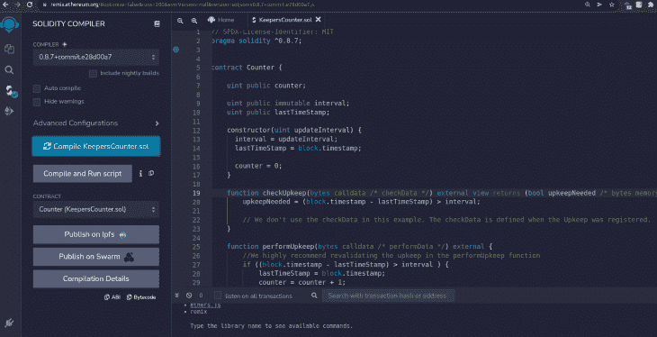

要继续，你需要用一些 [ERC-677 链接令牌](https://docs.chain.link/docs/link-token-contracts/)来支付你的维持费。使用水龙头连接你的 Rinkeby 测试网络，[在 chainlink](https://faucets.chain.link) 上获得一些 testnet LINK 令牌:

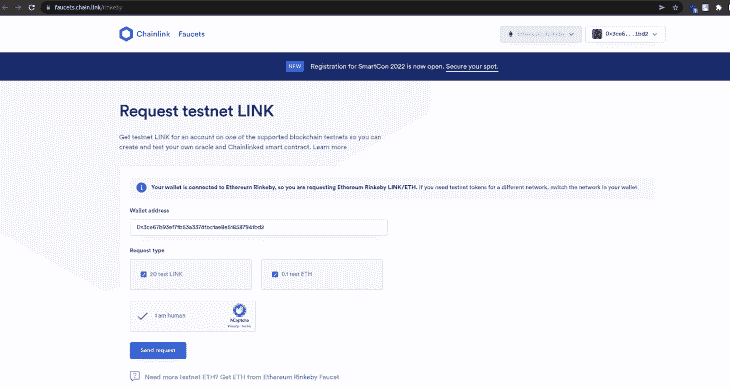

选择**注入 Web3** 作为环境，选择 **Rinkeby 测试网络**。然后点击**发送请求**获得 20 个测试链接和 0.1 个测试 ETH 发送到你的钱包。

接下来，通过将 30 秒作为间隔来部署契约。一旦您点击 **Deploy** ，MetaMask 就会打开，要求您确认交易。

点击 MetaMask 钱包中的**确认**:

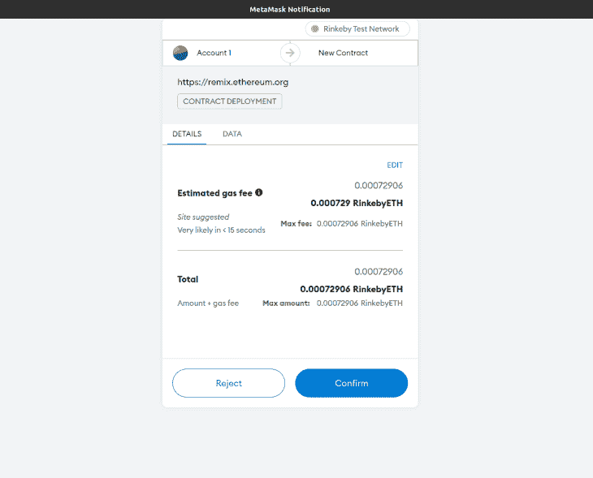

现在，您可以查看您部署的合同地址:

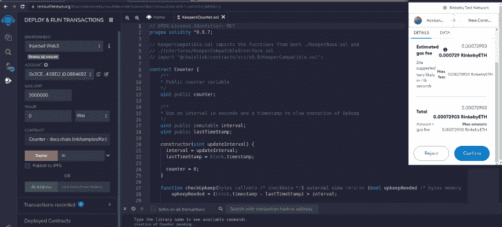

接下来，导航到 Chainlink Keepers，通过选择基于**时间的**触发器选项并输入您部署的智能合约的地址来注册您部署的智能合约:

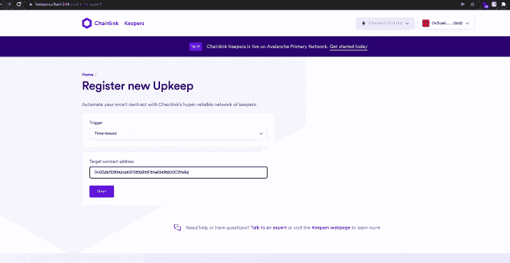

从你的混音 IDE 中复制你的合同的 ABI，并将其粘贴到 **ABI** 字段:

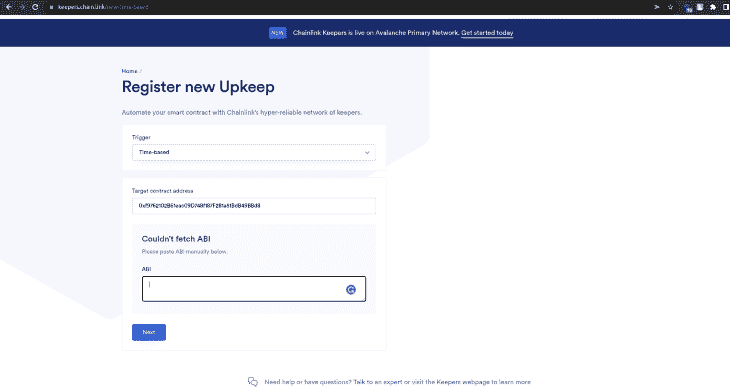

现在，在**功能输入**字段中输入您的合同地址:

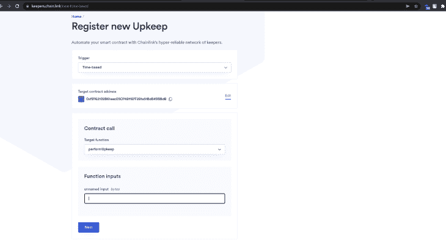

指定链节守护者对你的智能契约进行维护的时间表。在 **Cron expression** 字段中，指示维护应该每 15 分钟进行一次。

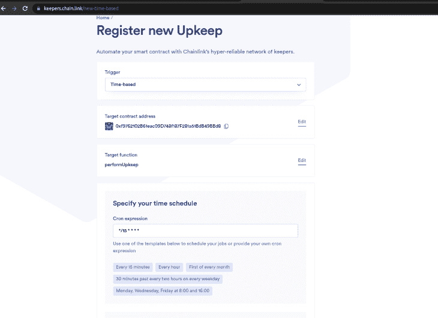

接下来，通过在以下字段中输入适当的信息来提供您的维护细节:**维护**名称、**气体限制**、**链接令牌的开始余额**，以及**您的电子邮件地址**。然后，点击**注册维护**:

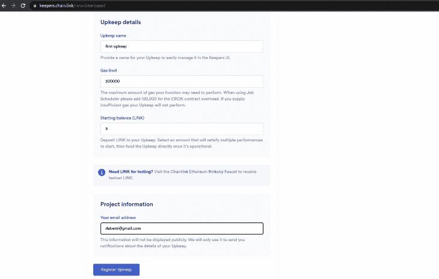

就是这样！Chainlink Keepers 已成功注册您的自动维护智能合约。

## 意式冰淇淋网络

意式冰淇淋网络是一个分散的机器人网络，在所有 EVM 区块链上自动执行智能合同。意式冰淇淋易于使用的架构为 DeFi 应用提供了可靠的接口。

### 演示:自动化与意式冰淇淋的智能合同

要自动执行与意式冰淇淋网络的智能合同，请执行以下步骤:

1.  在 Remix IDE 上创建一个实现计数器的新智能合约
2.  编译智能合同并将其部署到 Rinkeby 测试网络
3.  将您的 MetaMask 钱包连接到意式冰淇淋网络并存款
4.  使用部署的合同地址和一些配置在意式冰淇淋上创建一个任务

我们开始吧！

在您的 Remix IDE 上，创建一个带有`GelatoContract.sol`文件的`gelato`文件夹，该文件定义了一个函数，该函数基于以下条件递增计数器变量:

```
// SPDX-License-Identifier: MIT
pragma solidity ^0.8.7;

contract Counter {
   uint public counter;

    uint public immutable interval;
   uint public lastTimeStamp;

   constructor(uint updateInterval) {
     interval = updateInterval;
     lastTimeStamp = block.timestamp;

     counter = 0;
   }

   function incrementCounter() external {
        if ((block.timestamp - lastTimeStamp) > interval ) {
           lastTimeStamp = block.timestamp;
           counter = counter + 1;
       }
   }
}

```

编辑合同并导航至[意式冰淇淋网络](https://app.gelato.network/)。从右上方的下拉列表中选择林克比网络。然后，连接您的钱包:

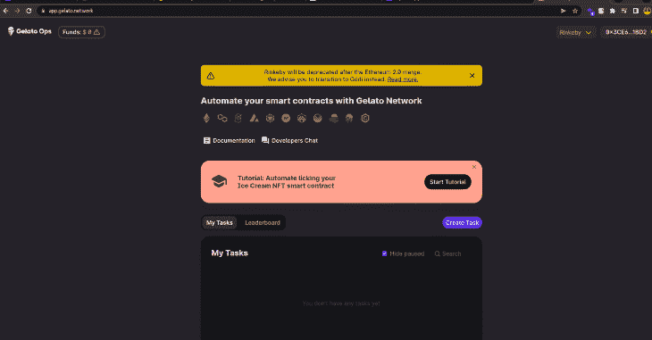

接下来，点击**资金**，添加 0.1 ETH 的存款:


一旦您点击**存款**，MetaMask 将打开。点击**确认**，屏幕上会出现一条信息，提示交易成功。

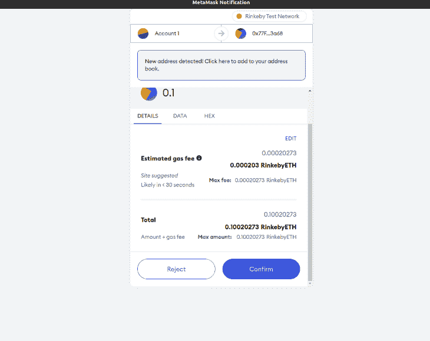

接下来，一些 ETH 将被添加到你的余额中。

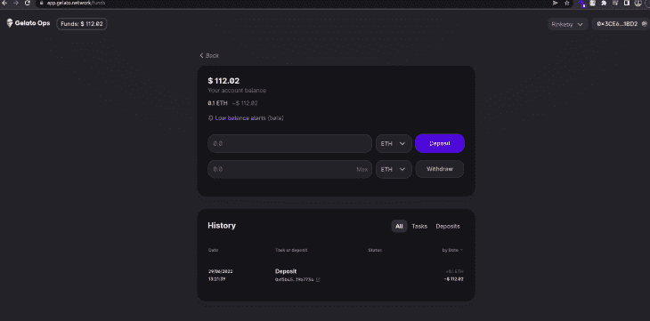

现在，返回 Remix IDE，在 Rinkeby 测试网络上部署你的契约，间隔 30 秒。

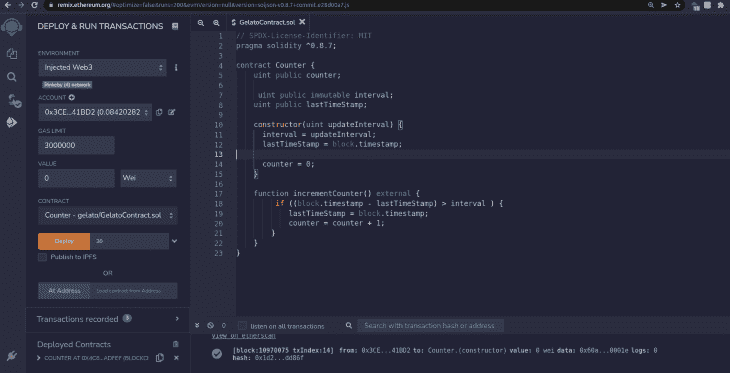

通过传递您部署的合同地址并将您的合同的 ABI 粘贴到 **ABI** 字段来创建一个新任务。

然后，从要自动化的**功能**下拉菜单中选择`incrementCounter()`功能。

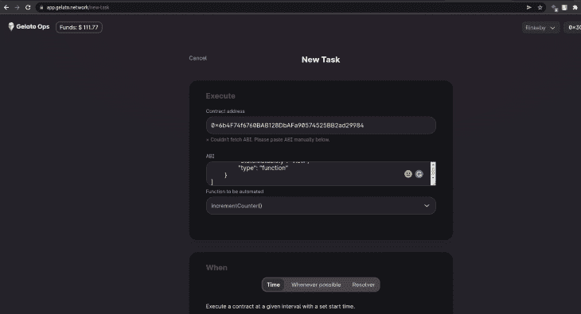

选择五分钟一次的频率，让意式冰淇淋自动执行您的智能合约。然后，选择**立即开始**复选框，指示意式冰淇淋在您创建任务后立即执行您的智能合同。

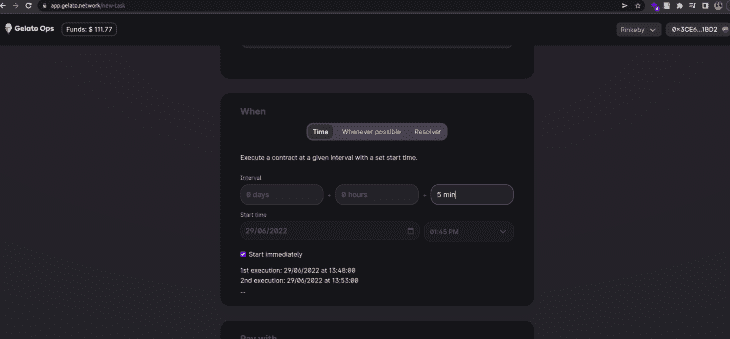

选择任务的支付方式，点击**创建任务**，并在 MetaMask 上确认您的交易。

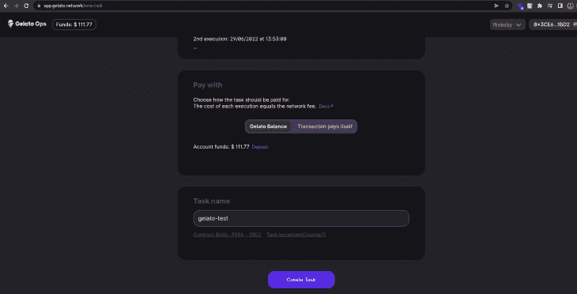

在你的 Remix IDE 上，如果你点击**计数器**，你会注意到它已经增加了 1，并将继续每五分钟递增一次:

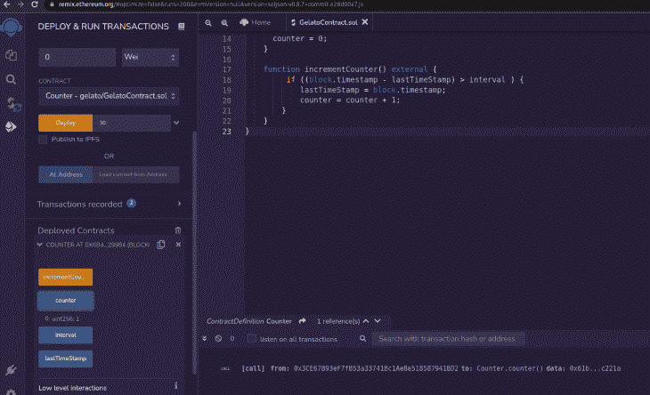

好了，您已经成功地在意式冰淇淋上为您的智能合约设置了自动化！

## OpenZeppelin 防御者

OpenZeppelin 是一个用于构建安全的分散式应用程序的流行工具。Defender 是一款 OpenZeppelin 产品，专为安全智能合同自动化而设计，支持第 1 层区块链、第 2 层区块链和侧链。

OpenZeppelin Defender 提供了以下与智能合同自动化相关的功能:

*   [**Admin**](https://docs.openzeppelin.com/defender/admin) :实现智能合同流程的透明管理，如访问控制(对资产的管理权限)、升级(修复遇到的错误或应用新服务)和暂停(使用暂停功能)
*   [**中继**](https://docs.openzeppelin.com/defender/relay) :允许创建中继(外部拥有的帐户)，轻松保护您的私有 API 密钥，用于签名、管理(发送)您的交易，以及强制执行汽油价格上限等政策
*   [**自动任务**](https://docs.openzeppelin.com/defender/autotasks) :连接到中继，允许在外部 Web APIs 或第三方服务的帮助下，以 JavaScript 编写和调度将在智能合约上定期运行的代码脚本
*   [](https://docs.openzeppelin.com/defender/sentinel)**:监控您的智能合约交易，并根据指定的条件、功能或事件提供交易通知**
***   [**顾问**](https://docs.openzeppelin.com/defender/advisor) :帮助您了解最新的安全最佳实践，包括智能合约开发、监控、运营和测试的安全程序的实施**

 **### 演示:使用 OpenZeppelin Defender 自动执行智能合同

现在，让我们使用上述特性来自动化与 OpenZeppelin Defender 的智能合约。

首先，在你的 Remix IDE 上创建一个智能合约。使用之前使用的相同代码，但给它一个新名称，并将其放在不同的文件夹中:

```
// SPDX-License-Identifier: MIT
pragma solidity ^0.8.7;

contract Counter {
   uint public counter;

    uint public immutable interval;
   uint public lastTimeStamp;

   constructor(uint updateInterval) {
     interval = updateInterval;
     lastTimeStamp = block.timestamp;

     counter = 0;
   }

   function incrementCounter() external {
        if ((block.timestamp - lastTimeStamp) > interval ) {
           lastTimeStamp = block.timestamp;
           counter = counter + 1;
       }
   }
}

```

将合同部署到 Rinkeby 测试网络，并在 MetaMask 上确认您的交易。然后，执行以下步骤:

#### 步骤 1:创建继电器

导航到 [OpenZeppelin Defender 中继仪表板](https://defender.openzeppelin.com/#/relay)，通过提供**名称**并选择**网络**来创建您的中继:

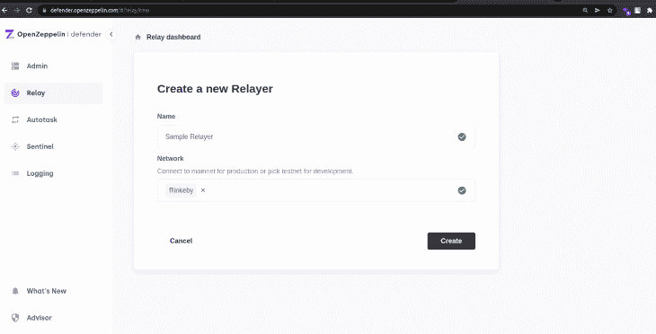

一旦你创建了你的中继器，你的 ETH 地址，API 密匙和秘密密匙将会出现在你的屏幕上。复制你的密钥，保存在某个安全的地方，然后复制你的 ETH 地址。

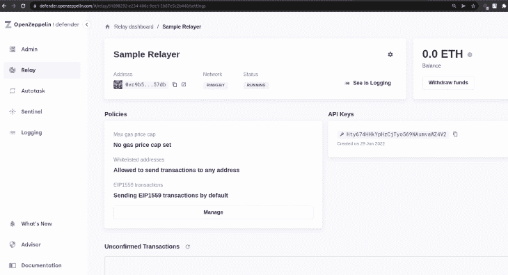

接下来，通过将你的地址粘贴在一个水龙头上，为你的中继地址注入一些 ETH。然后，咨询您的中继站，确认 ETH 已发送到您的 OpenZepplin 帐户:

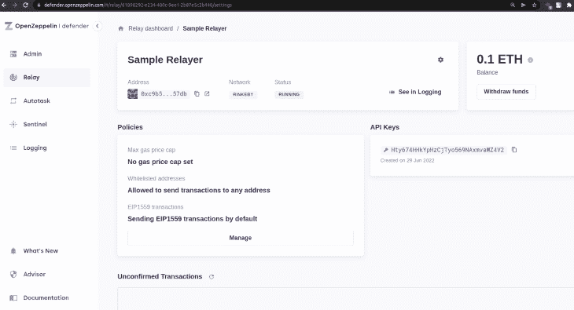

#### 步骤 2:创建自动任务

接下来，在 [Defender 自动任务仪表板](https://defender.openzeppelin.com/#/autotask)中创建一个自动任务，该自动任务将连接到您刚刚创建的中继器。

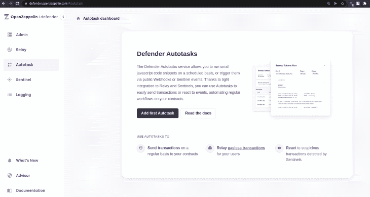

点击**添加第一个自动任务**；您可以选择通过调度或 HTTP 请求来触发任务。对于此演示，选择**日程**，选择每时间段运行**两分钟，并在**连接到继电器**字段中添加您的继电器名称。**

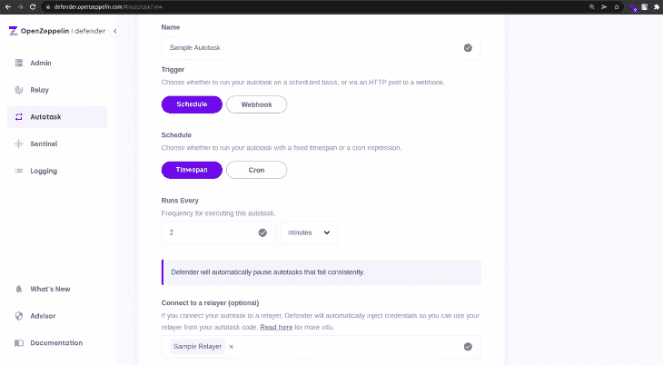

现在，传递使用 [ethers.js](https://docs.ethers.io/v5/) 和 [defender-relay-client](https://www.npmjs.com/package/defender-relay-client) 导出用于签名和发送交易的`DefenderRelaySigner`和`DefenderRelayProvider`的 JavaScript 代码片段。

以下代码片段调用并执行智能合约中定义的`incrementCounter()`函数:

```
const { DefenderRelaySigner, DefenderRelayProvider } = require('defender-relay-client');
const { ethers } = require("ethers");
const ABI = [`function incrementCounter() external`];

const ADDRESS = '0xC1C23C07eC405e7dfD0Cc4B12b1883b6638FB077'

async function main(signer) {
        const contract = new ethers.Contract(ADDRESS, ABI, signer);
          await contract.incrementCounter();
          console.log('Incremented counter by 1');
}

exports.handler = async function(params) {
        const provider = new DefenderRelayProvider(params);
          const signer = new DefenderRelaySigner(params, provider, { speed: 'fast' })
    console.log(`Using relayer ${await signer.getAddress()}`);
          await main(signer);
}openzepp

```

点击**自动询问**。然后，将上述代码片段复制粘贴到仪表盘的**代码**部分:

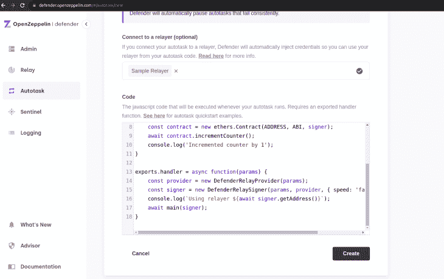

点击**创建**按钮，Autotask 将每两分钟自动执行一次`incrementFunction()`，继电器中有 ETH 余额。

一旦自动任务开始运行，检查你的混音 IDE 上的计数器。两分钟后，它应该增加 1。


## 使用链节守护者，意式冰淇淋，和开放齐柏林后卫的利与弊

链锁守护者、意式冰淇淋网络和 OpenZeppelin Defender 都是智能合同自动化的好选择。以下是为您的项目选择智能合同自动化工具时要记住的一些权衡。

| 智能合同自动化工具 | 赞成的意见 | 骗局 |
| 链节保持器 | –在多个区块链网络上运行
–提供全面的文档 | –需要链接令牌(ERC-677)来支付网络费用
–智能合约必须与链节管理器兼容
–链接令牌使用 ERC-677 令牌标准，不能直接在非以太坊区块链上使用，如 BNB 链和多边形(MATIC)，直到它们被桥接和交换 |
| 意式冰淇淋网络 | –提供两种支付智能合同自动化的选择
–支持众多区块链网络
–易于使用的架构 | –任务创建后不能编辑 |
| OpenZeppelin 防御者 | –支持多个区块链网络
–通过指定的通知模式(例如，电子邮件)提供有关交易的快速通知
–提供一种透明的方式来轻松管理任务 | –与其他智能合同自动化工具相比，使用起来更复杂 |

## 结论

实现许多智能合同功能的自动化可以节省时间并提高安全性。在本文中，我们回顾了一些流行的智能合同自动化工具(Chainlink Keepers、意式冰淇淋网络和 OpenZeppelin Defender)，讨论了它们的优缺点，并演示了如何使用每种工具自动化智能合同。

## 加入像 Bitso 和 Coinsquare 这样的组织，他们使用 LogRocket 主动监控他们的 Web3 应用

影响用户在您的应用中激活和交易的能力的客户端问题会极大地影响您的底线。如果您对监控 UX 问题、自动显示 JavaScript 错误、跟踪缓慢的网络请求和组件加载时间感兴趣，

[try LogRocket](https://lp.logrocket.com/blg/web3-signup)

.

[](https://lp.logrocket.com/blg/web3-signup)[https://logrocket.com/signup/](https://lp.logrocket.com/blg/web3-signup)

LogRocket 就像是网络和移动应用的 DVR，记录你的网络应用或网站上发生的一切。您可以汇总和报告关键的前端性能指标，重放用户会话和应用程序状态，记录网络请求，并自动显示所有错误，而不是猜测问题发生的原因。

现代化您调试 web 和移动应用的方式— [开始免费监控](https://lp.logrocket.com/blg/web3-signup)。**