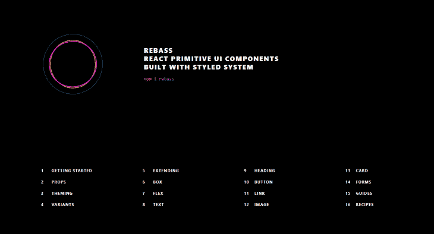
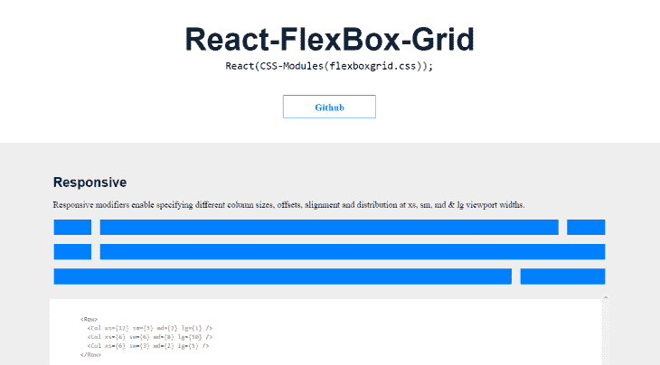
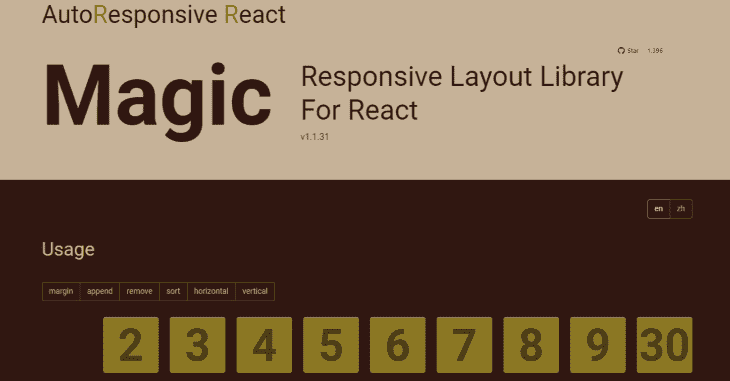
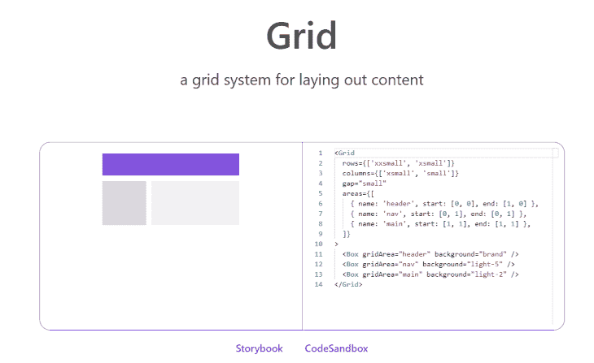
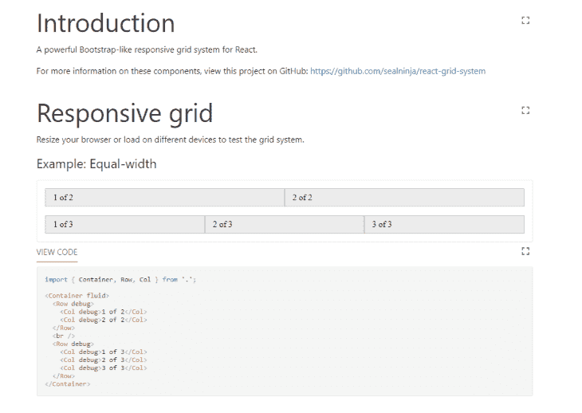
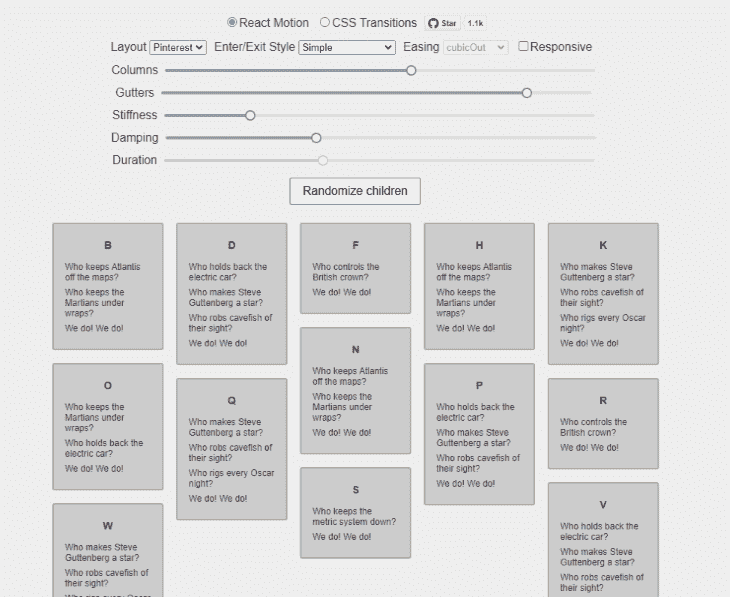
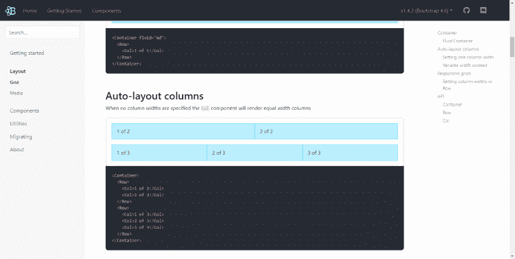
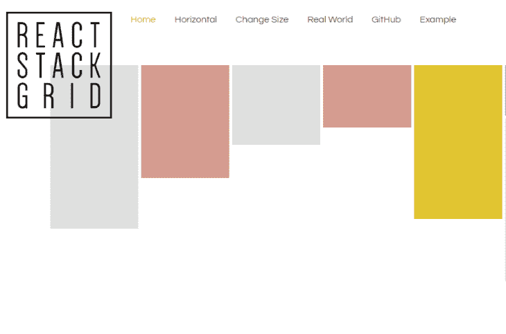
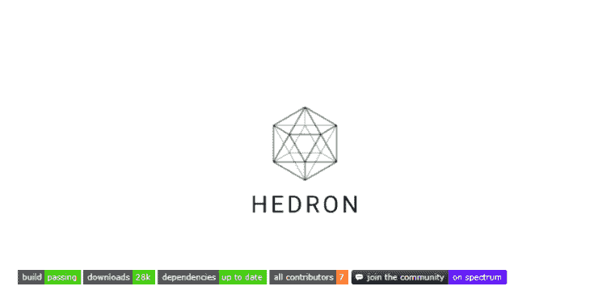

# 2021 年十大 React 网格组件和库

> 原文：<https://blog.logrocket.com/top-10-react-grid-components-and-libraries-for-2021/>

在建立网站时，有许多事情需要考虑，以确保您的网站看起来很棒，性能良好。

在本帖中，我们将看看十大未排名的 React 网格组件库，它们可以帮助您构建美观且高性能的网格布局。

## 什么是反应网格布局？

React-grid-layout (RGL)是一个可拖动和可调整大小的网格布局，带有 React 应用程序可定制的响应断点。断点布局可以自动生成，也可以由用户创建。RGL 只支持 React，不需要 jQuery。

RGL 的一个很大的特点是，你可以在布局中添加或删除小部件，而无需重新构建整个网格。

它的一些主要特性包括:

*   响应断点
*   可拖动的部件
*   可调整大小的小部件
*   与服务器渲染的应用兼容

当您想要构建带有可拖动小部件的度量仪表板时，React-grid-layout 大放异彩，如下所示:

在 [GitHub](https://github.com/STRML/react-grid-layout) 上拥有超过 12.7k 的明星，6.5k 的用户，7.9m 的下载量，这种网格布局被很多开发者使用和喜爱。

## 雷巴斯

[Rebass](https://rebassjs.org/) 是一个 React UI 组件库，自带 [Reflexbox](https://rebassjs.org/reflexbox/) ，是 React 的一个响应式网格布局系统。

Reflexbox 提供了两个组件来布局 react 应用程序:flex 和 box。flex 组件设置布局容器，而 box 组件指定容器中的项目。

它还有一个叫做变体的东西，可以让你在你的主题中设置不同的变体，并在每个元素的基础上应用它们。当您希望布局容器(flex)中的项目具有不同的变体时，变体在 box 组件上非常有用。

此外，Reflexbox 遵循[主题规范](https://github.com/system-ui/theme-specification)，这使得使用您选择的任何主题提供者设置布局网格变得容易，并且在您的应用程序中具有相同的设计规范，例如颜色、间距和排版。

以下是一些顶级的 Reflexbox 功能:

*   符合人体工程学的响应式阵列价值观
*   满足您所有布局需求的原始样式组件
*   主题化并兼容[主题规范](https://github.com/system-ui/theme-specification)
*   用情感构建，支持风格化组件

Rebass 本身发展迅速，在 [GitHub](https://github.com/rebassjs/rebass) 上拥有 7.1k 明星，7.1k 用户，每周 73.99k 下载量。

## 反应-柔性盒-网格

[React-flexbox-grid](https://roylee0704.github.io/react-flexbox-grid/) 是一组 React 组件，用 css 模块的力量实现 [flexboxgrid.css](http://flexboxgrid.com/) 。 [Flexbox](http://flexboxgrid.com/) Grid 是基于 flex 显示属性的网格系统。

使用响应修改器，可以在小、中、大视口宽度下指定不同的偏移、对齐和列大小。调整行和列的大小是不固定的，因为 React-flexbox-grid 使用基于百分比的宽度。

Auto width 允许您在一行中添加无限数量的自动调整大小的列，网格会计算出每列的适当大小。

目前在 [GitHub](https://github.com/roylee0704/react-flexbox-grid) 上拥有 2.8k 明星，7.3k 用户，每月 132k 下载量。

## 自动响应反应

[Auto-responsive-react](https://github.com/xudafeng/autoresponsive-react) 是一个响应式布局库，用于构建响应式 react 应用。

如果您正在寻找一种简单的方法来执行简单和微妙的页面调整动画，那么这个库可以为您完成这项工作。您可以通过传递常规 CSS `transition-timing-function`值来控制`transition-timing-function`(例如，线性、渐进等。).

这个库的一个很好的用例是当你构建一个像图片库一样的东西时。这里有一个[的例子](https://xudafeng.github.io/autoresponsive-react/examples/)。

目前在 [GitHub](https://github.com/xudafeng/autoresponsive-react) 上有 1.4k 的星级，240 个用户，每月 2k 的下载量，Auto-response-react 简单而强大。

## 索环

根据网站介绍， [Grommet](https://v2.grommet.io/) 目前是第二版，是一个基于 React 的框架，它“在一个整洁的包中提供可访问性、模块化、响应性和主题化”。它为内容布局提供了一个简洁的[网格](https://v2.grommet.io/grid)组件。

只需一个布尔值，您就可以设置是否要为移动环境缩放边距和填充大小。

使用响应断点很容易为不同的屏幕尺寸构建应用程序，这使得使用这些断点设置布局更改变得很容易。

这个令人惊叹的库为您的应用程序布局提供了绝佳的体验。它目前在 [GitHub](https://github.com/grommet/grommet) 上拥有 7k 名明星，5.8k 名用户，每月 79k 次下载。

## 反应网格系统

在 [GitHub](https://github.com/sealninja/react-grid-system) ， [React-grid-system](https://sealninja.github.io/react-grid-system/) 上，每月有 587 颗星星，37k 个用户和 71k 次下载，这是一个为 React 应用程序构建的响应式网格系统，并受到了 [Bootstrap](https://getbootstrap.com/docs/4.5/layout/grid/) 的极大启发。

它提供了通过 Reacts 上下文设置断点和装订线宽度等功能。

它为创建响应式网格提供了三个组件:容器、行和列。这类似于 Rebass 使用 Reflexbox 所做的事情，但区别在于 Reflexbox 使用 flexbox 属性，而 react-grid-system 通过设置网格项的行和列来创建布局。

## 反应-切石机

React-stonecutter 是 React 的一个动画网格布局组件。对于动画，你可以选择 CSS 过渡或[反应-运动](https://github.com/chenglou/react-motion)。

React-stonecutter 提供了一个具有不同高度的类似 Pinterest 的布局，它使用带有常规转换属性值的 CSS 过渡或 React-motion 来流畅地处理动画。

此外，它还提供了`measureItems`，这是一个高阶函数，适用于您事先不知道物品高度的情况。您可以使用此功能在布局前测量浏览器中的项目。

目前，react-stonecutter 在 [GitHub](https://github.com/dantrain/react-stonecutter) 上有 1.1k 个星星和 343 个用户，这是一个有趣的游戏库，并且完成了任务。

## 反应引导

[React-Bootstrap](https://react-bootstrap.netlify.app/layout/grid/) 是一个 React 组件库，它采用了 Bootstrap 4 的核心，所以它依赖于 bootstraps 主题、样式表等等。

与 react-grid-system 的工作方式类似，React-Bootstrap 提供了一个布局组件，它使用一系列容器、行和列来布局内容。它采用 flexbox 构建，反应灵敏。

它还为 flexbox 网格列提供自动布局，因此当您设置或更改列的宽度时，同级列将自动围绕它调整大小。

在 [GitHub](https://github.com/react-bootstrap/react-bootstrap) 上有 18.9k 的明星和 373k 的用户，React-Bootstrap 绝对值得一试。

## 反应堆网格

[react-stack-grid](https://sealninja.github.io/react-grid-system/) 是另一个网格组件库，为构建 react 应用程序提供了类似 Pinterest 的布局。

react-stack-grid 有一个名为`updateLayout()` *方法的特性，当您想要在某个动作(如单击事件)发生后手动更新布局时，这个特性会派上用场。*

 *另一个顶级特性是它如何处理页面调整的动画。您可以从各种季节和过渡值中进行选择。

当您想要建立图片库时，应该考虑使用这个库。它在 [GitHub](https://github.com/wadackel/react-stack-grid) 上拥有 796 位明星和超过 1k 的用户。我喜欢它的可定制性。看看这个[演示](https://tsuyoshiwada.github.io/react-stack-grid/#/)来感受一下它是如何工作的。

## 赫伦

根据其官方网站，“Hedron 是 React 的一个简单的 flexbox 网格系统，由风格化组件驱动。”

它提供了三个独特的功能:

*   向布局中添加无限断点，以轻松控制栅格列和行在不同视口中的外观
*   任何断点都可以改变任何属性，从而允许您在不同的屏幕尺寸上自定义布局
*   调试模式，允许您轻松地可视化您的布局

目前，Hedron 在 [GitHub](https://github.com/garetmckinley/hedron) 上有 846 颗星，179 个用户，28k 次下载。希望构建仪表板？看看赫德伦。

## 结论

在本文中，我们介绍了 2021 年的 10 个 React 网格组件和库。它们都是非常好用的工具，所以在选择一个的时候，这完全取决于项目目标和个人偏好。

## 使用 LogRocket 消除传统反应错误报告的噪音

[LogRocket](https://lp.logrocket.com/blg/react-signup-issue-free)

是一款 React analytics 解决方案，可保护您免受数百个误报错误警报的影响，只针对少数真正重要的项目。LogRocket 告诉您 React 应用程序中实际影响用户的最具影响力的 bug 和 UX 问题。

  [LogRocket](https://lp.logrocket.com/blg/react-signup-issue-free)

自动聚合客户端错误、反应错误边界、还原状态、缓慢的组件加载时间、JS 异常、前端性能指标和用户交互。然后，LogRocket 使用机器学习来通知您影响大多数用户的最具影响力的问题，并提供您修复它所需的上下文。

关注重要的 React bug—[今天就试试 LogRocket】。](https://lp.logrocket.com/blg/react-signup-issue-free)*