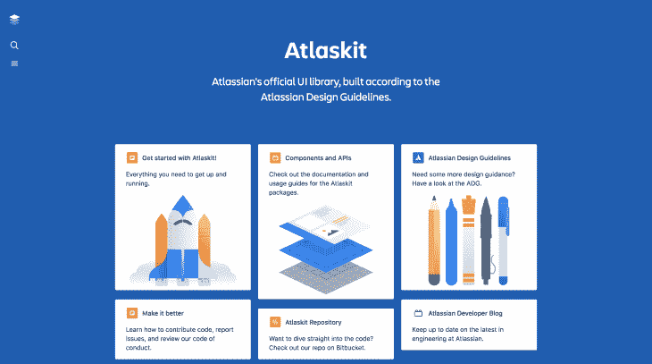
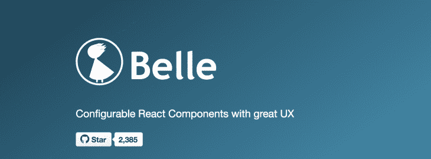
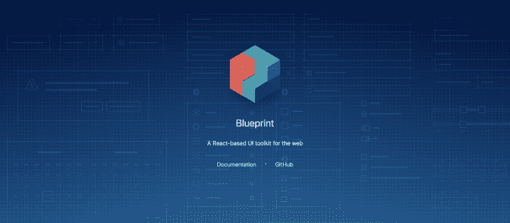
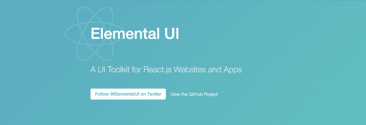
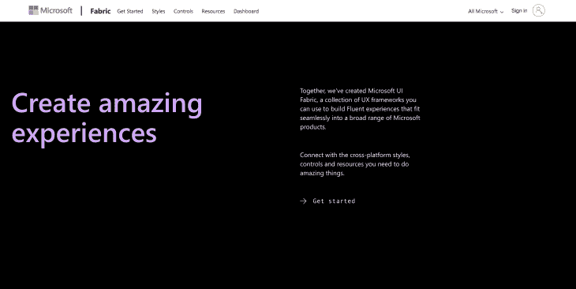
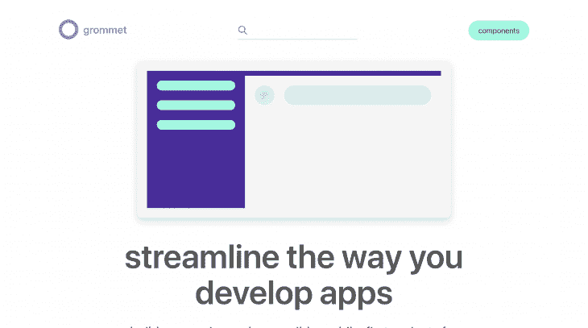
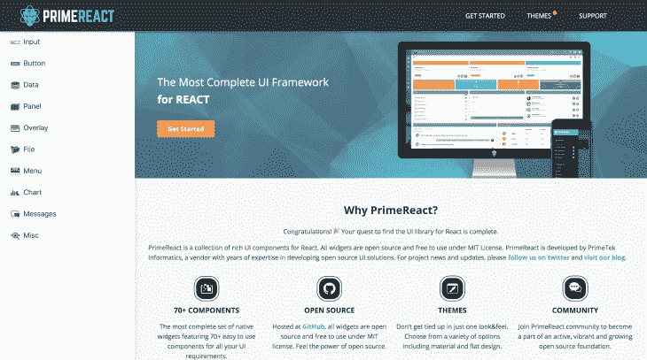
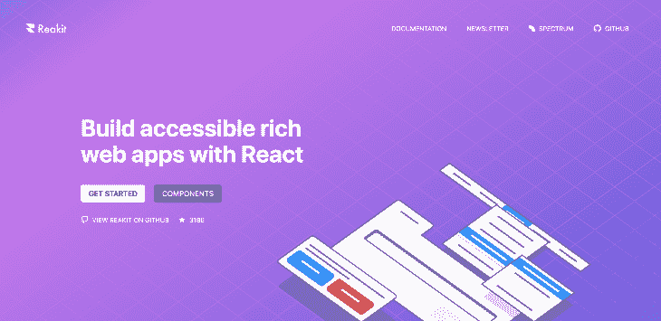
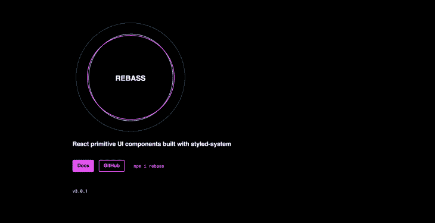
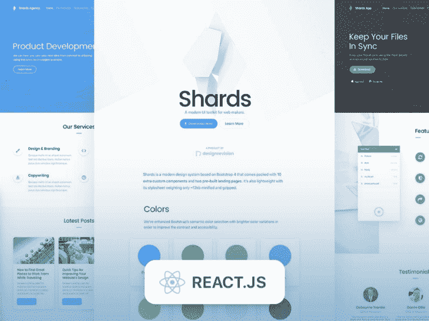

# 2019 年十大 React UI 套件概述

> 原文：<https://blog.logrocket.com/top-10-react-ui-kits-in-2019/>

[Egwuenu Gift Follow](https://blog.logrocket.com/author/egwuenugift/) Software Engineer at Andela. Passionate about photography and making the web accessible. Co-organizer @ConcatenateConf, Lead at @vuevixensNG and @JAMstackLagos. She/Her

# 2019 年十大 React UI 套件概述

## 

2019 年 7 月 5 日 3 分钟读完 1031

React 是一个流行的 JavaScript 库，用于构建用户界面和创建可重用的组件。这些组件可以从头开始开发，但是还有其他方法可以启动并运行。通过使用 UI 工具包进行开发，我们使得开发过程耗时更少且一致。

[React UI](https://blog.logrocket.com/improve-ux-in-react-apps-by-showing-skeleton-ui/) 套件是已经准备好的综合资源集，包括按钮、模态、复选框等。它们使开发人员能够在合理的时间内创建出色的视觉效果，并减少从头开发设计的时间和成本。在这篇文章中，我们将回顾 10 个将在 2019 年使用的 React UI 套件。

## 阿特拉斯基特

AtlasKit 是 Atlassian 的官方用户界面库，它是根据 Atlassian 的设计指南构建的。它是一个可重用组件的集合，可以独立地下载到您的项目中，每个组件也独立地进行版本控制并发布到 npm。Atlas UI kit 有一些好处，包括在您的应用程序中使用广泛的组件。

该工具包是一个可扩展的库，可用于构建企业应用程序或登录页面，但我对它将每个组件作为一个单独的包并不完全满意。这意味着对于我将要使用的每个组件，我都需要安装一个新的包。[吉拉](https://www.atlassian.com/software/jira)、[比特斗](https://www.atlassian.com/software/bitbucket)、[阿特拉斯入门套件](http://atlaskit-starter.surge.sh/)等。是目前使用 Atlas UI kit 实现的一些项目。

## 美女

[Belle](http://nikgraf.github.io/belle/#/?_k=by80vb) 是最有趣的 react UI 套件中的一个可配置 React 组件，它针对移动桌面进行了优化，具有高度可定制的风格，可以在基础级别上进行配置，也可以针对每个组件进行单独配置。Belle 建立在这样的原则之上，即它应该[易于使用，并且具有一致的行为](http://nikgraf.github.io/belle/#/philosophy?_k=3svxr5)，为开发人员和与之交互的最终用户而设计。唯一的限制是，与其他 UI 套件相比，它的可用组件要少得多，但好消息是，核心团队目前正在致力于此。它还支持移动和 ARIA 以及超过 2.3k 颗星星在 [Github](https://github.com/nikgraf/belle/) 上。

## 蓝图用户界面

[Blueprint UI](https://blueprintjs.com/) 是一个基于 React 的 UI 工具包，针对桌面应用程序构建复杂的数据密集型界面进行了优化。Github 上有超过 [14k 的星星](https://github.com/palantir/blueprint)和 npm 上有 [56k 的每周下载量](https://www.npmjs.com/package/@blueprintjs/core)，这是一个值得考虑的很好的 UI 套件，而且[它努力为所有组件提供开箱即用的可访问性标准](https://medium.com/@jmtame/moving-to-react-blueprint-72bccee0a22c)，并与明暗主题模式捆绑在一起。它支持跨浏览器，因为它支持 Chrome，Firefox，Safari，IE 11 和微软 Edge。 [Onedot](https://www.onedot.com/) 和[on board](https://onvoard.com)是目前使用的公司。

## 元素用户界面

Elemental UI 是一个工具包，用于解决项目中的实际需求，以及开发一组功能组件，这些组件可以单独使用，也可以一起使用，具有不引人注目的默认风格和灵活的主题功能。一些组件包括表单、按钮、卡片和模态。该项目仍在开发中，但已经在 GitHub 上有超过 [4k+的星星，在](https://github.com/elementalui/elemental) [npm](https://www.npmjs.com/package/elemental) 上有 4k 的每周下载量，并且可以在 MIT 许可下使用。 [Utry](http://utry.cn) 和 [Vacalians](https://www.vacalians.com) 是根据 [Stackshare](https://stackshare.io/elemental-ui) 目前使用它的公司的例子。

## 织物反应

[Fabric](https://developer.microsoft.com/en-us/fabric#/) 是一个基于 React 的前端框架，用于构建微软产品的体验，包括 Office 和 Office 365。它是一个健壮的 UI 组件的集合，旨在使您使用 Office 设计语言创建一致的 web 体验变得简单。它提供了[健壮的、最新的、可访问的开源组件](https://developer.microsoft.com/en-us/fabric#/get-started)，这些组件可以使用 CSS-in-JS 进行高度定制。GitHub 上有超过[5000 颗星星，npm](https://github.com/OfficeDev/office-ui-fabric-react) 上有 [92k 的每周下载量，这是一个值得关注的 UI 套件，用于构建出色的网络体验。](https://www.npmjs.com/package/office-ui-fabric-react)

## 索环

Grommet 是一个基于 react 的框架，在一个整洁的包中提供可访问性、模块化、响应性和主题化，它被构建为移动优先、响应性和可访问的 web。凭借 GitHub 上的[4k+stars](https://github.com/grommet/grommet)和 npm 上的 [61k 周下载量](https://www.npmjs.com/package/grommet)，它被 Twilio、惠普、三星和许多其他公司积极使用。

## 主要反应

[Prime React](https://www.primefaces.org/primereact/#/) 是 React 的开源 UI 套件。它是在 MIT 许可下发布的，由 70 多个易于使用的组件组成。凭借 GitHub 上的 [1k+ stars 和 npm](https://github.com/primefaces/primereact) 上的 [9k+ weekly installs，它被美国运通、福克斯、SAP 和其他伟大的组织所使用。](https://www.npmjs.com/package/primereact)

## 现实

Reakit 是一个 UI 工具包，用于使用 React 构建可访问的富 web 应用程序和设计系统。它提供了一组组件，允许您在 React 中快速组合各种各样的 ui，这使得它非常适合从快速原型制作到生产的所有事情。Reakit 严格遵循 WAI-ARIA 1.1 标准，并提供了许多在 [WAI-ARIA 创作实践 1.1](https://www.w3.org/TR/wai-aria-practices/) 中描述的小部件，如按钮、对话框、标签等。凭借在 [GitHub](https://github.com/reakit/reakit) 上超过 3000 的明星数和在 npm 上超过 3000 的每周下载量，它建立的原则使其在整个开发过程中保持一致，并积极支持可访问性标准。

## 雷巴斯

Rebass 是一个用 styled-system 构建的 UI 套件和设计系统，它只包含 8 个基本组件，所有组件都在一个仅重约 1KB 的超小文件中。这些组件是响应式的、可主题化的，为响应式 web 设计而设计，支持 Flexbox 和网格布局。这个项目目前在 Github 上拥有超过 [5k 的明星数。](https://github.com/rebassjs/rebass)

## 碎片会起反应

[Shards React](https://designrevision.com/downloads/shards-react/) 是一个现代化的 React UI 工具包，有几十个高质量的定制组件。它是基于 Bootstrap 4 构建的。Shards React 是在遵循最近的开发最佳实践以[优化 fast 性能的同时从零开始制作的，它也是一个轻量级库](https://designrevision.com/downloads/shards-react/)，样式表仅重约 12kb。

## 结论

React UI kits 允许我们使用独特的 UI 组件集和大量可供选择的 UI 套件来构建 React 应用程序，从而实现更好的开发工作流。在本文中，我们已经看到了一系列 React UI 工具包，可以试用并集成到我们的 React 项目中，以构建主题化和可定制的应用程序。如果您尝试过这里没有列出的其他 React UI 工具包，请在评论部分告诉我。

## 使用 LogRocket 消除传统反应错误报告的噪音

[LogRocket](https://lp.logrocket.com/blg/react-signup-issue-free)

是一款 React analytics 解决方案，可保护您免受数百个误报错误警报的影响，只针对少数真正重要的项目。LogRocket 告诉您 React 应用程序中实际影响用户的最具影响力的 bug 和 UX 问题。

  [LogRocket](https://lp.logrocket.com/blg/react-signup-issue-free)

自动聚合客户端错误、反应错误边界、还原状态、缓慢的组件加载时间、JS 异常、前端性能指标和用户交互。然后，LogRocket 使用机器学习来通知您影响大多数用户的最具影响力的问题，并提供您修复它所需的上下文。

关注重要的 React bug—[今天就试试 LogRocket】。](https://lp.logrocket.com/blg/react-signup-issue-free)