# 十大 React UI 库和工具包

> 原文：<https://blog.logrocket.com/top-10-react-ui-libraries-kits/>

***编者按:*** *本指南最近一次更新是在 2023 年 1 月 23 日，增加了一个关于何时使用 React UI 库的部分，并从我们的排名中删除了不太受欢迎的库。如果您对* [*React 原生组件库*](https://blog.logrocket.com/react-native-component-libraries/) *感兴趣，请查看本文；如果您想了解更多关于* [*React 仪表板库*](https://blog.logrocket.com/top-react-dashboard-libraries/) *的信息，请查看本文。*

React 目前处于 JavaScript 食物链的顶端。Stack Overflow 的 [2022 年开发者调查](https://insights.stackoverflow.com/survey/2021#section-most-popular-technologies-web-frameworks)显示 React 是第二大最常用的 web 框架，仅略落后于 Node.js

由于它的流行，许多 UI 库都构建了自定义的 React 组件，以方便集成并改善开发人员的体验。

向前跳:

## 什么是 React UI 库？

React UI 库或 React 组件库是一个软件系统或工具链，附带一组组件，即可以在 React 应用程序中使用的设计元素。

React UI 库中这些组件或设计元素的一些例子是表格、图表、模态、导航条、卡片、按钮、地图等。而且这些组件，开箱即用，有着漂亮而独特的风格——取决于 UI 库。

此外，其中一些 React UI 库允许您基于您的设计系统定制这些组件的外观。

React UI 库的使用和受欢迎程度随着 React 的使用和受欢迎程度线性增长。而且根据 Stack Overflow 来看，React 和 Node.js 都是最常用的 web 框架和技术。因此，由于 React 的出色和受欢迎——大约有 [20 万 GitHub stars](https://github.com/facebook/react) ，React 开发人员有几乎无穷无尽的各种各样的用户界面库和定制组件可供选择。

## 何时使用 React UI 库

虽然 React 很棒，但是从头开始构建 UI 组件可能很乏味，有时甚至是徒劳的。这就是组件库存在的原因——它们提供了现成的设计元素，从而允许开发人员专注于构建 UI，而不是从头开始构建一切。

此外，虽然从头开始构建一切让您可以完全控制，但这也是有代价的:可维护性。在大多数情况下，使用 UI 库更有意义，它带来了以下好处:

*   速度:通过提供漂亮的组件或设计元素，UI 库确保开发者专注于实现应用的功能，从而加快开发过程
*   漂亮的 UI:更快的开发时间并不意味着开发人员应该在应用程序的外观上妥协。这就是为什么 UI 库带有设计精美、随时可用的组件，这些组件充当应用程序的构建块
*   **支持和可访问性**:因为不同的人用不同的设备和需求访问 web，所以从头构建组件来满足用户的可访问性需求并在多种设备上具有正确的风格是一项艰巨的任务。UI 库负责处理这些问题，并处理对旧浏览器的支持
*   **跨浏览器兼容性**:在某些情况下——通常涉及到相对较新的 CSS 属性或浏览器工具的使用，开发适用于所有浏览器的 CSS 可能会很棘手。这可能会对您的用户体验产生负面影响。UI 库是一个有效的解决方案，因为它们具有跨浏览器的兼容性，所以您的应用程序可以在所有现代浏览器上工作

如上所述，现在有无数的 React UI 工具包和库。在本指南中，我们将重点介绍 10 个最有用的工具包和库，并展示如何在下一个 React 应用程序中使用它们。其中一些很受欢迎，一些则比较模糊，但是任何一个都可以帮助解决您下一个 React 项目的独特需求:

## 1.反应引导

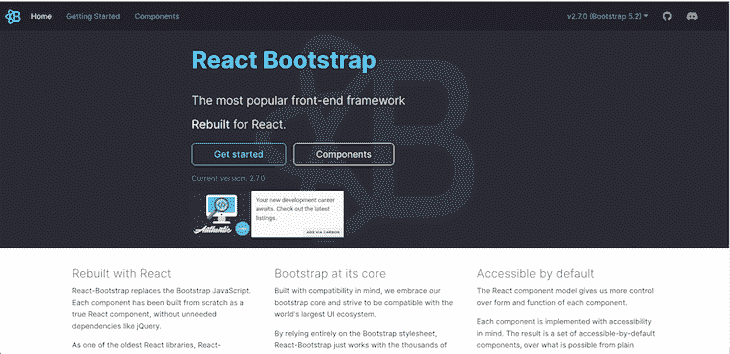

[React Bootstrap](https://react-bootstrap.github.io/) 重建 Bootstrap——React 最流行的前端框架。这样做的好处是消除了不必要的 jQuery 依赖。

虽然 jQuery 依赖关系被移除了，但是 React Bootstrap 包含了它的 Bootstrap 核心，并与整个 Bootstrap 样式表一起工作。因此，它与许多引导主题兼容。

作为最古老的 React 框架之一，React Bootstrap 已经随着 React 线性发展和成熟。每个组件的实现都考虑了可访问性，因此它提供了一组默认可访问的设计元素。

要安装 React Bootstrap，请运行以下代码:

```
npm install react-bootstrap bootstrap

```

您可以像这样轻松地导入和使用组件:

```
import Button from 'react-bootstrap/Button';

// or less ideally
import { Button } from 'react-bootstrap';

<Stack direction="horizontal" gap={2}>
  <Button as="a" variant="primary">
    Button as link
  </Button>
  <Button as="a" variant="success">
    Button as link
  </Button>
</Stack>

```

## 2.核心用户界面

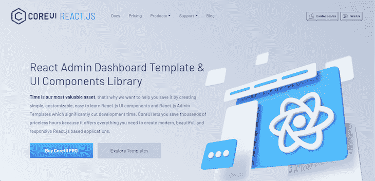

核心 UI 是最强大的 React UI 组件库之一。它提供了一个简单、可定制、易于使用的 React.js UI 组件和 React.js 管理模板的强大集合。因此，Core UI 提供了构建现代、美观、响应迅速的 React.js 应用程序所需的所有设计元素，从而大大缩短了开发时间。

除了加快开发速度，Core UI 还提供了精美的手工设计元素，与 Bootstrap 兼容。这些设计元素是真正的 React 组件，使用 Boostrap 从头开始构建，但没有 jQuery 依赖性。

此外，核心用户界面提供了移动和跨浏览器的兼容性。

要使用核心 UI，您必须通过运行以下命令来安装它:

```
npm install @coreui/react

```

然后，您可以像这样导入组件来使用:

```
import { Alert } from '@coreui/react';

```

## 3.PrimeReact

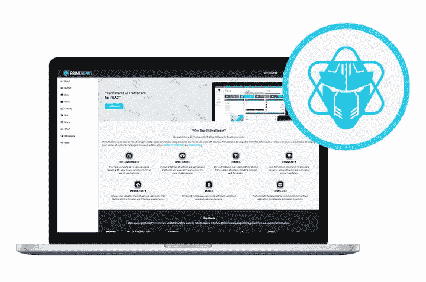

PrimeReact 是最非凡的 React UI 套件之一，它真正加速了前端设计和开发，拥有超过 70 个组件可供选择。

这个 UI 套件是由 [PrimeTek Informatics](https://primetek.com.tr/) 打造的。

除了各种各样的组件之外，PrimeReact 还具有自定义主题、高级应用程序模板、a11y 以及响应迅速且支持触摸的 UI 组件，可在任何设备上提供出色的 UI 体验。

更多详情，[查看 GitHub 上的 prime react](https://github.com/primefaces/primereact)。

该套件易于安装和使用:

```
npm i primereact --save

```

对于图标，可以下载`primeicons`库:

```
npm i primeicons --save

```

要使用组件，请在组件文档的导入部分将其导入:

```
import { Button } from "primereact/button"

function PrimeButtonEx() {
    return (
        <div>
            <Button>Button</Button>
        </div>
    )
}

```

## 4.索环

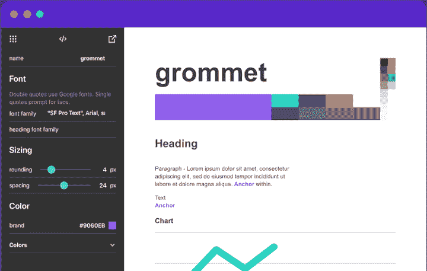

Part-design，part-framework， [Grommet](https://v2.grommet.io/) 是基于 React 的 UI 库。它的特点是有一套[漂亮的组件](https://v2.grommet.io/components)，让它很容易上手。该库还提供了强大的主题工具，允许您定制组件库，以符合您想要的布局、颜色和类型。

[索环设计套件](https://github.com/grommet/design-kit)是一款拖放工具，让您轻松设计布局和组件。它有贴纸、应用程序模板和大量图标:

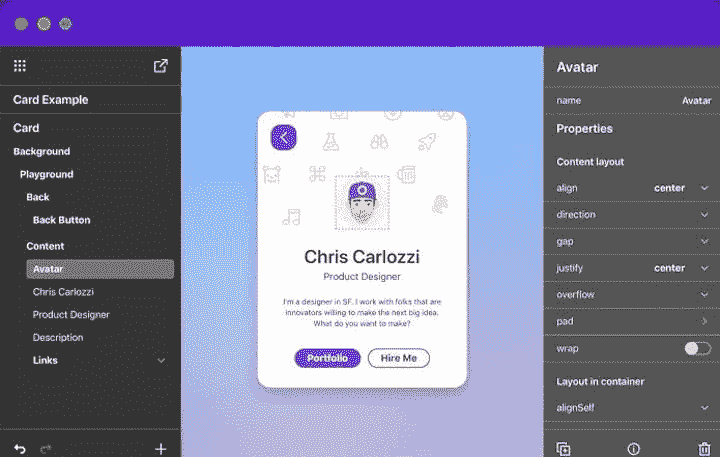

要设置索环，请在 React 应用程序中运行以下命令:

```
npm i grommet

```

要使用像`Button`这样的组件，从`"grommet"`包中析构它:

```
import { Grommet, Button } from "grommet"

function GrommetButtonEx() {
    return (
        <Grommet className="App">
            <Button
                label="Button" 
            />
        </Grommet>
    )
}

```

## 5.温泉 UI

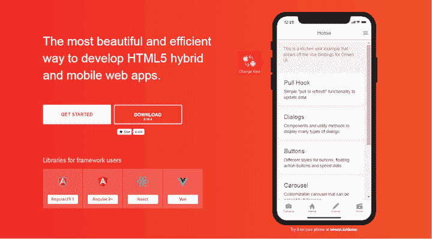

如果你想让你的网络应用有本土感， [Onsen UI](https://onsen.io/) 就是为你准备的库。Onsen UI 旨在通过类似手机的感觉丰富用户体验。它包含了提供原生 iOS 和 Android 设备 UI 体验的功能。

Onsen 的 UI 元素和组件是本机设计的，非常适合开发混合应用程序和 web 应用程序。该库使您能够模拟页面过渡、动画、涟漪效果和弹出模型——基本上，您可以在原生 Android 和 iOS 设备中找到的任何效果:

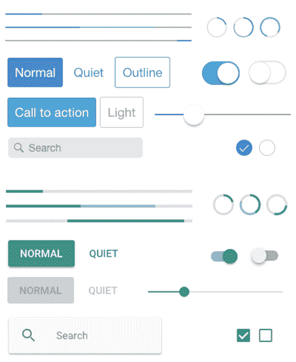

在 React 应用中使用温泉相当容易。首先，安装 npm 软件包:

```
npm i onsenui react-onsenui --save

```

`onsenui`包含温泉 UI 核心实例。`react-onsenui`包含 React 组件:

```
import { Page, Button } from "react-onsenui"

function OnsenButtonEx() {
    return (
        <Page>
            <Button> Click Me!!</Button>
        </Page>
    )
}

```

然后，导入温泉 CSS:

```
import "onsenui/css/onsenui.css"
import "onsenui/css/onsen-css-components.css"

```

我天真地把 Onsen UI 称为网络的原生 CSS。

## 6.miui

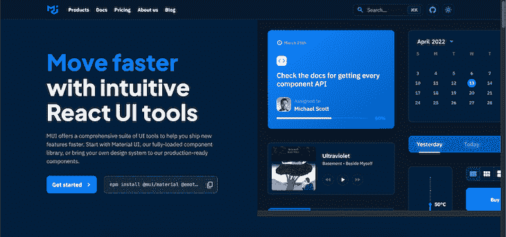

[MUI](https://mui.com) (之前的 Material-UI)是基于 Google 的材质设计。它提供用材料设计构建的 React 组件。

要安装，请运行以下命令:

```
// with npm
npm install @mui/material @emotion/react @emotion/styled

// with yarn
yarn add @mui/material @emotion/react @emotion/styled

```

接下来，从`@mui/material`导入您想要使用的组件:

```
import Button from '@mui/material/Button';

function MatButtonEx() {
    return (
        <div>
            <Button color="primary">
                Button
            </Button>
        </div>
    )
}

```

MUI 还提供了漂亮的[高级主题和模板](https://mui.com/store/),您可以购买它们来启动您的项目。

关于 MUI 的更多信息，[请看这篇文章](https://blog.logrocket.com/using-mui-react-native/)。

## 7.Chakra UI


我为我的尼日利亚同胞 Segun Adebayo 感到骄傲，他开发了 Chakra UI。它有一个干净整洁的 UI，是我见过的最完整的 React UI 套件之一。它的 API 简单但可组合，可访问性很好。

截至本文撰写之时，Chakra UI 已经拥有超过 30.8K 的 GitHub stars ，并且非常具有可扩展性和可定制性。

在 React 项目中，运行下面的命令来安装 Chakra UI:

```
npm i @chakra-ui/react @emotion/[email protected]^11 @emotion/[email protected]^11 [email protected]^4
# OR
yarn add @chakra-ui/react @emotion/[email protected]^11 @emotion/[email protected]^11 [email protected]^4

```

Chakra UI 有一个`ChakraProvider`,当我们想要使用 Chakra 组件时，我们必须在应用程序的根目录中提供它:

```
import * as React from "react";

// 1\. import `ChakraProvider` component
import { ChakraProvider } from "@chakra-ui/react";

function App({ Component }) {
  // 2\. Use at the root of your app
  return (
    <ChakraProvider>
      <Component />
    </ChakraProvider>
  );
}

```

要使用一个组件，例如一个`Button`，我们必须从`@chakra-ui/react`导入它:

```
import { Button, ButtonGroup } from "@chakra-ui/react";

```

然后我们可以把`Button`渲染成这样:

```
function ChakraUIButtonEx() {
  return (
    <div>
      <Button>Click Me</Button>
    </div>
  );
}

```

有关 Chakra UI 及其组件的更多信息，请访问[官方文档](https://chakra-ui.com/docs/components)。

## 8.蚂蚁设计

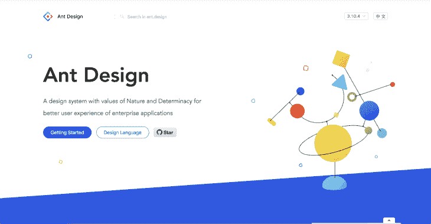

[Ant Design](https://ant.design/) 被认为是世界上最好的 React UI 套件之一。在撰写本文时，GitHub 上的[超过 83，000 颗星星，它是使用和下载最多的 React UI 工具包之一。](https://github.com/ant-design/ant-design)

Ant Design 整合并推广了全球设计模式，并提供了以下功能:

*   强大的主题定制
*   高质量的反应元件
*   国际化支持

Ant Design 在我们的 React 项目中安装和使用非常简单:

```
npm install antd
# OR
yarn add antd

```

我们可以手动导入样式表:

```
import 'antd/dist/antd.css';

```

我们可以从`antd`导入任何我们想要使用的组件。例如，要使用一个`Button`，我们这样做:

```
import { Button } from "antd";

function AntdEx() {
  return <Button type="primary">Primary Button</Button>;
}

```

访问此页面查看 Ant Design 中的所有[组件。蚂蚁设计也有 Angular](https://ant.design/components/overview) 的[分拆，Vue.js](https://ng.ant.design/docs/introduce/en) 的[分拆。](https://antdv.com/)

## 9.语义 UI 反应

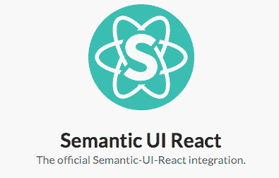

[语义 UI React](https://react.semantic-ui.com/) 是 React 的官方语义 UI 集成。它是一个完整的 React UI 工具包，建立在语义 UI CSS 框架之上。对于 React 项目来说，这是一个很好的选择。

这个语义 UI React 拥有超过 100 个组件，并提供以下健壮的特性:

*   **自动控制状态**:有状态组件自动控制；不需要显式编写代码来获取状态或事件
*   **速记道具**:语义 UI React 组件有一个传递道具的速记语法。比如，我们可以把`<Button type="primary" />`写成`<Button primary />`。一个道具可以转化成这么多的价值。例如，`icon`道具可以是一个图标`name`，一个`<Icon />`实例，或者一个图标道具对象
*   **增强**:一个组件可以使用`as`道具渲染成另一个组件；在 DOM 中，`Header`可能被渲染为`h3`元素

语义 UI React 易于安装:

```
$  yarn add semantic-ui-react semantic-ui-css
## Or NPM
$  npm install semantic-ui-react semantic-ui-css

```

安装后，我们可以导入缩小的 CSS 文件:

```
import "semantic-ui-css/semantic.min.css";

```

现在，让我们看看如何使用内置的语义 UI 组件。让我们使用`Button`组件:

```
import React from "react";
import { Button } from "semantic-ui-react";

const ButtonExampleButton = () => <Button>Click Here</Button>;

export default ButtonExampleButton;

```

要查看语义 UI 中所有组件的反应，[访问官方文档](https://react.semantic-ui.com/)。

## 10.蓝图用户界面

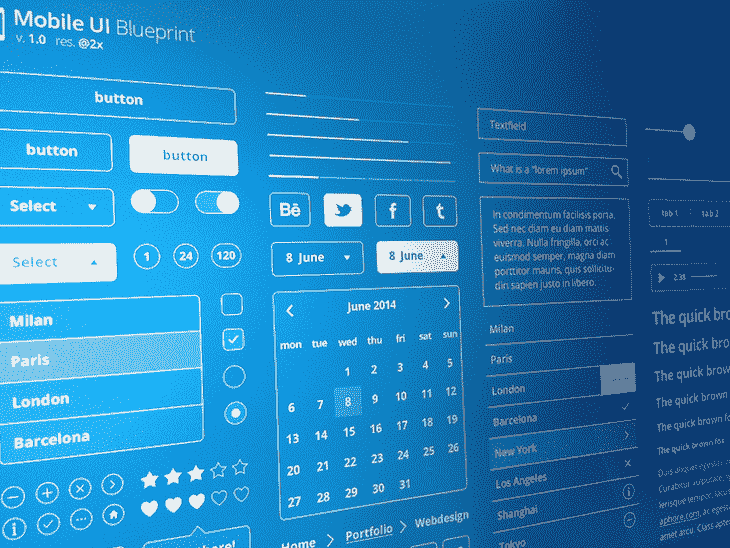

Blueprint UI 是一个基于 React 的 web UI 套件。它为构建桌面应用程序的复杂界面进行了巨大的优化。蓝图 UI 套件在 GitHub 上有超过 [19.6K 的星星。](https://github.com/palantir/blueprint)

安装 Blueprint UI 非常简单:

```
yarn add @blueprintjs/core react react-dom

```

`@blueprintjs/core`是 Blueprint UI 套件的核心。它包含了我们将使用的 40 多个组件。蓝图 UI 需要使用`react-dom`和`react`包。其他附加组件可从以下渠道获得:

*   @blueprintjs/icons
*   @blueprintjs/select
*   @blueprintjs/datetime
*   @blueprintjs/table
*   @blueprintjs/timezone

要使用 Blueprint UI 中的组件，我们必须从`@blueprintjs/core`中导入它。例如，要使用`Button`组件，我们必须从`@blueprintjs/core`导入它:

```
import { Button } from "@blueprintjs/core";

```

然后我们可以把`Button`渲染成这样:

```
function BlueprintUIButtonEx() {
  return (
    <div>
      <Button intent="success" text="button content">
        Click Me
      </Button>
    </div>
  );
}

```

## React UI 工具包和库的荣誉奖

下面是一些不太流行但值得一提的 UI 库。

| React UI 库 | GitHub stars | 功能 | 每周 npm 下载 | 新奇 |
| --- | --- | --- | --- | --- |
| 反应引导 | 21.4 千 | jQuery 免费，随时可以使用 React 组件风格的引导。 | 1,027,473 | 9 年前 |
| 核心用户界面 | 518 | jQuery 免费、可定制、易学的 React.js UI 组件和 React.js 管理模板。 | 27,220 | 3 年 |
| PrimeReact | 3.4K | PrimeReact 是 React 的一组丰富的开源 UI 组件 | 68,554 | 6 年 |
| 索环 | 8.1K | 可访问性、模块化、响应性和主题化 | 37,286 | 8 年 |
| 温泉 UI | 8.7K | 原生感觉的渐进式网络应用(PWAs)和混合应用 | 38,838 | 7 年 |
| 梅姐 | 83.8K | 使用谷歌材料设计的现成的基本反应组件 | 1,905,362 | 8 年 |
| Chakra UI | 478 | 简单、模块化且易于访问的 UI 组件 | 960 | 4 年 |
| 蚂蚁设计 | 83.7 千 | 一组高质量的 React 组件，用于构建为 web 应用程序设计的企业级 UI | 963,039 | 7 年 |
| 语义 UI 反应 | 12.9 千 | jQuery 免费，声明式 API，漂亮风格的 React 组件，用于企业级 UI | 224,892 | 6 年 |
| 蓝图用户界面 | 19.5 千 | 针对构建桌面应用程序的复杂数据密集型界面进行了优化 | 198,590 | 6 年 |

## 结论

在本指南中，我们回顾了 React UI 工具包的完整列表——从创新的新人到流行的中坚分子。我们还分享了其他不太流行但仍然很强大的 React UI 工具包。

现在，您应该已经具备了为下一个 React 项目选择合适的 UI 套件所需的基本知识。