# 2021 年十大 VS 代码扩展

> 原文：<https://blog.logrocket.com/top-10-vs-code-extensions-2021/>

[Visual Studio Code](https://code.visualstudio.com/) 是开发者社区中使用最广泛的代码编辑器之一。VS 代码流行的原因之一是它的许多扩展加速了开发过程。

在本指南中，我们将探索 2021 年每个 web 开发人员都应该知道的 10 个 [VS 代码扩展](https://code.visualstudio.com/docs/editor/extension-gallery)。这些工具旨在改善开发人员的体验，并以各种方式使您的工作更容易。

我们将讨论以下 VS 代码扩展:

1.  [自动重命名标签](#autorenametag)
2.  [括号对上色器](#bracketpaircolorizer)
3.  [片段](#snippets)
4.  [更好的评论](#bettercomments)
5.  [一体降价](#markdownallinone)
6.  [图标](#Icons)
7.  [更漂亮](#prettier)
8.  [进口成本](#importcost)
9.  [配置文件切换器](#profileswitcher)
10.  [GitLens](#GitLens)

[自动重命名标签](https://marketplace.visualstudio.com/items?itemName=formulahendry.auto-rename-tag)对于 web 开发者来说是一个超级有用的 VS 代码扩展。顾名思义，自动重命名标记会在第一个标记更新时重命名第二个标记，反之亦然:

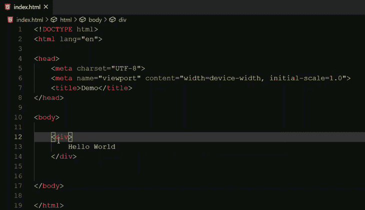

你会发现这个扩展不仅对 HTML 有帮助，而且对 React 也有帮助，因为有了 [JSX](https://reactjs.org/docs/introducing-jsx.html) 。

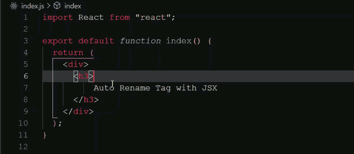

在上面的例子中，标签中只有文本，但是在实际的应用程序中，可能会有嵌套的标签和元素，这使得手动更新变得困难而繁琐。

## 2.括号对着色机

[括号对上色器](https://marketplace.visualstudio.com/items?itemName=CoenraadS.bracket-pair-colorizer)是一个用相同颜色匹配对应括号的扩展。具有嵌套的组件、功能、对象等。在文件中，可能会与多个圆括号、方括号等混淆。

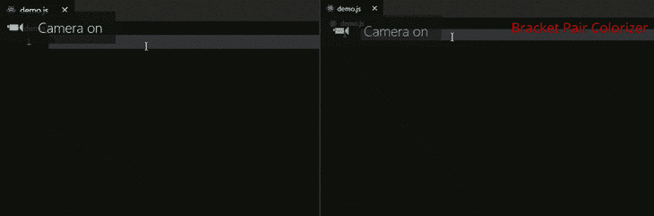

例如，考虑下面的代码片段:

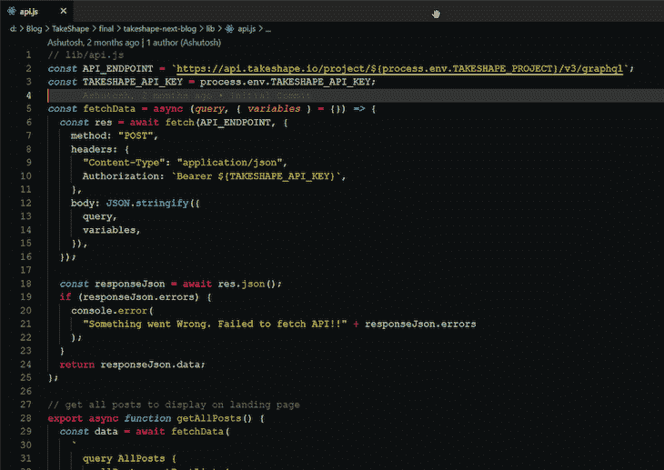

乍一看，很难区分代码中的不同代码块，但是为了便于导航和访问，括号对着色程序扩展对相应的括号和括号进行了着色。

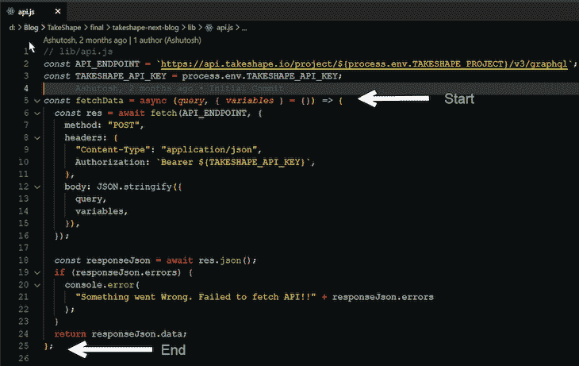

## 3.片段

片段是节省时间和提高生产力的最佳方式。这不是一个单一的扩展，而是一个扩展的集合，包含不同编程语言的各种代码片段。

以下是一些流行的代码片段扩展:

例如，每当您创建一个新的组件时，在 React 中重复功能组件的语法会非常乏味。使用[ES7 React/Redux/GraphQL/React-Native sniples](https://marketplace.visualstudio.com/items?itemName=dsznajder.es7-react-js-snippets)扩展，您可以使用功能组件的简写`rfc`并点击 enter。

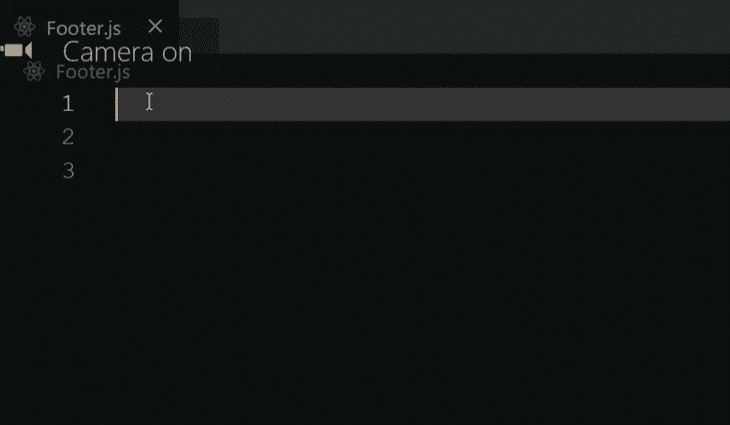

[更好的注释](https://marketplace.visualstudio.com/items?itemName=aaron-bond.better-comments)旨在帮助你在代码中编写更人性化的注释。

清晰易懂的注释不仅对阅读你的代码的人有好处，对你自己也有好处。开发人员在一段时间后访问代码时迷失在自己的代码中是很常见的。有描述性的评论可以为你和你的团队节省很多时间。

有了更好的注释和代码扩展，你可以将你的注释分为警告、查询、待办事项、高亮等。

您可以在双正斜杠(`//`)后使用以下任一字符:

*   `*`对于高亮显示的文本
*   `!`对于错误和警告
*   `?`对于疑问和问题
*   `//`删除线
*   `TODO`对于待办事项

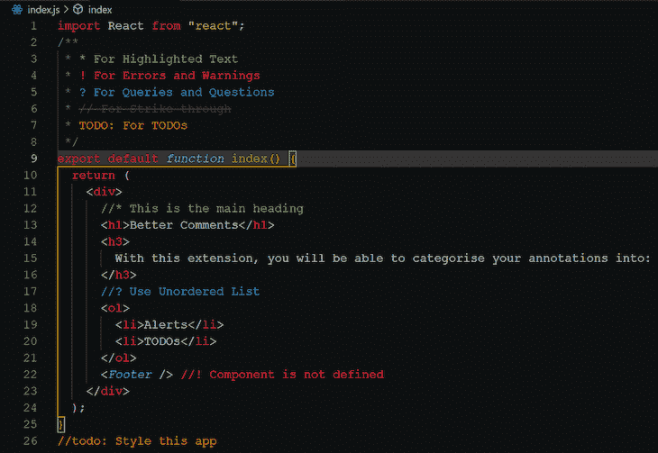

## 5.一次降价

Markdown All in One 是一个单独的扩展，可以满足你所有的 Markdown 需求，比如自动预览、快捷方式、自动完成等。

自 2004 年发布以来，Markdown 已经成为最流行和最受欢迎的标记语言之一。世界各地的技术作家广泛使用文章、博客、文档等的降价。，因为它的轻量级简单性和跨平台使用。它的受欢迎程度已经引发了降价的其他变体，如 [GitHub 风味降价](https://github.github.com/gfm/)、 [MDX](https://mdxjs.com/) 等。

例如，要加粗 Markdown 中的一些文本，您可以选择该文本并使用快捷键`Ctrl + B`来提高您的工作效率。

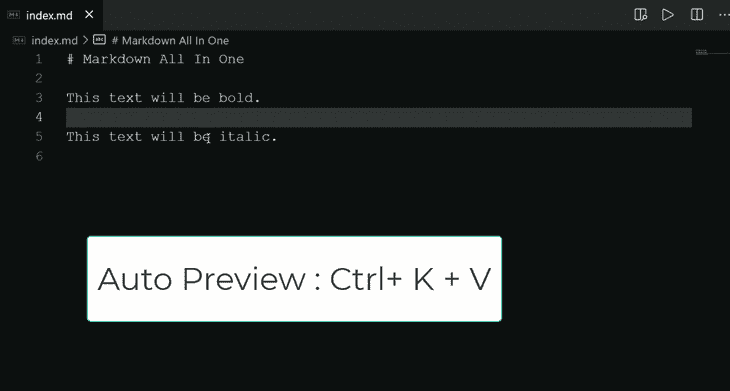

## 6.核标准情报中心

使用描述性图标可以帮助您区分文件和文件夹。图标也使开发更有趣。

下面是两个 VS 代码标签的比较。一个有图标，另一个没有。

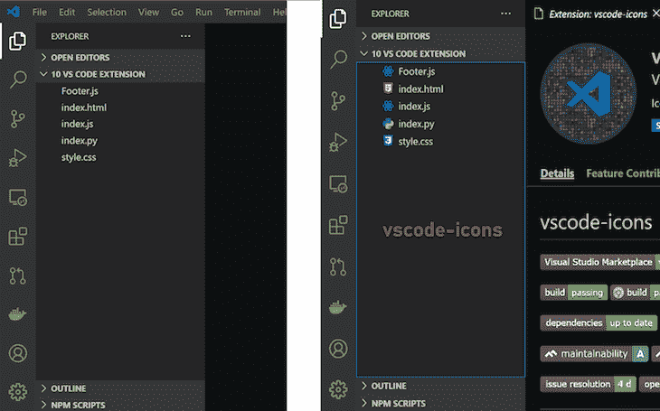

有许多图标扩展，你可以从中选择。流行的图标系列包括:

## 7.较美丽

[更漂亮](https://marketplace.visualstudio.com/items?itemName=esbenp.prettier-vscode)是一个固执己见的代码格式化程序。GitHub 上有超过 38.5k 的 stars，它是可用的最流行的代码格式化程序之一。在代码中使用一致的格式和样式可以节省大量时间，尤其是在与其他开发人员协作时。

考虑下面的代码块:

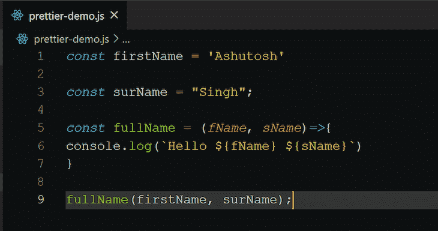

您可能会注意到这段代码的一些格式问题，包括:

*   单引号和双引号的组合
*   分号(`;`)的不规范使用
*   第 6 行控制台语句的缩进不正确

下面是 Prettier 如何格式化和修复上面的代码:

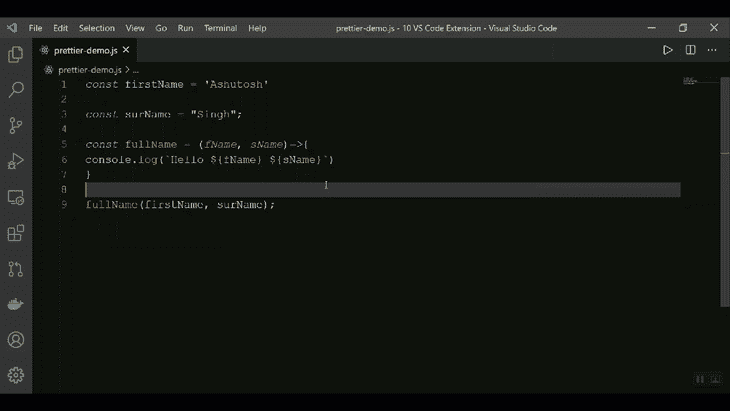

当你使用一个本地解析版本的漂亮插件时，这个扩展支持漂亮插件。
你可以进一步配置这个扩展来满足你的格式需求，甚至用自动保存来触发它。

## 8.进口成本

[Import Cost](https://marketplace.visualstudio.com/items?itemName=wix.vscode-import-cost) 是一个扩展，向您显示代码中导入包的估计大小。在进行一个项目时，重要的是不要通过导入 heft 包来损害用户体验。避免这种情况的一种方法是跟踪代码中附加依赖项的大小。

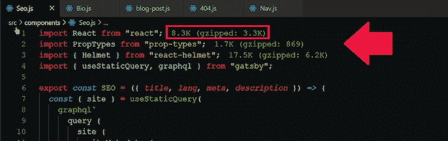

当导入过大时,“导入成本”会以红色显示尺寸来警告您。您可以配置什么大小应该被认为是小，中，或大。

## 9.配置文件切换器

[Profile Switcher](https://marketplace.visualstudio.com/items?itemName=aaronpowell.vscode-profile-switcher) 使您能够使用各种配置和设置在 VS 代码中切换和设置多个配置文件。

这个扩展对于技术博客、YouTubers 等内容创建者尤其有用。您可以设置一个配置文件所需的设置，而不是每次需要显示 VS 代码屏幕时都更改您的设置/配置。

下面介绍如何在两个情景模式之间切换:`Default`和`Content Creation`。

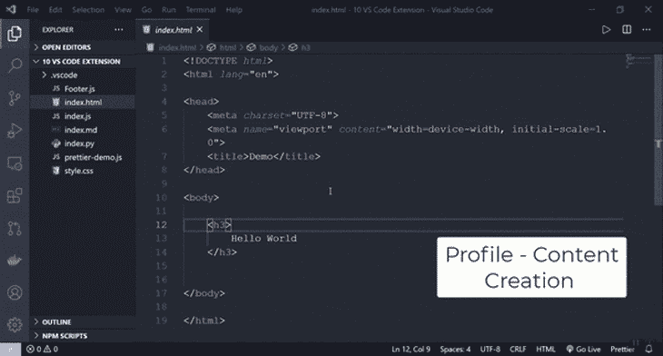

## 10.走吧

GitLens 是由 [Eric Amodio](https://www.amod.io) 创建、开发和维护的 Visual Studio 代码的[开源](https://github.com/eamodio/vscode-gitlens)扩展。它结合了 Git 的功能和 VS 代码。

这个扩展最好的特性之一是通过 Git 责备注释和代码透镜可视化代码作者的能力。

下面是来自[最终空间 API](https://finalspaceapi.com/) 的 [React 示例](https://finalspaceapi.com/docs/react)文档的截图。

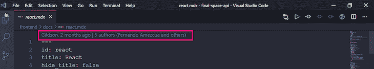

以下是代码作者身份的扩展版本:

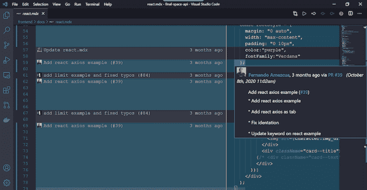

这只是 GitLens 扩展的众多[功能之一。其他显著特征包括:](https://gitlens.amod.io/#features)

## 结论

在本指南中，我们回顾了 10 个 VS 代码扩展，它们可以帮助你成为更好的程序员，提高你的工作效率。

还有许多 VS 代码扩展，您可以针对各种用例进行探索。以下是其他几个值得一试的扩展:

## 使用 [LogRocket](https://lp.logrocket.com/blg/signup) 消除传统错误报告的干扰

[LogRocket](https://lp.logrocket.com/blg/signup) 是一个数字体验分析解决方案，它可以保护您免受数百个假阳性错误警报的影响，只针对几个真正重要的项目。LogRocket 会告诉您应用程序中实际影响用户的最具影响力的 bug 和 UX 问题。

然后，使用具有深层技术遥测的会话重放来确切地查看用户看到了什么以及是什么导致了问题，就像你在他们身后看一样。

LogRocket 自动聚合客户端错误、JS 异常、前端性能指标和用户交互。然后 LogRocket 使用机器学习来告诉你哪些问题正在影响大多数用户，并提供你需要修复它的上下文。

关注重要的 bug—[今天就试试 LogRocket】。](https://lp.logrocket.com/blg/signup-issue-free)