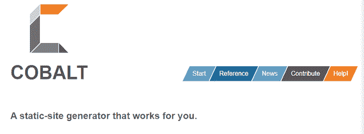
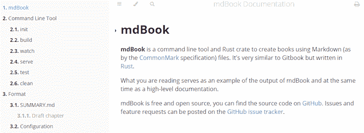
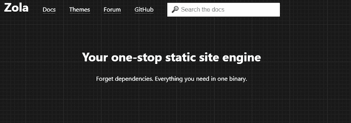

# 前三名 Rust 静态站点生成器以及何时使用它们

> 原文：<https://blog.logrocket.com/top-3-rust-static-site-generators-and-when-to-use-them/>

Rust 并不专注于生成网站，但是在这篇文章中，我们将介绍三个 Rust 项目。

内容管理系统(CMSs)是使您能够托管静态内容的工具。静态站点生成器将这些内容应用到模板中，这样它们就可以提前生成页面，以便在被请求时立即提供服务。

在本指南中，我们将探索三种最流行和最有趣的 Rust 静态站点生成器:

1.  [钴](#cobalt)
2.  [mdBook](#mdbook)
3.  [左拉](#zola)

我们将根据每个项目提供的特性来回顾它们，看一看它们的文档，并探索一些示例来确定生产准备情况。

## 1.钴



我们清单上的第一个项目是[钴](https://github.com/cobalt-org/cobalt.rs)，它完全是用 Rust 制造的。该项目作为一个静态的网站生成器。它的主要目标是减少项目从他们的网站开始的工作量。

该项目关注三大支柱，使钴尽可能方便。

1.  简单性:Cobalt 只需几分钟就能运行，但可以扩展到更复杂的情况
2.  易用性:Cobalt 提供了一个方便的安装过程和一个以工作流为中心的命令行工具
3.  速度:Cobalt 利用 Rust 的固有速度快速生成静态页面

让我们进一步看看命令行工具生成新的静态网站。 [Cobalt CLI 工具](https://cobalt-org.github.io/docs/usage/)与 [create-react-app](https://reactjs.org/docs/create-a-new-react-app.html) CLI 工具非常相似。您可以使用`cobalt init`实例化一个新项目。这将生成一个具有以下目录结构的新项目。

```
.
|- _cobalt.yml
|- _layouts
|  |- default.liquid
|- _includes
|  |- header.liquid
|- _data
|  |- movies.json
|- _sass
|  |- base.scss
|- _site
|  |- index.html
|- _defaults
|  |- pages.md
|  |- posts.md
|- posts
|  |- cats.md
|- _drafts
|  |- dogs.md
|- index.liquid
```

让我们快速理清一些最重要的文件夹。`_layouts`目录包含[模板](https://cobalt-org.github.io/docs/layouts/)，它们构成了你网站的骨架。可以包含位于`_includes`目录中的共享模板布局。此外，您可以在模板中包含 JSON 数据，这些数据驻留在 [`_data`目录](https://cobalt-org.github.io/docs/data/)中。不过，Cobalt 也支持加载动态数据的`yaml`和`toml`文件。

一旦您的项目架构被创建，您就可以使用`cobalt serve`来服务您的项目。这将在`127.0.0.1:3000`本地托管项目。

### 关键特征

*   简单模板引擎
*   生成项目文件结构的 CLI 工具。该工具还承载更多的功能，比如创建新页面、构建项目以及在本地服务项目。
*   简单的文件结构，明确区分数据、模板和文章
*   [配置文件`_cobalt.yml`](https://cobalt-org.github.io/docs/config/) 用于快速更改站点和页面/帖子选项

### 代码片段和示例

让我们看看模板引擎以及如何从模板中访问数据。在这个例子中，我们有一个狗品种的列表，我们想使用 HTML 为它生成一个无序列表。

先来定义一下`_data/dogs.yml`下的犬种档案。

```
- name: Corgi
- name: Malamute
```

接下来，让我们创建我们的狗概述模板。注意我们是如何使用`for - endfor`循环遍历狗的品种数据的。

```
<ul>

  <li>{{ breed.name }}</li>

</ul>
```

如你所见，我们可以使用[插值](https://en.wikipedia.org/wiki/String_interpolation#:~:text=In%20computer%20programming%2C%20string%20interpolation,replaced%20with%20their%20corresponding%20values.)直接访问数据文件夹。数据在文件`_data/dogs.yml`中可用。因此，我们可以通过`site.data.dogs`访问它。这非常有用，因为你不必考虑进口。模板中的所有数据都可供您使用。

### 生产准备就绪

为了评估生产准备情况，我们先来看看发布频率。在 GithHub 上，我们可以找到 [41 在撰写时发布的](https://github.com/cobalt-org/cobalt.rs/releases)。发布很少发生，但开发人员似乎专注于更新依赖关系并确保项目保持可用，这是一个好迹象。

此外，Cobalt 为 [TravisCI、Git 和 GitLab CI](https://cobalt-org.github.io/docs/deployment/) 提供部署配置。

最后，您可以使用`cobalt debug`命令访问[故障排除支持](https://cobalt-org.github.io/docs/trouble/)，在网站运行时检测语法错误并记录更多详细信息。

总的来说，Cobalt 看起来非常稳定，支持部署配置和故障排除问题。

### 重要的数据

*   **GitHub stars** : 880
*   **在[crates . io](https://crates.io/crates/cobalt)上的总下载量:8181**
*   **版本发布** : 41

## 2.mdBook



[mdBook](https://github.com/rust-lang/mdBook) 使您能够使用 markdown 编写页面，并将生成的图书发布为类似在线图书的网站。该项目主要用于生成文档和简单的静态网站。

同样，mdBook 附带了一个命令行工具，尽管它以 Rust crate 的形式公开了它的所有功能，因此您可以将 mdBook 集成到其他项目中，或者构建在项目之上。

您可以使用`mdbook init`通过 CLI 生成一个新的 mdBook 项目。该命令生成以下文件结构。

```
project-name/
├── book
└── src
    ├── chapter_1.md
    └── SUMMARY.md
```

`src`目录包含降价文件，而`book`目录包含渲染输出。您可以使用`mdbook build`命令来构建图书。你要定义一个 [`SUMMARY.md`文件](https://rust-lang.github.io/mdBook/format/summary.html)。这个文件告诉`mdbook build`命令如何组织你的书。

### 关键特征

*   基于降价的内容
*   用于生成、构建、测试和服务您的项目的 CLI 工具
*   添加预处理器的能力
*   如果您想将 mdBook 集成到现有项目中，API 文档的可用性

### 代码片段和示例

让我们来看看一些[预处理插件](https://github.com/rust-lang/mdBook#3rd-party-plugins)，你可以通过安装它们来启用它们。一个名为`mdbook-linkcheck`的非常简单的插件验证你文本中的每个链接是否有效，并链接到一个可访问的网站。

您必须首先安装插件，然后将其添加到`book.toml`文件中，该文件包含您的图书的所有配置。

下面是文档中的一个例子，展示了如何启用插件:

```
$ cargo install mdbook-linkcheck
$ edit book.toml && cat book.toml
[book]
title = "My Awesome Book"
authors = ["Michael-F-Bryan"]

[output.html]

[output.linkcheck]  # enable the "mdbook-linkcheck" renderer

$ mdbook build
2018-10-20 13:57:51 [INFO] (mdbook::book): Book building has started
2018-10-20 13:57:51 [INFO] (mdbook::book): Running the html backend
2018-10-20 13:57:53 [INFO] (mdbook::book): Running the linkcheck backend
```

### 生产准备就绪

为了评估生产准备情况，让我们看一下发布频率。在 GithHub 上，我们可以找到目前为止的 [55 个版本](https://github.com/rust-lang/mdBook/releases)。项目得到积极维护；开发人员会定期添加这两个补丁作为新功能。

该项目提供了如何为 Travis CI 和 GitHub Pages 设置[持续集成(CI)的示例。](https://rust-lang.github.io/mdBook/continuous-integration.html)[文档](https://rust-lang.github.io/mdBook/index.html)本身非常简洁明了。

对于技术项目的简单参考网站来说，mdBook 是一个不错的选择。然而，我不会用它来建立一个更先进的网站。对于复杂的项目，我更喜欢使用 Cobalt，因为它提供了数据集成和模板功能。

### 重要的数据

*   **GitHub stars** : 5.1k
*   **在[crates . io](https://crates.io/crates/mdbook)T3 上的历史下载量:1430412**
*   **发布版本** : 55

## 3.左拉



我们要探索的最后一个项目是 [Zola](https://github.com/getzola/zola) ，它也是一个静态站点生成器。

Zola 是一个独立的可执行文件。因此，安装非常简单。此外，根据官方网站的说法，它允许你在不到一秒的时间内生成一个普通的网站。Zola 专注于博客、知识库、登陆页面或以上的组合。

由于 Zola 是作为可执行文件提供的，所以您可以将其用作 CLI 工具。因此，可以使用`zola init`生成一个新的 Zola 项目。这将呈现以下目录结构。

```
.
├── config.toml
├── content
├── sass
├── static
├── templates
└── themes
```

所有项目配置都驻留在 [`config.toml`](https://www.getzola.org/documentation/getting-started/configuration/) 文件中。`content`文件夹包含所有标记内容。有一个`templates`文件夹，其中包含了渲染你的网站的所有模板。您可以在[文档](https://www.getzola.org/documentation/templates/overview/)中找到更多关于模板的信息。

### 关键特征

### 代码片段和示例

重要的是要知道佐拉不定期降价。它带来了增强降价的概念。这使您能够为所需的通用元素创建短代码。为什么？Markdown 不适合注入更复杂的 HTML 或内联样式。

这里有一个例子，我们创建了一个短代码来嵌入 YouTube 视频。

* * *

### 更多来自 LogRocket 的精彩文章:

* * *

```
<div class="{{class}}">
    <iframe
        src="https://www.youtube.com/embed/{{id}}?autoplay=1"
        webkitallowfullscreen
        mozallowfullscreen
        allowfullscreen>
    </iframe>
</div>
```

这里，我们注入一个指向 YouTube 视频的 iframe。接下来，您可以直接在模板中使用 create shortcode，如下所示:

```
Here is a YouTube video:

{{ youtube(id="dQw4w9WgXcQ") }}

{{ youtube(id="dQw4w9WgXcQ", autoplay=true) }}
```

如您所见，您甚至可以向您的短代码传递参数。

### 生产准备就绪

佐拉在制作准备方面表现出色。首先，它具有优秀的文档和丰富的功能。拥有 RSS 提要集成、自动站点地图生成、分页功能和对多语言站点的支持可以节省您大量的时间。

此外，Zola 还提供持续集成支持。它支持以下部署选项:

*   Netlify
*   Vercel(旧称 Zeit)
*   吉卜赛人
*   GitLab 页面

最后，在左拉的话语群中有一个活跃的社区，在那里你可以提出支持问题和提交专题请求。

毫无疑问，在制作准备方面，佐拉是明显的赢家。

### 重要的数据

*   **GitHub stars** : 4.3k
*   (crates.io 上没有的版本)
*   **版本发布** : 31

## 结论

让我们简要回顾一下我们研究的三个 Rust 静态站点生成器。

*   **Cobalt** 专注于简单性，使您能够在模板中加载数据。Cobalt 是快速创建可伸缩静态站点的一个很好的解决方案。
*   对于创建网站来说，mdBook 并不是一个很好的解决方案，但是对于文档项目来说，它却很好用。
*   Zola 具有丰富的功能，显示出良好的生产准备。它还为开发人员提供了优秀的文档。

就个人而言，我更喜欢 Zola，因为它提供了如此多的预置功能，如面包屑和多语言支持。对于简单的参考或文档项目，我会选择 mdBook。也就是说，如果你想快速建立一个简单的网站，你可以考虑使用 Cobalt。

## [log rocket](https://lp.logrocket.com/blg/rust-signup):Rust 应用的 web 前端的全面可见性

调试 Rust 应用程序可能很困难，尤其是当用户遇到难以重现的问题时。如果您对监控和跟踪 Rust 应用程序的性能、自动显示错误、跟踪缓慢的网络请求和加载时间感兴趣，

[try LogRocket](https://lp.logrocket.com/blg/rust-signup)

.

[](https://lp.logrocket.com/blg/rust-signup)

LogRocket 就像是网络和移动应用程序的 DVR，记录你的 Rust 应用程序上发生的一切。您可以汇总并报告问题发生时应用程序的状态，而不是猜测问题发生的原因。LogRocket 还可以监控应用的性能，报告客户端 CPU 负载、客户端内存使用等指标。

现代化调试 Rust 应用的方式— [开始免费监控](https://lp.logrocket.com/blg/rust-signup)。