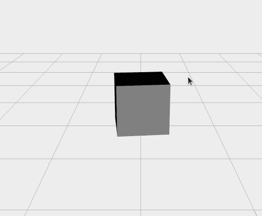
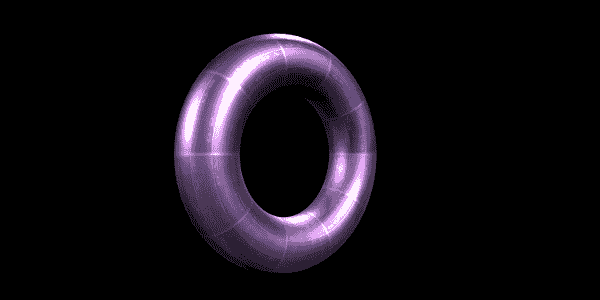

# 每个游戏开发者都应该知道的 4 个 3D 渲染引擎

> 原文：<https://blog.logrocket.com/top-4-3d-rendering-engines-available-in-js/>

开发游戏的一半乐趣在于构建复杂的动画，为游戏注入活力，吸引用户。你可以花无数的时间在[游戏引擎](https://blog.logrocket.com/top-6-javascript-and-html5-game-engines/)中挖掘动作，物理引擎挖掘动态，音频引擎挖掘声音——列表还在继续，选项和可能的组合只受你的想象力、时间和资源的限制。

但是让我们说，你宁愿把所有的努力都花在真正让用户迷上你的游戏上——也就是游戏性。渲染引擎可以帮助您在很短的时间内创建令人惊叹的精致图形，让您专注于让您的游戏真正独一无二、引人注目的因素。

在本指南中，我们将重点介绍 JavaScript 社区提供的四个最好、最受欢迎的 3D 渲染引擎:

1.  [Cannon.js](#overviewofcannonjs)
2.  [Phoria.js](#overviewofphoriajs)
3.  [D3](#overviewofd3)
4.  [Xeogl.js](#overviewofxeogljs)

我们将强调一些值得注意的特性，并探讨与每个引擎相关的优缺点。

## 1.Cannon.js

Cannon.js 是 JavaScript 可用的最好的物理和渲染引擎之一。受 Three.js 和 Ammo.js 的启发，它以特别轻便而闻名。最棒的是，它是免费和开源的。

### 赞成的意见

*   轻型建筑尺寸
*   易于上手
*   开源，可以在任何地方免费使用
*   使用迭代高斯-塞德尔解算器解决约束问题
*   内置碰撞检测
*   开箱即用的刚体动力学

### 骗局

*   难以掌握
*   单轴宽相位分离
*   以非性能的、面向对象的方式编写

### Cannon.js 正在运行

要开始使用 Cannon.js，创建一个简单的获取场景并将结果打印到控制台。

使用以下任一方法安装 Cannon.js。

```
<script src="cannon.min.js"></script>

// OR

npm install --save cannon 

```

现在让我们创造我们的世界。

```
const world = new CANNON.World();
world.gravity.set(0, 0, -9.82); // m/s²

```

创建一个球体并将其添加到世界中。

```
const radius = 1; // m
const sphereBody = new CANNON.Body({
   mass: 5, // kg
   position: new CANNON.Vec3(0, 0, 10), // m
   shape: new CANNON.Sphere(radius)
});
world.addBody(sphereBody);

```

接下来，创建地板或平面，并将其添加到世界中。

```
// Create a plane
const groundBody = new CANNON.Body({
    mass: 0 // mass == 0 makes the body static
});
const groundShape = new CANNON.Plane();
groundBody.addShape(groundShape);
world.addBody(groundBody);

const fixedTimeStep = 1.0 / 60.0; // seconds
const maxSubSteps = 3;

```

创建一个初始化函数来设置一切，并将球体`Z`的位置打印到控制台。

```
var lastTime;
(function simloop(time){
  requestAnimationFrame(simloop);
  if(lastTime !== undefined){
     const dt = (time - lastTime) / 1000;
     world.step(fixedTimeStep, dt, maxSubSteps);
  }
  console.log("Sphere z position: " + sphereBody.position.z);
  lastTime = time;
})();

```

这个函数创建动画本身。

```
function animate() {
      init();
      requestAnimationFrame( animate );

      mesh.rotation.x += 0.01;
      mesh.rotation.y += 0.02;

      renderer.render( scene, camera );
}

```

您可以运行代码并打开控制台来查看`Z`位置的值。点击[此处](http://schteppe.github.io/cannon.js/)查看更多示例，帮助您入门。

## 2.Phoria.js

Phoria 是一个 JavaScript 库和渲染引擎，用于在画布上创建简单的 3D 2D 渲染器。由于 Phoria 不使用 WebGL，所以它可以在任何可以渲染 HTML Canvas 的设备上工作。

### 赞成的意见

*   方便用户；易于上手并创建令人惊叹的图形
*   温和的学习曲线，因为 Phoria 不支持 WebGL
*   优秀的向量和矩阵数学库

### 骗局

*   缺少 WebGL 会使处理复杂的图形渲染变得困难
*   学习 HTML 画布需要稳定的练习
*   更适合小型动画和图形
*   没有文件。

### Phoria.js 在行动

有很多例子和评论良好的示例代码可以帮助您开始使用 Phoria.js。

首先，安装库。

```
<!DOCTYPE html>
<html>
<head>
    <script src="scripts/gl-matrix.js"></script>
    <script src="scripts/phoria-util.js"></script>
    <script src="scripts/phoria-entity.js"></script>
    <script src="scripts/phoria-scene.js"></script>
    <script src="scripts/phoria-renderer.js"></script>
    <script src="scripts/dat.gui.min.js"></script>
</head>
<body>
  // Create a Canvas element
  <canvas id="canvas" width="768" height="512" style="background-color: #eee"></canvas>
  <script>
      // Render animation on page load
      window.addEventListener('load', loadAnimation, false);
  </script>
</body>
</html>

```

接下来，创建`loadAnimation`函数来加载动画和下面的代码。

```
function loadAnimation(){
  const canvas = document.getElementById('canvas');

  // Add all script below here
  // ........
}

```

建立你的场景和摄像机，并设置好。

```
 const scene = new Phoria.Scene();
 scene.camera.position = {x:0.0, y:5.0, z:-15.0};
 scene.perspective.aspect = canvas.width / canvas.height;
 scene.viewport.width = canvas.width;
 scene.viewport.height = canvas.height;

```

创建一个渲染器，渲染上面创建的`canvas`。

```
const renderer = new Phoria.CanvasRenderer(canvas);

```

接下来，构建一些工具和栅格，然后将它们添加到上面创建的场景中。

```
  const plane = Phoria.Util.generateTesselatedPlane(8,8,0,20);
   scene.graph.push(Phoria.Entity.create({
      points: plane.points,
      edges: plane.edges,
      polygons: plane.polygons,
      style: {
         drawmode: "wireframe",
         shademode: "plain",
         linewidth: 0.5,
         objectsortmode: "back"
      }
   }));
   const c = Phoria.Util.generateUnitCube();
   const cube = Phoria.Entity.create({
      points: c.points,
      edges: c.edges,
      polygons: c.polygons
   });
   scene.graph.push(cube);
   scene.graph.push(new Phoria.DistantLight());

```

让我们结束动画，并开始它。

```
   const pause = false;
   const fnAnimate = function() {
      if (!pause)
      {
         // rotate local matrix of the cube
         cube.rotateY(0.5*Phoria.RADIANS);

         // execute the model view 3D pipeline and render the scene
         scene.modelView();
         renderer.render(scene);
      }
      requestAnimFrame(fnAnimate);
   };

   // key binding
   document.addEventListener('keydown', function(e) {
      switch (e.keyCode)
      {
         case 27: // ESC
            pause = !pause;
            break;
      }
   }, false);

   // start animation
   requestAnimFrame(fnAnimate);

```

最终结果应该是这样的:



## 3.D3

D3 是一个 JavaScript 库，用于操纵和呈现数据以及数据可视化。使用 D3，您可以通过使用 HTML 添加令人惊叹的强大转换来赋予数据生命。

这个库非常容易上手，即使在处理更复杂的数据可视化增强时也是如此，这在很大程度上要归功于它蓬勃发展的社区。它也是高度可定制的，使您能够调整现有的可视化和扩展功能。

### 赞成的意见

*   大型社区和全面的文档
*   各种各样的可视化集合
*   可定制的动画、交互性和数据驱动的绘图
*   快速且对系统资源要求低；因为它是用 JavaScript 构建的，可视化可以很容易地跨浏览器托管在 web 上。

### 骗局

*   几乎没有教育视频
*   可以使用更多创新的可视化图表
*   需要网络开发经验
*   处理大型数据集时可能会很慢
*   不太适合制作地图

### D3 在起作用

D3 入门非常简单。只需将脚本标签添加到 HTML 文档中。

```
<script src="https://d3js.org/d3.v6.min.js"></script>

```

例如，您可以像这样简单地在游戏中添加过渡:

```
d3.selectAll("transPage").transition()
    .duration(750)
    .delay(function(d, i) { return i * 10; })
    .attr("r", function(d) { return Math.sqrt(d * scale); });

```

这里，我们简单地选择了所有带有`transPage`的标签，并为它们添加了过渡。

## 4.Xeogl.js

Xeogl.js 是一个开源的 JavaScript 库，用于在 WebGL 上创建 3D 可视化。它的设计重点是创建交互式 3D 动画和图形。

### 赞成的意见

*   使用 WebGL 进行渲染
*   内置的、基于组件的场景图。
*   用 ECMAScript 6 编写
*   没有额外的依赖或库，使其规模更小
*   免费和开源
*   旨在快速渲染大量独立连接的对象

### 骗局

*   不如其他渲染引擎灵活
*   在开发人员中不太受欢迎，所以有时很难找到资源来帮助解决常见问题
*   文档没有清楚地解释概念

### Xeogl.js 在行动

要开始使用 Xeogl.js，首先将 CDN 库添加到您的项目中。

```
<script src="https://github.com/xeolabs/xeogl/blob/master/build/xeogl.js"></script>

```

接下来，创建您的 3D 对象。然后，用下面的代码创建一个`geometry`变量。

```
const geometry = new xeogl.TorusGeometry({
    radius: 1.0,
    tube: 0.3
});

```

使用下面的代码创建一些`metallicMaterial`。

```
const material = new xeogl.MetallicMaterial({
    baseColorMap: new xeogl.Texture({
        src: "textures/diffuse/uvGrid2.jpg"
    }),
    roughnessMap: new xeogl.Texture({
        src: "textures/roughness/goldRoughness.jpg"
    })
});

```

最后创建一些`Mesh`，添加上面的对象。

```
const mesh = new xeogl.Mesh({
    geometry: geometry,
    material: material,
    position: [0, 0, 10]
});

```

如果一切按计划进行，您应该会看到如下内容:



## 选择正确的渲染引擎

与任何项目一样，最好的工具将取决于您独特的目标、需求和要求。希望这篇概述能帮助你做出正确的选择，让你的游戏变得生动。

在大多数情况下，在我看来，Cannon.js 不会出错。如果你正在构建复杂的图形，它特别有用；由于内建了许多原本需要外部库的功能，Cannon 的尺寸更小，如果优先考虑快速处理的话，它是一个很好的选择。

另一方面，如果你只想创建简单的图形，Phoria.js 是一个很好的库。因为它不支持 WebGL，所以很难用 Phoria 创建复杂的 3D 图形。

如果你幻想自己是一名 web 数据科学家，并且正在寻找创建惊人的数据可视化，D3 是一个可靠的选择。

最后，如果您的目标是在 web 上创建类似 CAD 的图形或模型可视化，Xeogl.js 是一个有趣的选择。

你最喜欢哪个渲染引擎？我们错过什么了吗？欢迎留言！

## 通过理解上下文，更容易地调试 JavaScript 错误

调试代码总是一项单调乏味的任务。但是你越了解自己的错误，就越容易改正。

LogRocket 让你以新的独特的方式理解这些错误。我们的前端监控解决方案跟踪用户与您的 JavaScript 前端的互动，让您能够准确找出导致错误的用户行为。

[](https://lp.logrocket.com/blg/javascript-signup)

LogRocket 记录控制台日志、页面加载时间、堆栈跟踪、慢速网络请求/响应(带有标题+正文)、浏览器元数据和自定义日志。理解您的 JavaScript 代码的影响从来没有这么简单过！

[Try it for free](https://lp.logrocket.com/blg/javascript-signup)

.