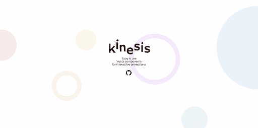
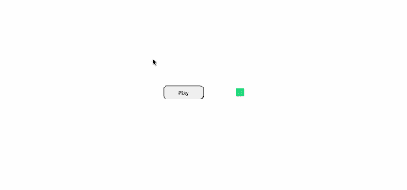
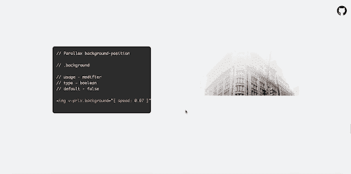
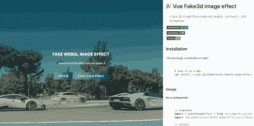
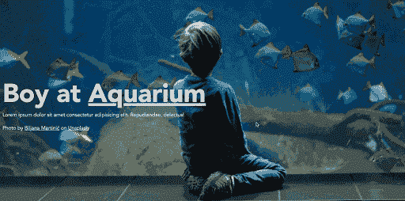
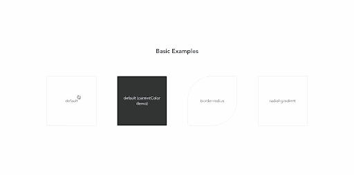
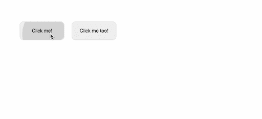
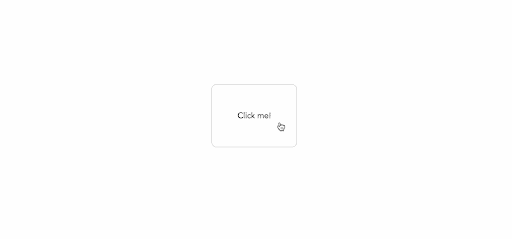
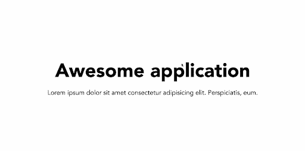

# 五大 Vue 动画库比较

> 原文：<https://blog.logrocket.com/top-5-vue-animation-libraries-compared/>

动画在我们与应用程序和网站的交互中扮演着重要的角色。它们可以用来增强用户体验，使之更流畅、更具交互性，或者简单地增加一些视觉效果。在本文中，我们将研究和比较实现这些目标的最流行的 Vue.js 库。

我们将讨论以下库，包括它们的安装过程、实现以及它们可能有用的一些场景:

## vista kinesis(检视动力学)

首先是 vue-kinesis，这是一个强大的动画库，它提供了一系列组件，允许我们向我们的 vue 应用程序添加交互式动画。这个库会自然地对光标变化做出反应，并根据鼠标事件调用动画，但有趣的是，除此之外，vue-kinesis 还让我们通过音频的变化来激活动画。



连同它的组件，它有广泛的自定义属性，我们可以使用这些属性以编程方式控制动画流，使我们能够轻松地实现所需的效果。

### 装置

vue-kinesis 可用于 vue 2 和 Vue 3，以及 Vue 浏览器 CDN。要将该库包含在 Vue 3 项目中，您必须首先安装该包:

```
​​npm install [email protected]
```

然后将其导入条目文件，如下所示:

```
import { createApp } from "vue";
import App from "./App.vue";
import VueKinesis from "vue-kinesis";

const app = createApp(App);
app.use(VueKinesis);

app.mount("#app");
```

您也可以安装 Vue 2 版本:

```
npm install vue-kinesis
```

然后选择导入整个库，以便它在项目中的任何位置都可用:

```
// src/main.js
import Vue from 'vue'
import VueKinesis from 'vue-kinesis'

Vue.use(VueKinesis);
```

或者仅导入特定组件:

```
import { KinesisContainer } from 'vue-kinesis'
```

### 使用

这个库包括三个组件，每个组件都有自己的属性来控制交互流:

*   kinesis-container——禁用或启用交互的包装组件。另外，为了附加触发动画的事件，同时支持`moving`(鼠标交互)和`scrolling`。但是，移动设备不支持移动事件
*   kinesis-element——要应用动画的元素的包装组件，也用于指定动画类型或原点
*   Kinesis-audio——该组件用于指定音频源添加到 kine sis 容器时要响应的音频频率

从文档页面中提取代码示例:

```
<template>
  <div id="app">
    <kinesis-container>
      Here, you can put
      <kinesis-element :strength="10"> whatever </kinesis-element>
      <kinesis-element :strength="20"> content! </kinesis-element>
    </kinesis-container>
  </div>
</template>

<script>
import { KinesisContainer, KinesisElement } from "vue-kinesis";
export default {
  name: "App",
  components: {
    KinesisContainer,
    KinesisElement,
  },
};
</script>
```

我们有以下输出:


对于音频样本，我们还有:

```
<template>
  <div id="app">
    <div class="main">
      <div style="padding: 40px">
        <button class="play-button" @click="togglePlaying">
          {{ isPlaying ? "Stop" : "Play" }}
        </button>
      </div>
      <div style="padding: 40px">
        <kinesis-container :audio="audioFile" :playAudio="isPlaying">
          <kinesis-audio :audioIndex="50" type="scale">
            <kinesis-element :strength="10" type="depth">
              <div class="circle"></div>
            </kinesis-element>
          </kinesis-audio>
        </kinesis-container>
      </div>
    </div>
  </div>
</template>

<script>
import { KinesisContainer, KinesisElement, KinesisAudio } from "vue-kinesis";
export default {
  name: "App",
  components: {
    KinesisContainer,
    KinesisElement,
    KinesisAudio,
  },
  data() {
    return {
      audioFile: require("./aud.mp3"),
      isPlaying: false,
    };
  },
  methods: {
    togglePlaying() {
      this.isPlaying = !this.isPlaying;
    },
  },
};
</script>
```

如果我们运行这个示例，我们应该会看到以下输出:



在这个例子中，我们定义了一个音频文件的路径，并将其附加到`kinesis-container`上，因为 `kinesis-audio` 组件由此触发，所以我们在其中放置了一个方形的`div`，这样每当我们单击切换播放的按钮时，我们的方形的`div`就会做出反应。

我们可以向`vue-kinesis`组件添加更多选项，其中一些可以在[示例页面](https://aminerman.com/kinesis/#/)找到。

如前所述，该库通过将 kinesis(无方向运动)动画添加到包装在其中的元素中，对来自音频文件的光标变化、滚动事件或频率做出反应。所以，它对于在这些地平线上创作动画是最有用的。然而，一个值得注意的例子是一个简单的音乐应用程序，其中一些其他元素对当前播放的音频做出反应。

## 视图-价格

vue-prix 是另一个很棒的 vue 动画库，可以很容易地给图像添加视差滚动效果。在视差效果中，前景图像及其背景元素都在移动，但背景移动得慢得多，从而产生了深度错觉。



### 装置

我们可以用下面的命令安装 vue-prix:

```
npm i vue-prlx
```

然后在我们的入口文件中初始化它:

```
// src/main.js

import Vue from 'vue'

import VuePrlx from 'vue-prlx'
Vue.use(VuePrlx);
```

或者，它可以作为通用模块提供，也可以通过其 CDN 包含，如下所示:

```
<script src="https://cdn.jsdelivr.net/npm/vue/dist/vue.min.js"></script>
<script src="https://cdn.jsdelivr.net/npm/vue-prlx/dist/v-prlx.min.js"></script>

<script>
Vue.use(VuePrlx.VuePrlxPlugin);
</script>
```

### 使用

首先，只需向图像标签添加一个新的`v-prlx`属性，视差效果就会立即启动:

```

```

在移动设备上，默认情况下禁用视差效果。但是，您可以通过将`.mobile:`附加到`v-prlx`属性来轻松启用它:

```

```

此外，通过提供一个额外的对象，我们可以设置视差速度，反转它的方向，等等:

```

```

在 web 应用程序中，视差效果通常会添加到特色(侧面)图像中，如本节开头的屏幕截图所示。然而，你想在你的项目中实现的交互类型将严重影响它的应用领域。

关于进一步的探索和例子，你可以[在这里](http://vue-prlx.surge.sh/)查阅他们的文档。

## 视图-假 3D 影像

这是另一个轻量级的 Vue 库，允许我们在 Vue 应用程序中为图像添加模拟的交互式 3D 效果。而且，与我们讨论过的其他一些动画库不同，这个库是 SSR 兼容的，这意味着它可以与服务器端渲染一起工作。



### 装置

我们可以使用下面的命令将这个库添加到 Vue 应用程序中:

```
npm install @luxdamore/vue-fake3d-image-effect
```

要开始给我们的图像文件添加 3D 效果，我们需要导入`Fake3dImageEffect`组件以及库 CSS 文件:

```
import { Fake3dImageEffect } from "@luxdamore/vue-fake3d-image-effect";
import "@luxdamore/vue-fake3d-image-effect/dist/Fake3dImageEffect.css";

export default {
  components: {
    "fake3d-image-effect": Fake3dImageEffect,
  },
};
```

或者，如果你想让它成为一个全局插件，可以从你的应用程序的任何地方访问，我们可以用下面的代码来实现:

```
// src/main.js
import Fake3dImageEffect from "@luxdamore/vue-fake3d-image-effect";
import "@luxdamore/vue-fake3d-image-effect/dist/Fake3dImageEffect.css";

Vue.use(Fake3dImageEffect);
```

要查看它的运行情况，请考虑下面的示例，在该示例中，我们将 Fake3dImageEffect 组件包装在一些其他文本内容中:

```
<template>
  <div id="app">
    <fake3d-image-effect
      fill-height-content
      tag="div"
      :image="require('./path/to/aquarium.jpeg')"
    >
      <div class="container">
        <h1>Boy at <u>Aquarium</u></h1>
        <p class="m-5">
          Lorem ipsum dolor sit amet consectetur adipisicing elit.
          delectus!
        </p>
        <p>Photo by Biljana Martinić on Unsplash</p>
      </div>
    </fake3d-image-effect>
    
  </div>
</template>

<script>
import { Fake3dImageEffect } from "@luxdamore/vue-fake3d-image-effect";
import "@luxdamore/vue-fake3d-image-effect/dist/Fake3dImageEffect.css";

export default {
  name: "App",
  components: { Fake3dImageEffect },
};
</script>
```

当我们运行这个示例时，我们会得到以下结果:



正如您可能已经注意到的，在这个例子中，`fake3dimage`组件还支持其他一些属性，比如`fill-height-content`属性，它将元素高度设置为`100vh`(全高)，以及 tag 属性，它允许我们选择一个首选的语义元素来包装其他子元素。

你也可以[在这里](https://luxdamore.github.io/vue-fake3d-image-effect/)查看他们的文档，获得支持道具的完整列表。

## v 形波



这个库允许我们通过简单地添加一个新的`v-wave`属性，在标记元素被点击时添加美丽的涟漪效果，类似于涟漪效果在材料设计中的工作方式。

这个库有一个有趣的特性，它可以很好地处理静态定位的元素，并且可以根据父元素自动猜测波形的颜色。但是，如果认为合适，您也可以设置首选颜色。

### 装置

我们可以通过以下方式轻松安装 v-wave:

```
npm i v-wave
```

或者包含其 CDN:

```
<script src="https://unpkg.com/v-wave"></script>
```

安装完成后，我们可以将其加载到 Vue 3 项目中，如下所示:

```
import {createApp} from 'vue'
import VWave from 'v-wave'
import App from './App.vue'

createApp(App)
  .use(VWave)
  .mount('#app')
```

对于 Vue 2，我们还有:

```
import Vue from 'vue'
import VWave from 'v-wave'

Vue.use(VWave)
```

### 使用

要开始使用这个库，只需将`v-wave`属性添加到任何想要添加涟漪效果的元素中:

```
<button v-wave>Click me!</button>
<button v-wave="{ color: 'blue' }">Click me too!</button>
```

因此，当我们运行此示例时，会得到以下结果:



我们可以通过更改其初始不透明度、持续时间、缓动和许多其他参数来进一步自定义涟漪效果:

```
<div
  v-wave="{
  color: 'rebeccapurple',
  initialOpacity: 0.5,
  duration: 2,
  easing: 'ease-in',
}"
>
  Click me!
</div>
```

这将为我们提供:



这里还有一个到 v-wave 文档的[链接，以获取更多信息。](https://github.com/justintaddei/v-wave#summary)

这个库包括当元素滚动到视图中时动画元素的指令。然而，与以前的库不同，这个库不直接提供帮助类或组件来允许我们将动画添加到应用程序中。相反，它提供了指令，允许我们在应用程序的一部分滚动到视图中时调用动画。

### 装置

我们可以用下面的命令简单地安装这个库:

```
npm install vue-animate-onscroll
```

安装完成后，我们可以像这样将其导入到我们的 Vue 条目文件中:

```
import Vue from 'vue'
import VueAnimateOnScroll from 'vue-animate-onscroll'

Vue.use(VueAnimateOnScroll)
```

### 使用

作为 Vue 插件导入后，我们可以通过向元素添加`v-animate-onscroll`属性以及我们的动画名称来制作滚动元素的动画:

```
<div v-animate-onscroll="'rotate">Rotate me once upon scroll</div>
```

然而，如前所述，我们仍然需要在动画被触发之前定义一个 CSS 动画名称`rotate`。下面是一个更相关的例子:

```
<template>
  <div id="app">
    <div class="flex-center">
      <div>
        <h1>Awesome application</h1>
        <p>
          Lorem ipsum dolor sit amet consectetur adipisicing elit. Perspiciatis,
          eum.
        </p>
      </div>
    </div>
    <div class="main">
      
    </div>
  </div>
</template>

<style>
/* create swing animation */
@keyframes swing {
  10% {
    transform: rotate(10deg);
  }

  40% {
    transform: rotate(-10deg);
  }

  60% {
    transform: rotate(5deg);
  }

  80% {
    transform: rotate(-5deg);
  }
}
</style>
```

运行这段代码，我们得到以下输出:



还值得一提的是，默认情况下，当一个元素被滚动到视图中时，它对应的动画只被触发一次。然而，我们可以使用`v-animate-onscroll.repeat`来代替后者，这样每当元素被滚动到视图中时，动画就会被触发:

```

```

此外，您可以自定义想要触发动画的滚动方向(向上或向下):

```
<div v-animate-onscroll="{up: 'animationName'}">Animate me once on scroll up</div>
<div v-animate-onscroll="{down: 'animationName'}">Animate me on upon scroll down</div>

<!-- Different animations for up and down directions -->
<div v-animate-onscroll="{down: 'animationName', up: 'anotherAnimationName'}">Animate me on scroll</div>
```

从头开始创建 CSS 动画可能很耗时。出于这个原因，将这个库与其他动画库(比如流行的 [Animate.css](https://animate.style/) )互换使用是一种常见的方法。集成非常简单；您只需要安装首选的 CSS 库或在您的标记中包含它的 CDN，然后您就可以用这个库中的名称替换您的动画名称。

## 结论

每个动画库都是不同的，有不同的方法使事情变得更容易。还有无数的动画库可供选择。然而，在本文中，我们已经概述了这些顶级产品的基本特性，以及如何实现它们。

有了这篇文章，希望你能够从各种可用的动画库中进行选择，并找到一个完美地补充你的 Vue.js 应用程序——无论你的需求是什么。

## 像用户一样体验您的 Vue 应用

调试 Vue.js 应用程序可能会很困难，尤其是当用户会话期间有几十个(如果不是几百个)突变时。如果您对监视和跟踪生产中所有用户的 Vue 突变感兴趣，

[try LogRocket](https://lp.logrocket.com/blg/vue-signup)

.

[](https://lp.logrocket.com/blg/vue-signup)[https://logrocket.com/signup/](https://lp.logrocket.com/blg/vue-signup)

LogRocket 就像是网络和移动应用程序的 DVR，记录你的 Vue 应用程序中发生的一切，包括网络请求、JavaScript 错误、性能问题等等。您可以汇总并报告问题发生时应用程序的状态，而不是猜测问题发生的原因。

LogRocket Vuex 插件将 Vuex 突变记录到 LogRocket 控制台，为您提供导致错误的环境，以及出现问题时应用程序的状态。

现代化您调试 Vue 应用的方式- [开始免费监控](https://lp.logrocket.com/blg/vue-signup)。