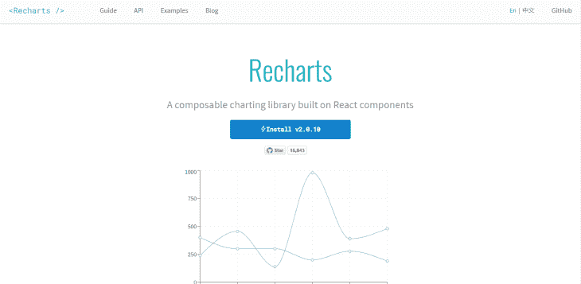
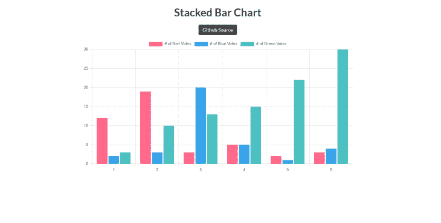
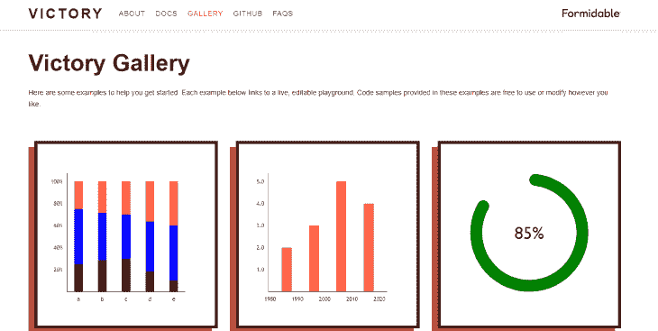
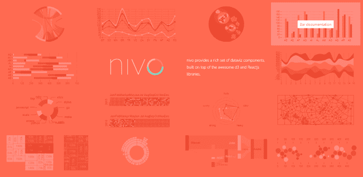
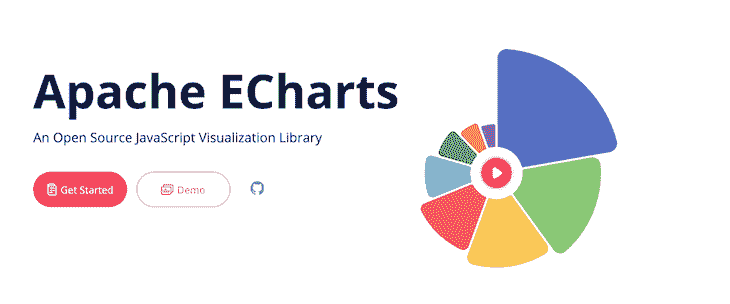

# 前 8 名 React 图表库- LogRocket 博客

> 原文：<https://blog.logrocket.com/top-8-react-chart-libraries/>

***编者按**:本文最后一次更新于 2023 年 2 月 6 日，添加了一些流行的 React 图表库，包括 Visx 和 BizCharts。*

数据无处不在，是我们生活中越来越重要的一部分。我们每天都在收集、发送和分析数据。

数据本身在视觉上并不吸引人，但我们可以做到这一点。图表使数据既美观又更容易理解和保留，因为当有协调的视觉效果来关注时，更容易吸引信息。

在构建网站或应用程序时，有无数种方法可以在工作中显示图表。您可以决定从头开始构建图表，或者使用许多可用的 React 图表库。在本指南中，我们将比较 React 应用程序的顶级图表库。

*向前跳跃*:

## 为什么使用 React 图表库？

图表库旨在简化构建图表和其他数据可视化的过程。在处理小项目时，从头开始创建图表通常很简单。但是，如果您正在处理一个需要显示不同类型数据的项目，使用图表库可能会更有用。

在当今的 React 生态系统中，有许多旨在帮助您轻松高效地创建交互式、响应性甚至动画图表的库。

事不宜迟，让我们比较一下前八个 React 图表库，评估每个库的标准，包括特性、文档、社区采用和可定制性。我们将关注几个最流行和最广泛采用的 React 图表库。

## 雷查尔兹

[GitHub](https://github.com/recharts/recharts) 上有 19K 颗星星， [Recharts](https://recharts.org/en-US/) 是用 D3 和 React 构建的重新定义的图表库。作为 React 最流行的图表库之一，Recharts 拥有易于理解的优秀文档，以及优秀的项目维护人员。

Recharts 遵循 React 的组件原则，允许用户使用其可重用的 React 组件构建图表。Recharts 提供了开箱即用的漂亮图表，可以通过调整现有组件的道具或添加自定义的道具来进行自定义。它仅支持 SVG 的[绘图，不支持移动。默认情况下，图表是不响应的，但是可以通过使用包装组件使其响应。](https://blog.logrocket.com/how-to-use-svgs-in-react/)

Recharts 已经有一段时间了，所以它有很多用户和一个很大的社区。通过使用这个图表库的 CDN 或者用 npm 或 yarn 安装它，您可以很容易地开始使用它。

*   反应组件语法
*   基于 D3
*   SVG 支持/无画布支持
*   [GitHub 星星:19K+](https://github.com/recharts/recharts)
*   npm 下载量:110 万以上
*   由开源社区提供支持

## 反应图 js-2

如果你在 React 中使用过 [Chart.js，那么在使用](https://blog.logrocket.com/using-chart-js-react/) [react-chartjs-2](https://www.npmjs.com/package/react-chartjs-2) 时，你应该不会有学习曲线。react-chartjs-2 是流行的 JavaScript Chart.js 库的 react 包装器。Chart.js 的许多特性可以在 react-chartjs-2 中使用。

react-chartjs-2 只支持画布的绘制，并且在客户端呈现。在撰写本文时，它在 [GitHub](https://github.com/reactchartjs/react-chartjs-2) 上拥有超过 5.7K 颗星星。

react-chartjs-2 支持动画，它提供的大多数图表都是默认响应的。该库为各种类型的图表样式提供了一些现成的组件，还允许进行自定义。

尽管 react-chartjs-2 没有自己的详细文档，但其网站显示了[不同的图表类型](https://reactchartjs.github.io/react-chartjs-2/#/)以及如何开始使用它们。此外，Chart.js 还有详细、易于理解的文档。

这个库在所有现代浏览器上都运行得很好，并且拥有一个庞大的用户社区和优秀的维护者。它可以使用 npm 或 yarn 安装。

*   反应组件语法
*   基于 [Chart.js](https://www.chartjs.org/)
*   画布支持/不支持 SVG
*   [GitHub 星辰:5.7K+](https://github.com/reactchartjs/react-chartjs-2)
*   npm 下载量:770K+
*   由开源社区提供支持

## 获胜

根据其官方文档，Victory 是“一个自以为是，但完全可替代的，用于构建交互式数据可视化的可组合 React 组件的生态系统。”

和榜单上其他很多 React 图表库一样， [Victory](https://formidable.com/open-source/victory/) 是用 React 和 D3 搭建的。它带有各种各样的现成图表，可以完全定制。

Victory 有健壮、详细的文档，这使得该库对初学者友好，易于上手。它具有对 SVG 的绘图支持和可定制的高质量动画(至少在某种程度上)。Victory 还提供了各种屏幕尺寸都能很好工作的响应图表。

在撰写本文时，这个库在 GitHub 上有超过[个 10K 明星，并由](https://github.com/formidablelabs/victory)[强大的](https://github.com/FormidableLabs)的开发者维护。

使用 Victory 的一个主要优点是，它还可以用于构建 iOS 和 Android 应用程序。这是因为 [Victory 有一个 React Native](https://blog.logrocket.com/creating-victory-charts-react-native/) 版本，它使用了与 web 版本几乎相同的 API。

## Nivo

与许多其他 React 图表库一样，Nivo 是用 React 和 D3 构建的，并提供了多种图表类型和设计供选择。该库提供了 HTML、Canvas 和 SVG 图表，支持客户端和服务器端渲染，并能很好地处理动画。

Nivo 提供了大量漂亮的图表，如果需要，可以毫无困难地进行定制。默认情况下，Nivo 提供的许多图表都是响应式的，因此它们非常适合各种屏幕尺寸。Nivo 还支持运动和过渡，由 [React Motion](https://blog.logrocket.com/introduction-to-react-motion/) 提供动力。

在撰写本文时，Nivo 拥有超过 [11K 的 GitHub stars](https://github.com/plouc/nivo) 。它拥有一个繁荣的社区和积极参与的维护者，并且有一个[漂亮的网站](https://nivo.rocks/)，上面有详细的文档，使它很容易上手。Nivo 可以使用 npm 或 yarn 安装。

*   反应组件语法
*   基于 D3
*   SVG、Canvas 和 HTML 支持
*   由[驱动的动画反应运动](https://blog.logrocket.com/introduction-to-react-motion/)
*   [GitHub stars: 11K](https://github.com/plouc/nivo)
*   npm 下载量:336K+
*   由开源社区提供支持

## 对…做出反应

由优步创建，用 React 和 D3 构建， [React-Vis](https://uber.github.io/react-vis/) 是最容易上手的 React 图表库之一。

如果您曾经使用过 React 组件，您会发现使用 React-Vis 提供的组件很容易，因为它们的功能相似，都有道具、子组件和回调。

使用 React-Vis，您可以创建各种类型的图表，包括折线图、条形图和饼图等。它提供了有吸引力的、可定制的现成图表，并支持由 React Motion 驱动的动画图表。

React-Vis 还支持 Canvas 和 SVG。使用 React-Vis 不需要深入了解任何数据可视化库；易于理解的文档足以让您入门。

*   反应组件语法
*   基于 D3
*   SVG 和画布支持
*   [GitHub 明星:8K+](https://github.com/uber/react-vis)
*   npm 下载量:120 万以上
*   由优步支持

## 埃查尔兹

ECharts 是由 Apache 构建的图表库。它构建在轻量级 Canvas 库 ZRender 之上，提供了 SVG 和 Canvas 支持。

除了常见的图表类型，ECharts 还提供了一些独特的图表类型，如桑基图、曲线图和热图。除了 200 多种数据可视化类型，ECharts 还提供了广泛的定制选项，并支持主题和扩展。它还支持动画，默认情况下是响应式的。ECharts 也有一个庞大的用户社区，并得到 Apache 的支持。

其广泛的定制选项和对主题和扩展的支持，使 ECharts 成为开发人员的一个很好的选择，这些开发人员希望用详细的数据可视化来创建漂亮的、信息丰富的图表。

*   普通 JavaScript 语法
*   一流的动画和美学
*   主题和扩展—也支持浅色和深色主题
*   SVG 和画布支持
*   [GitHub stars: 54K+](https://github.com/apache/echarts)
*   npm 下载量:458K+
*   由阿帕奇支持

## 商业图表

[BizCharts](https://bizcharts.net/) 是阿里巴巴打造的数据可视化库。它建立在 G2 之上，G2 是 AntV 建立的数据可视化库。

BizCharts 提供了广泛的图表类型，并支持 SVG 和 Canvas。它还提供了广泛的定制选项，并支持主题和扩展。您可能找不到一些英文文档，但是 BizCharts 库很容易使用，并且有一个蓬勃发展的用户社区。

*   反应组件语法
*   基于 D3
*   SVG 支持/无画布支持
*   [GitHub 明星:6K+](https://github.com/alibaba/BizCharts)
*   npm 下载量:23K+
*   由阿里巴巴支持

## Visx

[Visx](https://airbnb.io/visx) 是 Airbnb 搭建的数据可视化库。它建立在 D3 之上，提供了广泛的图表类型，并支持 SVG 和 Canvas。

其简约的设计使 Visx 在美学上令人愉悦。API 是超级可定制的，允许你在它的基础上构建自己的图表库。

Visx 也非常注重性能，并保持较小的包大小。它与 CSS-in-JS 库如 styled-components 和 emotion 配合得很好。

*   反应组件语法
*   基于 D3
*   SVG 支持/无画布支持
*   [GitHub 星星:16K+](https://github.com/airbnb/visx)
*   npm 下载量:295K+
*   由 Airbnb 支持

## 结论

React 可用的图表库比我们在一篇文章中可以研究的要多，但是上面描述的几个库是 React 社区中最广泛采用和喜爱的。

下面是上面提到的库的采用和流行的快速回顾:

| **图书馆** | **星星** | **下载量** | **渲染** | **由**撑腰 |
| --- | --- | --- | --- | --- |
| 重新开始 | 9k+ | 1.5 米+ | SVG(SVG) | 开源社区 |
| 反应图 js-2 | 8k+的 | 773 千多万 | 帆布 | 开源社区 |
| 获胜 | 10k 以上 | 175k+ | 挽救（saving 的简写） | 强大的实验室 |
| 尼夫 | 11k+ | 336k+ | SVG，画布 | 开源社区 |
| 对…做出反应 | 8k+的 | 98 公里以上 | SVG，画布 | 优步 |
| 电子图表 | 54k 以上 | 458k+ | SVG，画布 | 街头流氓 |
| 商业图表 | 6k | 23k 以上 | 挽救（saving 的简写） | 阿里巴巴 |
| Visx | 16k+的 | 295，000 以上 | 挽救（saving 的简写） | 爱彼迎（美国短租平台） |

当决定将图表库用于 React 项目时，请记住它们都是为了帮助开发人员实现特定的最终结果而创建的。在决定哪一个最适合您的项目之前，比较它们的功能和它们提供的功能。一些图表库可能是小型项目的理想选择，而另一些则更适合更复杂的项目。

最终，选择使用什么样的 React 图表库取决于您的项目需求和您喜欢使用什么类型的特性。

## [LogRocket](https://lp.logrocket.com/blg/react-signup-general) :全面了解您的生产 React 应用

调试 React 应用程序可能很困难，尤其是当用户遇到难以重现的问题时。如果您对监视和跟踪 Redux 状态、自动显示 JavaScript 错误以及跟踪缓慢的网络请求和组件加载时间感兴趣，

[try LogRocket](https://lp.logrocket.com/blg/react-signup-general)

.

  

LogRocket 结合了会话回放、产品分析和错误跟踪，使软件团队能够创建理想的 web 和移动产品体验。这对你来说意味着什么？

LogRocket 不是猜测错误发生的原因，也不是要求用户提供截图和日志转储，而是让您回放问题，就像它们发生在您自己的浏览器中一样，以快速了解哪里出错了。

不再有嘈杂的警报。智能错误跟踪允许您对问题进行分类，然后从中学习。获得有影响的用户问题的通知，而不是误报。警报越少，有用的信号越多。

LogRocket Redux 中间件包为您的用户会话增加了一层额外的可见性。LogRocket 记录 Redux 存储中的所有操作和状态。

现代化您调试 React 应用的方式— [开始免费监控](https://lp.logrocket.com/blg/react-signup-general)。