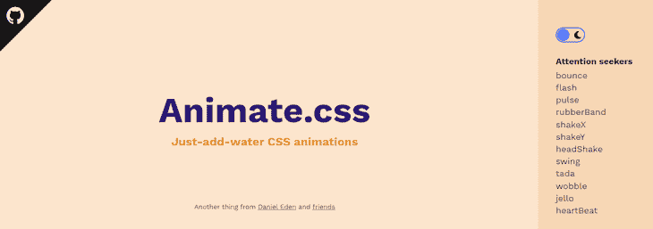
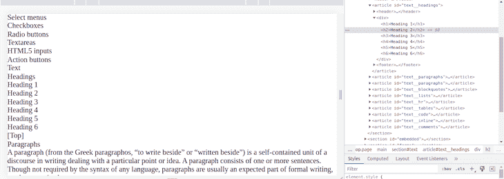
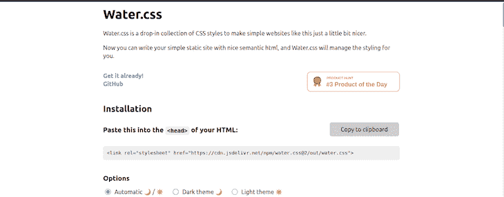
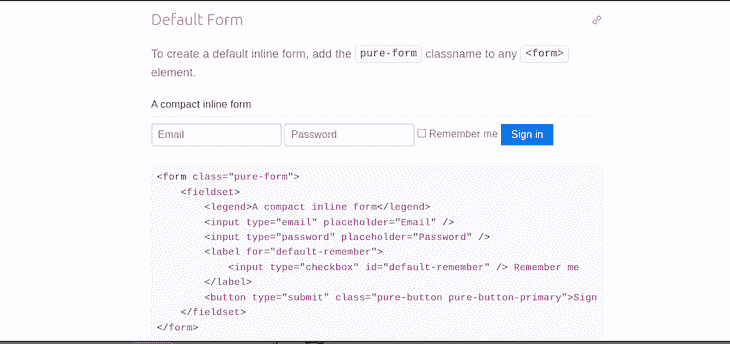
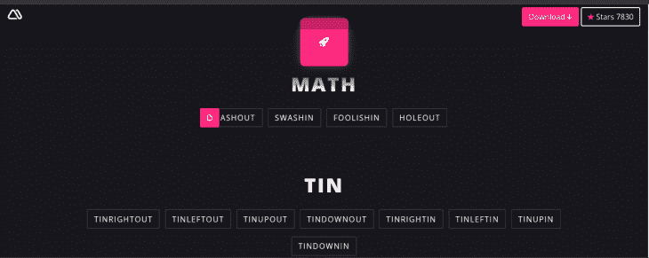
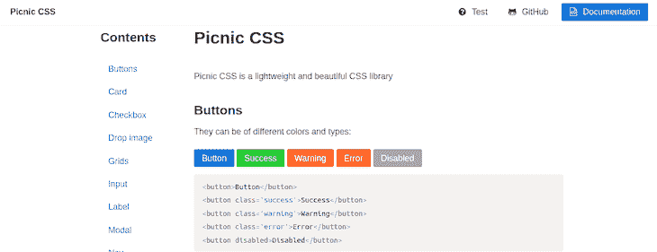
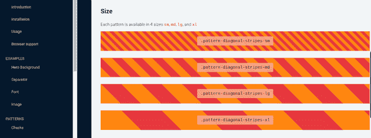

# 十大 CSS 库让你的网页设计更强大

> 原文：<https://blog.logrocket.com/top-css-libraries-empower-web-design/>

***编者按**:这篇 CSS 库的文章最后一次更新是在 2022 年 11 月 29 日，更新了 CSS 库的列表，更明确地定义了 CSS 库和框架的区别。*

有了 CSS，你就没有理由每次进行新的项目或设计时都要重新发明轮子。

为编码人员和开发人员提供大量的工具和资源是 CSS 最强的优势和最大的吸引力之一。它帮助您轻松地创建令人惊叹的设计，让您专注于创造力和生产力，而不是在开始之前就陷入技术细节中。

有大量令人惊叹的 CSS 库来帮助增强您的代码，使您的生活尽可能简单高效。我们将向您展示一些我们的最爱:

在我们开始之前，让我们澄清一下 CSS 库是什么意思。

## 什么是 CSS 库？

你经常会听到两个关于 CSS 预制资产的术语:库和框架。它们都很相似，但有一些关键的区别。

[自由代码营](https://www.freecodecamp.org/news/the-difference-between-a-framework-and-a-library-bd133054023f/)将 CSS 图书馆比作当你想要装修房子时的宜家之旅。有时候，你不想从头开始做一张桌子或者自己设计叉子。

另一方面，框架就像一个家庭模型。坚持房子的比喻，框架就是蓝图和承包商。你也许可以在这里或那里做一些细微的美学决定，但是最终产品是由框架强烈塑造的。

## CSS 库与框架

“库”和“框架”这两个词经常互换使用。但是它们的意思不一样。

库和框架都是别人写的可重用代码。当您使用库时，您控制着应用程序的流程。您可以在应用程序中决定何时调用它。但是当你使用一个框架时，它控制着应用程序的流程。换句话说，一个框架自己负责运行这个节目。

有了库，你可以选择让事情按照你想要的方式运行。对于框架，你必须遵循最初的规则。

以 jQuery 和 Angular 为例。一个是 JavaScript 库，另一个是框架。在您的 JavaScript 代码中，jQuery 不关心您决定在哪里使用它，也不关心代码库的文件结构如何。对于 Angular，情况并非如此。你的整个应用程序必须基于 Angular，遵循 Angular 自己关于函数、文件结构等的规则。

此外，库通常比框架更轻。

但是本文的重点是 CSS 库，所以让我们深入研究一些最好的库，为您的下一个项目做准备。

## Animate.css

[Animate.css](https://animate.style/) 是一个现成的 css 动画库，可以跨多种浏览器实现。

动画是给你的网页设计增添趣味的简单方法。它们也是引起兴趣的一种简单方式，良好的印象是你的品牌。

消费者在观看动画视频后，喜欢某个产品的可能性增加了 70%。他们观看视频后分享视频的可能性也增加了 92%。

然而，动画在 web 开发中可能很难实现。当跨多个平台实现网页动画时，这变得更加棘手。

Animate.css 简化了这一点，因为它易于安装，一旦安装，只需使用`animate__animated`函数就可以轻松添加动画元素。

假设我们想在页面的某个元素上添加一个 flash 动画。这很容易做到，就像这样:

```
<h1 class="animate__animated animate__flash">A flash animation</h1>

```

你可以在图书馆主页上看到这些不同动画的演示:



Animate.css 也可以广泛定制。你得到的不仅仅是一个美化了的 GIF 图库。css 可以指定动画的长度、延迟时间和交互。所有这些都是通过易于理解和实现的本机命令实现的。

## CSS 棒

说到网页动画，有时候你只需要一些简单的自定义图形，而不必写任何代码。如果你正在寻找一个 CSS 库来添加简单的动画元素，比如浮动光标和阴影， [CSS Wand](https://www.csswand.dev/) 值得一看。

更好的是，CSS Wand 的命令只需剪切并粘贴到您的代码中即可实现。这就像你所希望的那样，是一个即插即用的 CSS 库。正如您在下面看到的，单击 grow 动画会显示现成的代码，您可以轻松地将其复制并粘贴到项目中:


## 迪斯特勒。CSS(CSS)

你有时会听到“固执己见”和“不固执己见”的 CSS 库和框架。是一个优秀的固执己见的 css 库，允许你重新设置你的 HTML，给你的网络项目一个干净的石板。

css 允许您重新设置自定义边距和间距。它可以让你把行高和字体大小恢复到原来的状态。它还使您不必为不同类型的用户代理重置 web 项目。

css 帮助你轻松地在多种浏览器上实现你的 web 项目。它还允许您利用主网页的样式表，同时仍然为特定的 web 项目和应用程序提供空白画布。

下图很好地展示了 Destyle.css 如何从示例页面中提取所有默认样式。使用浏览器工具检查页面，可以清楚地看到标题等元素的存在，即使通常应用的样式已经被删除:



### 赞成的意见

*   跨浏览器设置新的和一致的默认值
*   帮助管理不一致性

### 骗局

*   解决由默认值引起的不一致问题，但创建一组全新的默认值

## 水. css

如果你想给网站添加一些简单的 css 功能，Water.css 是一个很好的工具。它被称为“水”，就像“只加水”一样，使它成为 Bisquick 的编程等价物。

Water.css 使几个 web 开发元素易于实现。其中包括响应式网页设计和嵌入式表单。该库的主页是用 Water.css 编写的，该库还带有现成的明暗主题，默认情况下页面内容居中:



css 也非常轻量级，只有 2kb。它也没有特性类，所以很容易通用地实现。

### 赞成的意见

*   现代浏览器支持
*   非常轻便
*   具有开箱即用的响应能力

### 骗局

*   只能用于简单/静态网站。不幸的是，使用这个库无法构建复杂的交互式网站

## 葡萄干

我们的下一个库[raising cs](https://github.com/tretapey/raisincss)从没有课变成有*多*节课。RaisinCSS 将自己描述为一个 CSS 实用程序库。它为流行的 CSS 框架如 flexbox 和 CSS Grid 提供了预构建的模块。它也是完全可定制的、轻量级的、易于部署的。

RaisinCSS 为您提供了一整套构建模块和工具来定制您的 CSS。各种命令都有广泛的功能，包括:

*   显示
*   浮动
*   泛滥
*   光标
*   位置
*   不透明
*   能见度

乍一看，可定制的边距和光标库听起来可能不像是世界上最令人兴奋的事情。如果您熟悉处理类的实用框架 Tailwind，那么 Raisin 会容易得多。即使没有，在 RaisinCSS 中为页面元素设置边距也只会给你带来一个形式为`m-[margin size]`的类。

除非你不得不手动设置同一个网站不同部分的页边距，否则你可能会非常高兴在你的工具包中有一个像 RaisinCSS 这样的工具。

### 赞成的意见

*   因为它只处理类，所以用户最终很少甚至没有编写 CSS
*   可以轻松定制以满足用户需求，并扩展现有的类

### 骗局

*   船舶与有限的类，简单的像保证金，填充，显示等。例如，省略了由用户引入的像过渡这样的功能

## 纯. css

移动开发者需要非常清楚他们消耗的资源。移动应用需要尽可能的轻便、紧凑和高效。如果你是为移动设备开发的，那么在你的工具包里有一个轻量级的、简洁的 CSS 库是很好的。

Pure.css 是一个非常轻量级的 css 库。压缩后，整个库只有 4.0kb。

尽管 Pure.css 很小，但它提供了一整套 css 工具。它有 CSS 工具，从表格到按钮到网格和表单。如下所示，默认的内联表单是通过将类名`pure-form`添加到任何表单元素中创建的:



通过只安装你需要的组件，Pure.css 可以变得更轻。如果你需要一个简单的、轻量级的、准系统的 CSS 库，并且它仍然是强大的，那么就去找 Pure.css 吧。

### 赞成的意见

*   基于 Normalize.css 构建，这是一个 css 重置工具，旨在帮助实现浏览器兼容性和一致性
*   对于一个提供大量现成类的库来说是非常小的，这些类可以帮助你快速发布网站

### 骗局

*   看起来很像 Bootstrap，不容易配置和定制。如果在多个网站上使用相同的样式，这些网站看起来会变得一样

## 神奇的 CSS

Magic CSS 是一个免费、开源、轻量级的动画库，可以帮助你在网站上添加特效。

在你的网站上放动画总是很有趣。看到 DOM 元素栩栩如生的过程是令人满意的，尽管有一种误解，认为总是需要大量的 JavaScript 来实现这些动画。

Magic CSS 使用最少的 JavaScript 和 jQuery 来选择各种类型的动画，并将其应用于页面上的 DOM 元素。只需点击适合你的动画，并将名字复制到你的剪贴板上。然后，您可以将其粘贴到您的 JavaScript 中。

想象一下，在你的网站上有一个名为`foolishin`的动画:



### 赞成的意见

*   支持 JavaScript 和 jQuery，因此用户可以随心所欲地编写 JavaScript
*   动画范围从旋转到闪光，到静态效果，幻灯片，甚至炸弹

### 骗局

*   Opera Mini 不支持

## 野餐 CSS

野餐 CSS 附带了一个广泛的预构建组件列表，如按钮、卡片、模态、导航栏等。有了这个库，你就不用太担心用户界面的外观了。

野餐 CSS 带有组件类，如按钮、卡片、输入字段和网格布局:



## pattern.css

动画可能不适合你，但是当它们被添加到一个站点时，模式不会被忽视。

免费、开源并且有惊人的浏览器支持， [pattern.css](https://bansal.io/pattern-css) 为你的下一个项目提供了各种各样的模式。无论是水平线、圆点、对角线图案、之字形等等:



### 赞成的意见

*   与其他模式库不同，模式不是静态的 PNG 文件。颜色和尺寸可以改变，以适应用户的喜好
*   这个库可以和其他 CSS 框架一起工作，比如 Bootstrap

### 骗局

*   不幸的是，不支持和/或工作与其他流行的框架，如顺风

## voxel.css

[voxel.css](http://voxelcss.com/) 是一个用于 3D 渲染的 css 库。将 CSS 用于 3D 有许多意想不到的好处。例如，使用体素库意味着鼠标事件没有光线跟踪。

这也意味着您的所有图像类型都可以利用 mesh。CSS 还确保您的 3D 图形可以利用 GPU 加速和过渡。

Voxel 足够灵活，可以用于从 3D 网络动画到全功能视频游戏的任何东西。这个 CSS 库有四个不同的类——场景、世界、编辑器和体素——它还提供了几乎和完整的 3D 动画套件一样多的可定制性:


## 结论

在创建网页设计时，使用 CSS 库会让你的生活变得更加简单。

没有必要一遍又一遍地重新编码轮子。CSS 库也有助于在所有开发项目中创建连续性，为您的数字项目提供一种有凝聚力的视觉美感。

虽然我们编译的一些 CSS 库乍看起来可能不那么令人兴奋，但它们会让您的生活更轻松、更高效、更有成效，让您专注于真正重要的事情——创建出色的 web 设计和令人惊叹的应用程序。

## 你的前端是否占用了用户的 CPU？

随着 web 前端变得越来越复杂，资源贪婪的特性对浏览器的要求越来越高。如果您对监控和跟踪生产环境中所有用户的客户端 CPU 使用、内存使用等感兴趣，

[try LogRocket](https://lp.logrocket.com/blg/css-signup)

.

[](https://lp.logrocket.com/blg/css-signup)[https://logrocket.com/signup/](https://lp.logrocket.com/blg/css-signup)

LogRocket 就像是网络和移动应用的 DVR，记录你的网络应用或网站上发生的一切。您可以汇总和报告关键的前端性能指标，重放用户会话和应用程序状态，记录网络请求，并自动显示所有错误，而不是猜测问题发生的原因。

现代化您调试 web 和移动应用的方式— [开始免费监控](https://lp.logrocket.com/blg/css-signup)。