# Top React 仪表板库

> 原文：<https://blog.logrocket.com/top-react-dashboard-libraries/>

仪表板直观地显示重要指标，为现代企业应用程序所有者和管理员提供可共享的见解，有助于监控性能、发现趋势和发现问题。

构建仪表板应用程序有许多选择，框架的选择通常是最重要的因素。在我看来，反应是不会错的。这是目前最流行、最通用的 UI 框架。

React 提供了与多个第三方前端工具和软件包的无缝集成，能够轻松操作和可视化大块数据(例如图表、图形和数据网格)。但是使用 React 从头构建一个仪表板会花费大量的时间和精力。其他前端技术也是如此。

在本文中，我将分享最好的免费开源仪表板模板的精选列表，这些模板足够复杂，可以作为独立的库，并且可以根据需要为项目轻松设置和修改。

让我们来看看以下 React 仪表板库:

## 反应-管理

首先是 React-admin，这是一个全面的开源库，用于构建数据驱动的管理仪表板。

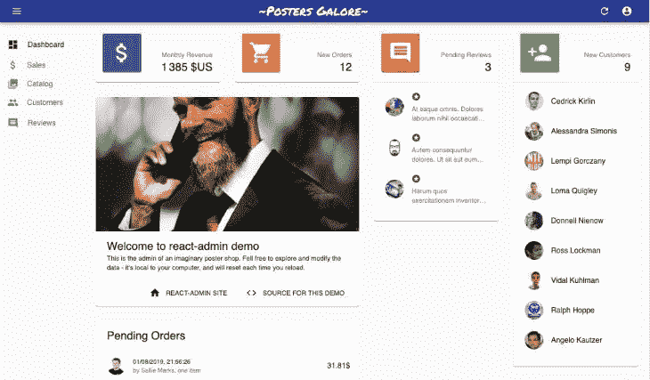

React-admin 基于 React 框架，由流行的 UI、数据管理和路由技术(如 Material UI、Redux、React Final Form 和 React Router)提供支持。这个库使用数据提供者来轻松适应几种后端架构，如 GraphQL、REST 和 SOAP。

React-admin 的松散耦合设计使得替换其任何核心系统都非常容易。例如，可以使用 Bootstrap 代替默认的材料设计。这个库可以集成到一个现有的项目中，也可以作为一个独立的项目使用 JavaScript 或 TypeScript。

**特点**:

*   数据有效性
*   国际化(i18n)
*   主题
*   身份验证(OAuth 等)
*   所见即所得编辑器

**快速启动** :
通过 npm 安装:

```
npm install react-admin

```

通过纱线安装:

```
yarn add react-admin

```

**统计数据**:

## 蚂蚁设计专业版

Ant Design Pro 是一个免费的开源 UI 库，用于为企业应用程序搭建生产就绪的管理界面解决方案。

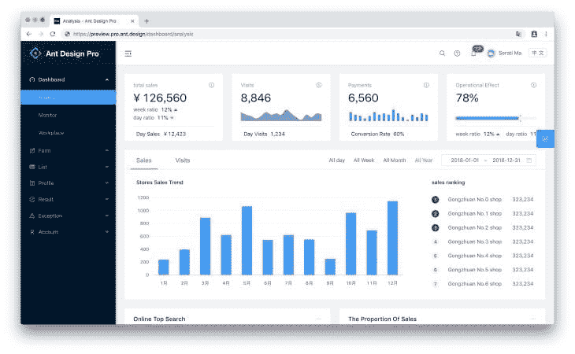

该库基于 React 海和 Ant Design UI 库，因此它是高度可定制的，有良好的文档记录，并且具有简单的学习曲线。

蚂蚁设计专业版由蚂蚁集团和大型电子商务公司阿里巴巴共同维护。图书馆定期更新，维护良好。Ant Design Pro 为开发人员提供了选择 JavaScript 或 TypeScript 进行开发的选项。

**特点**:

*   响应性
*   主题
*   国际化(i18n)
*   用户界面测试

**快速启动** :
克隆回购:

```
git clone https://github.com/ant-design/ant-design-pro.git --depth=1

```

**统计数据**:

## 反应仪表板

React Dashboard 是由 Flatonic 创建的管理库，Flatonic 是一家为各种 JavaScript 框架提供免费和高级模板的公司。React Dashboard 是一个免费的管理仪表板，由 React、Bootstrap、React Router、Redux 和 GraphQL 构建。

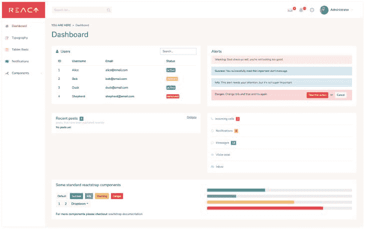

这个库附带了一个工作 Node.js 后端集成，允许轻松的数据可视化和身份验证。

**特点**:

*   证明
*   响应性
*   平面逻辑 CSS 集
*   CRUD 操作

**快速启动** :
克隆回购:

```
git clone -o react-dashboard -b master --single-branch \ https://github.com/flatlogic/react-dashboard.git

```

**统计数据**:

## 材料仪表板反应

Material Design React 是一个开发者友好的管理仪表板库，基于 [Google 的 Material Design (MUI)](https://mui.com) 和 React。

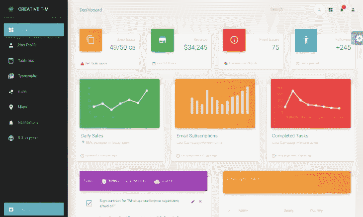

该库带有预构建的设计模块，可确保无缝开发流程。它还提供了 70 多个前端独立元素，如按钮、输入和卡片，可以使用 MUI 风格的 API 和 [sx prop](https://mui.com/system/the-sx-prop/) (自定义风格)轻松修改。

**快速启动** :
通过 npm 安装:

```
npm i material-dashboard-react

```

克隆回购:

```
git clone https://github.com/creativetimofficial/material-dashboard-react.git

```

**统计数据**:

## 伏特反应仪表板

Volt React Dashboard 是一个基于 Bootstrap 5 和 Sass 前端技术的免费开源 React Dashboard 库。这个库是基于 React 组件构建的，使用 React 挂钩和数据驱动的方法来确保改进的开发人员体验。


Volt 的结构设计使得从后端技术获得的数据很容易可视化。该库通过一组对象在预制组件之间传递数据，这些对象可以很容易地集成到预制组件中，如表单元素和其他 UI 元素。

**快速启动** :
**通过 npm** 安装:

```
npm i @themesberg/volt-react-dashboard

```

克隆回购:

```
git clone https://github.com/themesberg/volt-react-dashboard.git

```

**统计数据**:

## 机体反应

Airframe React 是一个管理仪表板库，具有简约的设计和创新的轻型 UI，用于构建大规模的仪表板应用程序。

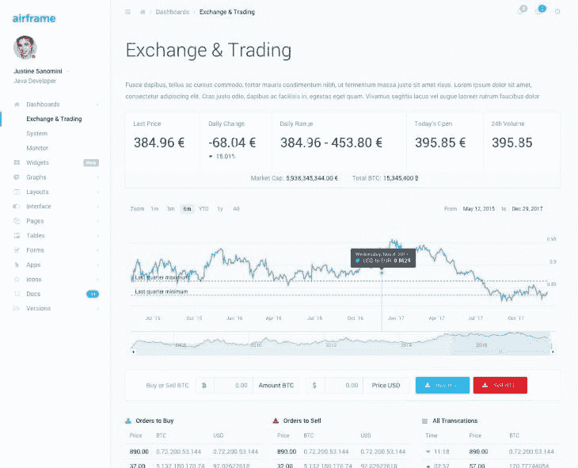

该库由大量预制组件组成，可用于设置所有类型的自定义数据可视化 web 应用程序，如管理面板和数据分析。

机体基于 React、Bootstrap、React 路由器和 Reactstrap。

**快速启动** :
**通过 npm** 安装:

```
npm i react-airframe

```

克隆回购:

```
git clone https://github.com/0wczar/airframe-react.git

```

**统计数据**:

**注意:**，*机体反应从 2020 年开始就没有更新过。尽管如此，这仍然是比从头开始构建仪表板更好的选择。*

## 核心用户界面反应

Core UI React 是一个轻量级的 MIT 授权开源仪表板库，构建在 Bootstrap 5 和 React with TypeScript 之上。

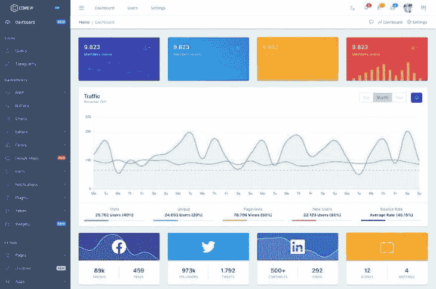

Core UI React 由来自 core UI CSS 库的样式化组件组成，它作为 Bootstrap 的扩展，为该库添加了额外的功能。

这个库的透明代码和没有冗余依赖使得它足够轻，可以提供最终的用户体验。

**快速启动** :
通过 npm 安装:

```
npm i @coreui/react

```

克隆回购:

```
git clone https://github.com/coreui/coreui-free-react-admin-template.git

```

**统计数据**:

## 碎片会起反应

Shards React 是操纵来自博客平台的数据块的最好的仪表板库之一。它有一个易于使用的 React UI 工具包，基于材料设计和字体真棒。

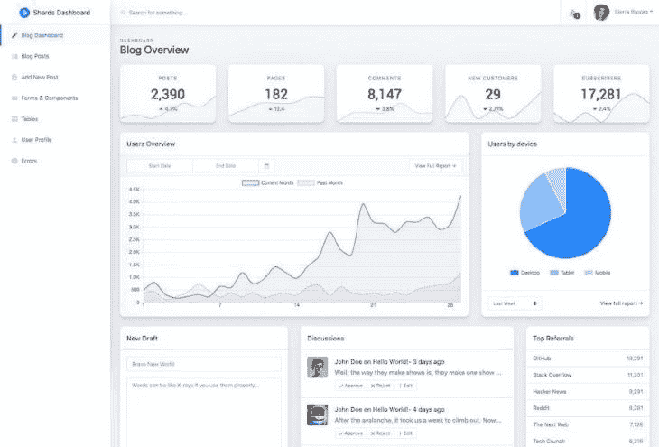

这个库包括可定制的组件，用于管理和可视化来自任何博客平台的数据。这些组件包括表格、表单、博客仪表板、博客文章统计等等。

**快速启动** :
通过 npm 安装:

```
npm i shards-react

```

通过纱线安装:

```
yarn add shards-react

```

**统计数据**:

**注意:**，*《碎片反应》自 2020 年起就没更新过。*

## 反应还原

React Reduction 是用 React 和 Bootstrap 4 构建的库。它提供了许多组件、卡片、图表和小部件，用于创建时尚和专业的仪表板。

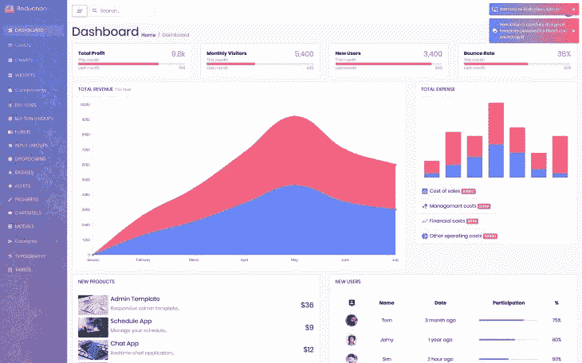

**快速启动** :
克隆回购:

```
git clone https://github.com/reduction-admin/react-reduction.git

```

**统计数据**:

**注意:**， *React Reduction 自 2020 年以来一直没有更新。*

## 氩仪表板反应

氩气仪表盘 React 基于 Bootstrap 4 和 Reactstrap。这是一个免费的开源库，带有完全编码的组件，提供选择和组合不同变体的自由，以创建令人惊叹的 web 应用程序。

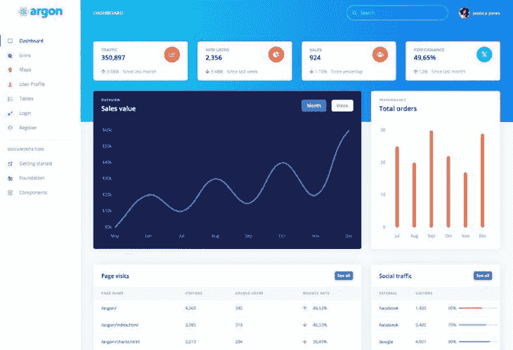

该库还提供了几个预构建的示例，使得开发过程无缝。

**快速启动** :
通过 npm 安装:

```
npm i argon-dashboard-react

```

用凉亭安装:

```
bower install argon-dashboard-react.

```

克隆回购:

```
git clone https://github.com/creativetimofficial/argon-dashboard-react.git.

```

**统计数据**:

## 马赛克 Lite

Mosaic Lite 是一个用 Tailwind CSS 和 React 构建的开源库。它是一个响应式仪表板模板，带有预编码图表和小部件，用于为 SaaS 产品和现代 web 应用程序构建用户界面。


**快速启动** :
克隆回购:

```
git clone https://github.com/cruip/tailwind-dashboard-template.git

```

**统计数据**:

## 纸质仪表板反应

纸质仪表盘 React 是一个基于 Bootstrap 4 的彩色仪表盘库。它附带了大量的组件，这些组件设计得看起来整洁有序。

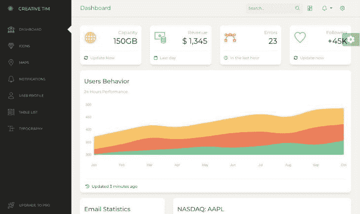

这个库由适量的依赖项组成，具有足够的特性以方便使用。

**快速启动** :
通过 npm 安装:

```
npm i paper-dashboard-react

```

克隆回购:

```
git clone https://github.com/creativetimofficial/paper-dashboard-react.git

```

**Stats** :

## Azia

Azia 是另一个基于 Bootstrap 框架的 React 仪表盘库。该库包含许多 UI 元素、组件和预制的示例页面，可以让您的项目立即启动并运行。

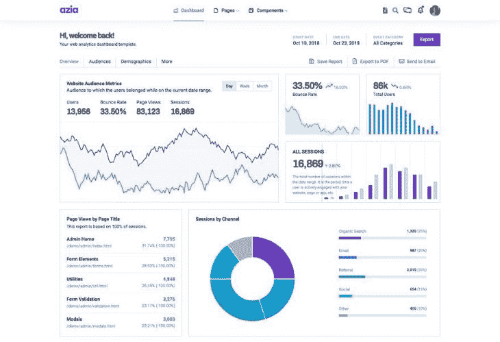

**快速启动** :
克隆回购:

```
git clone https://github.com/BootstrapDash/azia-admin-react.git

```

**统计数据**:

## 明星管理反应

Star Admin React 是一个强大的仪表板库，内置了各种基本的 UI 元素。


Star Admin React 基于 Bootstrap UI 库，它为可视化数据和创建独特的 web 应用程序提供了无限的定制选项。

**快速启动** :
克隆回购:

```
git clone https://github.com/BootstrapDash/StarAdmin-Free-React-Admin-Template.git

```

**统计数据**:

## 结论

在本文中，我们回顾了使用 React 构建专业仪表板和管理面板 web 应用程序的 14 个顶级免费解决方案。

有了这些库，您不必浪费时间和精力从零开始构建仪表板。这些 React 库加载了基本工具、UI 工具包和全面的文档，确保了无压力和高效的开发人员体验。

## [LogRocket](https://lp.logrocket.com/blg/react-signup-general) :全面了解您的生产 React 应用

调试 React 应用程序可能很困难，尤其是当用户遇到难以重现的问题时。如果您对监视和跟踪 Redux 状态、自动显示 JavaScript 错误以及跟踪缓慢的网络请求和组件加载时间感兴趣，

[try LogRocket](https://lp.logrocket.com/blg/react-signup-general)

.

[ ](https://lp.logrocket.com/blg/react-signup-general) [](https://lp.logrocket.com/blg/react-signup-general) 

LogRocket 结合了会话回放、产品分析和错误跟踪，使软件团队能够创建理想的 web 和移动产品体验。这对你来说意味着什么？

LogRocket 不是猜测错误发生的原因，也不是要求用户提供截图和日志转储，而是让您回放问题，就像它们发生在您自己的浏览器中一样，以快速了解哪里出错了。

不再有嘈杂的警报。智能错误跟踪允许您对问题进行分类，然后从中学习。获得有影响的用户问题的通知，而不是误报。警报越少，有用的信号越多。

LogRocket Redux 中间件包为您的用户会话增加了一层额外的可见性。LogRocket 记录 Redux 存储中的所有操作和状态。

现代化您调试 React 应用的方式— [开始免费监控](https://lp.logrocket.com/blg/react-signup-general)。