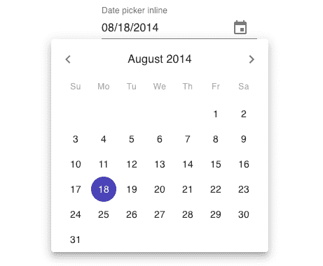
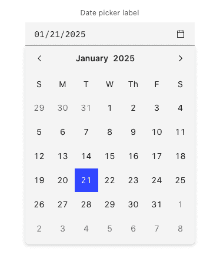
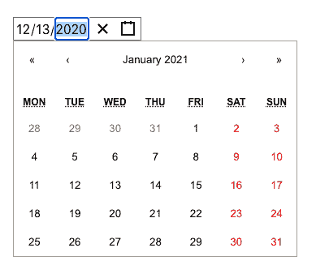
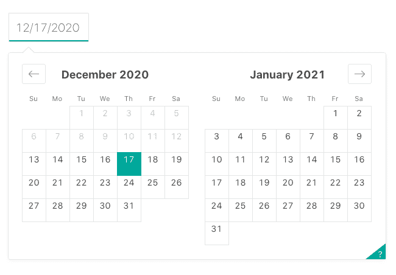
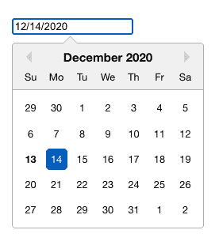
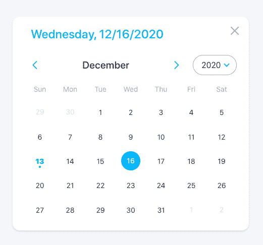
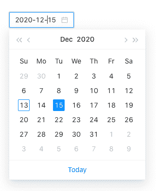
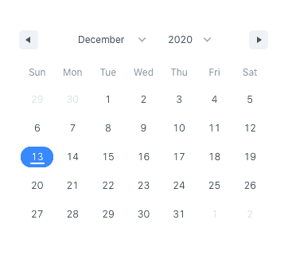

# 2021 年最佳日期选择

> 原文：<https://blog.logrocket.com/top-react-date-pickers-for-2021/>

作为开发人员，我们总是在寻找节省项目时间的方法。这就是为什么要创建库，这样我们就不会一遍又一遍地实现同样的东西。有了像 React 这样的前端框架，为不同的项目共享公共功能变得前所未有的容易。

在这篇文章中，我将带你浏览一些我认为非常有用的日期选择器库。请注意，我们将只浏览最近更新过的库。这是为了确保它能在你的项目中工作，而不需要经历很多麻烦。

## 材料 UI 日期/时间选择器



如果您使用材质 UI 作为项目 UI 组件的基础，您很可能还必须使用材质 UI 的日期和时间选择器。

这个库的好处是，即使你受限于材料设计，它仍然是非常可定制的。您可以通过材质 UI 提供的`createMuiTheme()`功能自定义样式。

这是该列表中唯一具有时钟视图的组件。这使得在桌面和移动视图中选择时间变得非常容易。

官方文档中的示例使用 date-fns 作为解析和格式化日期的日期时间库，但是您当然可以使用自己选择的日期时间库。这个库唯一的缺点是它没有自己的日期范围选择器(至少在稳定版上)。日期范围选择器仍在 alpha 上。

日期时间选择器没有附带核心材质 UI 库，因此您必须使用以下命令来安装它:

```
npm install @material-ui/core date-fns @date-io/[email protected]^1.3.13 @material-ui/pickers --save
```

你可以像这样使用它。注意，这是 Material UI 当前稳定版本的代码。是[不再支持](https://github.com/mui-org/material-ui-pickers/issues/2157)(从写这篇文章的时候算起大概一个月前)。因此，如果您在稍后的日期阅读此文章，并且下一版本的 Material UI 已经稳定，那么您应该使用该版本:

```
import React, { useState } from 'react';
import DateFnsUtils from '@date-io/date-fns';
import {
  MuiPickersUtilsProvider,
  KeyboardDatePicker,
} from '@material-ui/pickers';

export default function MaterialDatePicker() {

  const [selectedDate, setSelectedDate] = useState(new Date());

  const handleDateChange = (date) => {
    setSelectedDate(date);
  };

  return (
    <MuiPickersUtilsProvider utils={DateFnsUtils}>
      <KeyboardDatePicker
        disableToolbar
        variant="inline"
        format="MM/dd/yyyy"
        margin="normal"
        id="date-picker-inline"
        label="Date picker inline"
        value={selectedDate}
        onChange={handleDateChange}
        KeyboardButtonProps={{
          'aria-label': 'change date',
        }}
      />
    </MuiPickersUtilsProvider>
  );

}
```

## 特征

*   遵循材料用户界面设计
*   日期/时间选择器
*   不可知日期库
*   能地方化的

### 资源

## react-day-picker


这是所有图书馆中最简单的一个。如果你正在为你的项目寻找一个轻量级的库，选择这个日期选择器。不要被它的大小所迷惑，因为它可以提供日期选择器通常需要的所有常见功能，甚至更多。它的基本风格非常简单，易于定制。它带有自己的日期实用程序，用于处理日期并将其本地化。不过，如果你愿意，也可以使用你选择的数据库。

关于这个库最好的部分是它有一个广泛的例子列表，你几乎可以用它做任何事情。例如，您可以[将特定日期标记为禁用](https://react-day-picker.js.org/examples/disabled)或[点击](https://react-day-picker.js.org/examples/selected-range)选择日期范围。

您可以像这样安装它:

```
npm install react-day-picker --save
```

安装完成后，以下是您的使用方法:

```
import React, { useState } from "react";
import DayPickerInput from "react-day-picker/DayPickerInput";
import "react-day-picker/lib/style.css";

export default function ReactDayPicker() {
  const [date, setDate] = useState(new Date());

  function onChange(date) {
    setDate(date);
  }

  return <DayPickerInput onDayChange={onChange} />;
}
```

## 特征

*   日期范围选择器
*   日历和文本字段输入
*   能地方化的
*   可定制的
*   自带日期工具

### 资源

## 碳设计系统日期选择器



Carbon 是 IBM 的开源设计系统。它使用了 IBM 的设计语言 T1 作为基础。这相当于 IBM 从谷歌获得的[材料设计指南](https://material.io/design/guidelines-overview)。但与只适用于 React 的 Material UI 不同，Carbon 还支持 Vue、Angular、Svelte，甚至是 vanilla JavaScript。因此，如果你想为你的下一个项目采用碳设计，那么你可以使用这个日期选择器。否则，跳过。

它的核心是一个设计系统，所以它非常注重设计的一致性。各种元素的排列，以及各种状态应该是什么样子，这些都是最优先考虑的事情。

这个库的缺点是它没有日期时间选择器组件。它还允许用户手动输入日期。这经常容易出错，所以您必须自己实现验证。在引擎盖下，它使用 [flatpickr](https://flatpickr.js.org/) ，因此您可以通过使用 [flatpickr 选项](https://flatpickr.js.org/options/)来完全定制它。

您可以这样安装它:

```
npm install carbon-components carbon-components-react carbon-icons --save
```

然后像这样使用它:

```
import React from 'react';
import { DatePickerInput } from 'carbon-components-react';

export default function CarbonDatePicker() {

  return (
    <DatePickerInput
        placeholder="mm/dd/yyyy"
        labelText="Date Picker label"
        id="date-picker-single"
        onChange={date => {
          console.log(date);
        }}
      />
    </DatePicker>  
  );
}
```

参考 [flatpickr 文档](https://github.com/flatpickr/flatpickr)作为文档，因为 Carbon 并没有那么好。

## 特征

*   一致的设计
*   日期、时间、日期范围选择器
*   能地方化的

### 资源

## wojtekmaj /反应日期选择器



这个列表中的一个轻量级库。这个日期选择器不依赖于任何日期库来工作。它有一个可定制的日历视图，所以你可以有一个月，一年，十年，甚至一个世纪的看法。

这个库的缺点是缺少使用示例。它只有一个最常见用例的[使用示例](https://github.com/wojtekmaj/react-date-picker/tree/master/sample)。如果你的用例不是很常见，你需要仔细阅读[道具文档](https://github.com/wojtekmaj/react-date-picker#datepicker)。

您可以使用以下命令安装它:

```
npm install react-date-picker --save
```

然后你可以这样使用它:

```
import React, { useState } from 'react';
import DatePicker from 'react-date-picker';

export default function MyDatePicker() {
  const [value, updateValue] = useState(new Date());

  const onChange = (date) => {
    updateValue(date);
  }

  return (
    <div>
      <DatePicker
        onChange={onChange}
        value={value}
      />
    </div>
  );
}
```

## 特征

*   日期、时间、选取器和日期范围选取器
*   能地方化的
*   没有日期库依赖性

### 资源

开发这个库的开发人员已经将相关的功能(如时间选择器、日期选择器和日期范围选择器)分离到他们自己的包中。如果你需要的不仅仅是一个日期选择器，一定要看看它们:

## Airbnb/react-date



Airbnb 的 React Dates 是这个列表中较老的图书馆之一。但即使是这样，还是在积极维护。它是可本地化的、移动友好的，并且在构建时考虑了可访问性。它依赖 Moment.js 来处理日期，所以与这个列表中的轻量级库相比，它有点重。

这个库最大的缺点是他们没有合适的文档和使用示例。他们所有的东西就是一本故事书和几个关于 GitHub 回购的例子。因此，如果你是一个反应相当新的人，或者你不喜欢深入研究代码，你可以跳过这一条。

您可以使用以下命令安装它:

```
npm install react-dates --save
```

然后像这样使用它:

```
import React, { useState } from "react";
import "react-dates/initialize";
import "react-dates/lib/css/_datepicker.css";
import { SingleDatePicker } from "react-dates";

export default function ReactdatesDatepicker() {
  const [date, setDate] = useState(null);
  const [isFocused, setIsFocused] = useState(false);

  function onDateChange(date) {
    setDate(date);
  }

  function onFocusChange({ focused }) {
    setIsFocused(focused);
  }

  return (
    <SingleDatePicker
      id="date_input"
      date={date}
      focused={isFocused}
      onDateChange={onDateChange}
      onFocusChange={onFocusChange}
    />
  );
}
```

## 特征

*   日期，日期范围选取器
*   能地方化的
*   手机友好型
*   易接近的

### 资源

## 通过 hackerone 反应日期选择器



一个简单且可重用的日期选择器组件。

这个库的伟大之处在于它的文档中有你能想到的所有用例的例子。像使用自定义类名、突出显示特定日期、添加日期和时间过滤器等都有相应的例子。他们的例子也使用普通的 JavaScript，这意味着开发人员可以使用任何日期库进行日期操作。尽管它使用日期-fns 进行本地化。

这个库的缺点是它的默认用户界面看起来不是很好。它是为了简单而构建的，因此它假设开发人员必须自己定制样式。

您可以使用以下命令安装它:

```
npm install react-datepicker --save
```

然后你可以这样使用它:

```
import React, { useState } from "react";
import DatePicker from "react-datepicker";
import "react-datepicker/dist/react-datepicker.css";

export default function HackeroneDatepicker() {
  const [date, setDate] = useState(new Date());

  function onChange(date) {
    setDate(date);
  }

  return <DatePicker selected={date} onChange={onChange} />;
}
```

## 特征

*   日期、时间、日期范围选择器
*   可定制的
*   易接近的
*   能地方化的

### 资源

## React Rainbow 组件日期选择器



React Rainbow 是一个 UI 组件库，就像 Material UI 一样。因此，如果您已经在使用 React Rainbow，那么您很可能会被它的日期和时间组件所困扰。否则，你必须采用整个库来使用它。它有一个日期选择器、一个日期选择器和一个日期选择器模式。

这个库的主要缺点是它的组件不能单独安装，所以你必须使用整个 UI 库才能使用它的日期和时间选择器组件。

另一个缺点是，它对组件的外观和功能非常固执己见。例如，你不能有一个内嵌的日期选择器，因为所有的东西都需要有一个模式。

您可以使用以下命令安装它:

```
npm install react-rainbow-components --save
```

然后可以像这样使用日期选择器:

```
import React, { useState } from "react";
import { DatePicker } from "react-rainbow-components";

export default function RainbowDatepicker() {
  const [date, setDate] = useState(null);

  function onChange(date) {
    setDate(date);
  }

  return (
    <DatePicker
      id="datePicker-1"
      value={date}
      onChange={onChange}
      label="DatePicker Label"
      formatStyle="large"
    />
  );
}
```

## 特征

*   日期，日期范围，时间选择器
*   能地方化的
*   易接近的
*   类型脚本支持

### 资源

## Ant 设计日期选择器



就像 React Rainbow 一样，日期和时间选择器本身打包了整个 UI 组件库。它遵循 [Ant 设计规范](https://ant.design/docs/spec/introduce)，因此非常注重设计的一致性，以提供更好的用户体验。这意味着，只有在使用整个 UI 组件库的情况下，您才能获得使用该组件的全部好处。

默认情况下，日期选择器使用 Moment.js 来处理日期。但是它们也[提供了使用另一个很棒的工具](https://ant.design/docs/react/replace-moment#DatePicker)的方法，特别是如果你关心包的大小。

关于它(以及 Ant Design 的所有组件)的另一个伟大之处是，它们通过 [CodeSandbox](https://codesandbox.io/) 、 [CodePen](https://codepen.io/) 和 [StackBlitz](https://stackblitz.com/) 提供可编辑的演示。这使得通过简单地分叉它们的演示来尝试它们变得非常容易。

您可以使用以下命令安装它:

```
npm install antd --save
```

安装后，您可以像这样使用它:

```
import React, { useState } from "react";
import { DatePicker } from "antd";
import "antd/dist/antd.css";

export default function AntDatepicker() {
  const [date, setDate] = useState(new Date());

  function onChange(date, dateString) {
    setDate(date);
  }

  return <DatePicker onChange={onChange} />;
}
```

## 特征

*   日期、日期范围和时间选择器
*   附带一个 UI 组件库
*   类型脚本支持
*   能地方化的
*   不可知日期库

### 资源

## 超级服务器/反应日期范围



如果你正在寻找一个好看的日期范围选择器，并且很少或者没有 CSS 定制，那么这个包就是为你准备的。尽管如此，这个库仍然是高度可定制的。唯一的缺点是文档和例子可以稍加改进。因此，如果你正在寻找实现一些不常见的日期范围选择器功能，那么你可能会有一点麻烦。

您可以使用以下命令安装它。GitHub repo 提到它是一个与日期库无关的日期选择器，但它将 date-fns 库标记为对等依赖，因此您也必须在项目中安装它:

```
npm install react-date-range date-fns --save
```

然后你可以这样使用它:

```
import React, { useState } from "react";
import { Calendar } from "react-date-range";
import "react-date-range/dist/styles.css";
import "react-date-range/dist/theme/default.css";

export default function HypeserverDatepicker() {
  const [date, setDate] = useState(new Date());

  function onChange(date) {
    setDate(date);
  }

  return <Calendar date={date} onChange={onChange} />;
}
```

## 特征

*   日期范围选择器
*   日历输入
*   易接近的
*   单击并按住选择

### 资源

## 比较

这是所有库的对照表。请注意，此列表中的所有库都是可自定义、可访问和可本地化的，因此我从下表中排除了这些功能:

| 图书馆 | 成分 | 独立的 | 不可知日期库 | 类型脚本支持 |
| --- | --- | --- | --- | --- |
| 材料 UI 日期/时间选择器 | 日期、时间 | 不 | 是 | 不 |
| react-day-picker | 日期，日期范围 | 是 | 是 | 不 |
| 碳设计系统日期选择器 | 日期、时间、日期范围 | 不 | 是 | 不 |
| wojtekmaj /反应日期选择器 | 日期、时间、日期范围 | 是 | 是 | 不 |
| Airbnb/react-date | 日期，日期范围 | 是 | 否(Moment.js) | 不 |
| 通过 hackerone 反应日期选择器 | 日期、时间、日期范围 | 是 | No (date-fns) | No |
| React Rainbow 组件日期选择器 | 日期，日期范围，时间 | 不 | 是 | 是 |
| Ant 设计日期选择器 | 日期，日期范围，时间 | 不 | 是 | 是 |
| 超级服务器/反应日期范围 | 日期，日期范围 | 是 | 否(日期-fns) | 不 |

## 结论

这就是这个日期选择器库的概要。如您所见，有许多日期选择器库可供您选择。有些包括自己的时间选择器组件，而有些只有日期选择器组件。有些很简单，只有基本的日期选择器功能，而有些有很多选项，可以用来定制用户体验。最后，还有一些可以很好地与大 UI 组件库集成的组件，比如 Material UI 和 Ant Design。

如果你使用了一个很棒的日期选择器库，但不在上面的列表中，请在下面的评论中告诉我们。

## [LogRocket](https://lp.logrocket.com/blg/react-signup-general) :全面了解您的生产 React 应用

调试 React 应用程序可能很困难，尤其是当用户遇到难以重现的问题时。如果您对监视和跟踪 Redux 状态、自动显示 JavaScript 错误以及跟踪缓慢的网络请求和组件加载时间感兴趣，

[try LogRocket](https://lp.logrocket.com/blg/react-signup-general)

.

[ ](https://lp.logrocket.com/blg/react-signup-general) [](https://lp.logrocket.com/blg/react-signup-general) 

LogRocket 结合了会话回放、产品分析和错误跟踪，使软件团队能够创建理想的 web 和移动产品体验。这对你来说意味着什么？

LogRocket 不是猜测错误发生的原因，也不是要求用户提供截图和日志转储，而是让您回放问题，就像它们发生在您自己的浏览器中一样，以快速了解哪里出错了。

不再有嘈杂的警报。智能错误跟踪允许您对问题进行分类，然后从中学习。获得有影响的用户问题的通知，而不是误报。警报越少，有用的信号越多。

LogRocket Redux 中间件包为您的用户会话增加了一层额外的可见性。LogRocket 记录 Redux 存储中的所有操作和状态。

现代化您调试 React 应用的方式— [开始免费监控](https://lp.logrocket.com/blg/react-signup-general)。