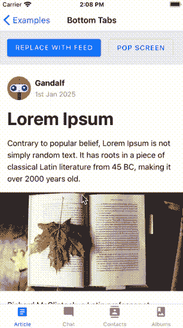
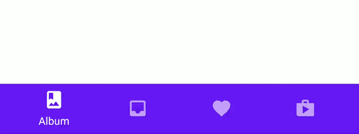
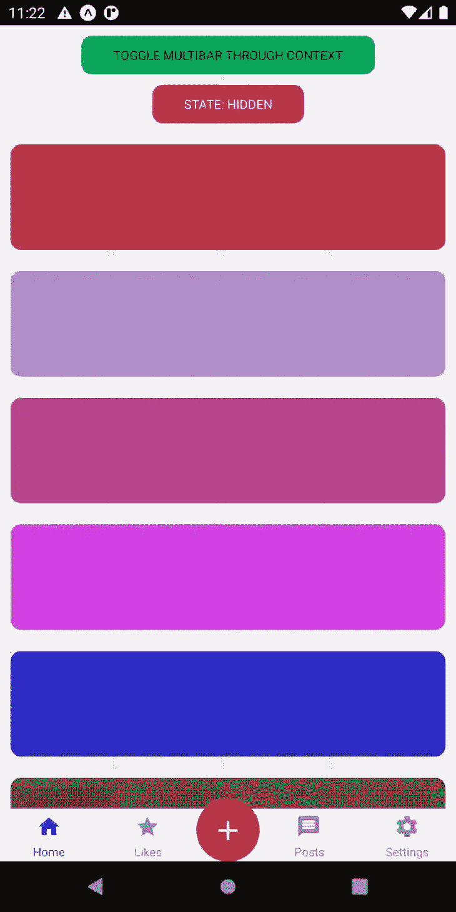
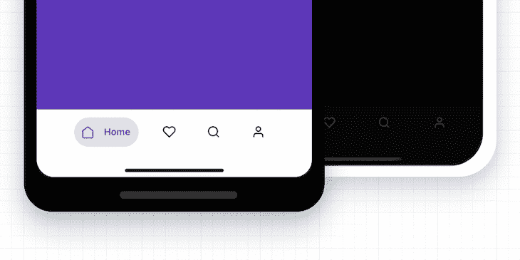

# Top React 本地选项卡导航组件

> 原文：<https://blog.logrocket.com/top-react-native-tab-navigation-components/>

对于移动项目，选项卡在引导用户通过应用程序流程方面起着至关重要的作用。可以使用多种选项卡，例如底部或顶部选项卡。

如果您正在 React Native 中构建应用程序，有几个库可以为您提供添加选项卡的能力。在本文中，我们将看看一些流行的标签，并讨论在你的移动应用程序中添加标签的最佳方式。

本文主要关注与 [React 导航](https://blog.logrocket.com/navigating-react-native-apps-using-react-navigation/)集成的选项卡导航，React 导航是最常见的导航库之一，也是 React 推荐的导航库。其他一些包括`react-native-router-flux`或`react-native-navigation`，但我总是发现 React 导航更容易使用，并且更容易扩展以构建高质量的原生应用。另外，它是最受欢迎的，拥有最多的图书馆。

## React Native 中的导航

为了理解这些库是如何工作的，我们首先要谈谈导航。在移动应用程序中，你有一堆所谓的屏幕。React Navigation 充当实际推送和清除该堆栈的基础库。

在基本导航库之上，你有你的导航策略，比如抽屉、堆栈或标签。这些都与 React 导航交互，以不同的方式从堆栈中推送或清除屏幕。

例如，这是提供单一屏幕的简单堆栈导航器的配置:

```
import * as React from 'react';
import { View, Text } from 'react-native';
import { NavigationContainer } from '@react-navigation/native';
import { createStackNavigator } from '@react-navigation/stack';

function HomeScreen() {
  return (
    <View style={{ flex: 1, alignItems: 'center', justifyContent: 'center' }}>
      <Text>Home Screen</Text>
    </View>
  );
}

const Stack = createStackNavigator();

function App() {
  return (
    <NavigationContainer>
      <Stack.Navigator>
        <Stack.Screen name="Home" component={HomeScreen} />
      </Stack.Navigator>
    </NavigationContainer>
  );
}

export default App;

```

您可以看到我们创建了一个导航对象，然后创建了一个包装器`Navigator`，在它下面，使用`Stack.Screen`创建了各种屏幕。

这是表示你的导航的最基本的方式，但是使用起来也非常简单。当处理简单或只有很少屏幕的应用程序时，这是一个很好的解决方案。

## 底部标签导航器

我们要看的第一个库是[底部标签](https://reactnavigation.org/docs/bottom-tab-navigator/)导航器。根据[的 React 导航文档](https://reactnavigation.org/docs/bottom-tab-navigator/)，这是提供标签导航的最基本选项，它创建了“一个简单的标签栏，在屏幕底部让你在不同的路线之间切换”。

路由是延迟初始化的，所以它们的屏幕组件在第一次聚焦之前不会被挂载。



[Source](https://reactnavigation.org/docs/bottom-tab-navigator/)

使用这个库非常简单:确保已经安装了`@react-navigation/native`，然后安装`[@react-navigation/bottom-tabs]([https://github.com/react-navigation/react-navigation/tree/main/packages/bottom-tabs](https://github.com/react-navigation/react-navigation/tree/main/packages/bottom-tabs))`。

用法非常类似于我们在前面的例子中看到的堆栈导航器。

这个组件是高度可配置的，以满足您的需求。您可以传入一个选项卡栏组件来处理底部选项卡栏的呈现和可视化。

其他一些配置选项包括定制默认选项卡栏或屏幕的样式或监听不同事件的能力。

这些底部标签超级简单明了，但也非常容易扩展。如果您试图为选项卡式导航构建更高级的东西，这是一个很好的构建和样式库，因为它向用户展示了几乎所有的样式选项。

例如，您可以使用`tabBarButton`属性传入您自己的按钮，或者使用`tabBarStyle`属性直接样式化标签栏。

这使得它在需要大量定制的应用中非常有用。

## 物料底部标签导航器

如果你正在用[材料设计](https://blog.logrocket.com/using-material-ui-in-react-native/)规格构建你的应用程序，那么[材料底部标签导航器](https://reactnavigation.org/docs/material-bottom-tab-navigator/)可能是你的一个很好的选择。

该库包装了`react-native-paper` `BottomNavigation`组件，并创建了一个符合材料设计的导航选项，开箱即可使用！



这个库非常容易设置和使用:

```
import { createMaterialBottomTabNavigator } from '@react-navigation/material-bottom-tabs';

const Tab = createMaterialBottomTabNavigator();

function MyTabs() {
  return (
    <Tab.Navigator>
      <Tab.Screen name="Home" component={HomeScreen} />
      <Tab.Screen name="Settings" component={SettingsScreen} />
    </Tab.Navigator>
  );
}

```

因为这是一个易于使用的、符合材料的库，它不包含许多选项来定制标签的样式，而不使用`react-native-paper`提供的主题化支持。

当您正在构建一个材料应用程序，或者需要一个可以集成很少配置的解决方案时，材料底部选项卡导航器是一个很好的解决方案。它与材料主题化结合得很好。不幸的是，因为它是材料，您不能自定义样式，所以它可能不适合需要大量自定义样式的应用程序。

## 物料顶部标签导航器

如果底部定位的导航器不吸引你，你想要一个开箱即用的解决方案，使用一个更像 TabView 的界面，[这是为你准备的库](https://reactnavigation.org/docs/material-top-tab-navigator/)！

材料顶部选项卡导航器环绕`react-native-tab-view`为您的 React 原生应用程序提供一个漂亮的选项卡式导航器，与材料主题保持一致。


[Source](https://reactnavigation.org/docs/material-top-tab-navigator/)

使用这个伟大的库非常简单，只需安装依赖项:

```
yarn add @react-navigation/material-top-tabs [email protected]^2.16.0

```

然后像这样设置它:

```
import { createMaterialTopTabNavigator } from '@react-navigation/material-top-tabs';

const Tab = createMaterialTopTabNavigator();

function MyTabs() {
  return (
    <Tab.Navigator>
      <Tab.Screen name="Home" component={HomeScreen} />
      <Tab.Screen name="Settings" component={SettingsScreen} />
    </Tab.Navigator>
  );
}

```

该库可以轻松定制，以适应您的应用程序所需的任何风格或使用需求。

虽然顶部标签不适合你的主导航策略，但是它们对于子菜单或者隐藏大量对用户来说没有价值的细节是很有用的。因为这些是用材质设计的，所以它们非常适合材质应用程序，但是对于特定的设计来说不是非常可定制的。

## 反应原生多条

如果你正在你的标签栏中寻找一些更高级的功能， [MultiBar](https://github.com/alex-melnyk/react-native-multibar#readme) 是一个很棒的库，它有一个功能丰富的标签栏。

你可以看到高级按钮上可以添加扩展动作，就像主按钮上的弹出动作一样。



[Source](https://github.com/alex-melnyk/react-native-multibar#readme)

通过使用`MultiBarButton`组件，您可以创建一系列弹出动作。

虽然 Multibar 有一些很棒的附加特性，但作为开发人员来说，这个 API 更难使用，而且比其他库更复杂。然而，扩展的 multibar 是一个很棒的、独特的附加功能，它包含了很多附加功能的潜力。

## 反应原生动画 TabBar

如果你想在你的标签栏中寻找更多的动画，那么[动画标签栏](https://github.com/gorhom/react-native-animated-tabbar)就是为你准备的库。它与 React 导航很好地集成在一起，并内置了漂亮的动画，这使它成为您的应用程序的一个很好的嵌入式解决方案。



要安装:

```
yarn add @gorhom/animated-tabbar

```

您还需要安装`react-native-reanimated`、`react-native-gesture-handler`和`react-native-svg`来让这个库正常工作。

这个库包括三个默认动画，`Bubble`、`Flashy`和`Material`，它们都是动画，在应用程序中看起来很棒。

如果你能使用一个默认的动画，这对你的应用程序来说是一个很好的选择。虽然相对重量级，但它仍然优化运行在 60fps。

编写你自己的动画风格可能有点困难，但是这个库仍然为你这样做提供了一个强大的基础。

## 结论

本指南中选项卡式导航的五个选项提供了大量选择(有些是预构建的，有些是定制的),用于在 React 应用中实现选项卡式导航。快乐大厦！

## [LogRocket](https://lp.logrocket.com/blg/react-native-signup) :即时重现 React 原生应用中的问题。

[](https://lp.logrocket.com/blg/react-native-signup)

[LogRocket](https://lp.logrocket.com/blg/react-native-signup) 是一款 React 原生监控解决方案，可帮助您即时重现问题、确定 bug 的优先级并了解 React 原生应用的性能。

LogRocket 还可以向你展示用户是如何与你的应用程序互动的，从而帮助你提高转化率和产品使用率。LogRocket 的产品分析功能揭示了用户不完成特定流程或不采用新功能的原因。

开始主动监控您的 React 原生应用— [免费试用 LogRocket】。](https://lp.logrocket.com/blg/react-native-signup)