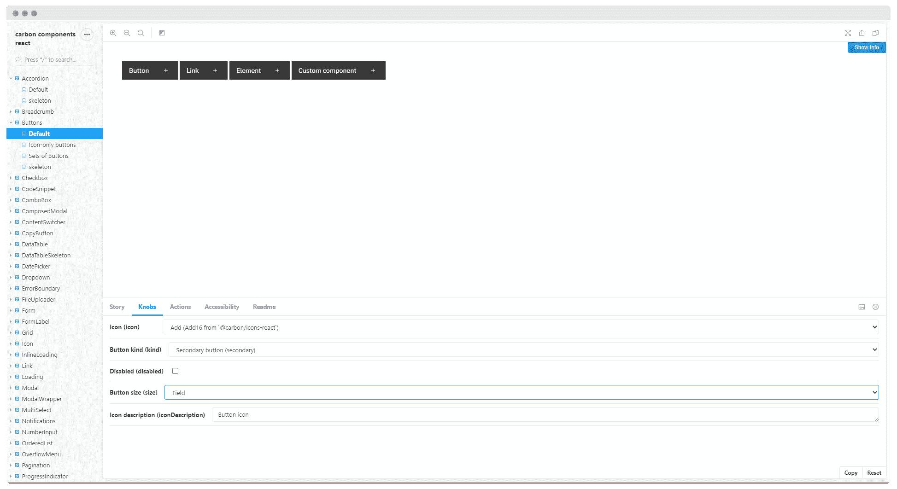
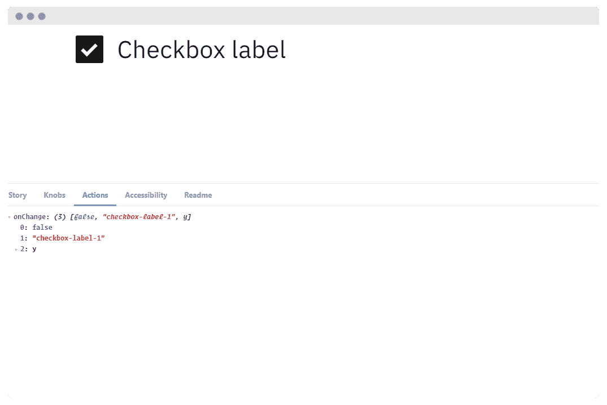
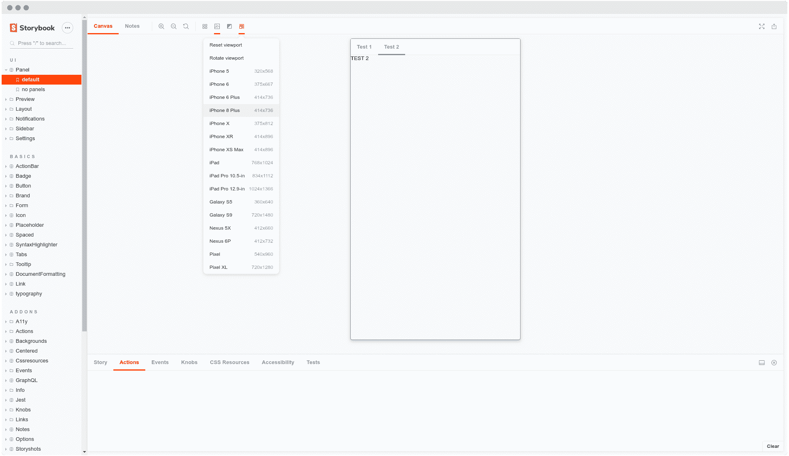
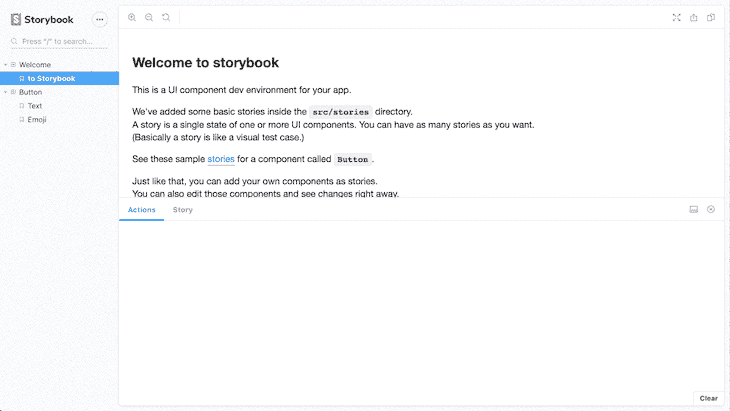
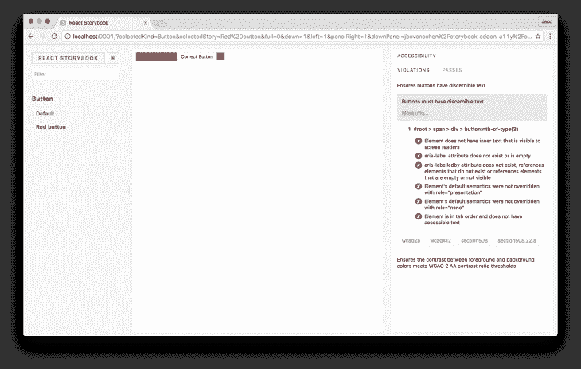
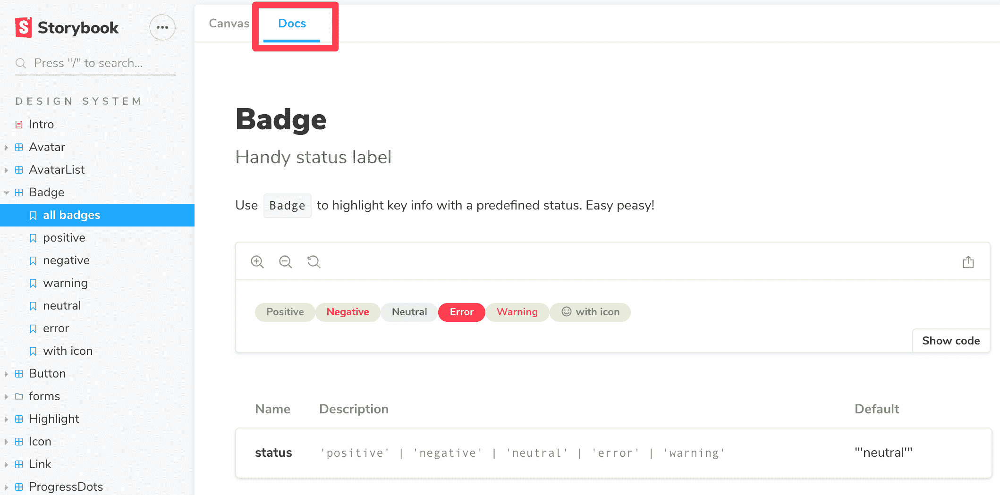
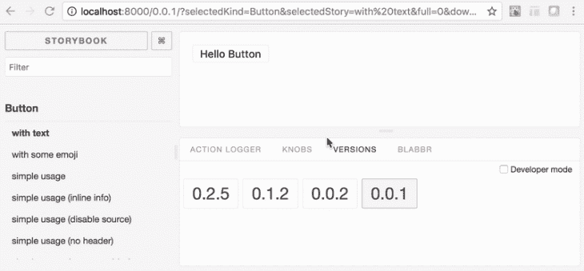
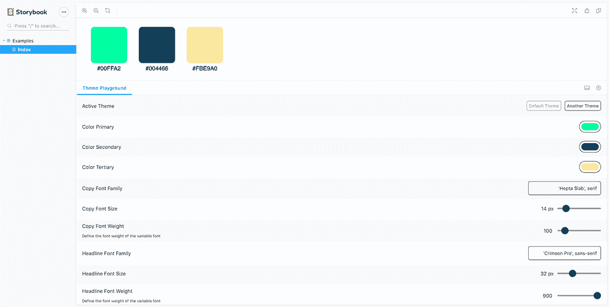
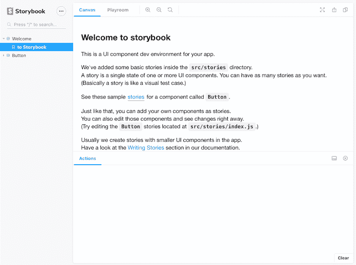
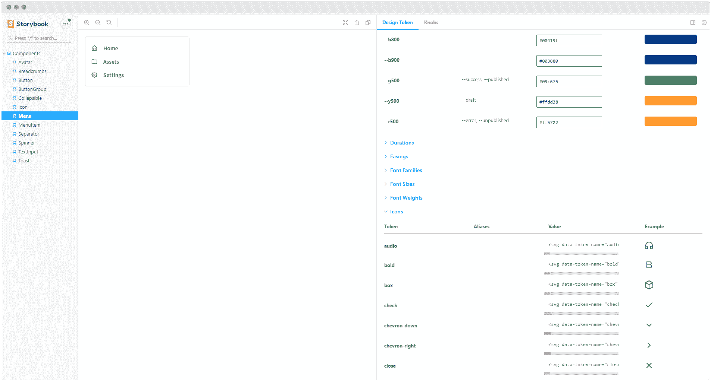

# 顶级故事书插件让你的代码更上一层楼

> 原文：<https://blog.logrocket.com/top-storybook-addons-to-take-your-code-to-the-next-level/>

从小到大，我都喜欢玩乐高玩具，因为它们能让你用同样的积木无限组合出不同的创意玩具。

你可以把 UI 开发中的组件想象成乐高积木。

同样，它们允许您从一堆碎片中组装不同的接口。

想象一下，有一种工具可以帮助您以隔离的方式组织所有这些组件(或砖块),使您能够高效地构建、共享和测试它们。

这是[故事书](https://storybook.js.org/)的角色，在他们的网站上定义如下:

> [Storybook](https://storybook.js.org/) 是一款开源工具，用于独立开发 React、Vue 和 Angular 的 UI 组件。
> 它让构建令人惊叹的 ui 变得有条理和高效。

##### 在这里听我们的播客故事集。

插件是插件，帮助增压您的故事书与新的自定义高级功能和工作流程。

这些插件由核心维护者(官方插件)和开发者社区(社区插件)贡献。

如果你一直在使用故事书，你可能见过一些官方插件，比如[旋钮](https://github.com/storybookjs/storybook/tree/master/addons/knobs)和[动作](https://github.com/storybookjs/storybook/tree/master/addons/actions)。

插件仍然是故事书的一个不断增长的功能。

以下是一些大大增强您的工作流程的主要插件:



[旋钮](https://github.com/storybookjs/storybook/tree/master/addons/knobs)允许你通过故事书界面动态编辑道具。

这是一个很好的开发、测试和调试工具。

使用旋钮，您可以通过简单地选中一个框或更改一个字段来将按钮的状态或文本从启用更改为禁用。



[动作插件](https://github.com/storybookjs/storybook/tree/master/addons/actions)用于显示事件处理程序收到的数据。

基本上就是你的事件`console.log()`。

有了这个插件，你可以在你的组件上监控多个动作。

你甚至可以在将数据发送到记录器之前对其进行处理，以防你需要在此之前做一些清理工作。

**提示:**
[事件插件](https://github.com/storybookjs/storybook/tree/master/addons/events)也可以让你为你的故事添加自定义事件。

您可以模拟一个事件并自定义有效负载。



视窗插件允许你以不同的尺寸和布局显示你的故事。

这个插件基本上可以作为你的浏览器开发工具。

您可以设置流行(iPhone 6、iPhone X、Pixel XL 等..)，编辑它们或在组件上添加自定义视口，以帮助在不同的环境中可视化它们。

```
import { addParameters } from '@storybook/react';

const customViewports = {
  kindleFire2: {
    name: 'Kindle Fire 2',
    styles: {
      width: '600px',
      height: '963px',
    },
  },
  kindleFireHD: {
    name: 'Kindle Fire HD',
    styles: {
      width: '533px',
      height: '801px',
    },
  },
};

addParameters({
  viewport: { viewports: customViewports },
});
```

**提示:**
你可以用[太妃糖](https://github.com/DEGJS/storybook-addon-taffy)和[响应视图](https://github.com/vizeat/storybook-addon-responsive-views)来提高组件的响应性测试。

Taffy 支持动态可拖动的大小调整，responsive views 能够设置媒体查询来帮助测试您的组件。



这个插件只是在插件面板中添加故事代码源。

这使读者能够看到组件的实现。

您甚至可以向代码中添加更漂亮的配置(或格式规则)。

此外，您可以在代码中添加深色和浅色的语法主题。

**提示:**
如果你是 React 用户，有一个 [React 实时编辑插件](https://github.com/vertexbz/storybook-addon-react-live-edit)。

顾名思义，它可以帮助你实时编辑一个故事的代码。



a11y 插件根据通用[可访问性规则](https://a11y.me/)检查你的组件。

这有助于开发人员理解他们的组件遵守哪些规则，违反哪些规则。

它甚至提供了如何修复它的提示，以及获取更多信息的链接。



[故事书文档](https://github.com/storybookjs/storybook/tree/master/addons/docs)将您的故事书故事转换成世界级的组件文档。

### 文档页面

开箱即用，你所有的故事都有一个`DocsPage`。

`DocsPage`是一个零配置的集合，将你的组件故事、文本描述、文档注释、道具表和代码示例整合到干净易读的页面中。

**MDX** 如果您想要更多的控制，`MDX`允许您将长格式的 markdown 文档和故事编写到一个文件中。

您还可以使用它来编写纯文档页面，并将它们嵌入到您的故事书中，与您的故事放在一起。

**提示:**
你可以使用[注释](https://github.com/storybookjs/storybook/tree/master/addons/notes)和[章节](https://github.com/Checkfront/react-storybook-addon-chapters)插件来组织和增强更多的组件文档。

[版本](https://github.com/buildit/storybook-addon-versions)



版本基本上是故事书中组件的 git。

这个插件允许你通过一个`versions`面板浏览你的组件的不同版本，以防你有一个为你的每个版本产生不同的静态故事书版本的设置。

## 数据和状态管理

### 图 QL 和阿波罗

如果你使用 **Apollo 客户端**来帮助查询和修改你的 GraphQL API，那么 [Apollo storybook 插件](https://github.com/abhiaiyer91/apollo-storybook-decorator)已经涵盖了你。

您可以提供一个[模拟对象](https://www.apollographql.com/docs/graphql-tools/mocking/)，它将被您的组件使用。

此外，如果你的 graphQL API 依赖于 [Hygraph](https://hygraph.com/) (以前的 Graph CMS)，那么 [Graph kit 插件](https://github.com/focusreactive/storybook-graphql-kit)可以帮助你直接在适当的组件中可视化你的所有数据。

您还能够以友好、可见的形式浏览数据库。

[Formik 插件](https://github.com/bhishp/storybook-formik)
现在，如果你碰巧使用众所周知的 [Formik](https://github.com/jaredpalmer/formik) 在 React 中创建你的表单，那么[这个故事书插件](https://github.com/bhishp/storybook-formik)将你的 Formik 字段打包并在面板中跟踪它们的状态，为你提供一个很好的体验。

i18n 是一个简单地帮助改变组件的语言环境的工具。

该插件是完全与库无关的(它不依赖于任何特定的国际化工具)。

### 风格

通过 Storybook 中不同风格的插件，你可以用不同的方式展示你的组件。

主题游乐场
主题游乐场提供了一个面板，可以在其中轻松调整组件中预定义的主题值。



### 风味风格

如果您有任何有特色的样式表，您可以使用以下内容:

1.  [样式-组件-主题插件](https://github.com/echoulen/storybook-addon-styled-component-theme)
2.  [JSS 主题插件](https://github.com/vertexbz/storybook-addon-jss-theme)
3.  [材料 UI 插件](https://github.com/react-theming/storybook-addon-material-ui)
4.  CSS 类主题插件



游戏室可能是最伟大的社区故事书插件之一。

[游戏室](https://github.com/rbardini/storybook-addon-playroom)让你可以一边玩你所有的组件，一边对照流行的屏幕断点测试它们。

使用这个插件，你可以从每个故事源开始设计组件的组合。

### 设计插件

如果你出于任何原因希望将你的 Adobe XD 或 Figma UI 设计嵌入到你的故事书页面中，你可以分别使用 [XD 插件](https://github.com/morgs32/storybook-addon-xd-designs)和 [Figma 插件](https://github.com/hharnisc/storybook-addon-figma)。

每当你的高保真设计有非常敏感的规格时，你也可以使用[垂直节奏](https://github.com/jmlweb/storybook-vrhythm)插件。

它们将帮助您处理组件的大小、深度和行高。

**提示:**
还有一个[设计令牌插件](https://github.com/UX-and-I/storybook-design-token)，它使你能够从你的样式表自动生成设计令牌文档。



## 额外提示

## 结论

Storybook 已经提供了一个很好的前端开发方法，插件只会增强它的功能。

插件是 Storybook 的一个很好的补充，它的愿景是给开发者更好的体验。

## 使用 [LogRocket](https://lp.logrocket.com/blg/signup) 消除传统错误报告的干扰

[](https://lp.logrocket.com/blg/signup)

[LogRocket](https://lp.logrocket.com/blg/signup) 是一个数字体验分析解决方案，它可以保护您免受数百个假阳性错误警报的影响，只针对几个真正重要的项目。LogRocket 会告诉您应用程序中实际影响用户的最具影响力的 bug 和 UX 问题。

然后，使用具有深层技术遥测的会话重放来确切地查看用户看到了什么以及是什么导致了问题，就像你在他们身后看一样。

LogRocket 自动聚合客户端错误、JS 异常、前端性能指标和用户交互。然后 LogRocket 使用机器学习来告诉你哪些问题正在影响大多数用户，并提供你需要修复它的上下文。

关注重要的 bug—[今天就试试 LogRocket】。](https://lp.logrocket.com/blg/signup-issue-free)