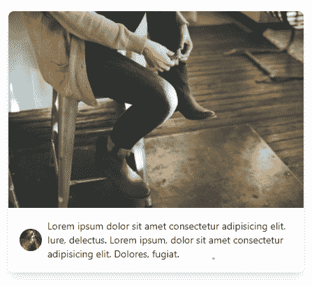

# 顶级实用工具-第一个 CSS 框架

> 原文：<https://blog.logrocket.com/top-utility-first-css-frameworks/>

CSS 是一种易于使用的设计语言，用于制作丰富多彩的网站和应用程序。CSS 在处理较小的项目时会很有趣，但是在大规模的项目中会变得过于复杂，你会遇到命名不一致和代码重复的问题。开发人员已经针对这个问题引入了各种解决方案，从 BEM 和 SMACSS 方法到旨在解决这些底层问题的框架。

多年来，出现了许多 CSS 框架来帮助简化开发过程。这些框架采用不同的方法。例如，它们中的一些遵循效用优先的方法，因此被称为效用优先框架。

实用优先框架提供了一个底层的[实用类](https://blog.logrocket.com/css-utility-classes-library-extendable-styles/)来在你的 HTML 文件中构建定制设计。实用程序类是根据它们的预期目的来命名的，因此一般人很容易理解。

```
<div class="bg-white"></div>

```

类`.bg-white`的主要目的是添加白色的背景色。有不同的类用于不同的目的，例如设置背景颜色或向容器添加边距或填充。

值得注意的是，作为一种设计语言，实用优先的框架并不能为 CSS 的潜在问题提供持久的解决方案，但它们可以帮助减少开发过程中与风格相关的问题。

事不宜迟，让我们看看 2021 年可用的最佳实用优先 CSS 框架。

## 顺风 CSS

Tailwind CSS 提供了一个广泛的实用程序类目录，可用于开发外观优雅的网站。您可以设计高度定制的 HTML 代码，而无需离开 HTML 文件。

### 安装尾翼 CSS

要随时访问 Tailwind CSS 及其类库，请将以下引用添加到您的 HTML 文件中:

```
<link href="https://unpkg.com/[email protected]^2/dist/tailwind.min.css" rel="stylesheet">

```

您的 HTML 初学者模板应该如下所示:

```
<!doctype html>
<html>
<head>
<meta charset="UTF-8" />
<meta name="viewport" content="width=device-width, initial-scale=1.0" />
  <link href="https://unpkg.com/[email protected]^2/dist/tailwind.min.css" rel="stylesheet">
  <!-- ... -->
</head>
<body>
  <!-- ... -->
</body>
</html>

```

注意，某些顺风 CSS 特性，比如指令，在 CDN 版本中是不可用的。

顺风 CSS 也可以通过 npm 模块获得。您可以通过在终端中运行以下命令来安装它:

```
npm install tailwindcss

```

为了在生产中[us](https://blog.logrocket.com/using-tailwind-css-in-production/)[e](https://blog.logrocket.com/using-tailwind-css-in-production/)[Tailwind CSS](https://blog.logrocket.com/using-tailwind-css-in-production/)[，您必须使用`@tailwind`指令将基础、组件和实用程序样式注入到您新创建的文件中:](https://blog.logrocket.com/using-tailwind-css-in-production/)

```
/* tailwind preflight injection */
@tailwind base;
@tailwind components;
@tailwind utilities;

```

默认为顺风 CSS 的基本样式是通过注入`@tailwind base`预检来添加的。用户可以使用`@layer base`指令插入他们自己的基本样式:

```
@tailwind base;

@layer base {
  h1 {
    @apply text-2xl;
  }
  a {
    @apply text-blue-500;
  }
}

@tailwind components;

@tailwind utilities;

```

指令用于风格构成:

```
<div class="my-1 w-full px-1">
  <section class="overflow-hidden rounded-lg shadow-lg">
    <a href="#">
        
      </a>
   <div class="flex items-center justify-between leading-none p-2 ">
      <a class="flex items-center no-underline text-black" href="#">
        
           <p class="ml-2 text-sm">
            Lorem ipsum dolor sit amet consectetur adipisicingelit. Iure, delectus. Lorem ipsum, dolor sit amet consectetur adipisicing elit. Dolores, fugiat.
             </p>
      </a>

     </div>

  </section>
</div>

```

上面是使用 Tailwind CSS 的卡组件的代码实现:



如果你在开发过程中优先考虑速度和效率，那么 Tailwind CSS 是正确的选择。它删除了所有不必要的 CSS 代码，产生了一个优化得更好的应用程序。此外，您可以在 HTML 文件中编写 Tailwind CSS，而无需创建新文件。这使得开发变得更加容易和简单。

尽管 [Tailwind CSS 听起来更上一层楼，更具未来感](https://blog.logrocket.com/tailwind-css-is-it-tomorrows-bootstrap-ebe560f9d00b/)，但它仍然相对垃圾，难以阅读。你需要大量的练习来适应它的各种类，这些类是没有意义的。

## 让我们来看看

[Tachyons](https://tachyons.io/) 是一个轻量级的(大约 14KB)，[实用优先的 CSS 框架](https://blog.logrocket.com/tailwindcss-vs-tachyons/)，遵循移动优先的 CSS 架构。你可以在 HTML 文件中创建一个快速响应的网站。超光速粒子在 HTML、Ember、React、Angular 等方面表现出色。

### 安装超光速粒子

超光速粒子可以通过添加对缩小文件的引用来访问:

```
<link rel="stylesheet" href="https://unpkg.com/[email protected]/css/tachyons.min.css">

```

您的 starter HTML 文件的结构应该如下所示:

```
<!doctype html>
<html>
<head>
  <meta charset="UTF-8" />
  <meta name="viewport" content="width=device-width, initial-scale=1.0" />
  <link rel="stylesheet" href="https://unpkg.com/[email protected]/css/tachyons.min.css">
  <!-- ... -->
</head>
<body>

</body>
</html>

```

或者，您可以通过 npm 安装:

```
npm install [email protected]

```

尽管 Tachyons 是用 PostCSS 编写的，但它还支持 SASS，这允许更灵活的开发。

```
<div class="mw9 center pa4 pt5-ns ph7-l">
    <h2 class="f2 f1-m f-headline-l measure-narrow lh-title mv0">
      <span class="bg-black-90 lh-copy white pa1 tracked-tight">
        Lorem ipsum dolor sit, amet consectetur adipisicing elit.=
      </span>
    </h2>
    <p class="f3 fw1 georgia i">Lorem ipsum dolor sit, amet consectetur                  adipisicing elit. Cumque odit quisquam atque ea dolores labore impedit      corrupti placeat cupiditate obcaecati.
   </p>
</div>

```

## Shed.css

据其创始人称，创建[S](https://tedconf.github.io/shed-css/)T2【hed . css 的想法是在一位创始人厌倦了重复编写 CSS 之后产生的。他认为所有人可能需要的 CSS 都已经写好了，没有必要重新发明轮子。

Shed.css 提供了一个单一用途的类，用作组件或应用程序的构建块。不是不停地写 CSS，而是提供了一组选项来阻止自行车脱落。像超光速粒子一样，Shed 主要是用 [PostCSS](https://blog.logrocket.com/getting-started-with-postcss-in-2019-484262a4d725/) 写成的。

### 安装 Shed.css

可以使用 npm 模块安装棚子。

在您的终端中运行以下命令开始:

```
npm install --saveDev shed-css

```

Shed.css 的按钮实现如下所示:

```
<button
  class="
    d:i-b
    f-w:700
    p-x:3
    p-y:.7
    b-r:.4
    f:2
    c:white
    bg:blue
    t-t:u
    hover/bg:blue.9
  "
>
  Log In
</button>

```

## Basscss

bascss 类以人类可读的格式命名，而不是采用语义方法。就像上面列出的其他库一样，Basscss 为纯 css 提供了一个轻量级的、响应性强的替代方案。

### 安装 Basscss

要获得 Basscss，您可以链接到 CDN 的参考资料

```
<link href="https://unpkg.com/[email protected]/css/basscss.min.css" rel="stylesheet">

```

或者通过 npm 安装

```
npm install [email protected]

```

以下是如何使用 Basscss 的示例:

```
<div class="flex flex-wrap items-center mt4">
  <h1 class="m0">Basscss <span class="h5">v8.0.2</span></h1>
  <p class="h3 mt1 mb1">Lorem ipsum dolor sit amet consectetur, adipisicing elit. Sapiente, voluptatibus.</p>
  <div class="flex flex-wrap items-center mb2">
  </div>
</div>

```

## 表达性 css

富有表现力的 [CSS](https://johnpolacek.github.io/expressive-css/) 建立在实用优先的开发架构之上。这个名字旨在突出 Expressive 的使命，即提供普通用户可以理解的类。这使得表现力成为视觉设计的一个特别好的选择。

下面是一个如何使用表达型 CSS 的例子:

```
<div class="grid-12 pad-3-vert s-pad-0">
    <div class="grid-12 pad-3-bottom">
        <h3 class="h1 pad-3-vert text-light text-blue">Lorem ipsum dolor sit</h3>
    </div>
    <div class="grid-12 pad-3-bottom">
        <h4 class="pad-1-bottom text-blue border-bottom marg-3-bottom">Do classes need to be ‘semantic’?</h4>
        <p class="grid-12 text-center">
              Lorem ipsum dolor sit amet consectetur adipisicing elit. Sequi illum beatae voluptatibus nobis
               aliquid minima incidunt, ullam dolor dolorem nemo quia similique eaque veniam molestias aliquam,
             animi blanditiis earum quam labore mollitia architecto porro, in impedit! Cupiditate officiis magnam minima.
        </p>
    </div>
div>

```

## 结论

实用程序优先的类命名方法已经存在了一段时间，但是直到最近随着 TailwindCSS 的发布才开始流行。效用第一类可能一开始看起来不熟悉，但是当你习惯了它，你会欣赏它所提供的好处。

## 你的前端是否占用了用户的 CPU？

随着 web 前端变得越来越复杂，资源贪婪的特性对浏览器的要求越来越高。如果您对监控和跟踪生产环境中所有用户的客户端 CPU 使用、内存使用等感兴趣，

[try LogRocket](https://lp.logrocket.com/blg/css-signup)

.

[](https://lp.logrocket.com/blg/css-signup)[https://logrocket.com/signup/](https://lp.logrocket.com/blg/css-signup)

LogRocket 就像是网络和移动应用的 DVR，记录你的网络应用或网站上发生的一切。您可以汇总和报告关键的前端性能指标，重放用户会话和应用程序状态，记录网络请求，并自动显示所有错误，而不是猜测问题发生的原因。

现代化您调试 web 和移动应用的方式— [开始免费监控](https://lp.logrocket.com/blg/css-signup)。