# 将 GraphQL 指令视为中间件

> 原文：<https://blog.logrocket.com/treating-graphql-directives-as-middleware/>

如果您使用过 Express.js，Node.js web 应用程序框架，那么您应该知道中间件的概念。Express 应用程序本质上是一系列中间件函数调用，其中中间件函数可以运行任何代码，修改请求和响应对象，终止执行，并将执行传递给堆栈中的下一个中间件函数。

下面的代码演示了一个中间件函数，它接收请求对象`req`，响应对象`res`，以及应用程序请求-响应周期中的下一个中间件函数`next`:

```
var express = require('express')
var app = express()

// Middleware function which prints the requested URL and calls the next function
app.use(function (req, res, next) {
  console.log('Request URL:', req.originalUrl)
  next()
})
```

中间件有助于有效地组织代码库，将逻辑分成处理单个任务的块，这些块可以在同一项目中针对不同的请求重用(也可以通过库跨项目重用)，从而实现代码模块化和关注点的清晰分离。

它的主要用例是跨应用程序实现那些功能，例如:

*   批准
*   度量的提取和存储
*   贮藏
*   排除故障
*   回退操作
*   输入验证
*   记录
*   输出操作

## GraphQL 中的字段解析中间件

一些 GraphQL 服务器已经结合了中间件的概念，将在现场解析器级别应用。中间件使我们能够通过一系列简单的解析器功能来解析领域，而不是应用执行大量业务逻辑的单个解析器功能。

基于 Express， [graphql-yoga](https://github.com/prisma-labs/graphql-yoga) 支持开箱即用的现场解析器中间件，通过 [graphql-middleware](https://github.com/prisma-labs/graphql-middleware) 包实现。

在下面的[代码中，字段`hello`是用这个解析器实现的:](https://github.com/prisma-labs/graphql-middleware#how-does-it-work)

```
const typeDefs = `
type Query {
  hello(name: String): String
}
`
const resolvers = {
  Query: {
    hello: (root, args, context, info) => {
      console.log(`3\. resolver: hello`)
      return `Hello ${args.name ? args.name : 'world'}!`
    },
  },
}
```

解析器可以增加中间件功能，该功能在解析场之前和/或之后执行任意逻辑:

```
const { GraphQLServer } = require('graphql-yoga')

const logInput = async (resolve, root, args, context, info) => {
  console.log(`1\. logInput: ${JSON.stringify(args)}`)
  const result = await resolve(root, args, context, info)
  console.log(`5\. logInput`)
  return result
}

const logResult = async (resolve, root, args, context, info) => {
  console.log(`2\. logResult`)
  const result = await resolve(root, args, context, info)
  console.log(`4\. logResult: ${JSON.stringify(result)}`)
  return result
}

const server = new GraphQLServer({
  typeDefs,
  resolvers,
  middlewares: [logInput, logResult],
})
server.start(() => console.log('Server is running on http://localhost:4000'))
```

现在，解析查询`{ hello(name: "Bob") }`产生一个洋葱形状的流:

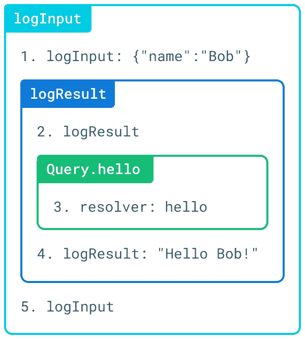

Output from executing middleware functions with graphql-middleware.

基于 Scala 的 GraphQL 服务器 [Sangria](https://sangria-graphql.org) 也[支持开箱即用的中间件](https://sangria-graphql.org/learn/#middleware)，提供函数`beforeField`和`afterField`在字段解析前后执行任意代码:

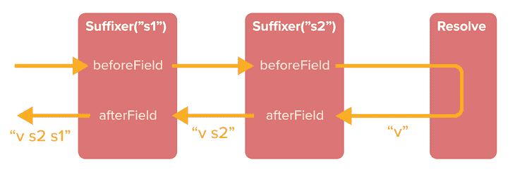

Executing middleware functions in Sangria.

其他为中间件提供支持的 GraphQL 服务器包括 [GraphQL。网](https://graphql-dotnet.github.io/docs/getting-started/field-middleware/)、[热巧克力](https://hotchocolate.io/docs/middleware)、[阿里阿德涅](https://ariadnegraphql.org/docs/middleware)、[灯塔](https://lighthouse-php.com/4.12/custom-directives/field-directives.html#fieldmiddleware)。

## 作为中间件执行指令？

上一节中描述的中间件功能用于增加字段的分辨率。然而 GraphQL 已经有了一个满足同样功能的特性:指令。既然他们达到了相同的目标，自然会问:为什么需要中间件？为什么不用指令来代替呢？

graph QL-中间件[答案](https://github.com/prisma-labs/graphql-middleware#how-does-graphql-middleware-compare-to-directives):

> GraphQL 中间件和指令以完全不同的方式处理同样的问题。GraphQL 中间件允许您在代码中实现所有的中间件逻辑，而指令则鼓励您将模式与功能混合使用。

这个回答引发了另一个问题:既然中间件作为一种设计模式自然满足了指令期望满足的功能，那么 GraphQL 服务器难道不会从将指令实现为中间件中受益吗？

也就是说，使用这样的查询:

```
query {
  field @directive1 @directive2
}
```

让指令`@directive1`和`@directive2`成为中间件，接收解析字段的值，执行它们的任意逻辑，并将结果传递给下一个指令，这有意义吗？

让我们找出答案。

### 对比中间件和管道

一般来说，中间件执行流程如下所示:

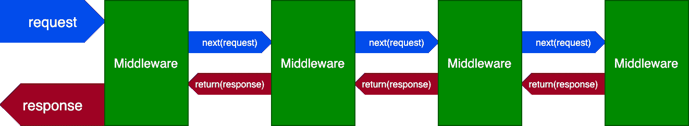

Middleware execution flow.

现在，这个执行流程并不完全适合执行指令，因为指令是按照它们的[建立的顺序从左到右](https://spec.graphql.org/draft/#sel-HAFjBRBAABKBPv2d)执行的。因此，我们不能让`@directive1`在执行`@directive2`之后更新字段值，而在 U 形转弯之后可以这样做。

因此，指令执行不能直接作为中间件来实现。我们需要的不是一个 U 形转弯，而是一个单向执行流程，如下所示:

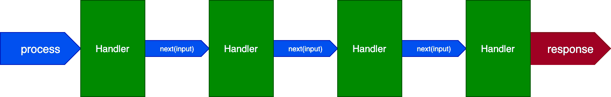

One-way execution flow.

满足这个执行流程的设计模式被称为[责任链模式](https://en.wikipedia.org/wiki/Chain-of-responsibility_pattern):

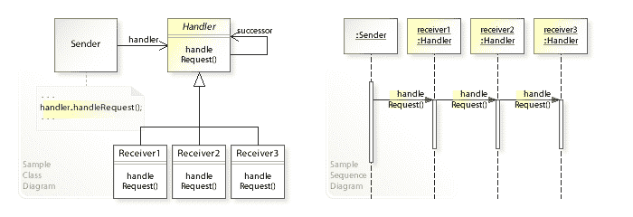

Chain-of-responsibility execution flow.

相应的结构称为管道，可以很容易地适用于执行指令:

*   管道的输入是字段解析器提供的字段值
*   每个指令执行其逻辑，并将结果传递给管道中的下一个指令
*   管道的输出将是已解析的字段值，已经过所有指令的处理

看起来是这样的:

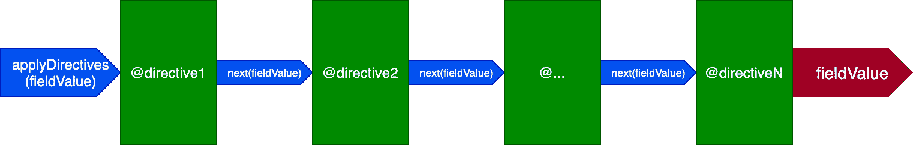

Directive pipeline.

这种设计比中间件简单，并且可以达到同样的效果:如果`@directive1`需要在返回的路上执行一些逻辑(即`afterField`逻辑)，我们可以通过位于字段末端的`@directive3`来执行这个逻辑:

```
query {
  field @directive1 @directive2 @directive3
}
```

中间件允许我们随时终止流程，这也可以通过管道来实现。

在某些情况下，在某个中间阶段终止是有意义的，比如当一个指令`@validate`指示某个验证失败，并且查询不能被执行时。这种逻辑可以通过在流水线中的阶段之间传递布尔标志`skipExecution`来实现，该标志在运行其逻辑之前由每个指令检查，并且可以在任何阶段由任何指令设置为`true`。

总之，使用管道比使用中间件更适合执行 GraphQL 指令。接下来，让我们设计管道来充分利用 GraphQL。

## 设计指令管道

在我的上一篇文章 [*GraphQL 指令被低估*](https://blog.logrocket.com/graphql-directives-are-underrated/) 中，我声明，由于指令潜在的无限力量，良好支持定制指令的 GraphQL 服务器将引领 GraphQL 走向未来。

在这种理念的推动下，对于 PoP 的 GraphQL(我自己的 PHP graph QL 服务器)，我决定将查询解析过程放在指令管道的顶部。因此，该指令可以被视为一个低级组件，使开发人员能够根据需要操纵 GraphQL 服务器的响应。

让我们看看这种架构是如何工作的，以及它为什么如此强大。

### 指令作为查询解析的构造块

最初，我们考虑让 GraphQL 服务器通过某种机制解析该字段，然后将该值作为输入传递给指令管道。

然而，用一个机制来处理所有事情要简单得多:调用字段解析器(验证字段和解析字段)已经可以通过指令管道完成了。在这种情况下，指令管道是用于解析查询的唯一机制。

因此，GraphQL 服务器提供了两个特殊的指令:

*   `[@validate](https://github.com/getpop/component-model/blob/57a27af3841da284ea59c6f7ff3a9b4c0befa472/src/DirectiveResolvers/ValidateDirectiveResolver.php)`调用字段解析器来验证字段是否可以被解析(例如，语法是否正确，字段是否存在等)。)
*   如果成功，`[@resolveValueAndMerge](https://github.com/getpop/component-model/blob/b2ef9fe693c69a6d4c4b549519eb236f527b841d/src/DirectiveResolvers/ResolveValueAndMergeDirectiveResolver.php)`然后调用字段解析器来解析字段，并将值合并到响应对象中

这两个是特殊的“系统类型”指令:它们只为 GraphQL 引擎保留，并且它们隐含在每个字段中。相比之下，标准指令是显式的:它们由用户添加到查询中。

通过使用这两个指令，该查询:

```
query {
  field1
  field2 @directiveA
}
```

将被解析为:

```
query {
  field1 @validate @resolveValueAndMerge
  field2 @validate @resolveValueAndMerge @directiveA
}
```

管道现在看起来像这样(请注意，管道接收字段作为输入，而不是它的初始解析值):

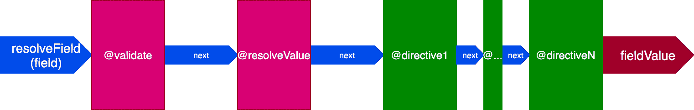

Directive pipeline with @validate and @resolveValueAndMerge.

### 管道槽

指令通常在`@resolveValueAndMerge`之后执行，因为它们很可能涉及更新已解析字段的值。但是，在`@validate`之前，或者在`@validate`和`@resolveValueAndMerge`之间，还有其他指令必须执行。

例如:

*   为了测量解析一个字段所花费的时间，指令`@traceExecutionTime`可以通过将子指令`@startTracingExecutionTime`放置在流水线的开始处和将子指令`@endTracingExecutionTime`放置在流水线的末端来获得解析该字段之前和之后的当前时间
*   在执行`@resolveValueAndMerge`之前，指令`@cache`必须检查被请求的字段是否被缓存并返回该响应

然后，管道将提供三个不同的插槽，指令将指示必须在哪个插槽中执行:

*   `"beginning"`槽–在验证发生之前
*   `"middle"`槽——验证之后，现场解析之前
*   `"end"`槽–场分辨率之后

指令管道现在看起来像这样:

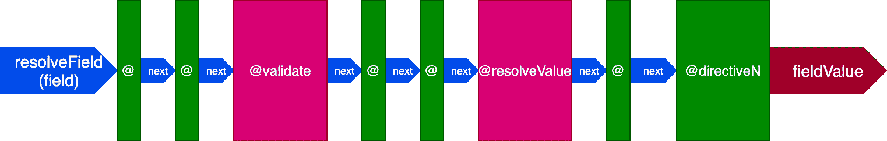

Directive pipeline with slots.

请注意指令`[@skip](https://github.com/getpop/engine/blob/b52f147c7d66d6677aad31b87794219fd9a1d92d/src/DirectiveResolvers/SkipDirectiveResolver.php)`和`[@include](https://github.com/getpop/engine/blob/b52f147c7d66d6677aad31b87794219fd9a1d92d/src/DirectiveResolvers/IncludeDirectiveResolver.php)`是如何如此容易地满足给定的架构的:在`"middle"`槽中，它们可以通过将标志`skipExecution`设置为`true`来通知指令`@resolveValueAndMerge`(以及流水线中稍后阶段的所有指令)不要执行。

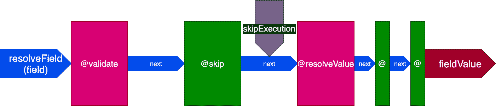

@skip directive in the pipeline.

### 在单个调用中对多个字段执行指令

到目前为止，我们已经考虑了输入到指令管道的单个字段。然而，在一个典型的 GraphQL 查询中，我们会收到几个要执行指令的字段。例如，在下面的查询中，对字段`"field1"`和`"field2"`执行指令`@upperCase`:

```
query {
  field1 @upperCase
  field2 @upperCase
  field3
}
```

此外，由于 GraphQL 引擎将系统指令`@validate`和`@resolveValueAndMerge`添加到查询中的每个字段，因此该查询:

```
query {
  field1
  field2
  field3
}
```

解析为以下查询:

```
query {
  field1 @validate @resolveValueAndMerge
  field2 @validate @resolveValueAndMerge
  field3 @validate @resolveValueAndMerge
}
```

然后，系统指令将总是接收所有字段作为输入。

因此，我们可以设计指令管道来接收多个字段作为输入，而不是一次只接收一个。

这种体系结构更有效，因为对所有字段只执行一次指令比对每个字段执行一次更快，而且会产生相同的结果。例如，在验证用户是否登录以授予对模式的访问权时，操作只能执行一次。运行以下代码:

```
if (isUserLoggedIn()) {
  resolveFields([$field1, $field2, $field3]);
}
```

比运行以下代码更有效:

```
if (isUserLoggedIn()) {
  resolveField($field1);
}
if (isUserLoggedIn()) {
  resolveField($field2);
}
if (isUserLoggedIn()) {
  resolveField($field3);
}
```

在调用本地函数(如`isUserLoggedIn`)时，这可能看起来没什么大不了的，但在与外部服务交互时，这可能会产生很大的影响，如通过 GraphQL 解析 REST 端点。在这些情况下，一次而不是多次执行一个功能会决定是否能够提供某种功能。

让我们看一个例子。当通过`@translate`指令与 Google Translate 交互时，GraphQL API 必须通过网络建立连接。然后，执行这段代码将尽可能快:

```
googleTranslateFields([$field1, $field2, $field3]);
```

相反，多次单独执行函数会产生更长的延迟，从而导致更长的响应时间，降低 API 的性能。对于翻译三个字符串(其中字段是要翻译的字符串)，这可能不是很大的区别，但是对于 100 个或更多的字符串，这肯定会有影响:

```
googleTranslateField($field1);
googleTranslateField($field2);
googleTranslateField($field3);
```

此外，对所有输入执行一次函数可能比对每个字段单独执行函数产生更好的响应。再次以谷歌翻译为例，我们提供给服务的数据越多，翻译就越精确。

例如，当执行下面的代码时:

```
googleTranslate("fork");
googleTranslate("road");
googleTranslate("sign");
```

对于第一次独立执行，谷歌不知道`"fork"`的上下文，所以它很可能用 fork 作为吃饭的器具，作为分支的道路，或者作为另一个意思来回答。但是，如果我们改为执行:

```
googleTranslate(["fork", "road", "sign"]);
```

从这些大量的信息中，Google 可以推断出`"fork"`指的是一条道路的分支，并返回精确的翻译。

正是由于这些原因，管道中的指令应该一起接收输入字段，然后每个指令可以决定在这些输入上运行其逻辑的最佳方式——每个输入一次执行，包含所有输入的一次执行，或者介于两者之间的任何方式。管道现在看起来像这样:


Receiving multiple fields as input in the directive pipeline.

### 对整个查询执行单个指令管道

刚才，我们了解到每个指令执行多个字段是有意义的——只要所有字段都应用了相同的指令，这就很好。当指令不同时，会导致更大的复杂性，使其难以实现，并会减少一些已获得的好处。

让我们看看这是如何发生的。考虑以下查询:

```
query {
  field1 @directiveA
  field2
  field3
}
```

上面的指令相当于这个指令:

```
query {
  field1 @validate @resolveValueAndMerge @directiveA
  field2 @validate @resolveValueAndMerge
  field3 @validate @resolveValueAndMerge
}
```

在这个场景中，字段`field2`和`field3`有相同的一组指令，而`field1`有不同的一组指令。然后，我们必须生成两个不同的管道来解析查询:

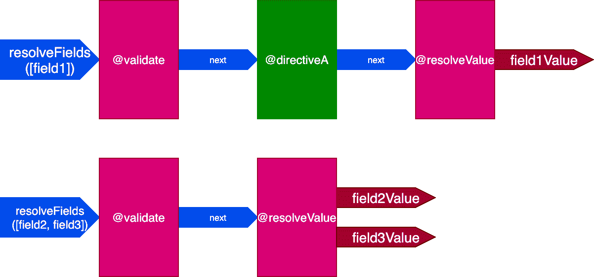

The query requires two directive pipelines to be resolved

当所有字段都有一组唯一的指令时，这种效果会更加明显。考虑这个查询:

```
query {
  field1 @directiveA
  field2 @directiveB @directiveC
  field3 @directiveC
}
```

相当于这个:

```
query {
  field1 @validate @resolveValueAndMerge @directiveA
  field2 @validate @resolveValueAndMerge @directiveB @directiveC
  field3 @validate @resolveValueAndMerge @directiveC
}
```

在这种情况下，我们将有三个管道来处理三个字段，如下所示:

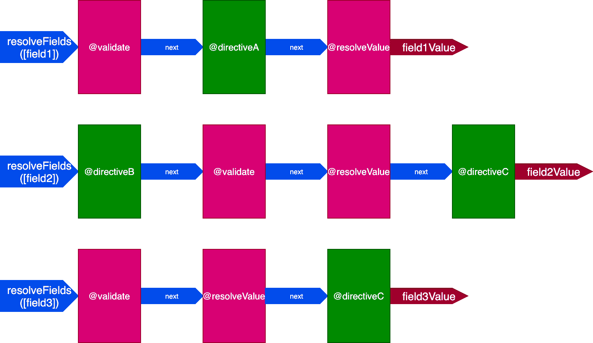

The query requires three directive pipelines to be resolved

在这种情况下，即使指令`@validate`和`@resolveValueAndMerge`应用于三个字段，它们也将彼此独立地执行，因为它们是通过三个不同的指令管道执行的——这使我们回到了一次对一个项目执行一个指令的情况。

这个问题的解决方案是避免生产多条管道，而是为所有油田处理一条管道。因此，我们不能再将字段作为输入传递给管道，因为不是来自一个管道的所有指令都将与同一组字段交互；相反，每个指令必须接收自己的字段列表作为自己的输入。

然后，对于这个查询:

```
query {
  field1 @directiveA
  field2
  field3
}
```

指令`@validate`和`@resolveValueAndMerge`将得到所有三个字段作为输入，`directiveA`将只得到`"field1"`:

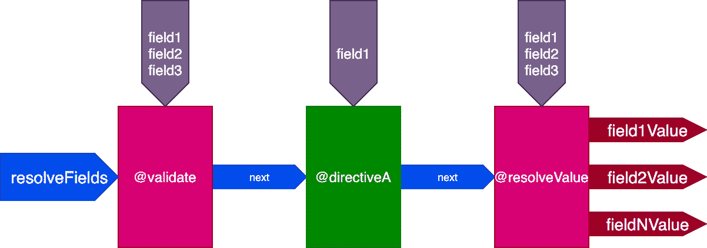

Single directive pipeline to resolve all fields.

对于这个查询:

```
query {
  field1 @directiveA
  field2 @directiveB @directiveC
  field3 @directiveC
}
```

指令`@validate`和`@resolveValueAndMerge`将获得所有三个字段作为输入；`directiveA`只会得到`"field1"`；`directiveB`只会得到`"field2"`；而`directiveC`会得到`"field2"`和`"field3"`:

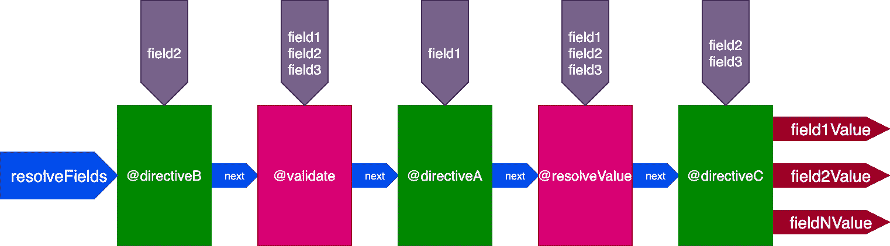

Another single directive pipeline to resolve all fields.

### 按 ID 控制指令的执行

到目前为止，某个阶段的指令可以通过标志`skipExecution`影响后面阶段指令的执行。然而，这个标志对于所有情况来说都不够细化。

例如，考虑一个`@cache`指令，它放在`"end"`槽中存储字段值，这样下次查询字段时，可以通过放在`"middle"`槽中的指令`@getCache`从缓存中检索它的值:

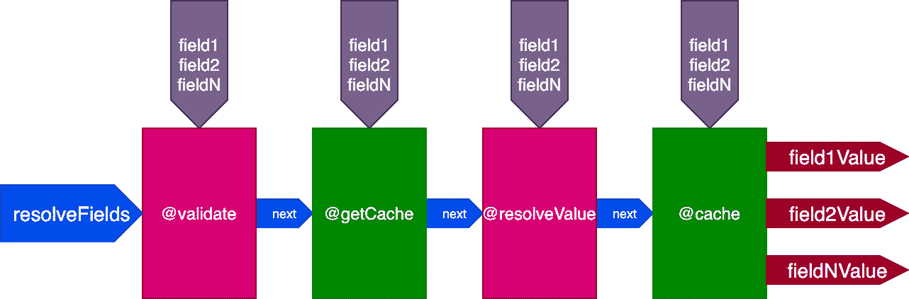

Pipeline with @getCache and @cache directives.

> **注意:**:类似于系统指令，`@getCache`是隐式的，由`@cache`自动添加，所以一定不能添加到查询中。稍后会有更多的介绍。

当[执行该查询](https://leoloso.com/posts/cache-and-logtime-directives/#heading-@cache-directive)时:

```
{
  posts(limit: 2) {
    title @translate @cache
  }
}
```

服务器将检索并缓存两条记录。然后，我们执行相同的查询，但是应用于四个记录:

```
{
  posts(limit: 4) {
    title @translate @cache
  }
}
```

当执行第二个查询时，第一个查询的两个记录已经被缓存，但是另外两个记录没有被缓存。然而，为了使用标志`skipExecution`，我们需要所有四个记录都已经被缓存。如果我们可以从缓存中检索前两条记录，并且只解析另外两条记录，那就更好了。

所以我们再次更新了管道的设计。我们转储`skipExecution`标志，而是将每个字段的对象 id 列表传递给每个指令，其中指令必须通过`fieldIDs`对象输入来应用:

```
{
  field1: [ID11, ID12, ...],
  field2: [ID21, ID22, ...],
  ...
  fieldN: [IDN1, IDN2, ...],
}
```

变量`fieldIDs`对于每个指令是唯一的，并且每个指令可以在后面的阶段为所有指令修改`fieldIDs`的实例。然后，`skipExecution`可以在一个 ID 接一个 ID 的基础上精细地完成，只需从`fieldIDs`中为堆栈中所有即将到来的指令删除 ID。

管道现在看起来像这样:

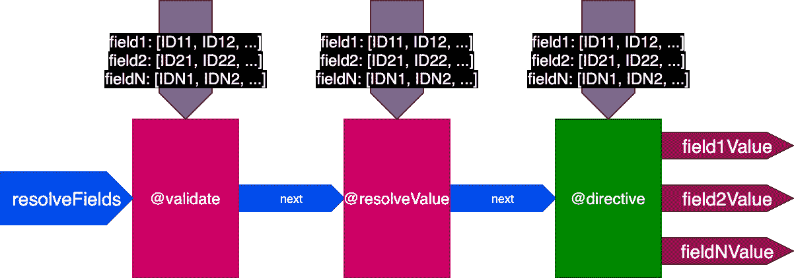

Passing the IDs per field to each directive.

在前面的示例中，当执行翻译两条记录的第一个查询时，管道如下所示:

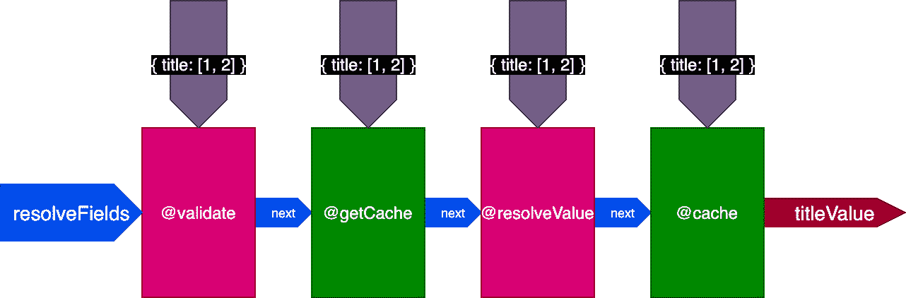

Passing the IDs per field to each directive for the first query

当执行翻译四个记录的第二个查询时，指令`@getCache`获得所有四个记录的 id，但是`@resolveValueAndMerge`和`@cache`将只接收最后两个记录的 id(它们没有被缓存):

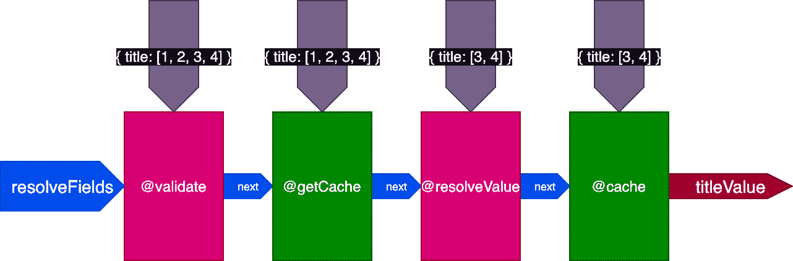

Passing the IDs per field to each directive for the second query

### 把这一切联系在一起

这是指令管道的最终设计:


Final design of the directive pipeline.

总而言之，这些是它的特点:

*   通过指令`@validate`和`@resolveValueAndMerge`从指令管道内调用字段解析器
*   指令可以放在三个槽中的任何一个上:`"beginning"`，在`@validate`之前；`"middle"`，在`@validate`和`@resolveValueAndMerge`之间；和`"end"`，在`@resolveValueAndMerge`之后
*   指令在一次调用中解析多个字段
*   单个管道包含查询中涉及的所有指令
*   每个指令通过变量`fieldIDs`接收它自己的一组 id 来解析每个字段
*   指令可以在流水线的稍后阶段修改所有指令的变量`fieldIDs`

## 通过指令和字段比较中间件

基于指令的中间件至少和基于字段的中间件一样好，因为它可以实现所有相同的功能。此外，它提供了几个特性，这些特性需要黑客攻击或额外的复杂性才能用基于领域的中间件来实现。

我们来看看这些。

### 自动/手动执行

如前所述，graphql-middleware 项目声明“指令鼓励您将模式与功能相结合。”

这对 SDL 优先的 GraphQL 服务器来说是正确的，但对代码优先的 GraphQL 服务器来说就不一定了(我在之前的一篇文章中解释了它们之间的区别)。对于后一种方法，我们可以直接在查询中执行指令，而不必在模式中定义它。

[GraphQL by PoP](https://graphql-by-pop.com) 遵循代码优先的方法。它提供了声明 [IFTTT (If This，Then That)规则](https://graphql-by-pop.com/docs/dynamic-schema/ifttt-through-directives.html)自动执行指令的可能性:

正如我们前面看到的，最后一条规则被指令`@cache`用来隐式地将`@getCache`添加到管道的开头。

有了这些规则，我们可以在不修改模式的情况下自动向查询中添加某个指令，同时还可以在需要时手动添加该指令。相比之下，我们不能通过查询来指示执行特定的字段解析器中间件功能，至少在没有黑客攻击的情况下是这样的。

例如，一个`[@traceExecutionTime](https://leoloso.com/posts/cache-and-logtime-directives/#heading-@traceexecutiontime-directive)`指令(这里实现的[是](https://github.com/PoPSchema/trace-tools/blob/8eb5a34faf8b35e3179d311e33ac26251cc82cf5/src/DirectiveResolvers/EndTraceExecutionTimeDirectiveResolver.php))可以帮助以一种精细的方式分析 API 的性能:

1.  通过设置由`"any"`类型上的`"any"`字段触发的 IFTTT 规则，让它对查询中的所有字段自动执行
2.  通过设置相应的 IFTTT 规则，让它为单个字段或指令自动执行
3.  在需要评估的字段的查询中手动定义`@traceExecutionTime`指令

### 一次在多个字段上执行

如前所述，有些操作不能为每个字段独立执行，否则 API 的质量会下降太多。作为一个例子，我提到了一个连接到 Google 翻译服务的`@translate`指令。

使用指令管道，我们可以执行一个包含所有相关字段作为输入的调用。然后，指令`[@translate](https://github.com/PoPSchema/translate-directive/blob/89698ff600fbbeb6639a71a5ae16530ead0dadf9/src/DirectiveResolvers/AbstractTranslateDirectiveResolver.php)`可以在一个请求中一起翻译几十个字符串[。](https://newapi.getpop.org/graphiql/?query=query%20%7B%0A%20%20posts%20%7B%0A%20%20%20%20id%0A%20%20%20%20title%0A%20%20%20%20titleES%3A%20title%20%40translate(from%3A%22en%22%2C%20to%3A%22es%22)%0A%20%20%7D%0A%7D)

这也可以使用基于字段的中间件来实现，但是我们负责实现额外的逻辑(批处理/延迟)，并且代码会更加复杂和难以维护。

### 低级功能

作为一个设计决策，GraphQL 引擎直接依赖于指令管道来解析查询。因此，指令被视为低级组件，可以访问存储响应的对象。

因此，任何自定义指令都有权修改 GraphQL 响应。一个明显的用例是指令`[@removeIfNull](https://graphql-by-pop.com/docs/operational/remove-if-null.html)`(这里实现了)，它允许我们在查询中指出我们是否宁愿忽略来自一个字段的响应，而不是接收一个`null`值(关于这个特性的规范中有一个[问题)。](https://github.com/graphql/graphql-spec/issues/476)

## 履行

设计架构很有趣，但解释其底层代码却不有趣，所以我只提供了生成指令管道的[逻辑和](https://github.com/getpop/component-model/blob/ea3a4b74d197ba319607516a655942f521acf99f/src/TypeResolvers/AbstractTypeResolver.php#L947)[指令接口](https://github.com/getpop/component-model/blob/b2ef9fe693c69a6d4c4b549519eb236f527b841d/src/DirectiveResolvers/DirectiveResolverInterface.php#L113)的链接。

关于指令接口，请注意函数`resolveDirective`接收的参数:

```
public function resolveDirective(
  TypeResolverInterface $typeResolver,
  array &$idsDataFields,
  array &$succeedingPipelineIDsDataFields,
  array &$succeedingPipelineDirectiveResolverInstances,
  array &$resultIDItems,
  array &$unionDBKeyIDs,
  array &$dbItems,
  array &$previousDBItems,
  array &$variables,
  array &$messages,
  array &$dbErrors,
  array &$dbWarnings,
  array &$dbDeprecations,
  array &$dbNotices,
  array &$dbTraces,
  array &$schemaErrors,
  array &$schemaWarnings,
  array &$schemaDeprecations,
  array &$schemaNotices,
  array &$schemaTraces
): void;
```

这些参数证明了该指令的低级本质。关于前面解释的设计决策，我们有一些参数:

*   `$idsDataFields`–指令要处理的每个字段的 id 列表
*   `$succeedingPipelineIDsDataFields`–在流水线的稍后阶段由指令处理的每个字段的 id 列表
*   `$resultIDItems`–响应对象

其他参数可以:访问查询变量和定义动态变量(由`[@export](https://github.com/GraphQLByPoP/graphql/blob/3c1ae32f641b5540a7538e3df5d7d6ffeb93d53f/src/DirectiveResolvers/ExportDirectiveResolver.php)`指令完成)；跨指令传递带有自定义数据的消息；引发错误和警告；识别和显示折旧；[给用户传递通知](https://graphql-by-pop.com/docs/operational/proactive-feedback.html)；和存储指标。

## 结论

指令是 GraphQL 最强大的特性之一，但前提是 GraphQL 服务器对它们提供良好的支持。

在本文中，我们将中间件确定为一个起点，从这个起点设计一个合适的架构来执行 GraphQL 中的指令，但是我们最终决定使用责任链设计模式，基于称为“管道”的结构。

有了这个决定，我们一步一步地浏览了为设计一个充分利用 GraphQL 的指令管道所做的决定。

## 继续多看

本文是正在进行的关于概念化、设计和实现 GraphQL 服务器的系列文章的一部分。该系列的前几篇文章是:

1.  *[设计 GraphQL 服务器以获得最佳性能](https://blog.logrocket.com/designing-graphql-server-optimal-performance/)*
2.  *[简化 GraphQL 数据模型](https://blog.logrocket.com/simplifying-the-graphql-data-model/)*
3.  *[graph QL 中模式优先与代码优先的开发](https://blog.logrocket.com/code-first-vs-schema-first-development-graphql/)*
4.  *[加速对 GraphQL 模式的修改](https://blog.logrocket.com/speeding-up-changes-to-the-graphql-schema/)*
5.  *[graph QL 中的版本控制字段](https://blog.logrocket.com/versioning-fields-graphql/)*
6.  *[GraphQL 指令被低估](https://blog.logrocket.com/graphql-directives-are-underrated/)*

## 监控生产中失败和缓慢的 GraphQL 请求

虽然 GraphQL 有一些调试请求和响应的特性，但确保 GraphQL 可靠地为您的生产应用程序提供资源是一件比较困难的事情。如果您对确保对后端或第三方服务的网络请求成功感兴趣，

[try LogRocket](https://lp.logrocket.com/blg/graphql-signup)

.

[](https://lp.logrocket.com/blg/graphql-signup)[https://logrocket.com/signup/](https://lp.logrocket.com/blg/graphql-signup)

LogRocket 就像是网络和移动应用的 DVR，记录下你网站上发生的每一件事。您可以汇总并报告有问题的 GraphQL 请求，以快速了解根本原因，而不是猜测问题发生的原因。此外，您可以跟踪 Apollo 客户机状态并检查 GraphQL 查询的键值对。

LogRocket 检测您的应用程序以记录基线性能计时，如页面加载时间、到达第一个字节的时间、慢速网络请求，还记录 Redux、NgRx 和 Vuex 操作/状态。

[Start monitoring for free](https://lp.logrocket.com/blg/graphql-signup)

.