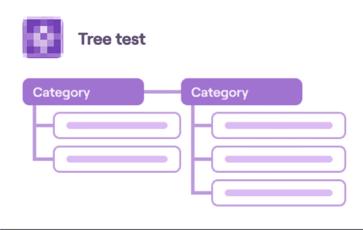
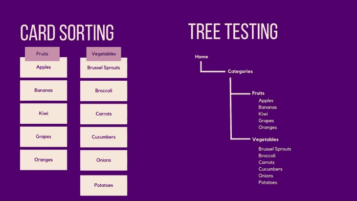
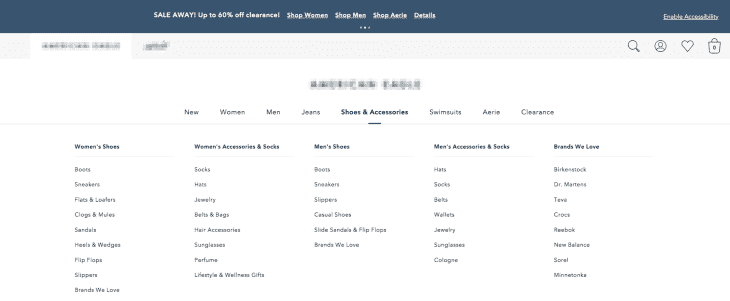
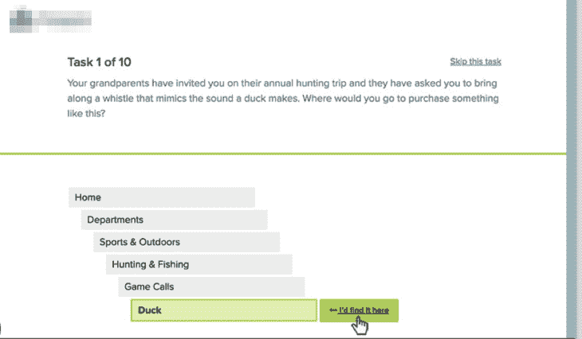
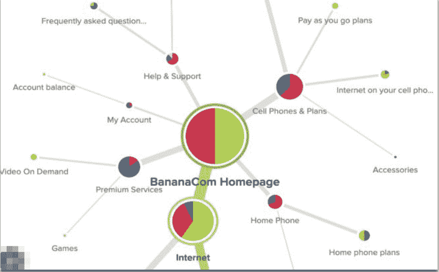
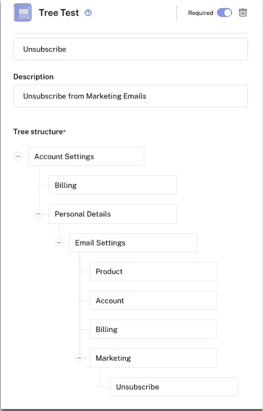

# 树木测试:一种有价值的 UX 研究方法

> 原文：<https://blog.logrocket.com/ux-design/tree-testing-valuable-ux-research-method/>

信不信由你，树木测试的实践已经融入到我们的日常生活中。无论你是在网上购物，逛杂货店，还是使用公共交通工具，这项技术都可以让你在完成这些任务时有一种组织感。

除了保持组织性，这种用户研究技术的结果使人们能够以一种快速和可管理的方式找到他们需要的东西。

## 什么是树测试？

树测试评估层次结构。之所以称之为树型测试，是因为参与者接受的树枝状结构使他们能够快速而轻松地访问他们正在查看的信息。这种方法从一个主类别开始，下面是子类别，这样参与者就不会有导航上的困难。

实际上，树测试经常被用来测试网站上的导航菜单。例如，当你在一个网站上购买衣服、家具、电器等时。，取决于公司的网站，他们通常在屏幕顶部有类别。当你的鼠标悬停在一个类别上时，会有一个列表下拉并分解成细节。有时，这些子类别还包含另一个子类别，使得搜索更加具体。这允许用户在浏览时直奔主题。

## 卡片分类与树测试

卡片分类是评估信息组织的另一种方法。但是，两者的区别在于，卡片分类侧重于通过创建一般类别来产生想法。

通过卡片分类，研究者给参与者提供卡片进行分类。有不同类型的卡片分类技术，我们不会在这里深入讨论，但是你应该在产品开发的早期阶段使用卡片分类，而不是在树测试阶段。

例如，如果你是一名大学研究人员，你想了解人们是如何将不同的主题归类在一起的，你可以给他们一些卡片，上面有你想让他们看的内容。然后，参与者会将这些卡片归入特定的类别，但他们不一定会创建一个分支层次结构。

卡片排序的结果为设计者创建一个导航结构创造了一个起点，然后你可以使用树测试来评估这个导航结构。

这两种技术都鼓励组织，并为观众提供了一个更简单的平台。它们对许多事情都有用。卡片分类是树形测试的基础，因为它可以让你一瞥你脑海中的愿景，而树形测试是当你开始安排并专注于更具体的时候，这样公众就可以理解你的目标概念。

## 我如何知道树测试会成功？

如果你想修复现有的网站导航或者创建新的网站导航，树测试将是合适的方法。这是您可以测试您的想法的地方，因为树测试将发现问题发生在哪里。有几个步骤需要完成，以确定它最终是否会成功。

### 第一步:确定你的目标

准备很重要，因为这是你想出你要测试的题目/问题的地方。如果你是一个电子商务网站，你可能想知道参与者可以轻松地浏览你的网站，并完成重要的任务，如:寻找产品，购买产品，结帐，并找出订单的状态。在这种情况下，你应该为每一项任务写下目标，并把它们作为你的研究目标。

### 第二步:计划你的任务

在计划你的任务时，总是回到你的研究目标。你可以把你的目标改写成一个提示，给你的参与者。你应该总是分析和精确你认为公众会点击什么，但不要引导他们找到答案。

作为一般的最佳实践，让子类别易于理解是很重要的。比如你的类目是**配饰**，子类可以是**墨镜**、**包包**、**腰带**等。当子类别**太阳镜**被点击时，这些是应该显示的唯一项目。

试着给参与者一个可以找到的部分和他们找到它的方向是很好的。您还可以查看参与者完成任务需要多长时间。

### 第三步:确定合适的受众

你需要了解你的网站的目标用户是谁。如果你的主要目标用户不能浏览你的网站，那么你就有麻烦了。

你可能也想看看主要人群之外的地方，但是你想确保你满足了你试图服务的人的需求。你应该向你的[买家角色](https://blog.logrocket.com/product-management/buyer-personas-templates-and-examples/)寻求指导。

### 步骤 4:招募参与者

一旦你确定了你的目标用户，你就需要招募他们。招聘是一个巨大的挑战。有许多[招聘](https://renaissancerachel.com/best-recruiting-tools/)和[用户测试](https://renaissancerachel.com/best-user-testing-tools/)工具可以帮助解决这个问题。或者，如果您有用户的联系信息，您可以发送电子邮件邀请他们参与您的树测试项目。

### 第五步:运行你的研究

我们将在本文的后面讨论几种不同的方法来进行树测试，无论是模拟的还是数字的。

在运行完整的树测试之前，您可能想要做一个试点测试来获得您需要的数据，以便继续或修复您的测试的任何潜在问题。

一旦你运行你的研究，你会看到是否很容易通过你的网站导航。

### 第六步:分析你的数据

一旦结果出来了，你就能知道它是否成功了。无论你是进行在线研究，还是面对面研究，或者两者都进行，你的研究都会向你展示参与者完成任务的路线。这将有助于了解参与者找到他们正在搜索的信息有多简单或多困难。您还可以找到每个参与者完成这项任务所花的时间。

### 第七步:分享你的发现

通常情况下，你会希望与你的各种利益相关者分享你的发现，这样你就可以在你的研究中获得认同。做一个无人参与的研究项目是没有意义的。与他人就你的发现进行合作将会让你获得反馈，并将它们带入研究过程。

## 进行树测试的策略

当进行树测试时，有一些不同的考虑。应该在网上还是当面？应该是数码的还是实体的？应该节制还是不节制？我们将在这一部分探讨这些不同的选项。

### 在线与面对面

进行网上或现场测试将取决于你的资源和时间。如果你的听众是本地人，亲自和他们见面会有很大的不同，你可能想亲自进行你的研究。也许你是一家杂货店，你想改善人们浏览你的商店的方式。你可以让他们参观你的商店，然后带他们和你一起做一个树木测试。

如果你在网上做，它会扩大你的潜在参与者，节省你的时间和金钱。

### 数字与物理

即使你是亲自做测试，你也可以使用数字工具让这个人做你的测试。这样，您就能够更密切地跟踪您的数据。用于树木测试的两个领先的数字工具是 UserZoom 和 Treejack through Optimal Workshop。这两者都能够为你提供各种方法，让你按照自己的喜好进行研究。此外，他们很快提供和交付世界各地的参与者参与您的研究。

物理测试需要您手动创建分组，并为它们模拟测试。分析这些数据需要付出更多的努力。然而，物理测试可以为创造力打开大门，而数字测试却不能。例如，你可以让你的参与者做笔记或者在你给他们的纸上画画。

### 受控与非受控树测试

您可以在有人管理或无人管理的情况下完成树测试。主持式包括有一个专门的主持人来主持与参与者的会议。这可能需要更长的时间，但你有机会提出后续问题。有节制也非常有帮助，因为你可以和这个人交流，了解他们的思维方式，以及他们为什么做出这样的选择。

自由将包括给参与者一步一步的指导来浏览网站，看看是否可以在没有人指导的情况下自己跟随。两者都有利弊，往往取决于你的时间和资源。

## 最后的想法

总的来说，当您想要评估信息的组织时，树测试是一种有益且有价值的方法。最好从卡片分类开始，看看你的参与者的心理模型，然后使用树测试来进一步完善你如何组织你的数据。

树测试可以为公司节省大量资金，因为它可以发现阻止用户完成关键任务的关键问题。一个错误分类的商品可能是阻止用户找到他们想要购买的产品的主要障碍。

*精选图片来源:* [IconScout](https://iconscout.com/icon/chart-board-company-business-performance-statics-growth-4)

## [LogRocket](https://lp.logrocket.com/blg/signup) :无需采访即可获得 UX 洞察的分析

[LogRocket](https://lp.logrocket.com/blg/signup) 让您可以回放用户的产品体验，以可视化竞争，了解影响采用的问题，并结合定性和定量数据，以便您可以创建令人惊叹的数字体验。

查看设计选择、交互和问题如何影响您的用户— [立即尝试 LogRocket】。](hhttps://lp.logrocket.com/blg/signup)