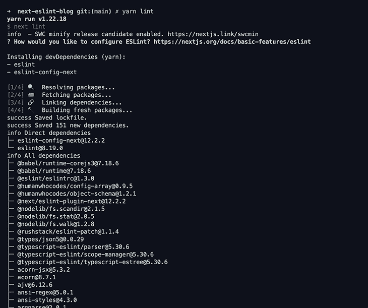

# 使用 ESLint 对 Next.js 应用程序进行故障排除

> 原文：<https://blog.logrocket.com/troubleshooting-next-js-app-eslint/>

ESLint 是一个很棒的工具，它强化了代码风格，并有助于保持代码的整洁。它可以帮助防止错误，并允许我们编写更多可读的代码。除了独立开发人员之外，如果您在团队中工作，使用该工具也将有所帮助，并有助于在跨多个开发人员的项目中保持一定的一致性。

在本文中，我将向您展示如何在一个 [Next.js](https://blog.logrocket.com/tag/nextjs/) 应用程序中使用 ESLint 进行设置和故障排除。

## 使用 Next.js 设置 ESLint

在 Next.js 应用程序中，添加一个名为`lint`的新脚本，它的值应该是`next lint`:

```
"scripts" : {
   ...
   "lint": "next lint"
}

```

现在运行:

```
yarn lint

```

您将看到一条消息，说“您希望如何配置 ESLint？”我建议使用“严格”，但您可以根据自己的需求选择。



您现在会看到已经为您创建了一个新的`.eslintrc.json`文件。您可以使用该文件自定义规则。

## 自定义规则和插件

使用 ESLint 时，自定义规则和插件非常重要，因为它们定义了您希望如何构建代码、何时给出警告以及何时给出错误。

首先将`.eslintrc.json`改名为`.eslintrc.js`。现在，让我们看看如何应用一些严格的规则来维护良好的代码结构。这是我喜欢使用的 ESLint 配置:

```
const prettierConfig = require("./.prettierrc.js");

module.exports = {
  env: {
    browser: true,
    commonjs: true,
    es2021: true,
    node: true,
  },
  extends: [
    "eslint:recommended",
    "plugin:react/recommended",
    "plugin:react-hooks/recommended",
    "plugin:prettier/recommended",
    "plugin:@typescript-eslint/eslint-recommended",
    "plugin:@typescript-eslint/recommended",
    "next/core-web-vitals",
  ],
  parserOptions: {
    ecmaFeatures: {
      jsx: true,
    },
    ecmaVersion: 12,
    sourceType: "module",
  },
  plugins: ["react"],
  rules: {
    // Possible errors
    "no-console": "warn",
    // Best practices
    "dot-notation": "error",
    "no-else-return": "error",
    "no-floating-decimal": "error",
    "no-sequences": "error",
    // Stylistic
    "array-bracket-spacing": "error",
    "computed-property-spacing": ["error", "never"],
    curly: "error",
    "no-lonely-if": "error",
    "no-unneeded-ternary": "error",
    "one-var-declaration-per-line": "error",
    quotes: [
      "error",
      "single",
      {
        allowTemplateLiterals: false,
        avoidEscape: true,
      },
    ],
    // ES6
    "array-callback-return": "off",
    "prefer-const": "error",
    // Imports
    "import/prefer-default-export": "off",
    "sort-imports": [
      "error",
      {
        ignoreCase: true,
        ignoreDeclarationSort: true,
      },
    ],
    "no-unused-expressions": "off",
    "no-prototype-builtins": "off",
    // REACT
    "react/jsx-uses-react": "off",
    "react/react-in-jsx-scope": "off",
    "jsx-a11y/href-no-hash": [0],
    "react/display-name": 0,
    "react/no-deprecated": "error",
    "react/no-unsafe": [
      "error",
      {
        checkAliases: true,
      },
    ],
    "react/jsx-sort-props": [
      "error",
      {
        ignoreCase: true,
      },
    ],
    "react-hooks/rules-of-hooks": "error",
    "react-hooks/exhaustive-deps": 0,
    // Prettier
    // eslint looks for the prettier config at the top level of the package/app
    // but the config lives in the `config/` directory. Passing the config here
    // to get around this.
    "prettier/prettier": ["error", prettierConfig],
  },
  settings: {
    react: {
      version: "detect",
    },
  },
};

```

让我们更详细地检查一下这个文件。

## 反应

在这里，我使用了 [React](https://www.npmjs.com/package/eslint-plugin-react) 和 [react-hooks](https://www.npmjs.com/package/eslint-plugin-react-hooks) 插件，因为它带有一些默认配置，也有助于定制代码结构。

你可以设置它来显示错误，比如使用不推荐的/不安全的东西，分类道具等等。要使用它，请添加以下包:

```
npm i -D eslint-plugin-react eslint-plugin-react-hooks # npm

yarn add -D eslint-plugin-react eslint-plugin-react-hooks # yarn

```

以下是 ESLint React 和 react-hooks 插件将帮助您更快地排除故障的一些示例:

*   有条件地使用钩子
*   不在 useEffect 的依赖数组中添加项
*   在钩子或 React 组件之外调用钩子

## 格式化

格式是一个重要的问题，因为有些人可能不遵循一种风格，这可能会导致进一步的问题，所以这里我们使用更漂亮和更漂亮的插件来确保格式得到保持。

我创建了这个`.prettierrc.js`文件来添加一些格式选项:

```
module.exports = {
    arrowParens: 'avoid',
    singleQuote: true,
    trailingComma: 'all',
    tabWidth: 4,
    endOfLine: 'auto',
};

```

你需要安装更漂亮的插件来使用它:

```
npm i -D eslint-config-prettier # npm

yarn add -D eslint-config-prettier # yarn

```

如您所见，我还在 ESLint 配置中添加了排序导入选项。这确保了导入也被正确排序。有一个更漂亮的插件叫做@ trivago/prettle-plugin-sort-imports。

所以，基本上，如果代码没有按照正确的格式格式化或者导入没有排序，那么这个插件就会对你大喊大叫！

## 以打字打的文件

如果您没有传递正确的值或类型，还有另一个用于 typescript 的 ESLint 插件，它可以改进键入和一般的键入错误。这也在你使用像`any`这样不应该使用的类型时给出警告。

```
npm i -D @typescript-eslint/eslint-plugin # npm

yarn add -D @typescript-eslint/eslint-plugin # yarn

```

## Next.js

有一个 Next.js 团队做的插件，提示你使用更多 Next.js 的惊艳功能；例如，使用下一个 <图像/ > 组件代替普通的<【img/>。

这也给出了更多类似`<Link>`的 Next.js 组件的警告。例如，如果您没有在需要的地方传入 passHref，它会警告您应该传入`passHref`属性。这对`_document.tsx`文件也有帮助，因为这个文件的一些导入与其他文件不同！

安装:

```
npm i eslint-config-next -D # npm

yarn add -D eslint-config-next # yarn

```

## 常规代码样式

我也有一些干净代码的通用规则，比如没有`else`返回语句，在可能的地方使用`const`，没有不需要的三元组，如果有控制台日志就给出警告，因为在生产中通常不应该有任何控制台日志。这些确保代码在整个代码库中是一致的。您可以根据自己的喜好增加或减少这个配置！

## 结论

ESLint 非常有用，在 Next.js 中使用它将帮助您和您的团队成员轻松地准备好代码，并轻松地排除错误🚀。这将需要一些时间来适应它，但从长远来看，它肯定会帮助你！

## [LogRocket](https://lp.logrocket.com/blg/nextjs-signup) :全面了解生产 Next.js 应用

调试下一个应用程序可能会很困难，尤其是当用户遇到难以重现的问题时。如果您对监视和跟踪状态、自动显示 JavaScript 错误、跟踪缓慢的网络请求和组件加载时间感兴趣，

[try LogRocket](https://lp.logrocket.com/blg/nextjs-signup)

.

[](https://lp.logrocket.com/blg/nextjs-signup)[](https://lp.logrocket.com/blg/nextjs-signup)

LogRocket 就像是网络和移动应用的 DVR，记录下你的 Next.js 应用上发生的一切。您可以汇总并报告问题发生时应用程序的状态，而不是猜测问题发生的原因。LogRocket 还可以监控应用程序的性能，报告客户端 CPU 负载、客户端内存使用等指标。

LogRocket Redux 中间件包为您的用户会话增加了一层额外的可见性。LogRocket 记录 Redux 存储中的所有操作和状态。

让您调试 Next.js 应用的方式现代化— [开始免费监控](https://lp.logrocket.com/blg/nextjs-signup)。