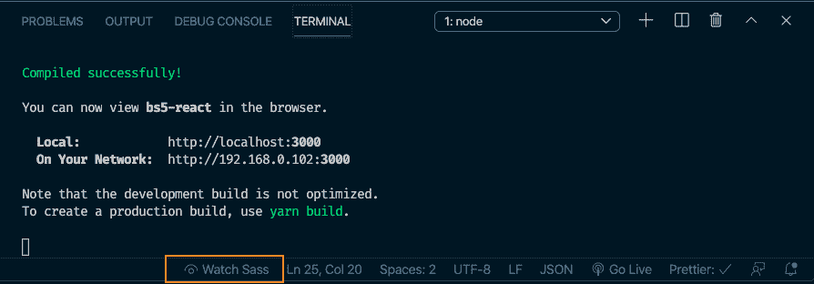
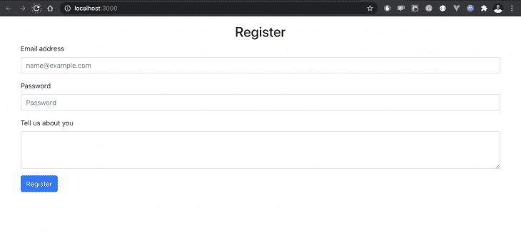
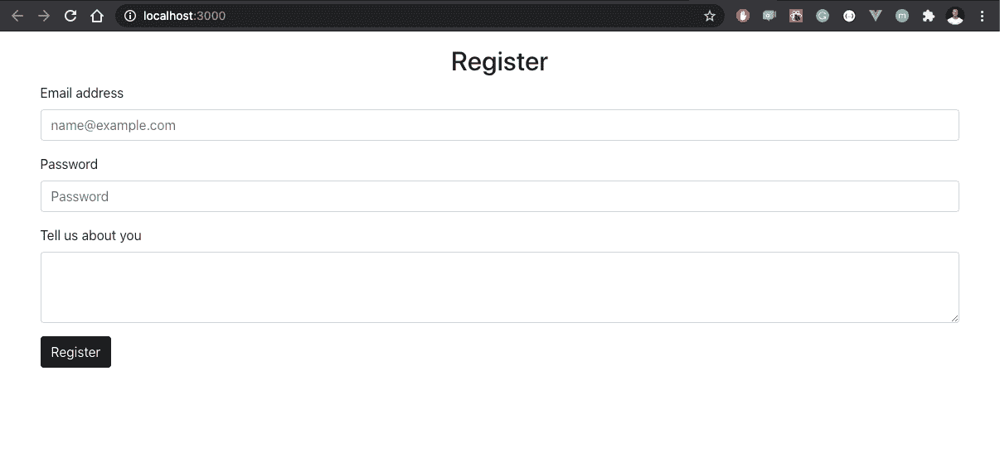
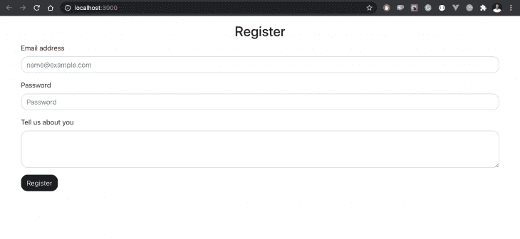
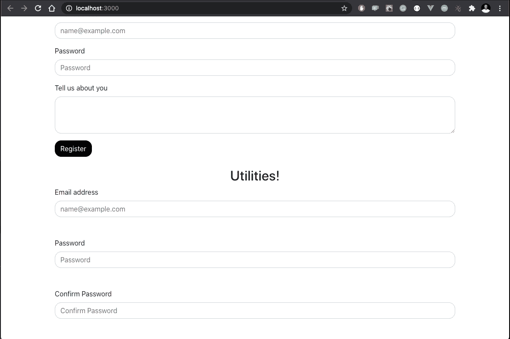
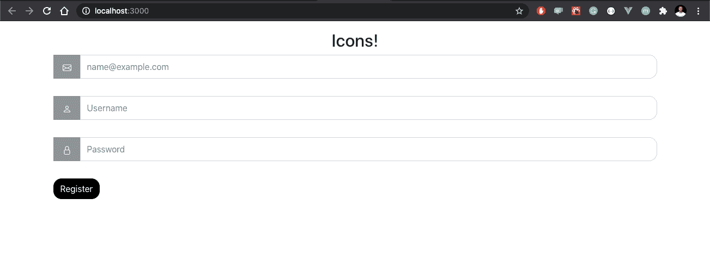

# 在 React - LogRocket 博客上试用新的 Bootstrap 5

> 原文：<https://blog.logrocket.com/trying-out-the-new-bootstrap-5-with-react/>

几周前，Bootstrap 团队[发布了 Bootstrap 5](https://v5.getbootstrap.com/) 的 alpha 版本。一个主要版本，发布了令人惊叹的公告，如:

1.  放弃对 jQuery 的支持
2.  不再支持 internet explorer
3.  改进的文档
4.  支持自定义 CSS 属性
5.  扩展调色板
6.  自定义图标
7.  可定制的实用程序 API
8.  还有更多…

虽然您可能会很兴奋，但值得注意的是，这个版本还不稳定，因此不建议在生产中使用。

在这篇文章中，我打算分享我对新事物的理解，以及如何快速上手。我们将更进一步，看看如何在 React 项目中使用新版本。

## Bootstrap 5 入门

首先，将 Bootstrap 安装到 React 项目中。此时，您应该已经建立了一个要使用的 React 项目。如果你需要如何操作的指导，请点击查看[如何创建一个 React 应用。](https://reactjs.org/docs/create-a-new-react-app.html)

## 安装引导程序

这里有几种方法可以做到这一点，你可以:

*   [下载](https://v5.getbootstrap.com/docs/5.0/getting-started/download/)源文件并在本地运行，
*   [下载](https://v5.getbootstrap.com/docs/5.0/getting-started/download/)缩小的 CSS 和 JS 文件并直接放入你的项目中
*   [使用 CDN](https://v5.getbootstrap.com/docs/5.0/getting-started/download/) (这种方法不太可定制)
*   使用包管理器(它作为预发行版发布给 npm、yarn、RubyGems 等。)

如果您使用包管理器，您将需要设置一个工作流来编译 Sass。在本教程中，我们将使用纱线。在 React 项目的根目录中，运行以下命令:

```
yarn add install [email protected]
```

这将在 React 项目中安装 Bootstrap 5 和 icons 包。如果您检查项目的`package.json`文件，您应该将这个新包添加到 dependencies 对象中:

```
"dependencies": {
  //...
  "bootstrap": "5.0.0-alpha1",
  //...
},
```

## 使用 Sass 设置工作流

首先，我们需要安装`node-sass`来使 Sass 在 React 项目中可用。您可以使用任何选择的包管理器，同样，我将使用 yarn:

```
yarn add node-sass
```

接下来，创建一个`src/main.scss`文件夹，并将引导源样式表导入其中，如下所示:

```
@import "../node_modules/bootstrap/scss/bootstrap.scss";
```



当你点击上面截图中高亮显示的`Watch Sass`按钮，它会自动编译成 CSS 并创建一个 CSS 文件夹，里面有你所有的引导包。

最后，您可以在您的`src/index.js`文件的顶部导入新创建的`main.scss`文件，如下所示:

```
import "../src/main.scss";
```

## 构建一个 React 登录页面

在我们的 React 项目中，我们将使用 Bootstrap 构建一个小的注册页面。这应该足以向我们介绍 Bootstrap 5 的一些新特性。首先，让我们创建一个用户注册表单。打开您的`App.js`文件，用下面的代码片段替换内容:

```
import React from "react";
function App() {
  return (
    <div className="container mt-3">
      <h2 class="text-center">Register</h2>
      <div>
        <div class="mb-3">
          <label for="email" class="form-label">
            Email address
          </label>
          <input
            type="email"
            class="form-control"
            id="email"
            placeholder="[email protected]"
          />
        </div>
        <div class="mb-3">
          <label for="password" class="form-label">
            Password
          </label>
          <input
            type="password"
            class="form-control"
            id="password"
            placeholder="Password"
          />
        </div>
        <div class="mb-3">
          <label for="bio" class="form-label">
            Tell us about you
          </label>
          <textarea class="form-control" id="bio" rows="3"></textarea>
        </div>
        <div class="col-12">
          <button class="btn btn-primary" type="submit">
            Register
          </button>
        </div>
      </div>
    </div>
  );
}
export default App;
```

这些是常规的 Bootstrap 4 类。我们刚刚为电子邮件、密码和简历设置了表单字段。我们还添加了一个按钮，用于在完成时提交表单。如果您运行此应用程序，您应该会在`localhost:3000`上看到以下视图:



## 自定义

现在我们有了一个常规的表单，让我们开始添加 Bootstrap 5 特性来进一步定制表单，并赋予它我们想要的外观和感觉。

首先，为了演示如何覆盖默认的引导变量，让我们改变按钮上设置的`primary`颜色变量的值。打开`src/main.scss`文件，用下面的代码片段更新它:

```
// src/main.scss
$primary: #000000;
@import "../node_modules/bootstrap/scss/bootstrap.scss";
```

我们所做的是将颜色变量`primary`的值从蓝色改为黑色。因此，如果我们保存此更改并重新加载浏览器，我们的按钮应该相应地从蓝色变为黑色:



不仅如此，我们还可以对`border-radius`变量执行相同的操作，如下所示:

```
//src/main.scss
$primary-btn: #000000;
$border-radius: 15px;
@import "../node_modules/bootstrap/scss/bootstrap.scss";
```

这将在表单域和按钮上应用边框-半径效果，给它更多可见的圆角，如下:


## 实用程序 API

既然我们已经看到了如何使用自定义变量，那么让我们深入到实用程序 API 中，看看它是如何工作的。根据[引导程序文档](https://v5.getbootstrap.com/docs/5.0/utilities/api/):

> 实用程序 API 可用于更改或扩展 Bootstrap 的实用程序类。

在我们的例子中，我们将向现有的 Bootstrap 实用程序 API 添加一个新的自定义实用程序。为了保持例子的一致性和简单性，让我们使用上面已经有的表单元素。

注意，上面表单元素的缺省值`margin-bottom`是`mb-3`。比方说，根据我的 UI 规范，它太小了，需要全面修改，我们可以做的是创建一个新的`margin-bottom`工具，它将有我需要的规范。在这种情况下，更大的边距值。

为此，让我们打开`main.scss`文件并用下面的代码片段更新它:

```
//Custom utilities
$utilities: (
  "custom-margin": (
    property: margin-bottom,
    class: mb,
    values: (
      0: 0,
      1: 1rem,
      2: 2rem,
      3: 3rem,
    ),
  ),
);
```

我已经创建了一个`custom-margin`实用程序，它指定了我希望在我的项目中应用的`margin-bottom`属性的级别。该物业可以是您选择的任何物业，取决于您想做什么，例如`padding`、`margin`、`opacity`、`flex`、`display`等。您可以创建自己选择的任何自定义实用程序，它将覆盖任何现有的默认值。

有了我的自定义实用程序，我不再局限于只使用 Bootstrap 提供的默认值，因为我现在有能力创建自己的默认值。为了展示这一点，我在`App.js`的初始项目中添加了一个`Utilities`部分:

```
//src/App.js     
   </div>
      <div>
        <h2 class="text-center"> Utilities! </h2>
        <div class="mb-3">
          <label for="email" class="form-label">
            Email address
          </label>
          <input
            type="email"
            class="form-control"
            id="email"
            placeholder="[email protected]"
          />
        </div>
        <div class="mb-3">
          <label for="password" class="form-label">
            Password
          </label>
          <input
            type="password"
            class="form-control"
            id="password"
            placeholder="Password"
          />
        </div>
        <div class="mb-3">
          <label for="cpassword" class="form-label">
            Confirm Password
          </label>
          <input
            type="password"
            class="form-control"
            id="password"
            placeholder="Confirm Password"
          />
        </div>
    </div>
```

注意，类仍然是`mb-3`然而，当您检查浏览器时，您将得到与我们最初不同的行为:



现在，我的表单正在使用我创建的自定义`margin-bottom`实用程序，而不再是默认的引导程序。请注意，您可以在其他属性上这样做，如`padding`、`display`等。

## 核标准情报中心

Bootstrap 5 还附带了一个自定义图标库。在 Bootstrap 5 发布之前，如果你想在 Bootstrap 项目上使用图标，你将不得不依赖于像 Font Awesome 这样的第三方服务。还有呢？这些图标以`SVG`的形式出现，因此它们是可伸缩的，并且可以使用 CSS 轻松定制。有趣的事实是，你可以在一个非引导项目中使用引导图标库，它仍然会像魔咒一样工作。

让我们看看如何将图标添加到现有的表单中。首先，通过在项目的根文件夹中运行以下命令来安装图标库:

```
npm install bootstrap-icons
```

接下来，更新`App.js`文件，向表单字段添加图标，如下所示:

```
//src/App.js
    <div className="container mt-3">
        <h2 class="text-center"> Utilities! </h2>
        <div class="mb-2 input-group">
          <div class="icon">
            <svg
              width="1em"
              height="1em"
              viewBox="0 0 16 16"
              class="bi bi-envelope"
              fill="currentColor"

            >
              <path
                fill-rule="evenodd"
                d="M0 4a2 2 0 0 1 2-2h12a2 2 0 0 1 2 2v8a2 2 0 0 1-2 2H2a2 2 0 0 1-2-2V4zm2-1a1 1 0 0 0-1 1v.217l7 4.2 7-4.2V4a1 1 0 0 0-1-1H2zm13 2.383l-4.758 2.855L15 11.114v-5.73zm-.034 6.878L9.271 8.82 8 9.583 6.728 8.82l-5.694 3.44A1 1 0 0 0 2 13h12a1 1 0 0 0 .966-.739zM1 11.114l4.758-2.876L1 5.383v5.73z"
              />
            </svg>
          </div>
          <input
            type="email"
            class="form-control"
            id="email"
            placeholder="[email protected]"
          />
        </div>
        <div>
          <div>
            <div class="input-group mb-2 ">
              <div class="icon">
                <svg
                  width="1em"
                  height="1em"
                  viewBox="0 0 16 16"
                  class="bi bi-person "
                  fill="currentColor"

                >
                  <path
                    fill-rule="evenodd"
                    d="M13 14s1 0 1-1-1-4-6-4-6 3-6 4 1 1 1 1h10zm-9.995-.944v-.002.002zM3.022 13h9.956a.274.274 0 0 0 .014-.002l.008-.002c-.001-.246-.154-.986-.832-1.664C11.516 10.68 10.289 10 8 10c-2.29 0-3.516.68-4.168 1.332-.678.678-.83 1.418-.832 1.664a1.05 1.05 0 0 0 .022.004zm9.974.056v-.002.002zM8 7a2 2 0 1 0 0-4 2 2 0 0 0 0 4zm3-2a3 3 0 1 1-6 0 3 3 0 0 1 6 0z"
                  />
                </svg>
              </div>
              <input
                type="text"
                class="form-control"
                id="inlineFormInputGroupUsername2"
                placeholder="Username"
              />
            </div>
          </div>
        </div>
        <div class="mb-2 input-group">
          <div class="icon">
            <svg
              width="1em"
              height="em"
              viewBox="0 0 16 16"
              class="bi bi-lock"
              fill="currentColor"

            >
              <path
                fill-rule="evenodd"
                d="M11.5 8h-7a1 1 0 0 0-1 1v5a1 1 0 0 0 1 1h7a1 1 0 0 0 1-1V9a1 1 0 0 0-1-1zm-7-1a2 2 0 0 0-2 2v5a2 2 0 0 0 2 2h7a2 2 0 0 0 2-2V9a2 2 0 0 0-2-2h-7zm0-3a3.5 3.5 0 1 1 7 0v3h-1V4a2.5 2.5 0 0 0-5 0v3h-1V4z"
              />
            </svg>
          </div>
          <input
            type="password"
            class="form-control"
            id="password"
            placeholder="Password"
          />
        </div>
        <div class="col-12">
          <button class="btn btn-primary" type="submit">
            Register
          </button>
        </div>
      </div>
    </div>
```

我们在这里所做的基本上是用单独的引导图标替换之前的表单标签。这只是在 React 项目中使用图标的许多不同方式中的一种。如果再次刷新浏览器，您应该会看到表单字段的新外观:



如果您愿意，您可以将图标用作外部图像，方法是首先将它们保存到首选目录中，然后导入到您的项目中，如下所示:

```

```

## 式样

除了有其他实现选项之外，引导图标可以接受一个`class`属性，以便使用 CSS 进行进一步的样式化。在我们的例子中，我通过`index.css`文件设计了图标的样式，如下所示:

```
.icon {
  padding: 10px;
  background: rgb(145, 148, 151);
  color: white;
  min-width: 50px;
  text-align: center;
}
```

然后将`class="icon"`添加到我的个人图标上，对它们施加样式效果。

## 结论

Bootstrap 团队对这个新版本赞不绝口，他们在消除对 JQuery 的依赖、为我们提供实用程序 API 和推出全新的图标库方面做了大量工作。但是，请记住，该版本仍处于测试阶段，将会有更多的更新和更改。想玩玩吗？请随意叉[这个回购](https://github.com/kenny-io/bs5-react)或发送一个 PR，期待你建立什么。

## 使用 LogRocket 消除传统反应错误报告的噪音

[LogRocket](https://lp.logrocket.com/blg/react-signup-issue-free)

是一款 React analytics 解决方案，可保护您免受数百个误报错误警报的影响，只针对少数真正重要的项目。LogRocket 告诉您 React 应用程序中实际影响用户的最具影响力的 bug 和 UX 问题。

[ ](https://lp.logrocket.com/blg/react-signup-general) [  ](https://lp.logrocket.com/blg/react-signup-general) [LogRocket](https://lp.logrocket.com/blg/react-signup-issue-free)

自动聚合客户端错误、反应错误边界、还原状态、缓慢的组件加载时间、JS 异常、前端性能指标和用户交互。然后，LogRocket 使用机器学习来通知您影响大多数用户的最具影响力的问题，并提供您修复它所需的上下文。

关注重要的 React bug—[今天就试试 LogRocket】。](https://lp.logrocket.com/blg/react-signup-issue-free)