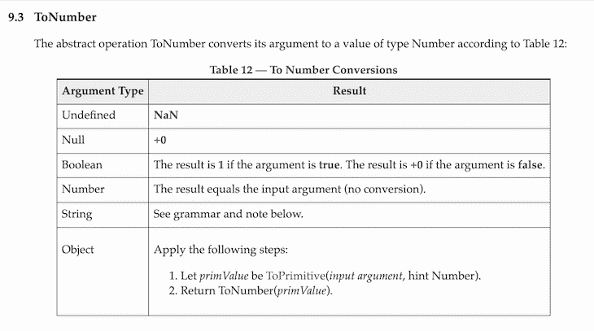
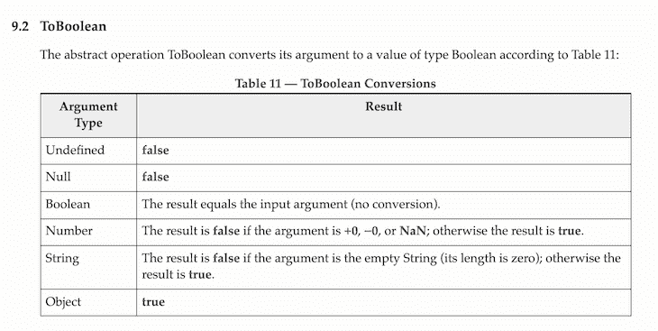

# JavaScript 中的类型强制

> 原文：<https://blog.logrocket.com/type-coercion-in-javascript/>

类型强制、类型转换、类型转换和类型转换:所有不同的名称都是指将一种数据类型转换为另一种数据类型的过程。这个过程存在于几乎每一种编程语言中，是计算机科学中的一个重要概念。

虽然 JavaScript 被认为是初学者最简单的编程语言之一，但当开发人员希望 JavaScript 做一件事，而它却返回另一件事时，它也会变得令人沮丧。

虽然 ECMAScript 语言规范标准可以帮助开发人员解决这些问题，但在处理 JavaScript 中的类型强制时，不阅读和理解规范标准会导致更多的挫折。

JavaScript 中的类型强制是一个例子，说明当我们不知道它到底是如何工作的时候，这种语言会产生意想不到的结果。每个接触过一点点 JavaScript 代码的人都知道类型强制是很棘手的。

虽然我们在本文中讨论的代码示例看起来像是版本更新可以修复的错误，但我们回顾类型强制为什么会这样的原因是因为许多遗留产品和代码依赖于旧版本的 JavaScript。

这意味着对语言进行修改会破坏遗留产品和代码，我们必须学会如何驾驭类型强制的怪癖。

在这篇文章中，我们将介绍 JavaScript 中有哪些类型以及如何使用类型强制，为编程成功做好准备。

## JavaScript 中的类型

我们可以将 [JavaScript 称为非类型化语言](https://stackoverflow.com/questions/964910/is-javascript-an-untyped-language)，这意味着它没有静态类型。然而，JavaScript 没有类型的神话是错误的。

JavaScript 有七种基本类型:

*   `string`
*   `number`
*   `Boolean`
*   `undefined`
*   `null`
*   `Symbol`
*   `BigInt`

然而，JavaScript 中的变量没有类型。每当我们使用`typeof`操作符返回变量类型时，我们返回变量的值类型。

既然我们已经澄清了一些关于 JavaScript 和类型的误解，我们可以学习更多关于类型强制以及它在 JavaScript 中是如何工作的。

## 类型强制

JavaScript 中的类型强制只强制到`string`、`number`和`Boolean`原始类型。JavaScript 中没有办法将值类型强制为`object`或`function`。

JavaScript 有两种典型的强制形式:隐式强制和显式强制。

当 JavaScript 将值类型强制转换为预期类型时，就会发生隐式强制。这种类型的强制在开发人员没有注意到的情况下发生。

当我们想要将值类型强制为特定类型时，就会发生显式强制。大多数时候，JavaScript 中的显式强制使用内置函数，如`String()`、`Number()`和`Boolean()`。

当我们试图使用不同的值类型在 JavaScript 中创建操作时，JavaScript 会隐式地强制我们使用值类型。

这也是开发人员倾向于避免 JavaScript 中隐式强制的原因之一。如果我们不知道 JavaScript 是如何强制值类型的，大多数时候我们会从操作中得到意想不到的结果。

隐式强制并不像开发人员想的那样糟糕，事实上，对于编写可读但高效的代码来说，隐式强制非常有用。正确理解 JavaScript 中隐式强制的关键是理解它在幕后做什么。

### 数字

将基元类型强制为数字有许多可能的方法。`Number()`函数强制传递给函数的值类型，然后传递给一个数字。当类型不能被强制为数字时，返回的结果是`NaN`。

让我们看几个使用`Number()`函数的显式强制的例子:

```
Number("42"); // 42
Number(""); // 0
Number(true); // 1
Number(false); // 0
Number(null); // 0
Number(undefined); // NaN

```

我们可以清楚地看到一些明显的和意想不到的结果。将`null`转换成数字会返回`0`，而将`undefined`转换成数字会返回`NaN`。两个操作都应该返回`NaN`，因为两个值类型显然都不是有效的数字。

将空字符串转换为数字会返回`0`。这是 JavaScript 的另一个奇怪之处，因为这个值类型显然不是一个有效的数字，但它仍然会转换成`0`。

[凯尔·辛普森](https://github.com/getify)， [*你不知道的 JS*](https://github.com/getify/You-Dont-Know-JS) 书系列的创作者说，“空弦变成 0 是一切威压罪恶的根源。”

尽管我们从`Number()`函数中得到的结果似乎出乎意料，ECMAScript 规范清楚地指出了这些差异。但是如果没有阅读 ECMA 规范，开发人员可能不会意识到 JavaScript 就是这样编写的。

在我们的第一个例子中，我们收到了`null`和`undefined`的不同结果。具有空值类型的 [ECMAScript 规范`Number()`函数](https://262.ecma-international.org/5.1/#sec-9.3)返回`0`，每当我们对`undefined`使用相同的函数时，它返回`NaN`。

`ToNumber`是 ECMAScript 规范在引用将值转换为数字的操作时使用的类型转换名称。`Number()`是 JavaScript 中的一个原始包装对象，它将一个值转换成一个数字。`ToBoolean`也是如此，我们将在后面介绍。

下面是参数列表和`ToNumber`操作将它们转换成的结果:



在我们的另一个例子中，我们使用了带有空字符串的`Number()`函数，并收到了一个`0`。这在 ECMAScript 规范中也是显而易见的:

> 空的或仅包含空白的`StringNumericLiteral`被转换为+0。–[ECMAScript 2015 语言规范](https://262.ecma-international.org/6.0/#sec-tonumber-applied-to-the-string-type)

### 线

要在 JavaScript 中将一个值显式地强制为一个字符串，我们可以使用`String()`函数。为了隐式地将一个值强制转换为一个字符串，我们可以对任何字符串操作数使用`+`操作符。

基本类型按预期转换为字符串:

```
String("42"); // "42"
String(true); // "true"
String(false); // "false"
String(null); // "null"
String(undefined); // "undefined" 
```

当我们想要创建一个操作并且我们的操作数类型之一是字符串时，我们应该小心使用类型强制。

当处理操作的正确方式应该是抛出错误时，JavaScript 将我们的操作作为字符串返回，因为无法使用数字和字符串进行数学运算，这是一个无效的数字:

```
10 + "10" // "1010"
20 + "200" // "20200"
0.212 + "1" // "0.2121"

```

### 布尔代数学体系的

要在 JavaScript 中将一个值显式强制为布尔值，我们可以使用`Boolean()`函数。为了隐式地将一个值强制转换为布尔值，我们可以在逻辑上下文中使用逻辑运算符，比如`||`、`&&`和`!`。

`Boolean() function` 的[规范非常简洁有用。根据传递的值类型，我们可以清楚地看到得到的结果:](https://262.ecma-international.org/5.1/#sec-9.2)



虚假值列表很容易记住。清单上没有的东西都是真实的价值:

```
Boolean('') // false
Boolean(0) // false     
Boolean(-0) // false
Boolean(NaN) // false
Boolean(null) // false
Boolean(undefined) // false
Boolean(false) // false

```

如前所述，逻辑运算符也将值类型强制转换为布尔值:

```
true && false // false
true && true // true
true || false // true
true || !false // true
"name" || 0 // "name"
"name" || [] // "name"
"" || [1, 2, 3] // [1, 2, 3]

```

## 结论

类型强制是 JavaScript 的一个核心概念，在使用 JavaScript 的每个应用程序、API 和服务中都使用。

总之，除非您追求显式强制，否则 JavaScript 会根据使用的值类型和操作进行隐式强制。但是不管使用隐式还是显式类型强制，它都为开发人员提供了灵活性，并有助于使代码更具可读性。

这个简短的概述提供了理解类型强制的基础，但是，阅读 ECMAScript 规范可以更深入地了解这个概念，从而理解为什么会出现意外的类型强制结果。

## 通过理解上下文，更容易地调试 JavaScript 错误

调试代码总是一项单调乏味的任务。但是你越了解自己的错误，就越容易改正。

LogRocket 让你以新的独特的方式理解这些错误。我们的前端监控解决方案跟踪用户与您的 JavaScript 前端的互动，让您能够准确找出导致错误的用户行为。

[](https://lp.logrocket.com/blg/javascript-signup)

LogRocket 记录控制台日志、页面加载时间、堆栈跟踪、慢速网络请求/响应(带有标题+正文)、浏览器元数据和自定义日志。理解您的 JavaScript 代码的影响从来没有这么简单过！

[Try it for free](https://lp.logrocket.com/blg/javascript-signup)

.