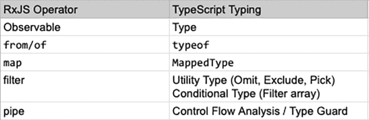
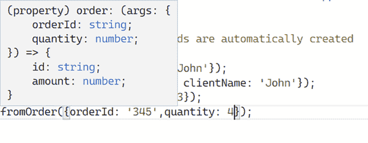
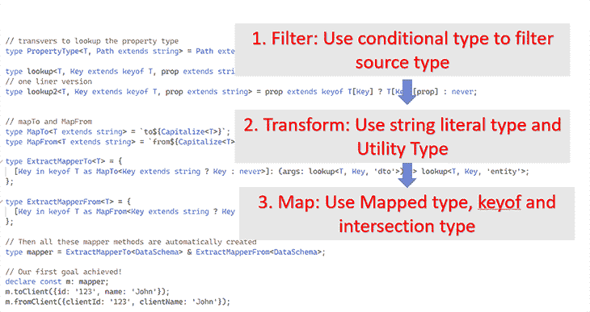

# 类型流动:重新思考 TypeScript 类型系统

> 原文：<https://blog.logrocket.com/type-flowing-rethinking-typescript-typing-system/>

## 介绍

TypeScript 提供了一个非常丰富的工具箱。它包括映射类型、基于控制流分析的条件类型、类型推断等等。

对于许多刚接触 TypeScript 的 JavaScript 开发人员来说，从松散类型转换到静态类型并不是一件容易的事情。即使对于多年从事 TypeScript 工作的开发人员来说，随着类型系统的不断发展，这也是令人困惑的。

关于高级类型的一个常见误解是，它应该主要用于构建类型库，而不是日常打字工作所必需的。

事实是，TypeScript 高级类型对于日常的 TypeScript 工作非常有用。它们是在您的代码中构建强类型系统、清晰表达您的意图并使您的代码更加安全的一个很好的工具。

引入类型流概念的目的是以类似于我们思考反应式编程数据流的方式来思考类型系统。

通过从新的角度来看待类型系统，它将帮助我们“用类型来思考”并以系统的方式利用 TypeScript 工具箱中更高级的工具。

### 类型可以流动

在反应式编程中，数据在反应式组件之间流动。在 TypeScript 类型系统中，类型也可以流动。

我第一次遇到“类型流动”这个概念是在 [Basarat Ali Syed 的打字本书](https://github.com/basarat/typescript-book/blob/master/docs/types/type-inference.md)里。他这样解释这个观点:

> 字体的流动就是我在大脑中想象的字体信息的流动。

受此启发，我想将类型流动的概念扩展到类型系统层面。我对流动型的定义是:

> 类型流动是指从源类型映射和转换一个或多个子类型。这些类型通过类型操作形成了一个强约束的类型系统。

类型流动的基本形式可以通过类型别名来完成。

类型别名允许您为现有类型创建新的类型名称。在下面的例子中，类型别名`TargetType`被指定为对`SourceType`的引用，因此类型被转移。

```
type SourceType = { id: string, quantity: number };
type TargetType= SourceType; // { id: string, quantity: number };
```

由于类型推理的强大功能，类型可以以几种不同的方式流动。其中包括:

*   通过数据分配
*   用`return type`函数，由`return`语句推断；例如，下面的函数被推断为返回一个`number`类型
*   与函数参数的模式匹配:如下例所示，用“`DecreaseType`类型注释`decrease`函数会将`a,b`值转换为`number`类型

以下代码片段说明了上述情况。

```
const quantity: number = 4;
const stockQuantity = quantity;
type StockType= typeof stockQuantity; // number

// function return type
function increase(a: number) {
    return a + 1;
}
const result = increase(2); // number

// function parameters matching
type DecreaseType = (start: number, offset: number) => number;
const decrease: DecreaseType = (a,b) => { // a: number, b: number
    return a- b;
}
```

## 反应式编程数据流与类型流

反应式编程的核心是数据源和反应式组件之间的数据流动。它的一些概念与 TypeScript 类型系统非常相似，正如您在下面的图表中所看到的。



您可以看到 RxJS 运算符概念和 TypeScript 类型之间的比较。在分型系统中，类型可以被转换、过滤并映射到一个或多个子类型。

这些亚型也是“反应性”的。当源类型发生变化时，子类型将自动更新。

一个设计良好的类型系统将为应用程序中的数据和函数添加强类型约束，因此对源类型定义所做的任何重大更改都会立即显示编译时错误。

虽然 RxJS 和 TypeScript 类型之间有一些相似之处，但两者之间仍有许多不同之处。例如，RxJS 中的数据流发生在运行时，而 TypeScript 中的类型流发生在编译时。

这里引用 RxJS 的目的是为了说明 RxJS 中的流概念，这将有望帮助我们建立对“用类型思考”的共同理解

## 类型流动中的类型操作

### 映射和过滤

反应式编程中最常用的两个运算符是`map`和`filter`。我们应该如何在 TypeScript 中对类型执行这两种操作？

* * *

### 更多来自 LogRocket 的精彩文章:

* * *

[映射类型](https://www.typescriptlang.org/docs/handbook/2/mapped-types.html)相当于 RxJS 中的[映射操作符。它允许我们使用第一个类型的索引签名和泛型类型来创建基于另一个类型的类型。](https://rxjs.dev/api/operators/map)

当您将条件类型与类型推断相结合时，您可以通过映射类型实现的类型转换是超乎想象的。我们将在本文后面讨论如何使用映射类型。

类型流中数组的等效形式是联合类型。为了对联合类型应用过滤器，我们需要使用条件类型和`never`类型。由于`filter`是如此普遍的需求，TypeScript 提供了开箱即用的`exclude`和`extract`实用程序类型。

以下代码使用条件类型从`T`中移除不可分配给`U`的类型。`never`类型在这里用于类型缩小，或者过滤掉联合类型的选项。

```
type Exclude<T, U> = T extends U ? never : T;
type T1 = Exclude<"a" | "b" | "c" , "a" >; // "b" | "c"
type Extract<T, U> = T extends U ? T: never;
type T2 = Extract<"a" | "b" | "c" , "a" >; // "a"
```

我们还可以使用现成的 TypeScript 实用程序类型来过滤类型属性。

```
type Omit<T, K extends string | number | symbol> = {[P in Exclude<keyof T, K>]: T[P]; }
type T1 = Omit<{ a: string, b: string }, "a"> //  { b: string; }
```

## 用控制流分析来管理流

使用类型保护的[控制流分析，我们可以像管道操作符在 RxJS 中做的那样用管道传输流。](https://www.typescriptlang.org/docs/handbook/2/narrowing.html#control-flow-analysis)

下面是一个使用类型保护执行类型检查的示例，它将类型缩小到一个更具体的类型，并控制逻辑流。

```
function doSomething(x: A | B) {
 if (x instanceof A) {
   // x is A
 } else {
   // x is B
 }
}
```

在上面的示例中，TypeScript 编译器分析了表达式的所有可能的控制流。它查看`x instance of A`以确定`x`的类型为`if`块中的`A`，并将类型缩小到`else`块中的`B`。

如果我们认为这是逻辑分支，它可以以连接的方式使用，类似于水流过管道，可以重定向到不同的连接管道到达目的地。

## 使用类型流动构建强约束

理论已经过时了，让我们把这个想法付诸实践吧。下面，我们将看看如何通过映射、过滤和转换类型来实现约束良好的类型系统，从而将类型流动概念付诸实践。

### 定义映射器方法

我们正在使用 mapper 模式构建 Node.js 应用程序。要实现该模式，我们必须首先定义一些映射器方法，这些方法获取数据实体对象并将它们映射到数据传输对象(DTO)。

另一方面，有另一组方法可以将 dto 转换成相应的实体对象。

```
export class myMapper {
   toClient(args: ClientEntity) : ClientDto { ...};
   fromClient(args: ClientDto) : ClientEntity{ ...};
   toOrder(args: OrderEntity) : OrderDto { ...};
   fromOrder(args: OrderDto) : OrderEntity{ ...};
}
```

我们将使用一个简化的、人为的示例来演示我们的强类型系统的以下两个目标:

1.  使用数据架构中的所有方法和接口为映射器创建一个类型
2.  为了类型安全，创建一个联合类型来表示实体名称

### 定义数据实体和 DTO 类型

首先，我们需要定义实体和 d to 的类型。

```
type DataSchema = {
  client: {
      dto:  { id: string, name: string},
      entity: {clientId: string, clientName: string}
  },
  order:  {
      dto:  { id: string, amount: number},
      entity: {orderId: string, quantity: number}
  },
}
```

既然我们已经定义了原始数据类型，我们如何从中提取每个实体和 DTO 类型呢？

我们将使用条件类型和`never`来过滤出所需的数据类型定义。

```
type PropertyType<T, Path extends string> = Path extends keyof T ? T[Path] : never;

type lookup<T, Key extends keyof T, prop extends string> = PropertyType<T[Key], prop>;
```

我们可以通过将它们合并成一个单一的`lookup`类型来简化上述内容。

```
type lookup<T, Key extends keyof T, prop extends string> = prop
extends keyof T[Key] ? T[Key][prop] : never;
```

### 支持嵌套属性

以上`lookup`类型只对单级属性有效。当源类型更有深度时会发生什么？

为了更深入地访问属性类型，我们将创建一个带有递归类型别名的新类型。

```
type PropertyType<T, Path extends string> =
    Path extends keyof T ? T[Path] :
        Path extends `${infer K}.${infer R}` ? K extends keyof T ? PropertyType<T[K], R> : 
        never :
    never;

type lookup<T, Key, prop extends string> = Key extends keyof T? PropertyType<T[Key], prop>: never;
```

当`Path extends keyof T`为 the 时，表示完整路径匹配。因此，我们返回当前的属性类型。

当`Path extends keyof T`为 falsy 时，我们使用`infer`关键字构建一个模式来匹配`Path`。如果匹配，我们递归调用下一级属性。否则，它将返回一个`never` ，这意味着`Path`与类型不匹配。

如果不匹配，则以当前属性作为第一个参数继续递归。

### 定义映射器类型和方法

现在，是时候创建映射器方法了。这里，我们使用[字符串文字类型](https://www.typescriptlang.org/docs/handbook/literal-types.html)在大写实用程序类型的帮助下形成`MapTo`和`MapFrom`。

```
// MapTo and MapFrom
type MapTo<T extends string> = `to${Capitalize<T>}`;
type MapFrom<T extends string> = `from${Capitalize<T>}`;
```

### 把所有的放在一起

当我们把前面的零件组装起来，我们的第一个目标就达到了！

我们利用了[键重映射](https://devblogs.microsoft.com/typescript/announcing-typescript-4-1/#key-remapping-mapped-types)特性(即下面代码块中的`as`子句)，该特性自 TypeScript 4.1 发布以来才可用。

还请注意，`Key extends string ? Key : never`是必需的，因为对象键的类型可以在字符串、数字和符号之间变化。我们只对这里的字符串感兴趣。

```
type ExtractMapperTo<T> = {
  [Key in keyof T as MapTo<Key extends string ? Key : never>]: (args: lookup<T, Key, 'dto'>) => lookup<T, Key, 'entity'>;
};

type ExtractMapperFrom<T> = {
  [Key in keyof T as MapFrom<Key extends string ? Key : never>]:(args: lookup<T, Key, 'entity'>) => lookup<T, Key, 'dto'>;
};

// Then all these mapper methods are automatically created 
type mapper = ExtractMapperTo<DataSchema> & ExtractMapperFrom<DataSchema>;
```

我们可以在下面看到，所有的映射器方法接口都是自动创建的。

```
// Our first goal achieved!
declare const m: mapper;
m.toClient({id: '123', name: 'John'});
m.fromClient({clientId: '123', clientName: 'John'});
m.toOrder({id: '123', amount: 3});
m.fromOrder({orderId: '345',quantity: 4});
```

我们也有很好的 IDE 智能感知支持。



## 将对象类型转换为联合类型

我们的下一个目标是创建一个联合类型来表示来自源`DataSchema`类型的数据类型名称。

解决方案的关键是`PropToUnion<T>`类型。

```
// Derive the data type names into a union type
type PropToUnion<T> = {[k in keyof T]: k}[keyof T];

type DataTypes = PropToUnion<DataSchema>; // 'client' | 'order'
```

首先，`{[k in keyof T]: k}`使用`keyof`提取`T`的键作为键和值。输出是:

```
{
   client: "client";
   order: "order";
}
```

然后，我们使用索引签名`[keyof T]`来提取作为联合类型的值。

生成的联合类型可以帮助我们加强类型安全。假设我们将下面的函数放在了另一个远离源类型的模块中。在`getProcessName`函数中，`switch`语句触发类型保护，默认情况下返回`never` ,告诉编译器永远不要到达它。

```
// Second goal achieved
function getProcessName(c: DataTypes): string {
    switch(c) {
        case 'client':
            return 'register' + c;
        case 'order':
            return 'process' + c;
        default:
        return assertUnreachable(c);
    }   
}
function assertUnreachable(x: never): never {
    throw new Error("something is very wrong");
}
```

这就是联合类型和`never`帮助加强类型安全的方式。

现在，让我们假设数据模式发生了变化——我们添加了一个名为`account`的新数据类型。在大型团队中，添加新类型的开发人员可能没有意识到变更的影响。如果不键入约束，可能会导致难以发现的隐藏运行时错误。

如果我们使用类型流动来构建类型约束，下游的子类型将自动更新，如下所示。

```
type DataTypes = "client" | "order" | "Account"
```

TypeScript 编译器还会在`getProcessName`函数中显示一个错误，提示我们发生了重大变化。


我们的第二个目标实现了！我们有一个 union 类型，它现在表示实体名称，并有助于类型安全。

概括地说，这个图表显示了我们为实现类型流动的第一个目标所采取的主要步骤。



总的来说，我们基于原始的源类型创建了几个新的类型。对源类型的任何更改都会自动触发对所有下游类型的更新，如果更改破坏了依赖于它的函数，我们会得到一个即时错误提示。

完整的示例代码可以在下面的要点中找到。

摘要

## 本文参考 RxJS 中的反应式编程来讨论 TypeScript 类型流概念。我们通过构建一个约束良好的类型系统，将类型流概念应用到一个实际的例子中，以最大化类型安全的好处。

我希望这个讨论有助于改变 TypeScript 的高级类型只用于开发类型库或复杂的框架级编程的想法。我也希望它能帮助你在日常打字工作中更有创造性地应用打字系统。

打字愉快！

[LogRocket](https://lp.logrocket.com/blg/typescript-signup) :全面了解您的网络和移动应用

## LogRocket 是一个前端应用程序监控解决方案，可以让您回放问题，就像问题发生在您自己的浏览器中一样。LogRocket 不需要猜测错误发生的原因，也不需要向用户询问截图和日志转储，而是让您重放会话以快速了解哪里出错了。它可以与任何应用程序完美配合，不管是什么框架，并且有插件可以记录来自 Redux、Vuex 和@ngrx/store 的额外上下文。

[](https://lp.logrocket.com/blg/typescript-signup)

除了记录 Redux 操作和状态，LogRocket 还记录控制台日志、JavaScript 错误、堆栈跟踪、带有头+正文的网络请求/响应、浏览器元数据和自定义日志。它还使用 DOM 来记录页面上的 HTML 和 CSS，甚至为最复杂的单页面和移动应用程序重新创建像素级完美视频。

.

[Try it for free](https://lp.logrocket.com/blg/typescript-signup)

.