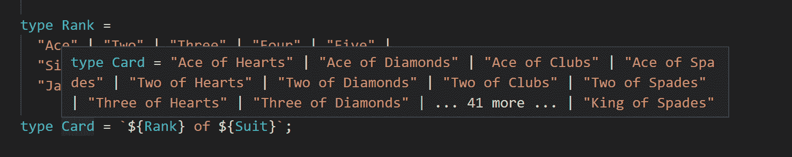

# TypeScript 4.1:新特性和改进- LogRocket 博客

> 原文：<https://blog.logrocket.com/typescript-4-1-new-features-and-improvements/>

TypeScript 4.1 在 11 月下旬成为该语言的最新稳定版本。这个新版本的语言建立在 4.0 版本中的特性[之上，改进包括新的检查标志、生产力跟踪和错误修复，以帮助开发人员以更精确的方式表达类型。](https://blog.logrocket.com/whats-new-in-typescript-4-0/)

在本文中，我们将看看这个版本中包含的一些特性将如何影响我们今后编写代码的方式。

## 如何升级到 TypeScript 4.1

您可以通过 npm 安装或升级到最新版本的 TypeScript:

```
$ npm install -D typescript

```

如果你想跳过安装，可以通过 [TypeScript Playground](https://www.typescriptlang.org/play?ts=4.1.2#code/Q) 尝试一下 TypeScript 中的新功能。TypeScript Playground 支持最新版本，因此您可以在不离开 web 浏览器的情况下测试本文中包含的任何代码。

让我们继续研究 TypeScript 4.1 中提供的一些最有趣的特性:

## 模板文字类型

TypeScript 有两种方式来表示语言中的字符串:一种是覆盖所有字符串的`string`类型，另一种是只匹配特定字符串的字符串[文字类型](https://www.typescriptlang.org/docs/handbook/literal-types.html)。您可以将联合类型与字符串文字类型结合使用，以便在允许的字符串输入方面更加精确。看一看以下内容:

```
let a: string = 'Hello'
a = 'World' // works

let b: 'Hello' = 'Hello'
b = 'World' // Type '"World"' is not assignable to type '"Hello"'.

declare function selectOperatingSystem(os: 'windows' | 'linux' | 'macos'): void

selectOperatingSystem('windows'); // works
selectOperatingSystem('linux'); // works
selectOperatingSystem('android');
// Argument of type '"android"' is not assignable to parameter of type '"windows" | "linux" | "macos"'.

```

有了 TypeScript 4.1，现在可以在模板文本字符串类型的帮助下在类型中使用连接字符串。它使用与 JavaScript 中的[模板文字](https://developer.mozilla.org/en-US/docs/Web/JavaScript/Reference/Template_literals)相同的语法，但是在类型位置。模板文本字符串类型通过连接模板字符串的内容来生成新的字符串文本类型:

```
type Name = 'John';
type Greeting = `Hello ${Name}`;
// Equal to: type Greeting = 'Hello John'

```

当您在替换位置使用联合类型时，模板文字类型的威力变得显而易见。生成的类型将是字符串文字的所有可能组合的并集:

```
type Names = 'John' | 'Jake' | 'Sarah';
type Greeting = `Hello ${Name}`;
// Equal to: type Greeting = 'Hello John' | 'Hello Jake' | 'Hello Sarah'

```

您还可以在模板文本中有多个联合类型，这将在结果类型中产生具有每种可能类型组合的联合:

```
type Suit =
  "Hearts" | "Diamonds" |
  "Clubs" | "Spades";

type Rank =
  "Ace" | "Two" | "Three" | "Four" | "Five" |
  "Six" | "Seven" | "Eight" | "Nine" | "Ten" |
  "Jack" | "Queen" | "King";

type Card = `${Rank} of ${Suit}`;

declare function printCard(c: Card): void

printCard('Ace of Spades'); // works
printCard('Ace of Diamond'); // error

```

当您将鼠标悬停在编辑器中的`type`上时，这一点变得很明显:



typescript 4.1 template literal types

这个特性支持的一个很棒的用例是能够解析 Node.js web 框架中的路由参数，比如 [Express](https://expressjs.com/) ，其中通常使用占位符来表示路由的动态部分(比如`ID`)。

```
app.get("/users/:userId", (req, res) => {
    const { userId } = req.params;
    res.send(`User ID: ${userId}`);
});

```

`req.params`对象是一个具有以下签名的`ParamsDictonary`:

```
interface ParamsDictionary {
    [key: string]: string;
}

```

TypeScript 只知道对象将具有带字符串值的字符串键。如果你试图访问一个没有在 route path 中指定的参数，那么编译器无论如何都会允许，因为它不知道只有`userId`可以存在。

通过从替换位置进行推断，我们可以使用模板文字类型为`req.params`对象提供更准确的类型:

```
type ExtractRouteParams<T extends string> =
  string extends T
  ? Record<string, string>
  : T extends `${infer Start}:${infer Param}/${infer Rest}`
  ? {[k in Param | keyof ExtractRouteParams<Rest>]: string}
  : T extends `${infer Start}:${infer Param}`
  ? {[k in Param]: string}
  : {};

type params = ExtractRouteParams<'/users/:userId/posts/postId'>;
// Same as: type params = { userId: string; postId: string; }

```

让我们把它分解一下:

*   如果`T`是`string`或`any`，则第一种情况匹配。在这种情况下，不能从参数中推断出任何东西。
*   第二种情况匹配路径开头的参数，并使用字符串的较短部分递归调用自身。
*   第三种情况匹配路径末端的参数。
*   在第四种情况下，返回一个空对象。

这种模式使得从`/users/:userId`中提取有效类型的`{userId: string}`变得容易，如示例所示。在这个 [GitHub 库](https://github.com/ghoullier/awesome-template-literal-types)中可以找到一系列其他(有时甚至超出顶部)用例。

## 检查索引访问

索引签名是向 TypeScript 编译器指定可以访问未在类型上显式定义的对象属性的一种方式。

```
type Person = {
  name: string;
  email: string;

  // index signature
  [key: string]: string;
}

function logPerson(p: Person): void {
  console.log(p.name) // string
  console.log(p.email) // string
  console.log(p.nationality.toLowerCase()) // OK, nationality is a string
}

const person: Person = {
  name: "Jack",
  email: "[email protected]",
};

logPerson(person);

```

除了明确列出的属性外，在`Person`下访问的任何属性都将具有类型`string`。这个特性的问题是，任何解析为索引签名的属性访问都可能是`undefined`，但是这并没有反映在类型中。例如，在上面的块中，`p.nationality`可能是未定义的，但是类型信息是`string`。

TypeScript 4.1 通过引入`noUncheckedIndexAccess`标志提供了一种修复这种不良行为的方法。启用时，解析为索引签名的任何属性或索引访问现在将解析为指定类型和`undefined`的并集。看看下面的例子:

```
function logPerson(p: Person): void {
  console.log(p.name) // string
  console.log(p.email) // string
  console.log(p.nationality.toLowerCase()) // Error when noUncheckedIndexedAccess is enabled
  //          ~~~~~~~~~~~~~ Object is possibly 'undefined'.
}

```

要修复这个错误，现在可以使用类型保护来缩小非空断言操作符(`!`)的类型:

```
if (p.nationality) {
  console.log(p.nationality.toLowerCase())
}

console.log(p.nationality!.toLowerCase())

```

启用`noUncheckedIndexedAccess`标志的另一个效果是，对数组进行索引也会产生数组元素类型和`undefined`的并集，即使索引已经过边界检查。

```
let arr = [1, 2, 3, 4];
for (let i = 0; i < arr.length; i++) {
    const n: number = arr[i]; // Error
    // Type 'number | undefined' is not assignable to type 'number'.
    console.log(n);
}

```

即使使用数组方法，如`forEach()`，也会出现同样的错误:

```
let arr = [1, 2, 3, 4];
arr.forEach((e, i) => {
  const n: number = arr[i]; // Error
  // Type 'number | undefined' is not assignable to type 'number'.
  console.log(n);
});

```

当然，您可以在上面的示例中直接使用元素，而不用通过它的索引来访问它，但是这个用例说明了在您的代码库中启用这个标志的效果。如果在不检查元素是否存在的情况下对数组执行索引访问，您可能会得到很多错误，但是，和以前一样，您可以使用类型保护或非空运算符来修复错误。

**注意**:这种行为不是作为`strict`级别选项的一部分启用的，所以您需要在您的配置文件中通过将`noUncheckedIndexedAccess`选项设置为`compilerOptions`下的`true`来显式启用它。

## 映射类型中的键重新映射

映射类型是 TypeScript 中一个非常有价值的工具。它们是从其他类型派生类型的有用工具，可以限制重复，同时确保类型保持同步。

下面是一个示例，它基于另一个对象类型创建一个新的对象类型，从而使新类型的所有属性都可以为空:

```
type Person = {
  name: string;
  age: number;
}

// `Nullable<T>` is the same as T but each property is nullable
type Nullable<T> = {
  [K in keyof T]: T[K] | null;
};

type NullablePerson = Nullable<Person>
// same as
//   type NullablePerson = {
//     name: string | null;
//     age: number | null;
//   };

```

在 TypeScript 4.1 中，现在可以用新的`as`子句重新映射对象键。这通过允许从现有的属性名创建新的属性名提供了灵活性。请注意在下面的示例中如何使用模板文字类型来促进对象键的重新映射:

```
type Company = {
  name: string;
  employees: number;
  ceo: string;
}

type Getters<T> = {
  [K in keyof T as `get${Capitalize<string & K>}`]: () => T[K];
};

type ComapanyAccessors = Getters<Company>
// same as
//   type ComapanyAccessors = {
//     getName: () => string;
//     getEmployees: () => number;
//     getCeo: () => string
//   };

```

如您所见，键已经通过`Capitalize`助手被大写。类似的帮手有:`Uncapitalize<T>`、`Uppercase<T>`、`Lowercase<T>`。

## 递归条件类型

当条件类型在 2.8 版本中首次引入时，它们被限制为非递归的，以防止当时不太支持的无限递归。随着 TypeScript 4.1 的发布，现在可以表达直接在其分支内引用自身的条件类型。看看下面的例子，看看`Awaited`如何深入地解开承诺:

```
type Awaited<T> =
    T extends PromiseLike<infer U> ? Awaited<U> :
    T;

type P1 = Awaited<Promise<string>>;  // string
type P2 = Awaited<Promise<Promise<string>>>;  // string
type P3 = Awaited<Promise<string | Promise<Promise<number> | undefined>>>;  // string | number | undefined

```

请注意，TypeScript 编译器需要更多时间来对递归类型进行类型检查。如果达到内部递归深度限制，将会发生编译时错误。尽管这些递归类型很强大，但微软警告说，应该负责任地谨慎使用它们，以避免在复杂输入中使用它们时出现故障。

## JSX 工厂对此有何反应

对 React 17 即将推出的`jsx`和`jsxs`工厂函数的支持已经通过`jsx`编译器标志的`react-jsx`和`react-jsxdev`选项包含在这个版本中。`react-jsx`扩展用于生产构建，而后者`react-jsxdev`用于开发。

```
{
  "compilerOptions": {
      "module": "esnext",
      "target": "es2015",
      "strict": true,
      "jsx": "react-jsx"
  },
  "include": [ "./**/*" ]
}

```

TypeScript 的打字和语法可能很难跟上，尤其是在与 React 一起使用时。点击了解更多[。](https://blog.logrocket.com/your-reference-guide-to-using-typescript-in-react/)

## 值得注意的提及

设置`checkJs`编译器选项还会启用 TypeScript 4.1 中的`allowJs`。以前，这两个选项都必须显式设置，这似乎是多余的。

另一个值得注意的改进是 Promise 构造函数中的参数`resolve()`不再是可选的，除非`Promise<void>`被设置为泛型类型参数。

例如，当您编写如下代码时…

```
function resolveAfter2Seconds() {
  return new Promise(resolve => {
    setTimeout(() => {
      resolve();
    }, 2000);
  });
}

```

…您可能会得到如下错误:

```
Expected 1 arguments, but got 0.
Did you forget to include 'void' in your type argument to 'Promise'?

```

修复方法是根据错误提示添加`void`通用参数:

```
function resolveAfter2Seconds() {
  return new Promise<void>(resolve => {
    setTimeout(() => {
      resolve();
    }, 2000);
  });
}

```

## 结论

看到 TypeScript 朝着更好的开发人员体验和更简单、更直观的 API 不断发展，这是令人鼓舞的。本文只详细介绍了 4.1 版本中的主要特性和改进，而不是历史 TypeScript 特性。如果你对所有的变化都很好奇，一定要查看官方发布说明。

感谢您的阅读，祝您编码愉快！

## [LogRocket](https://lp.logrocket.com/blg/typescript-signup) :全面了解您的网络和移动应用

[](https://lp.logrocket.com/blg/typescript-signup)

LogRocket 是一个前端应用程序监控解决方案，可以让您回放问题，就像问题发生在您自己的浏览器中一样。LogRocket 不需要猜测错误发生的原因，也不需要向用户询问截图和日志转储，而是让您重放会话以快速了解哪里出错了。它可以与任何应用程序完美配合，不管是什么框架，并且有插件可以记录来自 Redux、Vuex 和@ngrx/store 的额外上下文。

除了记录 Redux 操作和状态，LogRocket 还记录控制台日志、JavaScript 错误、堆栈跟踪、带有头+正文的网络请求/响应、浏览器元数据和自定义日志。它还使用 DOM 来记录页面上的 HTML 和 CSS，甚至为最复杂的单页面和移动应用程序重新创建像素级完美视频。

[Try it for free](https://lp.logrocket.com/blg/typescript-signup)

.