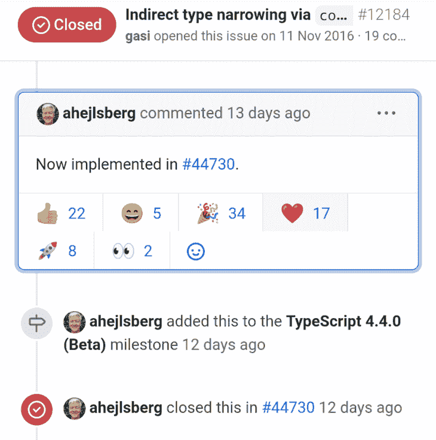
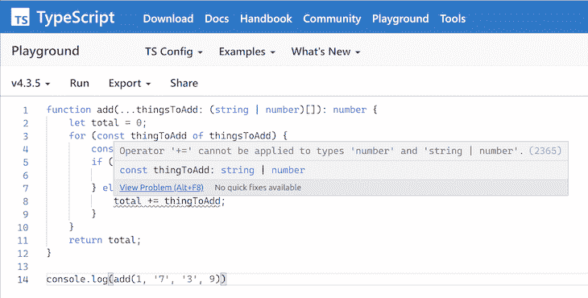
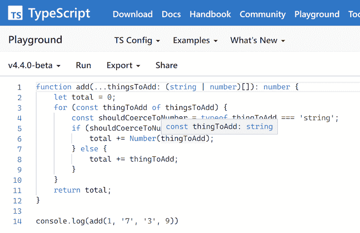

# 用 TypeScript 4.4 编写更可读的代码

> 原文：<https://blog.logrocket.com/typescript-4-4-and-more-readable-code/>

[John Reilly Follow](https://blog.logrocket.com/author/johnreilly/) MacGyver turned Dev 🌻❤️ TypeScript / ts-loader / fork-ts-checker-webpack-plugin / DefinitelyTyped: The Movie

# 用 TypeScript 4.4 编写可读性更好的代码

## 

2021 年 7 月 21 日 2 分钟阅读 672

TypeScript 4.4 附带了一个令人兴奋的特性。叫做[别名条件](https://devblogs.microsoft.com/typescript/announcing-typescript-4-4-beta/#cfa-aliased-conditions)的控制流分析，相当拗口。

在本帖中，我们将解开这个新特性，并展示它如何有助于提高代码的可读性。

## 通过`const`的间接类型缩小

2021 年 6 月 24 日，[安德斯·海尔斯伯格](https://www.twitter.com/ahejlsberg)关闭了 TypeScript GitHub 存储库上的一个问题，标题是“通过`const`的间接类型收缩”该问题自 2016 年以来一直未解决，因为它被一个解决别名条件表达式和判别式的控制流分析的[拉请求](https://github.com/microsoft/TypeScript/pull/44730)所覆盖，所以被关闭。

公平地说，TypeScript 社区对此非常兴奋，从对这个问题的两种反应来看:



更不用说推特上的普遍喜悦了:


泽赫的推特很好地总结了别名条件的控制流分析的重要性:

> 缺少使用常量的类型收缩使我重复代码，或者避免使用常量命名，这很有帮助

有了这个特性，我们可以用更少的重复来编写更可读的代码。太神奇了！

## 使用 TypeScript 4.4 编写更具表现力的代码

与其直接解释这种新的语言特性是什么，不如让我们从编写一些代码的位置开始，看看 TypeScript 4.4 有哪些我们以前无法解决的功能。

下面是一个简单的函数，它将接收到的所有参数相加并返回总数。这是一个宽容的函数，允许你以字符串的形式提供数字。所以它会像处理`2`一样成功地处理`'2'`。

当然，这是一个略显做作的例子，但这是展示新特性的好方法:

```
function add(...thingsToAdd: (string | number)[]): number {
    let total = 0;
    for (const thingToAdd of thingsToAdd) {
        if (typeof thingToAdd === 'string') {
            total += Number(thingToAdd);
        } else {
            total += thingToAdd;
        }
    }
    return total;
}

console.log(add(1, '7', '3', 9))

```

在 [TypeScript playground](https://www.typescriptlang.org/play?ts=4.3.5#code/GYVwdgxgLglg9mABAQwCaoBQDodQBYxgDmAzgCpwCC6AXIhiVAE6FGIA+iYIAtgEYBTJgEoA2gF1hdbvyGIA3gChEKxABsBURFDhRkaxAF5EABgDcy1cDhN6EBI20FiFaqkRxgT1uSrphCpaqqjBeGFAAngAOAp7eLn7uhsmIAOSMLMSpAUrBeao6egYA1MYAcryCTOHORK7+FvkqAL6IAmokAoFNeYX6iKXxdYmNTc1BiOPBTJogTEh9ahbjivZgJHAaWGpwRBhomACMADRpAOypp6kAzJeIAJzCwkA) 里试试吧。

这个功能虽然管用，但是表现力不是很强。`typeof thingToAdd === 'string'`有两个用途:

1.  它将类型从`string | number`缩小到`string`
2.  它对逻辑进行分支，使得`string`可以被强制转换成`number`并添加到总数中

你可以通过阅读代码来推断这一点。然而，如果我们重写它来捕捉意图呢？

让我们试着创建一个`shouldCoerceToNumber`常量来表达我们需要采取的行动:

```
function add(...thingsToAdd: (string | number)[]): number {
    let total = 0;
    for (const thingToAdd of thingsToAdd) {
        const shouldCoerceToNumber = typeof thingToAdd === 'string';
        if (shouldCoerceToNumber) {
            total += Number(thingToAdd);
        } else {
            total += thingToAdd;
        }
    }
    return total;
}

console.log(add(1, '7', '3', 9))

```

在 [TypeScript playground](https://www.typescriptlang.org/play?ts=4.3.5#code/GYVwdgxgLglg9mABAQwCaoBQDodQBYxgDmAzgCpwCC6AXIhiVAE6FGIA+iYIAtgEYBTJgEoA2gF1hdbvyGIA3gChEKxABsBURFDhRkaxAF5EABgDcy1cDhN6EBI20FiFaqkRxgT1uSrphCpaqqvZgjiR4cCBqqADCcEIQAhQAcryCtsZQAJ4ADgKe3i5+7oZliADkjCzEFRbBwTBeDJHRcQlMSanpQgFKDQPauvqIANTGabJMGPisrv71gwC+iAJqJAKBgw06egbjRUTzqIsDS0GI58FMmiBMSLv6FueKoSRwGlhqcEQYaJgARgANJUAOwVEEVADMEMQAE5hMIgA) 里试试吧。

这是有效的代码。然而，TypeScript 4.3 因一个错误而令人窒息:



出现的错误是:

```
Operator '+=' cannot be applied to types 'number' and 'string | number'.(2365)
```

这里发生了什么事？TypeScript 不记得`shouldCoerceToNumber`表示从`string | number`到`string`的`thingToAdd`的类型收缩。所以当我们编写依赖于它的代码时，`thingToAdd`的类型从`string | number`开始就保持不变。

这造成了可怕的后果。这意味着我们不能编写我们感兴趣的更具表达性的代码，这对我们代码库的维护者来说会更好。这就是 TypeScript 4.4 通过我们的新特性打开的锁。

让我们将操场改为使用 TypeScript 4.4:



在 [TypeScript playground](https://www.typescriptlang.org/play?ts=4.4.0-beta#code/GYVwdgxgLglg9mABAQwCaoBQDodQBYxgDmAzgCpwCC6AXIhiVAE6FGIA+iYIAtgEYBTJgEoA2gF1hdbvyGIA3gChEKxABsBURFDhRkaxAF5EABgDcy1cDhN6EBI20FiFaqkRxgT1uSrphCpaqqvZgjiR4cCBqqADCcEIQAhQAcryCtsZQAJ4ADgKe3i5+7oZliADkjCzEFRbBwTBeDJHRcQlMSanpQgFKDQPauvqIANTGabJMGPisrv71gwC+iAJqJAKBgw06egbjRUTzqIsDS0GI58FMmiBMSLv6FueKoSRwGlhqcEQYaJgARgANJUAOwVEEVADMEMQAE5hMIgA) 里试试吧。

令人高兴的是，现在我们已经切换到了 TypeScript 4.4，不再有错误了。如截图所示，`thingToAdd`变量被缩小为`string`。这是因为别名条件的控制流分析正在进行中。

我们现在正在编写更具表达性的代码，TypeScript 希望我们继续前进。

## 阅读更多

这个特性是对 TypeScript 语言的巨大补充。它应该对人们如何用 TypeScript 编写代码产生重大的、长期的、积极的影响。

要阅读更多内容，请查看优秀的 [TypeScript 4.4 beta 发行说明](https://devblogs.microsoft.com/typescript/announcing-typescript-4-4-beta/#cfa-aliased-conditions)。这个版本还附带了一些其他令人兴奋的特性。

非常感谢 TypeScript 团队再次改进了语言，并为人们能够编写可读的代码做出了真正的贡献。

## [LogRocket](https://lp.logrocket.com/blg/typescript-signup) :全面了解您的网络和移动应用

[](https://lp.logrocket.com/blg/typescript-signup)

LogRocket 是一个前端应用程序监控解决方案，可以让您回放问题，就像问题发生在您自己的浏览器中一样。LogRocket 不需要猜测错误发生的原因，也不需要向用户询问截图和日志转储，而是让您重放会话以快速了解哪里出错了。它可以与任何应用程序完美配合，不管是什么框架，并且有插件可以记录来自 Redux、Vuex 和@ngrx/store 的额外上下文。

除了记录 Redux 操作和状态，LogRocket 还记录控制台日志、JavaScript 错误、堆栈跟踪、带有头+正文的网络请求/响应、浏览器元数据和自定义日志。它还使用 DOM 来记录页面上的 HTML 和 CSS，甚至为最复杂的单页面和移动应用程序重新创建像素级完美视频。

[Try it for free](https://lp.logrocket.com/blg/typescript-signup)

.