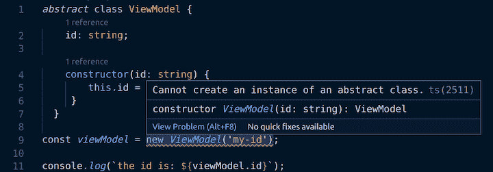
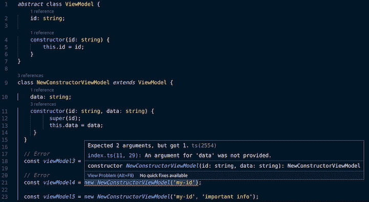
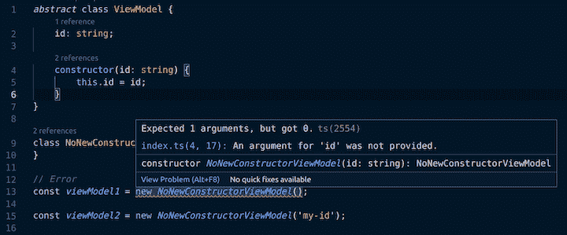

# 类型脚本、抽象类和构造函数

> 原文：<https://blog.logrocket.com/typescript-abstract-classes-and-constructors/>

TypeScript 能够将类定义为抽象类。这意味着它们不能被直接实例化；只有非抽象子类可以。让我们看看这对于构造函数的使用意味着什么。

## 制作便签簿

为了深入了解这一点，让我们创建一个 scratchpad 项目来使用。我们将创建一个 Node.js 项目并安装 [TypeScript](https://blog.logrocket.com/whats-new-in-typescript-4-2/) 作为依赖项。

```
mkdir ts-abstract-constructors
cd ts-abstract-constructors
npm init --yes
npm install typescript @types/node --save-dev

```

我们现在已经建立了一个`package.json`文件。我们还需要初始化一个 TypeScript 项目:

```
npx tsc --init

```

这将给我们一个`tsconfig.json`文件，它将驱动 TypeScript 的配置。默认情况下，TypeScript 会将文件转换为比类更早的 JavaScript 的旧版本。因此，我们将更新配置，以针对包含它们的新版本语言:

```
    "target": "es2020",
    "lib": ["es2020"],

```

让我们创建一个名为`index.ts`的类型脚本文件。名字不重要；我们只需要一个文件。

最后，我们将向我们的`package.json`添加一个脚本，它将我们的类型脚本编译成 JavaScript，然后用 node:

```
"start": "tsc --project \".\" && node index.js"

```

## 在 TypeScript 中创建抽象类

现在我们准备好了。让我们添加一个带有构造函数的抽象类到我们的`index.ts`文件中:

```
abstract class ViewModel {
  id: string;

  constructor(id: string) {
    this.id = id;
  }
}

```

考虑上面的`ViewModel`类。假设我们正在构建某种 CRUD 应用程序；我们会有不同的看法。每个视图都有一个对应的`viewmodel`，它是`ViewModel`抽象类的子类。

`ViewModel`类在构造函数中有一个强制的`id`参数。这是为了确保每个视图模型都有一个`id`值。如果这是一个真实的应用程序，`id`可能是在某种数据库中查找实体时使用的值。

重要的是，`ViewModel`的所有子类应该:

*   根本不实现构造函数，让基类构造函数成为子类的默认构造函数
*   实现自己的构造函数，调用`ViewModel`基类构造函数

## 带着我们的抽象类兜一圈

现在让我们看看我们可以用抽象类做些什么。

首先，我们能实例化我们的抽象类吗？我们不应该这样做:

```
const viewModel = new ViewModel('my-id');

console.log(`the id is: ${viewModel.id}`);

```

果不其然，运行`npm start`会导致下面的错误(我们的编辑器 VS Code 也在报告这个错误)。

```
index.ts:9:19 - error TS2511: Cannot create an instance of an abstract class.

const viewModel = new ViewModel('my-id');

```



太棒了。然而，值得记住的是`abstract`是一个类型化的概念。当我们编译 TS 时，尽管它抛出了一个编译错误，但它仍然传输了一个类似于下面的`index.js`文件:

```
"use strict";
class ViewModel {
    constructor(id) {
        this.id = id;
    }
}
const viewModel = new ViewModel('my-id');
console.log(`the id is: ${viewModel.id}`);

```

我们可以看到，这里没有提到`abstract`；只是很直白的`class`。事实上，如果我们用`node index.js`直接执行该文件，我们可以看到如下输出:

```
the id is: my-id

```

因此，即使源代码不是有效的类型脚本，转换后的代码也是有效的 JavaScript。这都提醒我们`abstract`是一个类型脚本结构。

## 没有新构造函数的子类化

现在让我们创建第一个子类`ViewModel`，并尝试实例化它:

```
class NoNewConstructorViewModel extends ViewModel {
}

// error TS2554: Expected 1 arguments, but got 0.
const viewModel1 = new NoNewConstructorViewModel();

const viewModel2 = new NoNewConstructorViewModel('my-id');

```





正如 TypeScript 编译器告诉我们的那样，第二种实例化是合法的，因为它依赖于基类的构造函数。第一个不是因为没有无参数构造函数。

## 用新的构造函数子类化

完成这些之后，让我们尝试子类化并实现一个新的构造函数，它有两个参数(以区别于我们正在重写的构造函数):

```
class NewConstructorViewModel extends ViewModel {
  data: string;
  constructor(id: string, data: string) {
        super(id);
        this.data = data;
   }
}

// error TS2554: Expected 2 arguments, but got 0.
const viewModel3 = new NewConstructorViewModel();

// error TS2554: Expected 2 arguments, but got 1.
const viewModel4 = new NewConstructorViewModel('my-id');

const viewModel5 = new NewConstructorViewModel('my-id', 'important info');

```


同样，尝试的实例化中只有一个是合法的。`viewModel3`不是因为没有无参数构造函数。不是因为我们用新的构造函数覆盖了基类构造函数，新的构造函数有两个参数。因此，`viewModel5`就是我们的“金发女孩”实例化——刚刚好！

同样值得注意的是，我们在`NewConstructorViewModel`构造函数中调用了`super`。这调用了`ViewModel`基类(或“超级”)的构造函数。TypeScript 强制我们传递适当的参数(在我们的例子中是一个`string`)。

## 结论

我们已经看到，当我们有一个抽象类时，TypeScript 确保了构造函数的正确使用。重要的是，抽象类的所有子类要么:

*   根本不实现构造函数，让基类构造函数(抽象构造函数)成为子类的默认构造函数
*   实现他们自己的构造函数，该构造函数使用正确的参数调用基类(或“超类”)构造函数

## [LogRocket](https://lp.logrocket.com/blg/typescript-signup) :全面了解您的网络和移动应用

[](https://lp.logrocket.com/blg/typescript-signup)

LogRocket 是一个前端应用程序监控解决方案，可以让您回放问题，就像问题发生在您自己的浏览器中一样。LogRocket 不需要猜测错误发生的原因，也不需要向用户询问截图和日志转储，而是让您重放会话以快速了解哪里出错了。它可以与任何应用程序完美配合，不管是什么框架，并且有插件可以记录来自 Redux、Vuex 和@ngrx/store 的额外上下文。

除了记录 Redux 操作和状态，LogRocket 还记录控制台日志、JavaScript 错误、堆栈跟踪、带有头+正文的网络请求/响应、浏览器元数据和自定义日志。它还使用 DOM 来记录页面上的 HTML 和 CSS，甚至为最复杂的单页面和移动应用程序重新创建像素级完美视频。

[Try it for free](https://lp.logrocket.com/blg/typescript-signup)

.