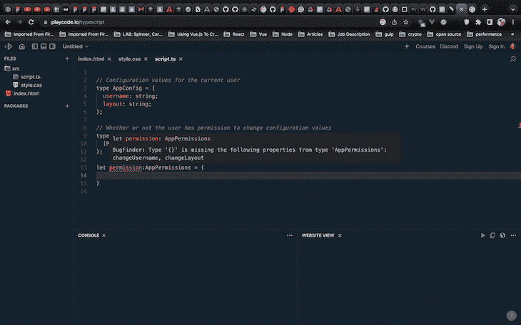
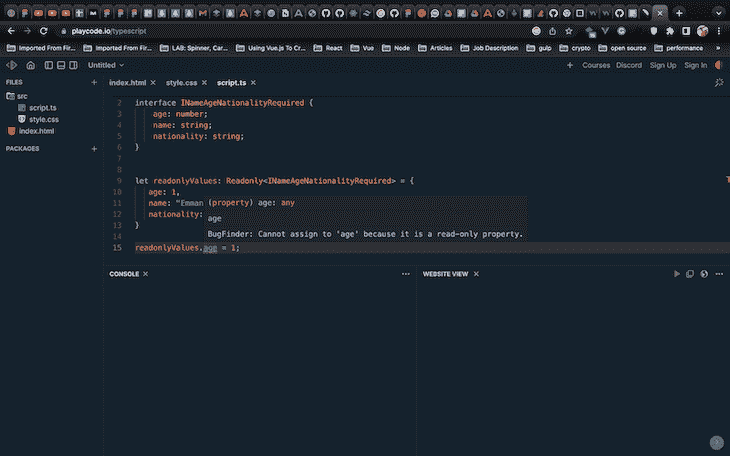
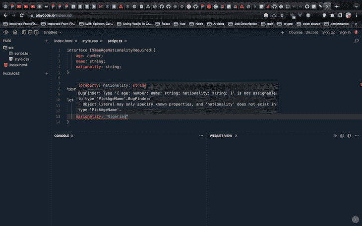

# 掌握 TypeScript 映射类型

> 原文：<https://blog.logrocket.com/typescript-mapped-types/>

***编者按**:本文最后一次更新是在 2022 年 11 月 8 日，添加了关于打字稿实用程序类型的信息，如`Partial<Type>`、`Pick<Type, Keys>`和`Readonly<Type>`。*

映射类型是一个方便的类型脚本特性，它允许作者保持他们的类型[(不要重复自己)](https://en.wikipedia.org/wiki/Don%27t_repeat_yourself)。然而，因为它们遵循编程和[元编程](https://en.wikipedia.org/wiki/Metaprogramming)之间的界限，映射类型一开始可能很难理解。

在本帖中，我们将讨论:

## 为什么在 TypeScript 中使用映射类型？

当需要从一个类型派生另一个类型(并与之保持同步)时，在程序中使用映射类型特别有用:

```
// Configuration values for the current user
type AppConfig = {
  username: string;
  layout: string;
};

// Whether or not the user has permission to change configuration values
type AppPermissions = {
  changeUsername: boolean;
  changeLayout: boolean;
};

```

这个例子是有问题的，因为在`AppConfig`和`AppPermissions`之间有一个隐含的关系。每当一个新的配置值被添加到`AppConfig`中，在`AppPermissions`中也必须有一个相应的`boolean`值。

让类型系统来管理这种关系比依赖未来程序编辑器的规则来同时对两种类型进行适当的更新要好。

我们稍后将深入研究映射类型语法的细节，但这里是使用映射类型而不是显式类型的同一示例的预览:

```
// Configuration values for the current user
type AppConfig = {
  username: string;
  layout: string;
};

// Whether or not the user has permission to change configuration values
type AppPermissions = {
  [Property in keyof AppConfig as `change${Capitalize<Property>}`]: boolean
};

let permission:AppPermissions = {

}

```

TypeScript 将引发以下错误:



如下将`changeUsername`和`changeLayout`添加到`permission`变量将解决该错误:

```
let permission:AppPermissions = {
  changeLayout: true,
  changeUsername: false
}

```

映射类型建立在这些概念和 TypeScript 功能的基础上。

## 映射类型的基本概念

### 什么是映射类型？

在计算机科学的上下文中，术语“映射”意味着将一个事物转换成另一个事物，或者更常见的是，指将相似的项目转换成不同的转换项目列表。这种思想最常见的应用可能是`Array.prototype.map()`，它用于日常的类型脚本和 JavaScript 编程:

```
[1, 2, 3].map(value => value.toString()); // Yields ["1", "2", "3"]

```

这里，我们将数组中的每个数字映射到它的字符串表示形式。因此，TypeScript 中的映射类型意味着我们通过对其每个属性应用转换，将一种类型转换为另一种类型。

### TypeScript 中的索引访问类型

TypeScript 作者可以通过按名称查找来访问属性的类型:

```
type AppConfig = {
  username: string;
  layout: string;
};

type Username = AppConfig["username"];

```

在这种情况下，`Username`的解析类型是`string`。有关索引访问类型的更多信息，请参见[官方文档](https://www.typescriptlang.org/docs/handbook/2/indexed-access-types.html)。

### TypeScript 中的索引签名

当类型属性的实际名称未知，但它们将引用的数据类型已知时，索引签名非常方便:

```
type User = {
  name: string;
  preferences: {
    [key: string]: string;
  }
};

const currentUser: User = {
  name: 'Foo Bar',
  preferences: {
    lang: 'en',
  },
};
const currentLang = currentUser.preferences.lang;

```

在这个例子中，TypeScript 编译器报告说`currentLang`的类型是`string`而不是`any`。该功能与下面详述的`keyof`操作符一起，是使映射类型成为可能的核心组件之一。有关索引签名的更多信息，请参见关于[对象类型](https://www.typescriptlang.org/docs/handbook/2/objects.html#index-signatures)的官方文档。

### 在 TypeScript 中使用联合类型

联合类型是两种或多种类型的组合。它向 TypeScript 编译器发出信号，表明基础值的类型可以是联合中包含的任何一种类型。这是一个有效的类型脚本程序:

```
type StringOrNumberUnion = string | number;

let value: StringOrNumberUnion = 'hello, world!';
value = 100;

```

下面是一个更复杂的示例，展示了编译器可以为联合类型提供的一些高级保护:

```
type Animal = {
  name: string;
  species: string;
};

type Person = {
  name: string;
  age: number;
};

type AnimalOrPerson = Animal | Person;

const value: AnimalOrPerson = loadFromSomewhereElse();

console.log(value.name); // No problem, both Animal and Person have the name property.
console.log(value.age); // Compilation error; value might not have the age property if it is an Animal.

if ('age' in value) {
  console.log(value.age); // No problem, TS knows that value has the age property, and therefore it must be a Person if we're inside this if block.
}

```

有关联合类型的更多信息，请参见关于[日常类型](https://www.typescriptlang.org/docs/handbook/2/everyday-types.html#union-types)的文档。

### 使用`keyof`类型运算符

[`keyof`](https://blog.logrocket.com/how-to-use-keyof-operator-typescript/) [类型操作符](https://blog.logrocket.com/how-to-use-keyof-operator-typescript/)返回传递给它的类型的键的并集。例如:

```
type AppConfig = {
  username: string;
  layout: string;
};

type AppConfigKey = keyof AppConfig;

```

`AppConfigKey`类型解析为`"username" | "layout"`。请注意，这也与索引签名协同工作:

```
type User = {
  name: string;
  preferences: {
    [key: string]: string;
  }
};

type UserPreferenceKey = keyof User["preferences"];

```

`UserPreferenceKey`类型解析为`string | number` ( `number`，因为通过数字访问 JavaScript 对象属性是有效的语法)。在这里阅读关于 [`keyof`](https://www.typescriptlang.org/docs/handbook/2/keyof-types.html) [型算子](https://www.typescriptlang.org/docs/handbook/2/keyof-types.html)。

### 在 TypeScript 中使用元组

尽管对实现映射类型没有严格的要求，但元组是典型的 TypeScript 程序中的常见构造。元组是一种特殊的数组类型，其中数组的元素可以是特定索引处的特定类型。它们允许 TypeScript 编译器在值数组周围提供更高的安全性，尤其是当这些值属于不同类型时。

例如，TypeScript 编译器能够为元组的各种元素提供类型安全:

```
type Currency = [number, string];

const amount: Currency = [100, 'USD'];

function add(values: number[]) {
   return values.reduce((a, b) => a + b);
}

add(amount);
// Error: Argument of type 'Currency' is not assignable to parameter of type 'number[]'.
// Type 'string' is not assignable to type 'number'.

```

在 [TypeScript playground](https://www.typescriptlang.org/play?#code/C4TwDgpgBAwgrgJwRAdgYxFAvFA2iuAWwCMIEAaKAZ2AQEsUBzAXQG4BYAKC7QHsUaUAIaFecFMABcsRMnSYcuAIwAGFZQDkAVQDKAEQ1suXAGbi0wOv2EATGwAoAbkIA2cCFWkESZXMwCUUADeXFBhUMjAiChQzm4eAHTINnBoEPb2QpTEgVgAfMJQANRQORycAL7GnEJ2maLiwP7lAPQtUACiSLwI0gCCCIxEqMBQvCZQoJBQGvBIqBgaUHRUUCi8o0JUVHSMKELELtDAvFBgQggiEMBkYxNT0BrepAh+GglcbVAAKuCPNPQmEsVmsNsJtrt9odjqcHjNnmR3lwgA) 中试试这段代码。

当访问元组定义类型之外的索引处的元素时，TypeScript 也能够提醒我们:

```
type LatLong = [number, number]; // Note that we're not using number[] here.

const loc: LatLong = [48.858370, 2.294481];

console.log(loc[2]);
// Error: Tuple type 'LatLong' of length '2' has no element at index '2'.

```

在 [TypeScript playground](https://www.typescriptlang.org/play?#code/C4TwDgpgBAMghsGB7AdgcygXigbRQVwFsAjCAJwBooCTyBdAbigHpmoA5JYaYACwSgB3CIEwCMtBRco+AM4BLdNSKkyOOlF7kIAOgCwAKAMBjVDOBQANkiMAuWAmSLsOACwAObW4CsbgMwB2AAYqACZtEIBOF3cARkYDY1MkCx0rNAAKKyMcELoASgYDVigAUTIyJDI7ABV8MBSoUEgoAHJ4RFQ0FqgkADNLCHQ+VpDu-hlqJCgIFMJB8wEFABMIAA8Rlr19IA) 中试试这段代码。

## 映射类型:一个真实的例子

既然我们已经介绍了构建 TypeScript 的映射类型特性的基础，那么让我们来看一个详细的实际例子。假设我们的程序跟踪电子设备及其制造商和价格。我们可以用这样的类型来代表每个设备:

```
type Device = {
  manufacturer: string;
  price: number;
};

```

现在，我们想确保有一种方法以人类可读的格式向用户显示这些设备，所以我们将为一个对象添加一个新的类型，该对象可以用适当的格式化函数来格式化`Device`的每个属性:

```
type DeviceFormatter = {
  [Key in keyof Device as `format${Capitalize<Key>}`]: (value: Device[Key]) => string;
};

```

让我们一点一点地把这段代码拆开。

`Key in keyof Device`使用`keyof`类型操作符生成`Device`中所有键的并集。将它放在索引签名中实质上是遍历`Device`的所有属性，并将它们映射到`DeviceFormatter`的属性。

`format${Capitalize<Key>}`是映射的转换部分，使用[键重映射](https://www.typescriptlang.org/docs/handbook/2/mapped-types.html#key-remapping-via-as)和[模板文字类型](https://www.typescriptlang.org/docs/handbook/2/template-literal-types.html)将属性名从`x`更改为`formatX`。

`(value: Device[Key]) => string;`是我们使用索引访问类型`Device[Key]`来表示格式函数的`value`参数是我们正在格式化的属性的类型。所以，`formatManufacturer`拿一个`string`(厂家)，而`formatPrice`拿一个`number`(价格)。

下面是`DeviceFormatter`类型的样子:

```
type DeviceFormatter = {
  formatManufacturer: (value: string) => string;
  formatPrice: (value: number) => string;
};

```

现在，假设我们将第三个属性`releaseYear`添加到我们的`Device`类型中:

```
type Device = {
  manufacturer: string;
  price: number;
  releaseYear: number;
}

```

由于映射类型的强大功能，`DeviceFormatter`类型会自动扩展成这样，而无需我们做任何额外的工作:

```
type DeviceFormatter = {
  formatManufacturer: (value: string) => string;
  formatPrice: (value: number) => string;
  formatReleaseYear: (value: number) => string;
};

```

任何`DeviceFormatter`的实现都必须添加新函数，否则编译将会失败。瞧啊。

### 具有泛型的可重用格式化程序类型

现在假设我们的程序不仅需要跟踪电子设备，还需要跟踪这些设备的附件:

```
type Accessory = {
  color: string;
  size: number;
};

```

同样，我们希望对象的类型能够为`Accessory`的所有属性提供字符串格式化功能。我们可以实现一个`AccessoryFormatter`类型，类似于我们实现`DeviceFormatter`的方式，但是我们最终会得到大部分重复的代码:

```
type AccessoryFormatter = {
  [Key in keyof Accessory as `format${Capitalize<Key>}`]: (value: Accessory[Key]) => string;
};

```

唯一的区别是我们用`Accessory`替换了对`Device`类型的引用。相反，我们可以创建一个泛型类型，将`Device`或`Accessory`作为类型参数，并生成所需的映射类型。传统上，`T`用来表示类型自变量。

```
type Formatter<T> = {
  [Key in keyof T as `format${Capitalize<Key & string>}`]: (value: T[Key]) => string;
}

```

注意，我们必须对我们的属性名转换做一点小小的改变。因为`T`可以是任何类型，我们不能确定`Key`是不是一个`string`(例如，数组有`number`属性)，所以我们取属性名和`string`的[交集](https://www.typescriptlang.org/docs/handbook/2/objects.html#intersection-types)来满足`Capitalize`施加的约束。

参见关于泛型的 [TypeScript 文档](https://www.typescriptlang.org/docs/handbook/2/generics.html)以获得关于它们如何工作的更多细节。

现在，我们可以替换我们定制的`DeviceFormatter`和`AccessoryFormatter`的实现，使用泛型类型:

```
type DeviceFormatter = Formatter<Device>;
type AccessoryFormatter = Formatter<Accessory>;

```

以下是完整的最终代码:

```
type Device = {
  manufacturer: string;
  price: number;
  releaseYear: number;
};

type Accessory = {
  color: string;
  size: number;
};

type Formatter<T> = {
  [Key in keyof T as `format${Capitalize<Key & string>}`]: (value: T[Key]) => string;
};

type DeviceFormatter = Formatter<Device>;
type AccessoryFormatter = Formatter<Accessory>;

const deviceFormatter: DeviceFormatter = {
  formatManufacturer: (manufacturer) => manufacturer,
  formatPrice: (price) => `$${price.toFixed(2)}`,
  formatReleaseYear: (year) => year.toString(),
};

const accessoryFormatter: AccessoryFormatter = {
  formatColor: (color) => color,
  formatSize: (size) => `${size} inches`,
};

```

在 [TypeScript playground](https://www.typescriptlang.org/play?ssl=29&ssc=1&pln=1&pc=1#code/C4TwDgpgBAIhBuBLAxtAvFA3gKClAtgIYB2ArgGaHLAQBOdAXFAM7C2LEDmA3LlGO1RMy+AEZ1eeegBsIhZhACac2sNJiJ2AL69soSFACCyVM2YB7WiCgYceZOemWmrdl0ktEALwhqNtXh1sPXBoADFLImAaWgAeABUAPhssPgBtAGkIaw4oAGts83IoeKh5KAADckjCYAASTABhQjBEYEJpbwhYrOsAMhY2Dk5ErQqAXSYACngO0l8SzOzxgEobZNdhwN19aDgkVAjaKJiUo5O6WP2UCETeXaMTCDNLEHPa04x36MvjUwsrHdgg5iKwoAATBA3b4xJjXQ41H60FJ2KDVY61ACyJAoVBijCgUyIZEo1FI9FoazQyWJuLJFIANHx0VEAAqCBZTAQ3KnJCp1Brc1AAOmA5jCiAAHhBwVMAEwrMZMvAs2oAJQgsnkShU0xAKl5UH1hFoovMAGUhlwpismUFsCCwVR-q8YQS-s8AW9EZ9UirEY1HM5CQ4nJT1lBQ5ZlWjEeautNmF1DfzMEmfFooBxkAALZ4VO28IA) 中试试这段代码。

## 使用自定义实用程序类型

映射类型不是我们可以在类型系统中构建的唯一有用的构造。使用相同的基本概念，我们还可以创建定制的实用程序类型，允许其他工程师派生出他们自己的类型并保持他们的程序干燥。

映射类型是如此的基础，以至于一些映射类型定义被采用作为标准的 TypeScript 实用程序类型——比如下面的`OptionalInterface`定义:

```
interface INameAgeNationalityRequired {
    age: number;                                                
    name: string; 
    nationality: string;
} 
type OptionalInterface<T> = {
    [K in keyof T]?: T[K];

}
let allOptional: OptionalInterface<INameAgeNationalityRequired> = {}

```

这使得 T 中的所有属性都是可选的，并被采用为名为`Partial``<T>`的标准类型:

```
type Partial<T> = {
    [P in keyof T]?: T[P];                                             
}; 

```

TypeScript 附带了许多现成的有用的实用工具类型。

### 部分

`[Partial<Type>](https://www.typescriptlang.org/docs/handbook/utility-types.html#partialtype)`返回一个与`Type`形状相同的类型，但是所有的键都是可选的。这种实用程序类型可能有用的一个例子是，当用户填写表单时，用户输入是可选的，并返回到一组默认值。`Partial<T>`类型将代表用户的输入，而原始类型将代表混合了默认值的用户输入。

### 只读

类似地，`[Readonly<Type>](https://www.typescriptlang.org/docs/handbook/utility-types.html#readonlytype:~:text=Try-,Readonly%3CType%3E,-Released%3A%0A2.1)`返回一个与 T 形状相同的类型，但是所有的键都是只读的:

```
type Readonly<T> = {
    readonly [P in keyof T]: T[P];                                              
};

```

我们可以如下使用`Readonly<T>`:

```
let readonlyValues: Readonly<INameAgeNationalityRequired> = {                                    
   age: 1,                                          
   name: “Emmanuel”,
   nationality: "Nigerian"
}

```

这里，我们使用了带有`INameAgeNationalityRequired`接口的`Readonly`映射类型来创建`readonlyValues`变量。因为`INameAgeNationalityRequired`接口需要姓名、年龄和国籍属性，所以我们为这些属性提供了值。

现在，如果我们尝试为这些属性(年龄和姓名)赋值，如下所示:

```
readonlyValues.age = 1;

```

TypeScript 将引发以下错误:

```
error TS2540: Cannot assign to 'age' because it is a read-only property.

```



除了标准的映射类型`Partial`和`Readonly`之外，还有另外两种有趣的映射类型:

### `Pick<Type, Keys>`

顾名思义， [`Pick`](https://www.typescriptlang.org/docs/handbook/utility-types.html#picktype-keys:~:text=Try-,Pick%3CType%2C%20Keys%3E,-Released%3A%0A2.1) 映射类型用于构造一种类型，该类型选取另一种类型的属性:

```
type PickAgeName = Pick<INameAgeNationalityRequired, "age" | "name">;

```

这里，我们使用`Pick`映射类型构造了一个新类型`PickAgeName`，并提供了两个泛型类型。第一个泛型类型是`INameAgeNationalityRequired`接口，第二个泛型类型是一个字符串文字，它匹配原始类型`INameAgeNationalityRequired`的键。从本质上讲，`Pick`映射类型将从原始类型中选择一组属性应用于新类型。

上面定义的`PickAgeName`类型可以如下使用:

```
let pickAgeAndName: PickAgeName = {
    age: 22,
    name: "Paul"
} 

```

如果我们决定向`pickAgeAndName`变量添加任何其他属性，TypeScript 将抛出以下错误:



`Pick<Type, Keys>`返回一个从`Type`派生的类型，该类型只包含由`Keys`指定的键。这种实用程序类型对于不需要完整类型的程序领域非常有用，比如 API 响应中的相关实体——也许`/user` API 端点会返回用户的所有数据(名称、用户名、属性等)。)，而`/team` API 端点只返回部分用户数据的用户列表(例如，只有用户名)。

### 其他类型脚本类型

使用泛型、索引访问类型、联合类型和本文中描述的其他工具，我们可以很容易地[添加我们自己的实用程序类型](https://www.typescriptlang.org/docs/handbook/utility-types.html)，以便与 TypeScript 的默认实用程序类型一起使用。

## 结论

TypeScript 的映射类型提供了一种自动保持相关类型同步的强大方法。它们还可以通过保持类型干燥和避免重复键入(或复制和粘贴)相似的属性名来帮助防止错误。

打字愉快！

## [LogRocket](https://lp.logrocket.com/blg/typescript-signup) :全面了解您的网络和移动应用

[](https://lp.logrocket.com/blg/typescript-signup)

LogRocket 是一个前端应用程序监控解决方案，可以让您回放问题，就像问题发生在您自己的浏览器中一样。LogRocket 不需要猜测错误发生的原因，也不需要向用户询问截图和日志转储，而是让您重放会话以快速了解哪里出错了。它可以与任何应用程序完美配合，不管是什么框架，并且有插件可以记录来自 Redux、Vuex 和@ngrx/store 的额外上下文。

除了记录 Redux 操作和状态，LogRocket 还记录控制台日志、JavaScript 错误、堆栈跟踪、带有头+正文的网络请求/响应、浏览器元数据和自定义日志。它还使用 DOM 来记录页面上的 HTML 和 CSS，甚至为最复杂的单页面和移动应用程序重新创建像素级完美视频。

[Try it for free](https://lp.logrocket.com/blg/typescript-signup)

.