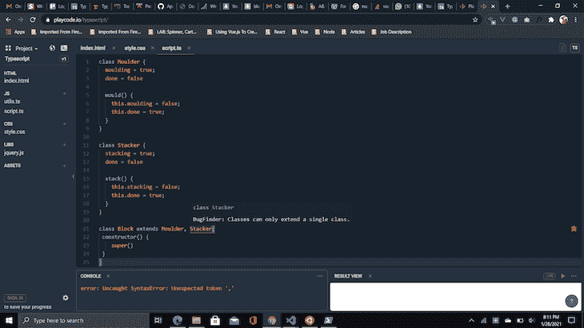

# TypeScript mixins:示例和用例

> 原文：<https://blog.logrocket.com/typescript-mixins-examples-and-use-cases/>

我在 TypeScript 方面经历的一个挑战是一次只能继承或扩展一个类的限制。您可以通过使用[TypeScript](https://www.typescriptlang.org/docs/handbook/mixins.html)[m](https://www.typescriptlang.org/docs/handbook/mixins.html)[ixins](https://www.typescriptlang.org/docs/handbook/mixins.html)来改进多类继承，从而规避这种约束，尤其是在更复杂的架构中。

在本教程中，我们将学习更多关于 mixin 的一般知识，探索 TypeScript mixins，并浏览一个典型的 mixin 用例。

以下是我们将要介绍的内容:

要学习本教程，您应该具备:

我使用了 [playcode.io](http://playcode.io/) 来编写示例程序。

## 什么是混合蛋白？

Mixins 是特殊的类，它包含可以被其他类使用的方法组合。Mixins 促进代码的可重用性，并帮助您避免与多重继承相关的限制。

即使属性和实例化参数是在编译时定义的，mixins 也可以将方法的定义和绑定推迟到运行时。

## 使用 TypeScript 创建 mixins

为了创建 mixin，我们将利用 TypeScript 的两个方面:接口类扩展和声明合并。

不出所料，接口类扩展用于扩展 TypeScript 中的多个类。声明合并是指 TypeScript 将两个或多个同名声明合并在一起的过程。如果接口具有相同的名称，它们也可以合并到类和其他构造中。

下面是一个声明合并的例子:

```
    interface Car {
      steering: number;
      tyre: number;
    }
    interface Car {
      exhaustOutlet: number;
    }
    // contains properties from both Car interfaces
    const BMW: Car = {
        steering: 1,
        tyre: 4,
        exhaustOutlet: 2
    };

```

既然我们已经理解了这两个 TypeScript 特性，我们就可以开始了。

首先，我们需要创建一个将应用 mixins 的基类:

```
class Block {
    name = "";
    length = 0;
    breadth = 0;
    height = 0;
    constructor(name: string, length: number, breadth: number, height: number, ) {
        this.name = name;
        this.length = length;
        this.breadth = breadth;
        this.height = height;
    }
}

```

接下来，创建基类将扩展到的类:

```
class Moulder {
  moulding = true;
  done = false
  mould() {
    this.moulding = false;
    this.done = true;
  }
}
class Stacker {
  stacking = true;
  done = false
  stack() {
    this.stacking = false;
    this.done = true;
  }
}

```

创建一个接口，合并与基类同名的预期类(`Block`):

```
interface Block extends Moulder, Stacker {}

```

新接口的定义名称与我们之前创建的类`Block`完全相同。这是至关重要的，因为这个接口同时扩展了`Moulder`和`Stacker`类。这意味着接口将把它们的方法定义合并到一个构造(接口)中，同时合并到同名的类定义中。

由于声明合并，`Block`类将与`Block`接口合并。

### 创建一个函数

为了创建一个函数来连接两个或多个类声明，我们将使用[官方类型脚本手册](https://www.typescriptlang.org/docs/handbook/mixins.html)中提供的函数:

```
function applyMixins(derivedCtor: any, constructors: any[]) {
  constructors.forEach((baseCtor) => {
    Object.getOwnPropertyNames(baseCtor.prototype).forEach((name) => {
      Object.defineProperty(
        derivedCtor.prototype,
        name,
        Object.getOwnPropertyDescriptor(baseCtor.prototype, name) ||
          Object.create(null)
      );
    });
  });
}

```

前面的函数遍历`Moulder`和`Stacker`类，然后遍历其属性列表，并将这些属性定义到`Block`类中。本质上，我们手动将所有方法和属性从`Moulder`和`Stacker`类链接到`Block`类中。

若要继续，请按如下方式执行前面的函数，然后查看下面的示例:

```
applyMixins(Block, [Moulder, Stacker]);

```

### TypeScript 混合示例

```
let cube = new Block("cube", 4, 4, 4);
cube.mould();
cube.stack();
console.log(cube.length, cube.breadth, cube.height, cube.name, cube.moulding, cube.stacking);

```

这里，我们将`cube`分配给基类`Block`的实例。现在`Block`实例可以分别从`Moulder`和`Stacker`类直接访问`mould()`和`stack()`方法。

虽然有其他方法可以创建 TypeScript Mixins，但这是优化程度最高的模式，因为它较少依赖编译器，而更多地依赖代码库来确保运行时和类型系统保持同步。

## 类型脚本混合的常见用例

让我们回顾一下您可能会遇到或可能想要考虑的一些 TypeScript 混合用例。

### 处理多个类扩展

除非在接口中引入 mixin，否则 TypeScript 类不能同时扩展几个类。

考虑下面的片段:

```
class Moulder {
  moulding = true;
  done = false
  mould() {
    this.moulding = false;
    this.done = true;
  }
}
class Stacker {
  stacking = true;
  done = false
  stack() {
    this.stacking = false;
    this.done = true;
  }
}
class Block extends Moulder, Stacker{
 constructor() {
    super()
 }
}

```

在这个例子中，`Block`类试图在不引入 mixins 概念的情况下同时扩展两个类。如果您将这个代码片段添加到在线编辑器( [playcode.io](http://playcode.io/) )中，您将得到以下错误:



TypeScript multiple class extension error

此时，解决这一限制的唯一方法是引入 TypeScript mixins。

## 结论

当构建复杂程度可能会增加的应用程序时，TypeScript mixins 就派上了用场。当构建具有复杂体系结构的 TypeScript 应用程序时，您会希望同时扩展多个类。有了 mixins，你可以克服多重继承带来的限制。

## [LogRocket](https://lp.logrocket.com/blg/typescript-signup) :全面了解您的网络和移动应用

[](https://lp.logrocket.com/blg/typescript-signup)

LogRocket 是一个前端应用程序监控解决方案，可以让您回放问题，就像问题发生在您自己的浏览器中一样。LogRocket 不需要猜测错误发生的原因，也不需要向用户询问截图和日志转储，而是让您重放会话以快速了解哪里出错了。它可以与任何应用程序完美配合，不管是什么框架，并且有插件可以记录来自 Redux、Vuex 和@ngrx/store 的额外上下文。

除了记录 Redux 操作和状态，LogRocket 还记录控制台日志、JavaScript 错误、堆栈跟踪、带有头+正文的网络请求/响应、浏览器元数据和自定义日志。它还使用 DOM 来记录页面上的 HTML 和 CSS，甚至为最复杂的单页面和移动应用程序重新创建像素级完美视频。

[Try it for free](https://lp.logrocket.com/blg/typescript-signup)

.