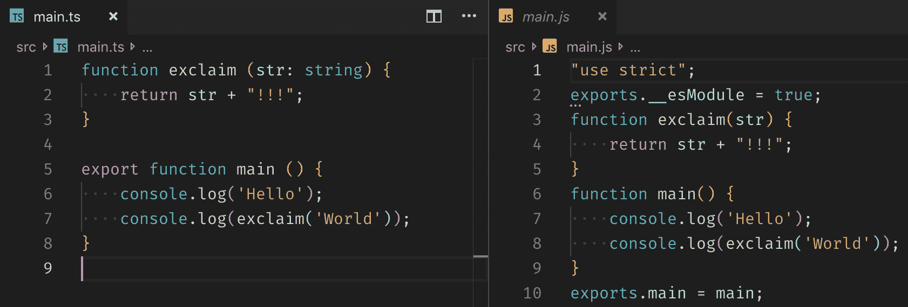
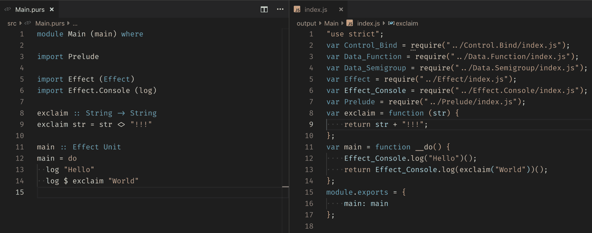

# TypeScript vs . pure script-log rocket 博客

> 原文：<https://blog.logrocket.com/typescript-vs-purescript-not-all-compilers-are-created-equal-c16dadaa7d3e/>

有很多种方法可以剥一只猫的皮，对于每一种方法，都有一种静态类型的语言可以编译成 JavaScript。其中最著名的有 TypeScript (TS)、PureScript (PS)、Elm、Reason、Flow 和 Dart。但是为什么有这么多呢？它们为什么存在，它们的基本原理是什么？

在本帖中，我们将看看前两种语言。我们将分析它们的相似之处和不同之处，看看它们如何处理不同的情况，并了解它们提供了什么保证。

## 类型、限制和保证

所有语言都有类型，即使是最宽松的语言，比如 JavaScript (JS)。在某种程度上，程序的逻辑值和它们的物理表示之间有一个映射。

知道它们是如何翻译的会帮助我们理解事情，比如为什么在某些语言中 0.1 + 0.2！= 0.3.像 JavaScript、Python 和 PHP 这样的语言是动态类型化的，这意味着当代码被执行并且类型有问题时，解释器将需要决定是强制值还是抛出运行时错误。

```
"Hello" + 1 // "Hello1"
null.f()    // TypeError: Cannot read property 'f' of null
```

在创建消息时，强制使用字符串和数字确实很方便，但正如 Gary Bernhardt 的史诗般的演讲 [WAT](https://www.destroyallsoftware.com/talks/wat) 所示，它可能会变得非常奇怪，从而导致意想不到的错误。

相比之下，静态类型语言如 TypeScript 和 PureScript 让我们显式地考虑类型。大多数语言会推断出大多数类型，所以我们不必太罗嗦，但在某些时候，我们必须提供一些关于我们想要计算的数据以及我们将如何计算的信息。

这些信息将帮助其他程序员(甚至是我们未来的自己)理解代码，它将允许我们的工具向我们提供信息和警告，应用自动修复，甚至协助重构。如果程序有问题，我们会在编译时出错，所以反馈循环会更短。

每种语言都会引入不同的限制，影响我们的编程方式。这些限制将为我们提供一定的保证，增加我们对代码的信心。

例如，如果语言不允许我们使用`null`，我们将保证我们不会有`NullPointerExceptions`，十亿美元的错误，我们可能需要一个不同的概念来代表失败或空虚。

## 类型脚本与纯脚本

TypeScript 是微软在 2012 年创造的一种语言，旨在帮助开发者开发大型应用程序。它是一个 JavaScript 超集，这意味着一个有效的 JavaScript 程序就是一个有效的 TypeScript 程序。

这个决定告诉我们很多关于他们的基本原理。而不是创建新的语言特征(例如，特征、管道操作符、模式匹配等)。)，TypeScript 专注于增加现有 JavaScript 的类型，紧跟规范更新。他们在最新的[路线图目标](https://github.com/Microsoft/TypeScript/issues/29288)中说得很清楚，当他们说“每张桌子上的类型，每个家庭，每个 JS 开发人员”和“通过强大的工具提高生产力”

PureScript 是 Phil Freeman 在 2013 年创造的语言，由社区维护。它是一种受 Haskell 启发的严格的纯函数式语言。因此，它提供了许多旨在提高代码正确性和开发人员生产率的特性和限制，例如*不变性*、*模式匹配*、*curry*、*类型类*和 *do 表达式*等等。

它使用 JavaScript 作为主要编译目标是因为在 web、服务器、移动甚至 [Google Sheets](https://twitter.com/sherman3ero/status/970034089813315584) 上运行的好处，但它也可以编译成 C、C++，甚至 Erlang。

TypeScript 在 2015 年起飞，当时 [Angular 宣布](https://devblogs.microsoft.com/typescript/angular-2-built-on-typescript/)正在用它构建第二个版本。紧跟 JS 的决定、使用 VSCode 等工具的开发人员体验以及接受其限制所带来的信心鼓励了其他团队重写 Vue、Jest 和 Yarn 等大型项目。

根据 JS 2018 的[状态，TypeScript 采用量从 2016 年到 2018 年翻了一番。所有这些导致了学习资源的爆炸式增长和一个大而健康的生态系统。](https://2018.stateofjs.com/javascript-flavors/typescript/)


相比之下，PureScript 并不那么受欢迎，但是函数式编程已经吸引了许多开发人员的眼球。像 PHP 或 Java 这样的语言增加了 [lambda 表达式](http://tutorials.jenkov.com/java/lambda-expressions.html)，这使得高阶模式的使用成为可能，像 React 和 Redux 这样的库的流行帮助人们采用纯函数和不变性。

其他语言如 Elm 有更大的社区，是函数世界的一个很好的起点，但是 PS 有一些很好的特性，我们将在后面分析。尽管很小，PureScript 社区在函数式编程松弛期和 T2 对话页面非常活跃。

## 剖析输出

编译器将高级语言转换成低级语言。比如 C，和 GO 编译成可以直接在设备上执行的机器码，Scala 和 Kotlin 编译成 Java 字节码(打算在 Java 虚拟机(JVM)上运行)，TypeScript 和 PureScript 编译成 JavaScript。

前面例子的区别在于，机器码和 Java 字节码都是非常低级的二进制语言，而 JavaScript 是高级语言，仍然需要像 Chrome 的 V8 或 Firefox 的 SpiderMonkey 这样的引擎来解释。

在这一节中，我们将分析一个简单的 hello world 模块的编译输出结果。在这两种情况下，我们将导出一个`main`函数，它在控制台中打印两行并使用一个 helper 私有函数。TypeScript 源代码非常类似于编译后的输出。请注意，类型信息被删除，一些模块代码被添加，但除此之外，代码是相同的。



TypeScript with CommonJS module and ES5 target.

TypeScript has many [compiler options](https://www.typescriptlang.org/docs/handbook/compiler-options.html) that can increase or decrease the strictness level and change how the output is constructed. For example, the `target` option, which defaults to ES5, allows us to use newer language features such as [arrow functions](https://developer.mozilla.org/en-US/docs/Web/JavaScript/Reference/Functions/Arrow_functions), [async/await](https://developer.mozilla.org/en-US/docs/Web/JavaScript/Reference/Statements/async_function), and [destructuring](https://developer.mozilla.org/en-US/docs/Web/JavaScript/Reference/Operators/Destructuring_assignment) in older browsers. Another option is `module`*,* which we can use to best suit our build process.

默认情况下，它使用 CommonJS，这是 Node 中的默认模块加载器，它也可以作为 Browserify、webpack 或 Parcel 的输入。如果我们将选项设置为 ES6，那么输出将更类似于输入，因为我们使用的是 [ES6 导入](https://developer.mozilla.org/en-US/docs/Web/JavaScript/Reference/Statements/import)，稍后可以将它提供给 rollup 之类的工具。

即使两个例子做了完全相同的事情，它们彼此也没有多少相似之处。这是因为 PureScript 试图看起来更像 Haskell 而不是 JavaScript。这种语法来自 C 系列语言，可能看起来很奇怪，但是我们会边走边解释。

现在，请注意，输出中还缺少类型信息。静态意味着所有的类型检查都在编译时执行，不会导致运行时开销。默认情况下，PS 使用 CommonJS 作为其模块定义，因此您可以直接在 Node 中使用它，或者将其提供给外部绑定器。您还可以指示编译器使用全局变量捆绑您的所有文件。



PureScript hello world compiled.

编译后的代码看起来不像是我们的首选。它有许多奇怪的词，如`Semigroup`、`Bind`和`Effect`，我们可以看到它在`main`函数中有一个额外的间接层，我们首先使用`Effect_Console.log(“Hello”)`创建一个计算，然后立即使用`()`执行它。

这种间接性是由于语言强加的限制；顾名思义，PureScript 代码必须是纯的。这在这里并不明显，但是这种限制将允许我们组合和扩展我们的计算，从简单的构建复杂的特征。

纯度限制给了我们强有力的保证。我们说过这两个例子做的是完全一样的事情，此时此刻，它们什么也不做(至少它们自己不做)。在这两种情况下，我们都在创建一个导出`main`函数的模块，就这样。如果我们想要代码实际运行，我们应该在某个时候调用`main()`。

在 TypeScript 中，我们可以在同一个文件中添加调用——毕竟，它没有对我们施加纯度限制。另一方面，pure script*，*禁止我们这样做，从而向我们保证导入模块不会导致执行未知的副作用，比如连接到数据库。

* * *

### 更多来自 LogRocket 的精彩文章:

* * *

像 [colors.js](https://github.com/Marak/colors.js#usage) 这样的库可以利用 JS/TS 提供的自由，通过在导入库时自动修补`String.prototype`来“改进它的语法”。向`String.prototype`引入新的属性起初看起来似乎无关紧要，但正如 [SmooshGate](https://developers.google.com/web/updates/2018/03/smooshgate) 向我们展示的那样，这可能会成为一个问题。

纯度保证是有代价的。为了与 PureScript 中现有的 JavaScript 进行交互，我们需要使用[外部函数接口](https://github.com/purescript/documentation/blob/master/language/FFI.md)创建绑定，并确保所有不纯的代码都被包装。TypeScript，更接近金属(如果可以称 JS 为金属的话)，只是要求我们提供打字信息，我们有选择什么时候要纯，什么时候不纯的自由。

## 表达类型

为了让其他用户和工具知道您的数据和函数是什么样子，我们需要提供类型信息。作为 JavaScript 超集，TypeScript 属于 C 系列语法，其中值、关键字和类型信息交织在同一个表达式中。

在[基本类型](https://www.typescriptlang.org/docs/handbook/basic-types.html)中，我们有 JS 原始类型，它不区分浮点类型和整数类型——只有`number`。

```
const PI: number = 3.1416

let age: number = 32
```

另一个常见的 C 惯例是将标识符如`PI`、`SOME_REGEX`和`API_URL`写成大写，以表示它们是常量值(好像`const`关键字还不够)。

请记住，对于复杂类型，常量值不同于不可变值。这个例子过于冗长，可以简化。编译器可以根据值推断出类型是`number`，所以不需要显式；这里，我们只是展示完整的语法。

如果我们回忆一下`exclaim`函数，我们可以注意到只有输入被键入。在像这样的简单情况下，省略返回类型并让推理系统保存我们宝贵的击键是很常见的。但是我们可以显式地添加类型作为后置条件，确保如果我们有一些差异，编译器会失败。

```
function exclaim (str: string): string {
    return str + "!!!";
}
```

我们需要为顶级函数的输入提供显式类型。如果不这样做，编译器会推断出不安全的类型`any`。这可能会导致错误，因为`any`静默传播，这就是为什么 TS 添加了一个名为`no-implicit-any`的严格选项，它将抛出一个错误。为了通过工具提高开发人员的生产率，在 3.2 版本中，TypeScript 为其语言服务添加了一个[快速修复](https://devblogs.microsoft.com/typescript/announcing-typescript-3-2/)，以根据函数用法建议类型。

鉴于其基本原理，TypeScript 在我们编写函数和表达它们的类型的方式上有很大的灵活性。在下面的例子中，`exclaim1`和`exclaim2`是类似的。有许多地方需要添加函数类型定义，并且不知道使用哪种语法可能会令人困惑。

```
interface Exclaimable {
    exclaim1 (str: string): string
    exclaim2: (str: string) => string
}
```

如果我们使用 JavaScript 文件，我们可以避免使用特殊的语法，只需使用 JSDoc 编写类型。这些特性允许新来者[体验一些 TypeScript 的好处](https://www.typescriptlang.org/docs/handbook/type-checking-javascript-files.html),而不用完全投入，这种决定让我认为 ts 是工具而不是新语言(拥有特殊的语法只是为了更具表达性)。

```
/**
 * Adds two numbers together
 * @param {number} a The first number to add
 * @param {number} b The second number to add
 */
function add (a, b) {
    return a + b
}
```

在下面的例子中，函数`sub`和`div`也是类似的，但是后者是用箭头函数编写的，更加简洁。接收两个参数使得这些函数更难组合。所以对于`mul`，我们决定一次接受一个参数，这使我们能够从中创建像`times2`这样的新函数。

```
function sub (a: number, b: number) {
  return a - b
}

const div = (a: number, b: number) => a / b

const mul = (a: number) => (b: number) => a * b

const times2 = mul(2)
```

这样写`mul`的缺点是，当我们想用两个参数来调用它时，它看起来很奇怪:`mul(2)(4)`。如果我们想两全其美，我们可以使用类似 ramda 的 [curry 函数](https://medium.com/@hernanrajchert/creating-typings-for-curry-using-ts-3-x-956da2780bbf)，但是它在 TS 中也有一些限制，因为它不能处理一般函数。

```
const mul = curry((a: number, b: number) => a * b)
mul(2, 2) // 4
mul(2)(2) // 4
```

像 Elm 和 Haskell 一样，PureScript 也有一个基于 Hindley-Milner 的类型系统，它非常适合函数式语言，并使它们之间的转换更加容易。我们可以注意到，类型信息放在上面，使用`::`将标识符与其类型*、*分开，在新的一行中，我们使用`=`到*、*将标识符与其值分开。即使编译器可以正确推断类型，如果我们不为所有顶级表达式提供显式信息，PS 也会警告我们。

```
pi :: Number
pi = 3.1416

age :: Int
age = 32
```

专注于正确性，[原语类型](https://github.com/purescript/documentation/blob/master/language/Types.md)区分了浮点数和整数。另外，注意我们不需要 *const* 或 *let* 关键字，我们用小写写 *pi* ，因为我们保证所有数据都是不可变的。

当我们描述函数时，类型也写在函数实现之上，将参数名与其类型解耦。我们使用一个箭头来分隔输入和输出，所以像" *String → String* 这样的类型意味着"给定一个字符串，返回一个字符串的函数"。如果我们不知道输出类型，我们可以使用下划线来产生类似“通配符类型定义具有推断的类型字符串”的警告

```
exclaim :: String -> String
exclaim str = str <> "!!!"

what :: String -> _
what str = str
```

与 TypeScript 不同，定义函数类型只有一种方式，类似于 TS 中的 arrow 函数方式。所有的函数都是自动生成的，没有泛型的限制，所以我们可以像以前一样创建`times2`。通过将数字`2`部分应用于`mul`，我们将签名`Number -> Number -> Number`改为`Number -> Number`。

```
add :: Number -> Number -> Number
add a b = a + b

sub :: Number -> Number -> Number
sub a b = a - b

div :: Number -> Number -> Number
div a b = a / b

mul :: Number -> Number -> Number
mul a b = a * b

times2 :: Number -> Number
times2 = mul 2
```

与 C-family 语言的一个很大的语法差异是，函数应用程序没有用括号将参数括起来；相反，它是通过用空格将它们分开来完成的。所以 PS 表达式`mul 2 4`和 TS 表达式`mul(2)(4)`是一样的。一开始可能会令人困惑，但它使语法更加清晰，我们将在下一节看到这一点。

还要注意在`times2`的两个版本中，`b`参数是隐式的。这种技术叫做[无点编程](https://lucasmreis.github.io/blog/pointfree-javascript/)，可以省去我们做`const times2 = b => mul(2)(b)`之类事情的按键。这是一个强大的技术，但它不应该被滥用，因为有时它会降低可读性。

## 为写作而生的语言

在这一节中，我们将让 TypeScript 休息一会儿，并重点关注是什么使 PureScript 成为一种考虑到组合的语言。让我们回忆一下**一节中解析输出**的`main`函数。有三样东西我们还没有谈到:一个特殊的符号`do`，一个不那么特殊的符号`$`，还有一个`main`的类型，看起来不像是函数。

```
main :: Effect Unit
main = do
  log "Hello"
  log $ exclaim "World"
```

PureScript 有一个叫做 do notation 的语言特性，它根据底层类型做不同的事情。我们可以写一整篇文章来详细描述它，但是现在，我们只能说这是一种方式，让我们以类似命令式编程的方式一个接一个地调用一个有效的计算。

为了帮助我们研究`$`和`Effect Unit`，我们将使用 REPL 来查看表达式的类型和类型的种类。我们需要安装[纸浆](https://github.com/purescript-contrib/pulp)，然后执行`pulp repl`。使用`:t`命令，我们可以看到`log`是一个接收`String`并返回`Effect Unit`的函数，这是我们的`main`函数的类型。

```
$ pulp repl
PSCi, version 0.12.2
Type :? for help

import Prelude
import Effect
import Effect.Console

> :t log
String -> Effect Unit
```

`do`里面的所有表达式都必须返回一个`Effect Unit`。对`log`的第一次调用是微不足道的，但是第二次调用带来了一个问题，因为我们想要记录被调用的字符串。假设函数应用是使用空格完成的，如果我们编写表达式`log exclaim “World”`，编译器将抛出一个错误，因为它知道我们正在向一个只接受一个参数的函数传递两个参数。

有三种常见的方法可以写出我们想要的表达式:用括号，用`apply` ( `$`，用`applyFlipped` ( `#`)。

```
> :t log "Hello"
Effect Unit

> :t log exclaim "World"
Error found:
  Could not match type                    
    String -> String                    
  with type          
    String

> :t log (exclaim "World")
Effect Unit
> :t log $ exclaim "World"
Effect Unit
> :t exclaim "World" # log
Effect Unit

```

符号`$`和`#`不是语言特征，它们只是分别被称为`apply`和`applyFlipped`的普通函数，它们在标准库 Prelude 中定义。特别之处在于，我们可以为任何两个参数的函数定义一个中缀运算符。正如[文档](https://pursuit.purescript.org/packages/purescript-prelude/4.1.0/docs/Data.Function#v:%28%24%29)所说，`apply`允许你在某些情况下省略括号，使得代码更容易阅读。

查看源代码，实现非常简单，但是类型可以使用一些解释，因为这些是我们看到的第一个抽象函数。

如果我们看一下`apply`，第一部分声明了两个类型变量`a`和`b`，它们可以是任何具体的类型。然后我们收到两个参数，一个来自`(a -> b)`的函数`f`和一个类型为`a`的值`x`。如果我们使用`log`作为我们的`f`，我们可以替换类型来看到`a`将是类型`String`，而`b`将是`Effect Unit` *。*

该实现只是将参数`x`应用于函数`f`。注意`applyFlipped`也是一样的，但是它首先接收值，然后是函数。

```
apply :: forall a b. (a -> b) -> a -> b
apply f x = f x

infixr 0 apply as $

applyFlipped :: forall a b. a -> (a -> b) -> b
applyFlipped x f = f x

infixl 1 applyFlipped as #
```

还是那句话，`$`和`#`没什么特别的。使这成为可能的语言决定是:函数应用是用空格完成的，括号仅用于定义优先级，任何两个参数的函数都可以被中缀。

这是盖伊·斯蒂尔在他的演讲《发展一门语言》中描述的一个非常强大的概念。它涉及到经过深思熟虑的语法原语，这些原语可以组成更复杂的结构，并且最终可以用来定义特定于领域的语言。

在 JavaScript/TypeScript 中，有许多语言特性可以在 PureScript 中实现，而不必通过委员会。

[管道操作符](https://developer.mozilla.org/en-US/docs/Web/JavaScript/Reference/Operators/Pipeline_operator)是第 1 阶段的一个提议，可以为函数式程序员提供更好的语法，它的作用与 PS `applyFlipped` ( `#`)相同。Async/await 是一个关于承诺的特性，它允许我们更强制性地编写代码。

在 PS 中，我们可以将`do`符号与类型`Aff`结合起来。同样在第 1 阶段的[可选链接操作符](https://github.com/tc39/proposal-optional-chaining)，可以用`do`符号和`Maybe`类型来代替。

既然`do`中的所有表达式都返回相同的类型，让我们回到 REPL 来理解类型的含义。

我们可以使用`:k`命令来检查一个类型的种类。例如，`Unit`和`Number`是常规类型，但是`Effect`和`Array`是类型构造函数。类型构造函数是类型而不是值的函数，因此有类似的语法`Type -> Type`。

构造函数可以应用于使用空格的类型(就像普通的函数应用一样)，所以`Array Number`和`Effect Unit`将具有相同的种类`Type`。类型`Unit`来自单词“工作单元”，它类似于 TypeScript 中的`void`。

```
> :k Number
Type

> :k Unit
Type

> :k Effect
Type -> Type

> :k Array
Type -> Type

> :k Effect Unit
Type
> :k Array Number
Type

```

我们可以把`Array`看作一个简单的数据结构，也可以把它看作一种表达多值计算的方式。同理，我们可以把`Effect`想象成一个修改世界的计算。

严格的函数式语言有纯语言的限制，这使得一整套保证成为可能，但是程序的主要目标是以某种方式改变世界——读取文件、改变 DOM 等等。我们可以通过使用表示有效计算的类型来解决这个限制。

正如我们在**剖析输出**部分看到的，所有的`Effects`都被编译成函数，增加了一个额外的间接层。这允许我们在实际运行之前组合这些计算。在他演讲的前八分钟“[约束解放，自由约束](https://www.youtube.com/watch?v=GqmsQeSzMdw&list=WL)”中，鲁纳·比雅纳松对这个概念给出了我所见过的最好的解释之一。

> 如果我们要用炸药，用 TNT 比用爆炸的碎片更容易。

它还引用了大卫·惠勒的话:

> 我们可以通过引入额外的间接层来解决任何问题。

用这种方式表达计算的一个好处是，你可以在类型系统中对你想做的事情和你想如何做的一些想法进行编码。我们可以像这样把多种计算结合起来创建我们的程序:

*   一种以某种方式改变世界的有效计算——同步写文件、改变 DOM 等等。
*   `Array Student`:倍数`Students`的计算
*   `Maybe User`:可能在用户中解析或者可能为空的计算
*   `Either String Prime`:一个同步计算，它可以解析出一个质数，也可以因字符串消息而失败
*   一个异步的、有效的计算，可以解析一篇博客文章
*   `State AST Number`:有状态计算，使用`AST`并返回`Number`

在这篇文章中，我们看到了 TypeScript 和 PureScript 之间的一些差异，更值得注意的是，它们的基本原理——存在的理由。和往常一样，决定使用它们而不是普通的 JavaScript 更多地取决于一些因素，比如你的团队喜欢什么，你对正确性和开发速度的关心程度，等等。了解每种语言能提供什么将有助于你做出明智的决定。

如果你觉得这篇文章有用，请评论或分享。

## [LogRocket](https://lp.logrocket.com/blg/typescript-signup) :全面了解您的网络和移动应用

[](https://lp.logrocket.com/blg/typescript-signup)

LogRocket 是一个前端应用程序监控解决方案，可以让您回放问题，就像问题发生在您自己的浏览器中一样。LogRocket 不需要猜测错误发生的原因，也不需要向用户询问截图和日志转储，而是让您重放会话以快速了解哪里出错了。它可以与任何应用程序完美配合，不管是什么框架，并且有插件可以记录来自 Redux、Vuex 和@ngrx/store 的额外上下文。

除了记录 Redux 操作和状态，LogRocket 还记录控制台日志、JavaScript 错误、堆栈跟踪、带有头+正文的网络请求/响应、浏览器元数据和自定义日志。它还使用 DOM 来记录页面上的 HTML 和 CSS，甚至为最复杂的单页面和移动应用程序重新创建像素级完美视频。

[Try it for free](https://lp.logrocket.com/blg/typescript-signup)

.